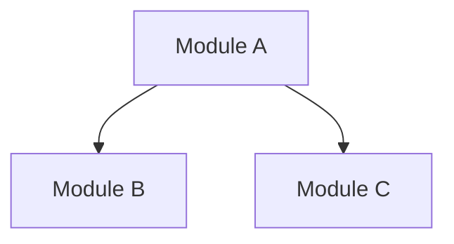

# Document Templates (V5)

## DETAIL.md Format

Each module gets one DETAIL.md with per-file analysis in four sections.

### Template

```markdown
---
module_id: {module_id}
module_name: {module_name}
file_count: {N}
generated_at: {timestamp}
token_budget: {budget}
---

<!-- module:{module_id} -->

## {Module Name}

### {filename1}
<!-- file:{filepath1} -->

#### 功能概述 (Purpose)
What this file does, why it exists, and its role in the module.

#### 数据流 (Data Flow)
How data enters this file, what transformations occur, and where results go.

#### 核心接口 (Key Interfaces)
Important functions and classes with signatures:
- `function_name(param: Type) -> ReturnType`: Brief description
- `ClassName`: What it represents and key methods

#### 依赖关系 (Dependencies)
Cross-file dependencies with purpose:
- Calls `other_file.function_name()` to accomplish X
- Uses `ClassName` from `module/file.py` for Y
- Imported by `consumer.py` which needs Z

<!-- end:file:{filepath1} -->

### {filename2}
<!-- file:{filepath2} -->
...
<!-- end:file:{filepath2} -->

<!-- index-fragment:{module_id} -->
**{Module Name}** ({N} files, {tokens} tokens) — 2-3 sentence summary describing
what this module does, its primary responsibility, and how it relates to other modules.
Key entry points: `main_function()`, `ImportantClass`.
<!-- end:index-fragment:{module_id} -->

<!-- end:{module_id} -->
<!-- codebase-explorer: end -->
```

### Section Guidelines

| Section | Must Include | Must NOT Include |
|---------|-------------|-----------------|
| 功能概述 | What + Why + Role in module | Implementation details |
| 数据流 | Input → Transform → Output | Line-by-line code walkthrough |
| 核心接口 | Function signatures + brief purpose | Full parameter documentation |
| 依赖关系 | Specific function names + purpose | Generic "imports X" statements |

### Index Fragment Guidelines

The `<!-- index-fragment -->` block is critical — it gets extracted verbatim into INDEX.md.
- 2-3 sentences: what the module does + primary responsibility
- Mention key entry points (function/class names)
- Include file count and token count
- Must stand alone as a module summary (reader hasn't seen DETAIL)

## INDEX.md Format

INDEX.md is automatically assembled by `doc_operation("update_index")` from all DETAIL fragments.

### Template

```markdown
---
title: "{Project Name} Architecture"
generated_at: {timestamp}
module_count: {N}
total_files: {N}
total_tokens: {N}
---

# {Project Name} Architecture

## Module Dependency Graph



## Modules

<!-- module-index:{module_id_1} -->
**{Module Name 1}** (N files, N tokens) — Summary from index-fragment...
Key entry points: `function()`, `Class`.
[→ DETAIL]({module_id_1}/DETAIL.md)
<!-- end-module-index:{module_id_1} -->

<!-- module-index:{module_id_2} -->
...
<!-- end-module-index:{module_id_2} -->

<!-- codebase-explorer: end -->
```
