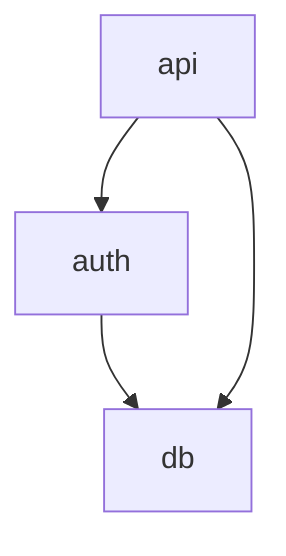
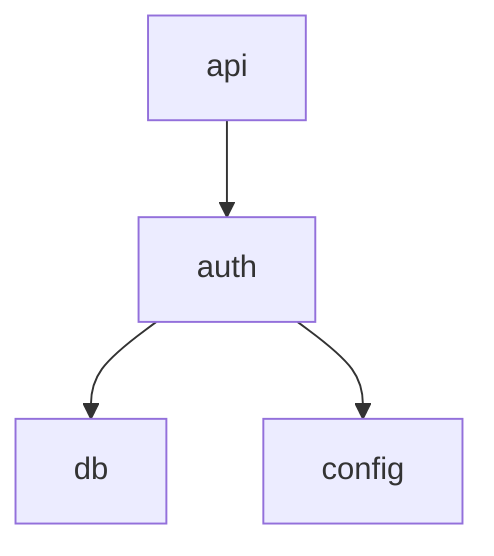
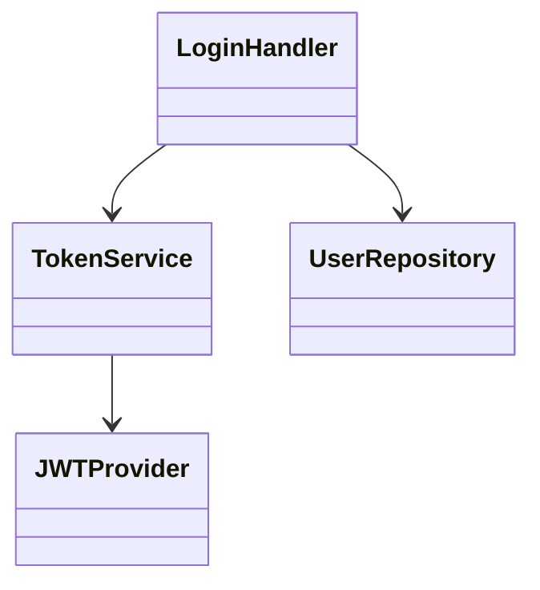

# Document Templates Reference

> Load this file when you need template variable lists, output examples, or
> token budget guidance.

## Table of Contents

1. [Template Inventory](#1-template-inventory)
2. [index.md.j2 Variables (Level 0)](#2-indexmdj2-variables-level-0)
3. [overview.md.j2 Variables (Level 1)](#3-overviewmdj2-variables-level-1)
4. [detail.md.j2 Variables (Level 2+)](#4-detailmdj2-variables-level-2)
5. [Token Budget Guide](#5-token-budget-guide)
6. [Output Examples](#6-output-examples)
7. [doc-meta Comment Format](#7-doc-meta-comment-format)

---

## 1. Template Inventory

| Template | Level | Purpose | Usage |
|----------|-------|---------|-------|
| `index.md.j2` | 0 | Project overview | Once per project |
| `overview.md.j2` | 1 | Module overview | Once per module |
| `detail.md.j2` | 2+ | Component detail | Universal for any depth |

The `detail.md.j2` template is **recursive** -- it works at depth 2, 3, 4,
or 5 with identical structure. The breadcrumb chain grows with depth, and
sub-component links point to deeper DETAIL documents.

---

## 2. index.md.j2 Variables (Level 0)

```
project:
  .name: str                    - Project name
  .description: str             - One-line description
  .version: str                 - Project version
  .repository_url: str | none   - Optional repository URL

tech_stack: list[str]           - Technology stack items

modules: list[Module]
  .id: str                      - Module identifier (slug)
  .name: str                    - Display name
  .description: str             - Brief description (max 80 chars)
  .file_count: int              - Number of files
  .complexity_score: float      - Normalized complexity (0.0-1.0)
  .doc_path: str                - Path to OVERVIEW.md

entry_points: list[EntryPoint]
  .name: str                    - Entry point name
  .file: str                    - Source file path
  .line: int                    - Line number

dependency_graph: str           - Mermaid graph definition

metrics:
  .total_files: int
  .total_functions: int
  .total_classes: int
  .total_loc: int

generation:
  .timestamp: str               - ISO 8601 timestamp
  .tool_version: str            - codebase-explorer version
  .model_used: str              - LLM model identifier
```

---

## 3. overview.md.j2 Variables (Level 1)

```
module:
  .id: str                      - Module identifier
  .name: str                    - Display name
  .description: str             - Module purpose description
  .parent_path: str             - Path to INDEX.md

files: list[File]
  .path: str                    - Relative file path
  .description: str             - Brief file description
  .loc: int                     - Lines of code

dependencies:
  .imports: list[Dep]           - Modules this module imports
  .imported_by: list[Dep]       - Modules that import this module
  Dep.name: str
  Dep.doc_path: str
  Dep.description: str

public_interfaces: list[Interface]
  .name: str                    - Function/class name
  .signature: str               - Full signature
  .description: str             - Brief description
  .type: str                    - "function" | "class" | "constant"

components: list[Component]
  .id: str                      - Component identifier
  .name: str                    - Display name
  .description: str             - Brief description
  .doc_path: str                - Path to DETAIL.md
  .depth: int                   - Documentation depth (2+)

dependency_graph: str           - Mermaid dependency diagram

metrics:
  .file_count: int
  .function_count: int
  .class_count: int
  .avg_complexity: float
```

---

## 4. detail.md.j2 Variables (Level 2+)

```
document:
  .level: int                   - Current documentation level (2+)
  .type: str                    - "detail"
  .target_id: str               - Component identifier
  .target_name: str             - Display name
  .description: str             - Component purpose

breadcrumbs: list[Breadcrumb]
  .level: int                   - Documentation level
  .name: str                    - Display name
  .path: str                    - Path to document

parent:
  .name: str                    - Parent component name
  .path: str                    - Path to parent document

children: list[Child] | none    - Sub-components (recursive)
  .id: str
  .name: str
  .description: str
  .path: str                    - Path to child DETAIL.md
  .has_children: bool           - Whether child has further sub-docs

classes: list[ClassInfo]
  .name: str
  .description: str
  .base_classes: list[str]
  .methods: list[MethodInfo]
    .name: str
    .signature: str
    .description: str
    .visibility: str            - "public" | "private" | "protected"

functions: list[FuncInfo]
  .name: str
  .signature: str
  .description: str
  .called_by: list[str]
  .calls: list[str]

structure_graph: str            - Mermaid internal structure diagram
data_flow_graph: str | none     - Mermaid data flow (optional at deep levels)

design_decisions: list[Decision] | none
  .title: str
  .description: str
  .rationale: str

source_files: list[str]         - Source file paths covered
```

---

## 5. Token Budget Guide

### Per-Level Budget Ranges

| Level | Template | Min | Max | Recommended | Strategy |
|-------|----------|-----|-----|-------------|----------|
| 0 | index.md.j2 | 600 | 1,200 | 800-1,000 | Fixed |
| 1 | overview.md.j2 | 1,000 | 2,000 | 1,200-1,500 | Complexity-scaled |
| 2 | detail.md.j2 | 1,500 | 3,500 | 2,000-2,500 | Steady |
| 3 | detail.md.j2 | 1,200 | 2,500 | 1,500-2,000 | Progressive reduction |
| 4 | detail.md.j2 | 800 | 2,000 | 1,000-1,500 | Progressive reduction |
| 5+ | detail.md.j2 | 500 | 1,500 | 800-1,000 | Minimum viable |

### Budget Allocation Formula

```
total_budget = source_tokens * 0.15 * (1 + depth * 0.5)

Per-level allocation: geometric decay with factor 0.6
  Level 0 weight: 1.0
  Level 1 weight: 0.6
  Level 2 weight: 0.36
  Level 3 weight: 0.216
  ...
```

### Content Truncation Priority

When budget is exceeded, trim in this order (lowest priority first):

| Priority | Content | Weight |
|----------|---------|--------|
| 1.0 | Module name, one-line description | Always keep |
| 1.0 | Public interface signatures | Always keep |
| 0.9 | Dependency list | High priority |
| 0.85 | Architecture diagram (Mermaid) | High priority |
| 0.8 | Entry points | High priority |
| 0.7 | Class responsibilities | Medium |
| 0.65 | Function descriptions | Medium |
| 0.6 | Data flow diagram | Medium |
| 0.4 | Implementation notes | Low |
| 0.35 | Code examples | Low |
| 0.3 | Edge cases | Low |
| 0.2 | Internal helpers | Trim first |
| 0.1 | Deprecated APIs | Trim first |

---

## 6. Output Examples

### Level 0: INDEX.md

```markdown
<!-- doc-meta
level: 0
target: my-web-app
type: index
token_budget: 1000
generated_at: 2026-03-22T10:30:00Z
children:
  - docs/auth/OVERVIEW.md
  - docs/api/OVERVIEW.md
version: 1.0
-->
# My Web App

> A modern REST API server with authentication and data persistence.

## Overview

### Technology Stack

- Python 3.11
- FastAPI 0.104
- PostgreSQL 15

### Architecture



## Modules

| Module | Description | Files | Complexity |
|--------|-------------|-------|------------|
| [**auth**](docs/auth/OVERVIEW.md) | User authentication | 12 | High |
| [**api**](docs/api/OVERVIEW.md) | REST API endpoints | 18 | Medium |

## Entry Points

- `main` -- [`src/main.py:15`](src/main.py#L15)

## Metrics

| Metric | Value |
|--------|-------|
| Files | 38 |
| Functions | 124 |
```

### Level 1: OVERVIEW.md

```markdown
<!-- doc-meta
level: 1
target: auth
type: overview
token_budget: 1500
generated_at: 2026-03-22T10:30:00Z
parent: ../../INDEX.md
children:
  - login/DETAIL.md
  - oauth/DETAIL.md
-->
# auth

> User authentication and authorization module.

## Navigation

| Level | Document |
|-------|----------|
| Up | [Project Overview](../../INDEX.md) |
| Down | [login](login/DETAIL.md) |
| Down | [oauth](oauth/DETAIL.md) |

## Dependencies



## Public Interfaces

- `def login(username: str, password: str) -> Token`
- `def verify_token(token: str) -> User`
- `class AuthMiddleware` -- Request authentication middleware

## Components

| Component | Description | Documentation |
|-----------|-------------|---------------|
| **login** | Login flow handlers | [Detail (L2)](login/DETAIL.md) |
| **oauth** | OAuth2 integration | [Detail (L2)](oauth/DETAIL.md) |
```

### Level 2+: DETAIL.md

```markdown
<!-- doc-meta
level: 2
target: auth.login
type: detail
token_budget: 2000
generated_at: 2026-03-22T10:30:00Z
parent: ../OVERVIEW.md
children:
  - handlers/DETAIL.md
-->
# Login Handlers

> Core login flow: credential validation, token generation, session management.

## Breadcrumb Navigation

| Level | Document |
|-------|----------|
| 0 | [Project Overview](../../../INDEX.md) |
| 1 | [auth](../OVERVIEW.md) |
| 2 | Login Handlers *(current)* |

## Internal Structure



## Classes

### LoginHandler

Handles login requests: validates credentials, issues tokens.

| Method | Signature | Description |
|--------|-----------|-------------|
| `login` | `(username, password) -> Token` | Main login flow |
| `logout` | `(token) -> None` | Invalidate session |

## Source Files

- `src/auth/login/handler.py`
- `src/auth/login/validators.py`
```

---

## 7. doc-meta Comment Format

Every generated document includes a `doc-meta` HTML comment at the top:

```html
<!-- doc-meta
level: <integer>
target: <string>
type: <"index" | "overview" | "detail">
token_budget: <integer>
generated_at: <ISO8601 datetime>
parent: <relative_path | null>
children:
  - <child_path>
version: <string>
-->
```

| Field | Type | Required | Description |
|-------|------|----------|-------------|
| `level` | integer | Yes | Documentation level (0-5+) |
| `target` | string | Yes | Identifier for the documented entity |
| `type` | enum | Yes | Document type: index, overview, detail |
| `token_budget` | integer | Yes | Target token budget |
| `generated_at` | ISO8601 | Yes | Generation timestamp (UTC) |
| `parent` | string | No* | Relative path to parent document |
| `children` | list | No | Relative paths to child documents |
| `version` | string | No | Format version (default "1.0") |

*Required for all documents except INDEX.md (level 0).
