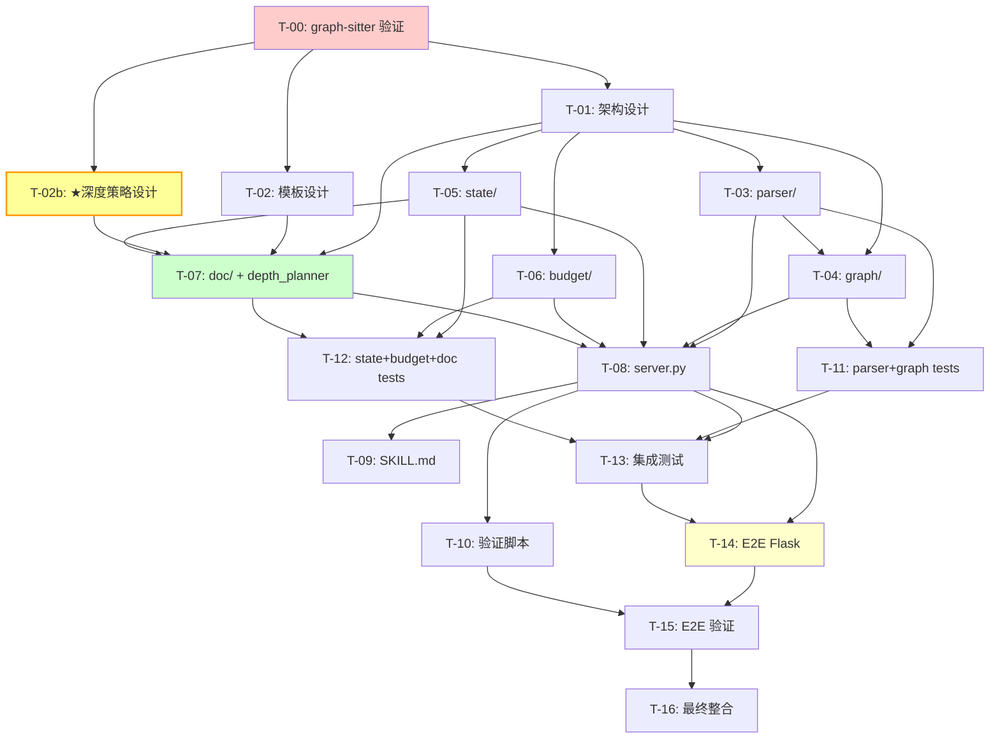

> **Context 恢复协议**：如果你在 Context 压缩后读到此文件，
> 1. 查看"执行进度"区块，确认当前进度（哪些 [x] 已完成，哪些 [ ] 待执行）
> 2. **调用 `/od` skill** 继续执行此计划
> 3. `/od` 会从首个 [ ] 任务继续，按其 workflow 自主执行
>
> **恢复后必须调用 `/od` skill，不要自己直接开始工作。**

# Plan: codebase-explorer-implementation (v3)

**Date**: 2026-03-22
**Version**: 3.0 — 语言聚焦 Py/TS/JS + 动态文档深度 + Flask E2E
**Project**: codebase-explorer @ `/Users/lexuanzhang/code/codebase-explorer`
**Plan file**: `/Users/lexuanzhang/code/codebase-explorer/.claude_plans/2026-03-22-codebase-explorer-implementation.md`

---

## v2 → v3 关键变更

| #   | v2 状态                                          | v3 修正                                                                 |
| --- | ------------------------------------------------ | ----------------------------------------------------------------------- |
| 1   | tree-sitter 为主力 + graph-sitter 可选            | **graph-sitter 为主力**（仅 Py/TS/JS），移除 tree-sitter 通用解析      |
| 2   | 支持 Go 等多语言（tree-sitter-go）               | **仅 Python / TypeScript / JavaScript**，后续再扩展                     |
| 3   | 固定三层文档 (INDEX/OVERVIEW/ARCHITECTURE)        | **动态 N 层文档**，根据模块大小/复杂度自动决定深度                     |
| 4   | oh-my-opencode (Go) 作为 E2E 测试目标            | **Flask** (pallets/flask, Python) — 7.7K LOC, 4 级自然层次             |
| 5   | 3 个固定文档生成工具                              | **2 个动态工具** (plan_doc_structure + generate_doc)                    |
| 6   | 无专门的深度决策设计                              | **新增 T-02b** 动态文档深度策略设计任务                                |
| 7   | parser 层含 5 个文件（含 tree_sitter.py 通用）    | **简化为 2 个文件**（graph-sitter wrapper + 语言检测）                 |

---

## Context（背景）

### 目标

构建一个本地运行的 **MCP Server + Agent Skill** 工具，用于分析 Python/TypeScript/JavaScript 代码库结构并生成**渐进式披露的架构文档**。系统必须满足 9 项核心需求：

1. **完整性保证** — 对所有代码进行检查，不遗漏
2. **混合架构** — LLM + 确定性分析相结合
3. **分布式** — 多 Agent 分工，不在单 Agent 中完成
4. **资源管控** — 监控每个 Agent 的 token/代码量
5. **无冲突** — Agent 间互斥探索，不重复分析
6. **可审计** — 确定性检查完成度的记录机制
7. **动态层级文档** — 渐进式披露，层级深度由模块复杂度自动决定
8. **本地运行** — 本地 MCP/Skill，不依赖外部服务
9. **跨工具** — 兼容 Claude Code / Codex / OpenCode / Gemini CLI

### 前置研究

已完成 7 份深度研究报告 + 1 份批判性审查：

| 报告                         | 核心结论                                                  | v3 中的应用                           |
| ---------------------------- | --------------------------------------------------------- | ------------------------------------- |
| 01_code_graph_tools          | Graph-sitter 为 Py/TS/JS 最佳语义级分析工具               | **graph-sitter 为唯一解析引擎**       |
| 02_auto_module_grouping      | Louvain 算法 + 目录结构启发式 = 三层分组                  | 直接复用，增加递归子分组              |
| 03_docagent_architecture     | DocAgent DAG 拓扑排序 + Writer-Verifier 模式              | 借鉴 DAG 排序                        |
| 04_progressive_doc_standards | C4 Model 映射 + Jinja2 模板 + Token 预算                  | **扩展为 N 层模板**（非固定 3 层）    |
| 05_mcp_server_patterns       | FastMCP 3.0 + SQLite WAL + STDIO transport                | 直接复用代码骨架                     |
| 06_agent_skill_design        | SKILL.md 格式规范 + 跨工具兼容布局                        | 直接复用 Skill 设计草案              |
| 07_context_budget_strategies | 模块分片 + 预算控制器 + checkpoint 系统                   | 预算控制 + **深度决策输入**           |
| CRITICAL_REVIEW              | 7 个关键修正                                              | 全部采纳                             |

### 关键设计决策（v3 更新）

| 决策           | 选择                                                       | 理由                                                     |
| -------------- | ---------------------------------------------------------- | -------------------------------------------------------- |
| 代码解析引擎   | **graph-sitter（唯一）**                                   | Py/TS/JS 语义级跨文件依赖分析，NetworkX 原生输出         |
| 语言范围       | **Python, TypeScript, JavaScript**                          | graph-sitter 支持的全部语言，后续可扩展                  |
| 文档层级       | **动态 N 层**（最深 5 层，由深度规划器自动决定）           | 模块大小/复杂度差异巨大，固定 3 层不够灵活              |
| 深度决策依据   | Token 预算 + 组件数量 + 复杂度指标                         | 三维指标避免单一维度误判                                 |
| 文档生成工具   | `plan_doc_structure` + `generate_doc`（2 个动态工具）      | 替代固定的 index/overview/architecture 三个工具          |
| 模块分组       | 目录结构 → Louvain 社区检测 → **递归子分组**               | 支持大模块自动拆分为子文档                               |
| E2E 测试目标   | **Flask** (pallets/flask, ~7.7K LOC Python)                 | 4 级自然层次 + 跨层继承 + 中等规模                      |
| 状态管理       | SQLite WAL                                                 | 与 v2 一致                                               |
| Token 控制     | 代码量（行数/字符数）为代理指标                            | 与 v2 一致                                               |
| 互斥机制       | 任务队列 `get_next_batch()`                                | 与 v2 一致                                               |

### 动态文档深度设计概要

固定 3 层 (INDEX/OVERVIEW/ARCHITECTURE) 的问题：一个 50 行的小模块和一个 3000 行的大模块用同样的文档深度，要么信息冗余，要么信息不足。

**v3 策略：深度由模块特征自动决定**

```
深度决策规则（由 depth_planner.py 实现）：

Level 0 (INDEX.md):  始终 1 个，覆盖整个项目
  ├── 条件：项目根 → 必定生成
  └── Token 预算：1000-1500 tokens

Level 1 (模块文档):  每个 Louvain 模块 1 个
  ├── 条件：模块存在 → 必定生成
  └── Token 预算：1500-2500 tokens

Level 2+ (子文档):  仅当模块超过阈值时生成
  ├── 触发条件（任一满足）：
  │   ├── 模块 token 数 > 6000 tokens（约 500 行 Python）
  │   ├── 模块内组件数 > 15 个（函数+类）
  │   └── 模块内子包数 > 2 个
  ├── 分割策略：按子包 > 按类 > 按功能组
  └── Token 预算：2000-3000 tokens per sub-doc

最大深度：5（可配置）
递归终止：组件数 <= 5 OR token 数 <= 3000
```

**文档树示例（Flask 项目）**：

```
.codebase-docs/
├── INDEX.md                              # L0: Flask 项目概览
├── core/                                 # L1: 核心模块（app, ctx, globals）
│   ├── OVERVIEW.md                       # L1 doc
│   ├── app/                              # L2: Flask App 深入（> 1400 行）
│   │   └── DETAIL.md                     # L2 doc
│   └── ctx/                              # L2: 请求上下文
│       └── DETAIL.md                     # L2 doc
├── sansio/                               # L1: Sans-IO 抽象层
│   ├── OVERVIEW.md                       # L1 doc
│   ├── scaffold/                         # L2: Scaffold 基类
│   │   └── DETAIL.md                     # L2 doc
│   └── app/                              # L2: SansIO App
│       └── DETAIL.md                     # L2 doc
├── routing/                              # L1: 路由系统
│   └── OVERVIEW.md                       # L1 doc（模块较小，不再深入）
├── json-module/                          # L1: JSON 序列化
│   └── OVERVIEW.md                       # L1 doc（较小）
├── cli/                                  # L1: CLI 集成
│   └── OVERVIEW.md                       # L1 doc
└── doc-index.json                        # 全局文档索引
```

### 约束

- 不接入任何外部 MCP 或外部服务，完全本地运行
- 使用 Python 3.11+
- **仅支持 Python, TypeScript, JavaScript**（graph-sitter 支持范围）
- 所有文档为 Markdown + Mermaid 图
- 兼容 `.agents/skills/` 通用路径
- E2E 测试目标代码库：**GitHub `pallets/flask`**（Python，~7.7K LOC）
- 源文件遵循 200-400 行目标，800 行上限

### 执行预算

```
执行预算:
  预估总任务数: 18（含 Phase 0）
  预估每任务耗时: 12 分钟
  预估总耗时: 216 分钟 (≈ 3.6 小时)
  Context 窗口评估: 需要多轮 /clear 中断，每 Phase 结束时建议中断
  最大并行 Sub-agent 数: 3（用户指定）
```

---

## MCP 工具清单（15 个）

### A. 索引与分析（4 个）

| 工具                       | 功能                                                    | readOnly |
| -------------------------- | ------------------------------------------------------- | -------- |
| `index_codebase`           | 索引代码库：graph-sitter 解析 + 依赖图构建              | false    |
| `get_modules`              | 获取 Louvain 模块分组结果 + 复杂度指标                  | true     |
| `get_module_detail`        | 获取模块内文件、函数、类、依赖详情                      | true     |
| `get_dependency_graph`     | 获取模块间依赖图（Mermaid 格式）                        | true     |

### B. 预算与分片（3 个）

| 工具                       | 功能                                                    | readOnly |
| -------------------------- | ------------------------------------------------------- | -------- |
| `estimate_module_tokens`   | 估算各模块 token 数（字符/行数代理指标）                | true     |
| `create_analysis_plan`     | 生成分片 + DAG 拓扑排序的分析计划                       | false    |
| `check_budget_status`      | 查询当前预算使用情况 + 是否该停下                       | true     |

### C. 任务管理与互斥（3 个）

| 工具                       | 功能                                                    | readOnly |
| -------------------------- | ------------------------------------------------------- | -------- |
| `get_next_batch`           | 获取下一批待分析模块                                    | true     |
| `submit_analysis`          | 提交模块分析结果（摘要 + 详细分析）                     | false    |
| `get_analysis_status`      | 获取整体分析进度                                        | true     |

### D. Checkpoint 与跨引用（3 个）

| 工具                       | 功能                                                    | readOnly |
| -------------------------- | ------------------------------------------------------- | -------- |
| `save_checkpoint`          | 保存分析检查点（支持中断恢复）                          | false    |
| `load_checkpoint`          | 加载最近检查点，恢复分析上下文                          | true     |
| `get_cross_ref_context`    | 构建跨模块引用上下文（注入摘要而非完整代码）            | true     |

### E. 文档生成（2 个） ← v3 变更：从 3 个固定工具改为 2 个动态工具

| 工具                       | 功能                                                    | readOnly |
| -------------------------- | ------------------------------------------------------- | -------- |
| `plan_doc_structure`       | **分析项目结构，输出文档树规划**（每个节点的层级和路径） | false    |
| `generate_doc`             | **按层级和目标生成单篇文档**（INDEX / OVERVIEW / DETAIL）| false    |

**`plan_doc_structure` 签名**：
```python
plan_doc_structure(index_id: str) -> {
    "doc_tree": [
        {"path": "INDEX.md", "level": 0, "target": "root", "token_budget": 1200},
        {"path": "core/OVERVIEW.md", "level": 1, "target": "core", "token_budget": 2000},
        {"path": "core/app/DETAIL.md", "level": 2, "target": "core.app", "token_budget": 3000},
        ...
    ],
    "total_docs": 12,
    "max_depth": 3,
    "depth_decisions": {"core": {"depth": 2, "reason": "1453 lines, 28 components"}, ...}
}
```

**`generate_doc` 签名**：
```python
generate_doc(
    target: str,          # 目标：模块名或 "root"
    level: int,           # 层级：0=INDEX, 1=OVERVIEW, 2+=DETAIL
    token_budget: int,    # Token 预算
    parent_path: str | None,  # 父文档路径（用于生成返回链接）
    children: list[str] | None,  # 子文档路径列表（用于生成向下链接）
) -> {"content": "...", "path": "...", "actual_tokens": 1150}
```

---

## 源代码模块分解（v3 简化 + 新增 depth_planner）

```
src/
├── __init__.py              # 包入口
├── server.py                # FastMCP 入口 + 15 个工具注册 (~350行)
├── parser/                  # 代码解析层（graph-sitter 专用）
│   ├── __init__.py
│   ├── codebase.py          # graph-sitter Codebase 封装 (~250行)
│   └── language_detect.py   # 语言检测 (Py/TS/JS) (~80行)
├── graph/                   # 图构建与分析层
│   ├── __init__.py
│   ├── dependency.py        # graph-sitter → NetworkX DiGraph (~250行)
│   ├── grouper.py           # Louvain 分组 + 递归子分组 (~300行)
│   └── ordering.py          # DAG 拓扑排序 + PageRank (~200行)
├── state/                   # 状态管理层
│   ├── __init__.py
│   ├── database.py          # SQLite schema + CRUD (~350行)
│   ├── checkpoint.py        # checkpoint 保存/恢复 (~200行)
│   └── models.py            # Pydantic 数据模型 (~200行)
├── budget/                  # 预算控制层
│   ├── __init__.py
│   ├── estimator.py         # token 估算 (~150行)
│   └── controller.py        # AnalysisBudgetController (~200行)
├── doc/                     # 文档生成层
│   ├── __init__.py
│   ├── depth_planner.py     # ★ 动态深度决策算法 (~300行) ← v3 新增
│   ├── generator.py         # 动态 N 层文档生成 (~400行)
│   ├── mermaid.py           # Mermaid 图生成 (~200行)
│   └── templates.py         # Jinja2 模板加载 (~100行)
└── templates/               # Jinja2 模板文件
    ├── index.md.j2          # Level 0 项目概览模板
    ├── overview.md.j2       # Level 1 模块概览模板
    └── detail.md.j2         # Level 2+ 组件详情模板（通用）
```

**v2 → v3 变更**：
- 移除 `src/parser/base.py`（无需抽象接口，只有 graph-sitter 一种实现）
- 移除 `src/parser/tree_sitter.py`（不再支持 tree-sitter 通用解析）
- 移除 `src/parser/graph_sitter.py` → 改为 `src/parser/codebase.py`（更明确的命名）
- 新增 `src/doc/depth_planner.py`（动态深度决策核心）
- `architecture.md.j2` → `detail.md.j2`（通用深层模板，不限 Level 2）

---

## Execution Progress（执行进度）

### Phase 0 — 工具链验证 ⚡

- [x] T-00: 验证 graph-sitter 安装 + Py/TS/JS 解析能力 → agent: `general-purpose` → 产出物: `scripts/verify_toolchain.py` ✅ 2026-03-22T04:00:00+01:00

### Phase 1 — 核心架构设计

- [x] T-01: 设计 MCP Server 整体架构 + 15 个工具接口规格 → agent: `architect` → 产出物: `design/architecture.md` ✅ 2026-03-22T13:30:00+01:00
- [x] T-02: 设计文档模板系统（动态 N 层 Jinja2 模板 + Token 预算） → sub-agent: `Explore` → 产出物: `design/doc_templates.md` ✅ 2026-03-22T12:00:00+01:00
- [x] T-02b: ★ 设计动态文档深度策略（阈值、分割算法、递归终止条件） → agent: `architect` → 产出物: `design/depth_strategy.md` ✅ 2026-03-22T12:00:00+01:00

### Phase 2 — MCP Server 核心实现

- [x] T-03: 实现代码解析层 `src/parser/`（graph-sitter 封装 + 语言检测） → agent: `general-purpose` → 产出物: `src/parser/` ✅ 2026-03-22T14:00:00+01:00
- [x] T-04: 实现图构建与分析层 `src/graph/`（依赖图 + Louvain 分组 + 拓扑排序） → agent: `general-purpose` → 产出物: `src/graph/` ✅ 2026-03-22T14:20:00+01:00
- [x] T-05: 实现状态管理层 `src/state/`（SQLite schema + checkpoint + models） → agent: `general-purpose` → 产出物: `src/state/` ✅ 2026-03-22T14:30:00+01:00
- [x] T-06: 实现预算控制层 `src/budget/`（token 估算 + AnalysisBudgetController） → agent: `general-purpose` → 产出物: `src/budget/` ✅ 2026-03-22T14:10:00+01:00
- [x] T-07: 实现文档生成层 `src/doc/`（depth_planner + 动态 N 层生成 + Mermaid） → agent: `general-purpose` → 产出物: `src/doc/` + `src/templates/` ✅ 2026-03-22T15:15:00+01:00
- [x] T-08: 实现 MCP Server 入口 `src/server.py`（FastMCP 15 工具注册 + Lifespan） → agent: `general-purpose` → 产出物: `src/server.py` ✅ 2026-03-22T16:00:00+01:00

### Phase 3 — Agent Skill 实现

- [x] T-09: 创建 SKILL.md + references/ + assets/ → agent: `general-purpose` → 产出物: `.agents/skills/codebase-explorer/` ✅ 2026-03-22T17:00:00+01:00
- [x] T-10: 实现验证脚本（validate_doc_links.py + check_coverage.py） → agent: `general-purpose` → 产出物: scripts/ ✅ 2026-03-22T16:30:00+01:00

### Phase 4 — 单元测试 + 集成测试

- [x] T-11: 编写 parser/ 和 graph/ 单元测试 → agent: `tdd-guide` → 产出物: `tests/test_parser.py`, `tests/test_graph.py` ✅ 2026-03-22T16:30:00+01:00
- [x] T-12: 编写 state/, budget/, doc/ 单元测试 → agent: `tdd-guide` → 产出物: `tests/test_state.py`, `tests/test_budget.py`, `tests/test_depth_planner.py` ✅ 2026-03-22T17:15:00+01:00
- [x] T-13: 编写 MCP Server 集成测试 → agent: `general-purpose` → 产出物: `tests/test_server_integration.py` ✅ 2026-03-22T18:00:00+01:00

### Phase 5 — End-to-End 测试

- [x] T-14: 克隆 Flask 仓库 + 运行完整 E2E 流程 → agent: `general-purpose` → 产出物: `test_repos/flask/.codebase-docs/` ✅ 2026-03-22T18:45:00+01:00
- [x] T-15: 验证 E2E 结果 → agent: `general-purpose` → 产出物: `tests/e2e_validation_report.md` ✅ 2026-03-22T19:30:00+01:00 (fix-loop: 链接/覆盖率/深度修复)

### Phase 6 — 最终整合

- [x] T-16: 创建 README.md + pyproject.toml + .mcp.json → agent: `general-purpose` → 产出物: `README.md`, `pyproject.toml`, `.mcp.json` ✅ 2026-03-22T20:00:00+01:00

---

## Agent Responsibility Matrix（Agent 职责矩阵）

| Task ID | 描述                   | Skill / Agent           | 输入                                   | 输出产物                              |
| ------- | ---------------------- | ----------------------- | -------------------------------------- | ------------------------------------- |
| T-00    | 工具链验证             | agent: general-purpose  | pip 环境                               | `scripts/verify_toolchain.py`         |
| T-01    | 架构设计               | agent: architect        | 7 份研究报告 + CRITICAL_REVIEW         | `design/architecture.md`              |
| T-02    | 文档模板设计           | sub-agent: Explore      | report 04                              | `design/doc_templates.md`             |
| T-02b   | 动态深度策略设计       | agent: architect        | report 02/04/07 + 本计划深度设计概要   | `design/depth_strategy.md`            |
| T-03    | 代码解析层             | agent: general-purpose  | T-01 + report 01                       | `src/parser/`                         |
| T-04    | 图构建分析层           | agent: general-purpose  | T-01 + T-03 + report 02               | `src/graph/`                          |
| T-05    | 状态管理层             | agent: general-purpose  | T-01 + report 05/07                    | `src/state/`                          |
| T-06    | 预算控制层             | agent: general-purpose  | T-01 + report 07                       | `src/budget/`                         |
| T-07    | 文档生成层(含depth)    | agent: general-purpose  | T-01 + T-02 + **T-02b** + report 04   | `src/doc/` + `src/templates/`         |
| T-08    | MCP Server 入口        | agent: general-purpose  | T-03 ~ T-07 所有模块                   | `src/server.py`                       |
| T-09    | Agent Skill            | agent: general-purpose  | report 06 + T-08                       | `.agents/skills/codebase-explorer/`   |
| T-10    | 验证脚本               | agent: general-purpose  | report 04/07                           | `scripts/`                            |
| T-11    | parser + graph 测试    | agent: tdd-guide        | T-03 + T-04                            | `tests/test_parser.py`, `test_graph.py`|
| T-12    | state+budget+doc 测试  | agent: tdd-guide        | T-05 + T-06 + T-07                     | `tests/test_state.py` 等             |
| T-13    | MCP 集成测试           | agent: general-purpose  | T-08                                   | `tests/test_server_integration.py`    |
| T-14    | E2E 运行 (Flask)       | agent: general-purpose  | T-08 + Flask 仓库                      | `.codebase-docs/`                     |
| T-15    | E2E 验证               | agent: general-purpose  | T-14 + T-10                            | `tests/e2e_validation_report.md`      |
| T-16    | 最终整合               | agent: general-purpose  | 所有产出物                             | README + pyproject + .mcp.json        |

---

### T-00 规格

```
Task T-00 规格：
  Skill: agent: general-purpose
  目的: 验证 graph-sitter 对 Python/TS/JS 的解析能力
  操作范围:
    创建: [scripts/verify_toolchain.py]
    修改: []
    禁止修改: [results/*, CRITICAL_REVIEW.md] — 原因: 研究结果为只读
  复用: 无
  预期日志输出:
    - "[VERIFY] graph-sitter import successful"
    - "[VERIFY] Python codebase parsed: {N} files, {M} functions"
    - "[VERIFY] networkx available, louvain available"
    - "[VERIFY] fastmcp available"
    - "[VERIFY] All checks passed"
  验收标准:
    - [ ] scripts/verify_toolchain.py 存在
    - [ ] 脚本运行退出码 0
    - [ ] graph-sitter 能解析一个小型 Python 目录并输出函数/类列表
    - [ ] networkx + python-louvain 可 import
    - [ ] fastmcp 可 import
  回滚策略:
    回滚点: 无（首个任务）
    替代方案: 若 graph-sitter 安装失败，尝试 codegen 包名（graph-sitter 曾更名）
    丢弃条件: graph-sitter 完全不可用（需要重新评估技术方案）
  超时: 10 分钟
```

### T-01 规格

```
Task T-01 规格：
  Skill: agent: architect
  操作范围:
    创建: [design/architecture.md]
    修改: []
    禁止修改: [results/*, CRITICAL_REVIEW.md] — 原因: 研究结果为只读
  复用: 无
  预期日志输出:
    - "[DESIGN] Architecture design started"
    - "[DESIGN] Module interfaces defined: {N} modules"
    - "[DESIGN] MCP tools defined: {N} tools"
    - "[DESIGN] Architecture design completed"
  验收标准:
    - [ ] design/architecture.md 存在且 > 150 行
    - [ ] 包含 7 个源码模块的接口定义（parser, graph, state, budget, doc, templates, server）
    - [ ] 包含 15 个 MCP 工具的完整签名（参数类型、返回值、描述）
    - [ ] 包含数据流 Mermaid 图（index → analyze → plan_depth → generate_doc）
    - [ ] 包含 SQLite schema（≥ 5 个表）
    - [ ] 包含 graph-sitter 封装策略（Codebase API 使用方式）
    - [ ] 包含错误处理策略
  回滚策略:
    回滚点: 无（首个设计任务）
    替代方案: 直接参考 CRITICAL_REVIEW.md 的修订架构
    丢弃条件: 无
  超时: 15 分钟
```

### T-02 规格

```
Task T-02 规格：
  Skill: sub-agent type: Explore
  操作范围:
    创建: [design/doc_templates.md]
    修改: []
    禁止修改: [results/*] — 原因: 研究结果为只读
  复用: report 04 的 Jinja2 模板
  预期日志输出:
    - "[TEMPLATE] Analyzing progressive disclosure standards"
    - "[TEMPLATE] Template design completed"
  验收标准:
    - [ ] design/doc_templates.md 存在
    - [ ] 包含 3 种 Jinja2 模板规格（index.md.j2, overview.md.j2, detail.md.j2）
    - [ ] detail.md.j2 设计为通用模板，支持 Level 2+ 任意深度
    - [ ] 包含 Token 预算定义（按层级递减/平稳）
    - [ ] 包含 doc-meta HTML 注释格式
    - [ ] 包含 doc-index.json 结构定义
    - [ ] 包含示例输出片段
  回滚策略:
    回滚点: 无
    替代方案: 使用字符串拼接替代 Jinja2
    丢弃条件: 无
  超时: 12 分钟
```

### T-02b 规格 ★ v3 新增

```
Task T-02b 规格：
  Skill: agent: architect
  目的: 专门设计动态文档深度策略，解决"模块过大时如何分级分割"的核心问题
  操作范围:
    创建: [design/depth_strategy.md]
    修改: []
    禁止修改: [results/*] — 原因: 研究结果为只读
  复用: 无
  预期日志输出:
    - "[DEPTH] Analyzing module complexity distribution"
    - "[DEPTH] Depth decision algorithm designed"
    - "[DEPTH] Strategy document completed"

  Sub-agent Prompt 注入（关键，必须传达给 architect agent）:
    你需要设计一个"动态文档深度规划器"的完整算法。这是渐进式披露架构文档的核心。

    背景问题：
    - 我们生成的架构文档不应该是固定的三层
    - 一个 50 行的小模块可能只需要在上层文档中内联介绍
    - 一个 3000 行的大模块可能需要 3-4 层的渐进式文档
    - 每个文档有 Token 预算限制（给 LLM 消费时不会过载）

    你需要具体设计：
    1. **深度决策算法**：
       - 输入：模块的 {文件数, 函数数, 类数, 总行数, 估算 token 数, 子包数, 依赖数}
       - 输出：推荐文档深度 (0-5) + 每层的分割方案
       - 给出具体的阈值数值和判断逻辑（不是模糊描述）

    2. **分割策略**（当模块超过单篇文档容量时如何拆分）：
       - 按子包分割（首选，天然边界）
       - 按类/接口分割（OOP 项目）
       - 按功能组分割（函数式代码）
       - 何时使用哪种策略的判断规则

    3. **Token 预算分配**：
       - 每层文档的 Token 预算范围
       - 当内容超出预算时的裁剪策略（优先保留什么，优先删除什么）
       - 跨层信息传递：父文档如何摘要子文档内容

    4. **递归终止条件**：
       - 何时停止生成更深的子文档
       - 最小可文档化单元的定义

    5. **用 Flask 项目验证**：
       - 基于 Flask 的实际模块结构（sansio/, json/, 24个文件, ~7.7K LOC）
       - 给出 Flask 项目预期的文档树结构
       - 说明每个深度决策的理由

    参考资料（需要阅读）：
    - results/02_auto_module_grouping.md — Louvain 分组和复杂度计算
    - results/04_progressive_doc_standards.md — C4 Model 层级和 Token 预算
    - results/07_context_budget_strategies.md — 分片策略和预算控制

  验收标准:
    - [ ] design/depth_strategy.md 存在且 > 100 行
    - [ ] 包含具体的深度决策算法（带数值阈值，非模糊描述）
    - [ ] 包含 3+ 种分割策略及其判断规则
    - [ ] 包含每层 Token 预算分配方案
    - [ ] 包含递归终止条件
    - [ ] 包含 Flask 项目的预期文档树验证
    - [ ] 算法可以直接翻译为 Python 代码（不含歧义）
  回滚策略:
    回滚点: 无
    替代方案: 使用简化规则（仅按行数阈值决定：< 200 行内联, 200-800 行一层, > 800 行两层）
    丢弃条件: 无
  超时: 18 分钟
```

### T-03 规格

```
Task T-03 规格：
  Skill: agent: general-purpose
  操作范围:
    创建: [src/parser/__init__.py, src/parser/codebase.py, src/parser/language_detect.py, src/__init__.py]
    修改: []
    禁止修改: [src/graph/*, src/state/*, src/server.py] — 原因: 属于其他任务
  复用: report 01 中的 Graph-sitter Codebase API 模式
  预期日志输出:
    - "[PARSER] Codebase wrapper initialized"
    - "[PARSER] Language detection: {language} for {file}"
  验收标准:
    - [ ] 所有文件存在
    - [ ] codebase.py 封装 graph-sitter 的 Codebase API
    - [ ] 暴露统一接口: parse_project(path) → {files, functions, classes, imports, dependencies}
    - [ ] language_detect.py 正确识别 .py/.ts/.tsx/.js/.jsx 文件
    - [ ] 对非支持语言（如 .go/.rs）返回 "unsupported" 而非崩溃
    - [ ] 每个文件 < 300 行
  回滚策略:
    回滚点: Phase 2 入口
    替代方案: 若 graph-sitter API 变更，参考 codegen 包名适配
    丢弃条件: graph-sitter 完全不兼容当前 Python 版本
  超时: 15 分钟
```

### T-04 规格

```
Task T-04 规格：
  Skill: agent: general-purpose
  操作范围:
    创建: [src/graph/__init__.py, src/graph/dependency.py, src/graph/grouper.py, src/graph/ordering.py]
    修改: []
    禁止修改: [src/parser/*, src/state/*, src/server.py] — 原因: 属于其他任务
  复用:
    - report 02 中的 Louvain 社区检测代码
    - report 07 中的 order_chunks_for_analysis() 和 build_analysis_order() 代码
  预期日志输出:
    - "[GRAPH] Dependency graph built: {N} nodes, {M} edges"
    - "[GRAPH] Louvain grouping: {N} modules, modularity Q={Q}"
    - "[GRAPH] Topological ordering: {N} layers"
  验收标准:
    - [ ] 所有文件存在
    - [ ] dependency.py 从 graph-sitter 输出构建 NetworkX DiGraph
    - [ ] grouper.py 输出模块分组 dict[str, list[str]]
    - [ ] grouper.py 支持递归子分组（大模块内部再分组）
    - [ ] ordering.py 输出 list[list[str]] 层级分析顺序
    - [ ] 每个文件 < 400 行
  回滚策略:
    回滚点: Phase 2 入口
    替代方案: 仅使用目录结构分组（不依赖 Louvain）
    丢弃条件: networkx 或 python-louvain 不可用
  超时: 18 分钟
```

### T-05 规格

```
Task T-05 规格：
  Skill: agent: general-purpose
  操作范围:
    创建: [src/state/__init__.py, src/state/database.py, src/state/checkpoint.py, src/state/models.py]
    修改: []
    禁止修改: [src/parser/*, src/graph/*, src/server.py] — 原因: 属于其他任务
  复用:
    - report 07 的 SQLite schema（5 个表）
    - report 07 的 Pydantic 模型
    - report 05 的 WAL 模式
  预期日志输出:
    - "[STATE] Database initialized at {path}"
    - "[STATE] Module {name} status updated to {status}"
  验收标准:
    - [ ] 所有文件存在
    - [ ] database.py 的 init_db() 创建完整 schema（≥ 5 个表）
    - [ ] 互斥 get_next_batch 正确标记任务为 in_progress
    - [ ] checkpoint 保存和恢复往返一致
    - [ ] WAL 模式启用
    - [ ] models.py 包含文档树节点模型（DocNode: path, level, target, token_budget）
    - [ ] 每个文件 < 400 行
  回滚策略:
    回滚点: Phase 2 入口
    替代方案: JSON 文件存储
    丢弃条件: aiosqlite 不可用
  超时: 15 分钟
```

### T-06 规格

```
Task T-06 规格：
  Skill: agent: general-purpose
  操作范围:
    创建: [src/budget/__init__.py, src/budget/estimator.py, src/budget/controller.py]
    修改: []
    禁止修改: [src/parser/*, src/graph/*, src/state/*, src/server.py] — 原因: 属于其他任务
  复用:
    - report 07 的 estimate_tokens_from_chars/lines 函数
    - report 07 的 AnalysisBudgetController 类
  预期日志输出:
    - "[BUDGET] Module {name} estimated at {N} tokens"
    - "[BUDGET] Budget status: {used}/{total} ({percent}%)"
  验收标准:
    - [ ] 所有文件存在
    - [ ] estimator.py 支持 Python/TS/JS 三种语言的字符/Token 比率
    - [ ] controller.py 的 should_stop() 实现 5 条停止规则
    - [ ] 每个文件 < 250 行
  回滚策略:
    回滚点: Phase 2 入口
    替代方案: 简化为仅行数阈值控制
    丢弃条件: 无
  超时: 12 分钟
```

### T-07 规格

```
Task T-07 规格：
  Skill: agent: general-purpose
  操作范围:
    创建: [src/doc/__init__.py, src/doc/depth_planner.py, src/doc/generator.py,
           src/doc/mermaid.py, src/doc/templates.py,
           src/templates/index.md.j2, src/templates/overview.md.j2, src/templates/detail.md.j2]
    修改: []
    禁止修改: [src/parser/*, src/graph/*, src/state/*, src/server.py] — 原因: 属于其他任务
  复用:
    - report 04 的 Jinja2 模板
    - **T-02b design/depth_strategy.md 的深度决策算法**（核心依赖）
  预期日志输出:
    - "[DOC] Depth planner: module {name} → depth {N} ({reason})"
    - "[DOC] Generating Level {N} document for {target}"
    - "[DOC] Token budget: {used}/{max}"
    - "[DOC] Document written to {path}"
  验收标准:
    - [ ] 所有文件存在
    - [ ] depth_planner.py 实现 T-02b 设计的深度决策算法
    - [ ] depth_planner.py 的 plan_doc_structure() 输出文档树
    - [ ] generator.py 支持动态 N 层文档生成（不固定为 3 层）
    - [ ] generator.py 的 generate_doc() 接受 level 和 token_budget 参数
    - [ ] 模板语法正确（Jinja2 可编译）
    - [ ] detail.md.j2 是通用模板，可用于 Level 2, 3, 4, 5
    - [ ] mermaid.py 输出有效的 Mermaid 语法
    - [ ] doc-meta HTML 注释包含在输出中
    - [ ] 每个源文件 < 400 行
  回滚策略:
    回滚点: Phase 2 入口
    替代方案: 退回固定 3 层（移除 depth_planner）
    丢弃条件: 无
  超时: 20 分钟
```

### T-08 规格

```
Task T-08 规格：
  Skill: agent: general-purpose
  操作范围:
    创建: [src/server.py]
    修改: [src/__init__.py]
    禁止修改: [] — 整合所有模块，可能需要微调 __init__
  复用: report 05 的 FastMCP 服务器骨架
  预期日志输出:
    - "[SERVER] CodebaseExplorer MCP Server started"
    - "[SERVER] Tool {name} registered"
    - "[SERVER] Database initialized"
  验收标准:
    - [ ] src/server.py 存在
    - [ ] FastMCP 实例创建成功
    - [ ] 15 个 MCP 工具全部注册（含 plan_doc_structure + generate_doc 替代原来 3 个）
    - [ ] `python -c "from src.server import mcp"` 无 import 错误
    - [ ] 每个工具函数 < 30 行（薄层包装）
    - [ ] server.py < 400 行
  回滚策略:
    回滚点: T-03~T-07 完成后
    替代方案: 减少工具至核心 10 个
    丢弃条件: FastMCP 3.0 API 不兼容
  超时: 15 分钟
```

### T-09 规格

```
Task T-09 规格：
  Skill: agent: general-purpose
  操作范围:
    创建: [.agents/skills/codebase-explorer/SKILL.md,
           .agents/skills/codebase-explorer/references/WORKFLOW_DETAIL.md,
           .agents/skills/codebase-explorer/references/MCP_TOOLS_REFERENCE.md,
           .agents/skills/codebase-explorer/references/DOC_TEMPLATES.md,
           .agents/skills/codebase-explorer/references/QUALITY_STANDARDS.md,
           .agents/skills/codebase-explorer/assets/doc-config.yaml]
    修改: []
    禁止修改: [] — Skill 是独立产出
  复用: report 06 的 SKILL.md 草案
  预期日志输出:
    - "[SKILL] SKILL.md created"
    - "[SKILL] References created: {N} files"
  验收标准:
    - [ ] SKILL.md 存在且 < 500 行
    - [ ] YAML frontmatter 有效（name, description, license, compatibility）
    - [ ] 工作流描述包含动态深度特性（不是固定三层）
    - [ ] references/ 下至少 4 个文件
    - [ ] 兼容 .agents/skills/ 路径
  回滚策略:
    回滚点: Phase 3 入口
    替代方案: 简化 SKILL.md（去掉 references）
    丢弃条件: 无
  超时: 15 分钟
```

### T-10 规格

```
Task T-10 规格：
  Skill: agent: general-purpose
  操作范围:
    创建: [.agents/skills/codebase-explorer/scripts/validate_doc_links.py,
           .agents/skills/codebase-explorer/scripts/check_coverage.py]
    修改: []
    禁止修改: [] — 独立脚本
  复用: report 04 的链接验证逻辑
  预期日志输出:
    - "[VALIDATE] Checking {N} documents"
    - "[VALIDATE] Results: {valid}/{total} links valid"
  验收标准:
    - [ ] 两个脚本存在
    - [ ] 可独立运行（python scripts/xxx.py --help）
    - [ ] 输出 JSON 格式结果
    - [ ] check_coverage.py 支持动态深度（不硬编码三层）
  回滚策略:
    回滚点: Phase 3 入口
    替代方案: 简化为仅文件存在性检查
    丢弃条件: 无
  超时: 12 分钟
```

### T-11 规格

```
Task T-11 规格：
  Skill: agent: tdd-guide
  操作范围:
    创建: [tests/test_parser.py, tests/test_graph.py, tests/__init__.py, tests/conftest.py]
    修改: []
    禁止修改: [src/*] — 测试不应修改源代码
  复用: 无
  预期日志输出:
    - "[TEST] test_parser: {passed}/{total} passed"
    - "[TEST] test_graph: {passed}/{total} passed"
  验收标准:
    - [ ] pytest tests/test_parser.py 通过
    - [ ] pytest tests/test_graph.py 通过
    - [ ] test_parser 覆盖: graph-sitter Python 解析、语言检测
    - [ ] test_graph 覆盖: 依赖图构建、Louvain 分组、拓扑排序
    - [ ] 使用内联代码片段或小型 fixture 项目
  回滚策略:
    回滚点: Phase 4 入口
    替代方案: 降低覆盖范围至核心路径
    丢弃条件: 无
  超时: 15 分钟
```

### T-12 规格

```
Task T-12 规格：
  Skill: agent: tdd-guide
  操作范围:
    创建: [tests/test_state.py, tests/test_budget.py, tests/test_depth_planner.py]
    修改: []
    禁止修改: [src/*] — 测试不应修改源代码
  复用: 无
  预期日志输出:
    - "[TEST] test_state: {passed}/{total} passed"
    - "[TEST] test_budget: {passed}/{total} passed"
    - "[TEST] test_depth_planner: {passed}/{total} passed"
  验收标准:
    - [ ] pytest tests/test_state.py 通过
    - [ ] pytest tests/test_budget.py 通过
    - [ ] pytest tests/test_depth_planner.py 通过
    - [ ] test_depth_planner 覆盖: 小模块(depth=0), 中模块(depth=1), 大模块(depth=2+), 递归终止
    - [ ] test_state 使用 in-memory SQLite
  回滚策略:
    回滚点: Phase 4 入口
    替代方案: 合并为单个测试文件
    丢弃条件: 无
  超时: 15 分钟
```

### T-13 规格

```
Task T-13 规格：
  Skill: agent: general-purpose
  操作范围:
    创建: [tests/test_server_integration.py]
    修改: []
    禁止修改: [src/*] — 集成测试不修改源代码
  复用: 无
  预期日志输出:
    - "[INTEGRATION] Tool count: {N}"
    - "[INTEGRATION] index → modules → plan_depth → generate_doc pipeline passed"
  验收标准:
    - [ ] pytest tests/test_server_integration.py 通过
    - [ ] 验证工具注册数 >= 15
    - [ ] 测试完整流程: index_codebase → get_modules → plan_doc_structure → generate_doc
    - [ ] 使用小型 fixture 项目（3-5 个 Python 文件）
    - [ ] 验证 plan_doc_structure 输出的文档树符合预期
  回滚策略:
    回滚点: Phase 4 入口
    替代方案: 拆分为多个小型集成测试
    丢弃条件: FastMCP in-process client 不可用
  超时: 18 分钟
```

### T-14 规格

```
Task T-14 规格：
  Skill: agent: general-purpose
  操作范围:
    创建: [test_repos/flask/.codebase-docs/*, tests/e2e_test.py]
    修改: []
    禁止修改: [src/*] — 源代码在此阶段应已冻结
  复用: 无
  预期日志输出:
    - "[E2E] Cloning Flask repository..."
    - "[E2E] Indexing Flask project..."
    - "[E2E] Found {N} modules"
    - "[E2E] Document structure planned: {N} docs, max depth {D}"
    - "[E2E] Generated {N} documents"
    - "[E2E] Coverage: {N}%"
  验收标准:
    - [ ] Flask 已克隆到 test_repos/flask/ (仅 src/flask/ 目录)
    - [ ] INDEX.md 文件存在于 .codebase-docs/
    - [ ] 每个发现的模块都有 OVERVIEW.md
    - [ ] 至少 2 个复杂模块有 DETAIL.md（Level 2+）
    - [ ] 文档深度 >= 2（验证动态深度功能正常工作）
    - [ ] doc-index.json 存在且结构正确
    - [ ] graph-sitter 成功解析 Flask Python 代码
  回滚策略:
    回滚点: Phase 4 完成后
    替代方案: 使用本项目自身 (codebase-explorer) 作为测试目标
    丢弃条件: Flask 仓库结构与预期不符
  超时: 30 分钟
```

### T-15 规格

```
Task T-15 规格：
  Skill: agent: general-purpose
  操作范围:
    创建: [tests/e2e_validation_report.md]
    修改: []
    禁止修改: [src/*, test_repos/*] — 验证阶段不修改任何代码或文档
  复用: T-10 验证脚本
  预期日志输出:
    - "[VALIDATE] Running link validation..."
    - "[VALIDATE] Running coverage check..."
    - "[VALIDATE] Report generated"
  验收标准:
    - [ ] tests/e2e_validation_report.md 存在
    - [ ] 文件发现率 >= 90%
    - [ ] 模块覆盖率 >= 80%
    - [ ] 链接有效率 100%
    - [ ] Token 预算合规率 >= 90%
    - [ ] 动态深度验证: 至少 1 个模块深度 >= 2（大模块被正确拆分）
    - [ ] 动态深度验证: 至少 1 个模块深度 = 1（小模块未过度拆分）
  回滚策略:
    回滚点: Phase 5 入口
    替代方案: 手动验证 + 截图
    丢弃条件: 无
  超时: 10 分钟
```

### T-16 规格

```
Task T-16 规格：
  Skill: agent: general-purpose
  操作范围:
    创建: [README.md, pyproject.toml, .mcp.json]
    修改: []
    禁止修改: [src/*, tests/*] — 最终整合不修改已测试的代码
  复用: 无
  预期日志输出:
    - "[FINAL] README.md created"
    - "[FINAL] pyproject.toml created"
    - "[FINAL] .mcp.json created"
  验收标准:
    - [ ] 三个文件存在
    - [ ] README.md 包含: 项目简介、安装指南、使用方式、动态深度特性说明
    - [ ] pyproject.toml 依赖: fastmcp>=3.0, graph-sitter, networkx, python-louvain, jinja2, aiosqlite, pydantic
    - [ ] pyproject.toml Python >= 3.11
    - [ ] .mcp.json 格式正确（STDIO transport）
    - [ ] pip install -e . 成功
  回滚策略:
    回滚点: Phase 6 入口
    替代方案: 手动创建最小配置
    丢弃条件: 无
  超时: 10 分钟
```

---

## Parallel Execution Map（并行执行图 v3）

```
Phase 0:
  T-00 (graph-sitter 验证)
  │
Phase 1 (等待 T-00, 最多 3 并行):
  批次 1: T-01 ∥ T-02 ∥ T-02b
  │       (架构设计)(模板设计)(深度策略)
  │
Phase 2 (等待 Phase 1):
  批次 2: T-03 ∥ T-05 ∥ T-06    ← 均只依赖 T-01
  │       (parser) (state) (budget)
  │
  串行: T-04 (graph)              ← 依赖 T-01 + T-03
  │
  串行: T-07 (doc + depth)        ← 依赖 T-01 + T-02 + T-02b + T-05
  │
  串行: T-08 (server)             ← 依赖 T-03~T-07 全部
  │
Phase 3 + 4 (等待 T-08, 可并行):
  批次 3: T-09 ∥ T-10 ∥ T-11    ← T-09/T-10 依赖 T-08; T-11 依赖 T-03+T-04
  │       (Skill) (验证脚本)(parser+graph测试)
  │
  批次 4: T-12                    ← 依赖 T-05+T-06+T-07
  │       (state+budget+doc测试)
  │
  串行: T-13 (集成测试)           ← 依赖 T-08 + T-11 + T-12
  │
Phase 5 (等待 T-13):
  串行: T-14 (E2E Flask)          ← 依赖 T-08 + T-13
  │
  串行: T-15 (E2E 验证)           ← 依赖 T-14 + T-10
  │
Phase 6 (等待 T-15):
  串行: T-16 (最终整合)           ← 依赖 T-15
```

### Mermaid DAG



### 最大并行利用

| 时段     | 并行数 | 运行任务                        |
| -------- | ------ | ------------------------------- |
| Phase 0  | 1      | T-00                            |
| Phase 1  | 3      | T-01 ∥ T-02 ∥ T-02b           |
| Phase 2a | 3      | T-03 ∥ T-05 ∥ T-06            |
| Phase 2b | 1      | T-04                            |
| Phase 2c | 1      | T-07                            |
| Phase 2d | 1      | T-08                            |
| Phase 3+4| 3      | T-09 ∥ T-10 ∥ T-11            |
| Phase 4b | 1      | T-12                            |
| Phase 4c | 1      | T-13                            |
| Phase 5  | 1→1    | T-14 → T-15                    |
| Phase 6  | 1      | T-16                            |

---

## File Decomposition（文件拆解）

| 文件路径                                                             | 操作   | 所属任务 | 行数目标 |
| -------------------------------------------------------------------- | ------ | -------- | -------- |
| `scripts/verify_toolchain.py`                                        | CREATE | T-00     | ~80      |
| `design/architecture.md`                                             | CREATE | T-01     | 150+     |
| `design/doc_templates.md`                                            | CREATE | T-02     | 100+     |
| `design/depth_strategy.md`                                           | CREATE | T-02b    | 100+     |
| `src/__init__.py`                                                    | CREATE | T-03     | ~5       |
| `src/parser/__init__.py`                                             | CREATE | T-03     | ~10      |
| `src/parser/codebase.py`                                             | CREATE | T-03     | ~250     |
| `src/parser/language_detect.py`                                      | CREATE | T-03     | ~80      |
| `src/graph/__init__.py`                                              | CREATE | T-04     | ~10      |
| `src/graph/dependency.py`                                            | CREATE | T-04     | ~250     |
| `src/graph/grouper.py`                                               | CREATE | T-04     | ~300     |
| `src/graph/ordering.py`                                              | CREATE | T-04     | ~200     |
| `src/state/__init__.py`                                              | CREATE | T-05     | ~10      |
| `src/state/database.py`                                              | CREATE | T-05     | ~350     |
| `src/state/checkpoint.py`                                            | CREATE | T-05     | ~200     |
| `src/state/models.py`                                                | CREATE | T-05     | ~200     |
| `src/budget/__init__.py`                                             | CREATE | T-06     | ~10      |
| `src/budget/estimator.py`                                            | CREATE | T-06     | ~150     |
| `src/budget/controller.py`                                           | CREATE | T-06     | ~200     |
| `src/doc/__init__.py`                                                | CREATE | T-07     | ~10      |
| `src/doc/depth_planner.py`                                           | CREATE | T-07     | ~300     |
| `src/doc/generator.py`                                               | CREATE | T-07     | ~400     |
| `src/doc/mermaid.py`                                                 | CREATE | T-07     | ~200     |
| `src/doc/templates.py`                                               | CREATE | T-07     | ~100     |
| `src/templates/index.md.j2`                                          | CREATE | T-07     | ~50      |
| `src/templates/overview.md.j2`                                       | CREATE | T-07     | ~60      |
| `src/templates/detail.md.j2`                                         | CREATE | T-07     | ~70      |
| `src/server.py`                                                      | CREATE | T-08     | ~350     |
| `.agents/skills/codebase-explorer/SKILL.md`                          | CREATE | T-09     | <500     |
| `.agents/skills/codebase-explorer/references/WORKFLOW_DETAIL.md`     | CREATE | T-09     | ~200     |
| `.agents/skills/codebase-explorer/references/MCP_TOOLS_REFERENCE.md` | CREATE | T-09     | ~150     |
| `.agents/skills/codebase-explorer/references/DOC_TEMPLATES.md`       | CREATE | T-09     | ~100     |
| `.agents/skills/codebase-explorer/references/QUALITY_STANDARDS.md`   | CREATE | T-09     | ~100     |
| `.agents/skills/codebase-explorer/assets/doc-config.yaml`            | CREATE | T-09     | ~30      |
| `.agents/skills/codebase-explorer/scripts/validate_doc_links.py`     | CREATE | T-10     | ~100     |
| `.agents/skills/codebase-explorer/scripts/check_coverage.py`         | CREATE | T-10     | ~150     |
| `tests/__init__.py`                                                  | CREATE | T-11     | ~0       |
| `tests/conftest.py`                                                  | CREATE | T-11     | ~50      |
| `tests/test_parser.py`                                               | CREATE | T-11     | ~200     |
| `tests/test_graph.py`                                                | CREATE | T-11     | ~200     |
| `tests/test_state.py`                                                | CREATE | T-12     | ~200     |
| `tests/test_budget.py`                                               | CREATE | T-12     | ~150     |
| `tests/test_depth_planner.py`                                        | CREATE | T-12     | ~200     |
| `tests/test_server_integration.py`                                   | CREATE | T-13     | ~250     |
| `tests/e2e_test.py`                                                  | CREATE | T-14     | ~200     |
| `tests/e2e_validation_report.md`                                     | CREATE | T-15     | ~60      |
| `README.md`                                                          | CREATE | T-16     | ~120     |
| `pyproject.toml`                                                     | CREATE | T-16     | ~50      |
| `.mcp.json`                                                          | CREATE | T-16     | ~15      |

**受保护文件（不得修改）：**

- `results/*` — 研究报告为只读参考资料
- `CRITICAL_REVIEW.md` — 批判性审查为只读参考资料
- `research_tasks/*` — 研究任务定义为只读

---

## Phase Structure（阶段结构）

### Phase 0 — 工具链验证 ⚡

**入口条件**: 计划已获用户确认
**任务**: T-00
**退出条件**:
- graph-sitter 安装成功
- Python 代码解析验证通过
- 如失败：检查包名（codegen vs graph-sitter）

### Phase 1 — 核心架构设计

**入口条件**: Phase 0 通过
**任务**: T-01 ∥ T-02 ∥ T-02b（3 并行）
**退出条件**:
- design/architecture.md 包含 15 个工具签名 + 7 模块接口
- design/doc_templates.md 包含动态 N 层模板规格
- design/depth_strategy.md 包含完整的深度决策算法

### Phase 2 — MCP Server 实现

**入口条件**: Phase 1 完成
**任务**: (T-03 ∥ T-05 ∥ T-06) → T-04 → T-07 → T-08
**退出条件**:
- 所有源文件存在
- `python -c "from src.server import mcp"` 无错误
- MCP Server 可以启动并列出 15 个工具

### Phase 3 — Agent Skill 实现

**入口条件**: Phase 2 完成
**任务**: T-09 ∥ T-10（并行）
**退出条件**:
- SKILL.md 存在且 < 500 行
- 2 个验证脚本可独立运行

### Phase 4 — 单元测试 + 集成测试

**入口条件**: Phase 2 完成（可与 Phase 3 并行启动）
**任务**: (T-11 ∥ T-12) → T-13
**退出条件**:
- `pytest tests/` 退出码 0
- depth_planner 测试验证动态深度功能

### Phase 5 — End-to-End 测试（Flask）

**入口条件**: Phase 4 通过
**任务**: T-14 → T-15
**退出条件**:
- Flask 文档集完整生成
- 动态深度验证: 文档树深度 >= 2
- 文件发现率 >= 90%
- 模块覆盖率 >= 80%
- 链接有效率 100%

### Phase 6 — 最终整合

**入口条件**: Phase 5 通过
**任务**: T-16
**退出条件**: 成功标准全部满足

---

## Checkpoint（检查点）

```yaml
phase: 0
current_task: T-00
status: ready
last_updated: 2026-03-22T04:00:00+01:00
completed: []
pending:
  [T-00, T-01, T-02, T-02b, T-03, T-04, T-05, T-06, T-07, T-08,
   T-09, T-10, T-11, T-12, T-13, T-14, T-15, T-16]
blocked: []
fix_loop_count: 0
current_fix_target: null
escalated: []
```

---

## Experiment Log（实验日志）

| Task | Attempt | Commit | 方案 | 关键指标 | Status | 描述 |
| ---- | ------- | ------ | ---- | -------- | ------ | ---- |

> **由执行 Agent 在执行过程中填写。初始化时此表为空。**

---

## Context Recovery Protocol（Context 恢复协议）

> **如果在 Context 压缩后读到此内容**：
>
> 1. 你是编排 Agent（Orchestrator）。
> 2. 找到上方"执行进度"区块。
> 3. 找到第一个未勾选的 `[ ]` 任务。
> 4. **调用 `/od` skill** 继续执行。
> 5. 计划文件路径: `/Users/lexuanzhang/code/codebase-explorer/.claude_plans/2026-03-22-codebase-explorer-implementation.md`

---

## Validation / Success Criteria（成功标准）

满足以下**全部**条件时，任务才算完成：

- [ ] `python -c "from src.server import mcp"` 无 import 错误
- [ ] MCP Server 列出的工具数 >= 15
- [ ] `pytest tests/` 退出码 0，所有测试通过（含 test_depth_planner）
- [ ] `.agents/skills/codebase-explorer/SKILL.md` 存在且行数 < 500
- [ ] 对 Flask 仓库（Python）的 E2E 测试通过：
  - [ ] INDEX.md 文件存在
  - [ ] 至少 3 个模块有 OVERVIEW.md
  - [ ] 至少 2 个复杂模块有 DETAIL.md（Level 2+）
  - [ ] 文档树最大深度 >= 2（验证动态深度正常工作）
  - [ ] 至少 1 个小模块深度 = 1（验证不过度拆分）
  - [ ] doc-index.json 存在且结构正确
  - [ ] `validate_doc_links.py` 报告 valid: true
  - [ ] 文件发现率 >= 90%
  - [ ] 模块覆盖率 >= 80%
  - [ ] Token 预算合规率 >= 90%
- [ ] README.md 包含安装指南和动态深度特性说明
- [ ] pyproject.toml 包含所有依赖（graph-sitter 为核心依赖）
- [ ] .mcp.json 包含正确的 MCP Server 配置
- [ ] 所有源文件 < 800 行（目标 200-400 行）
- [ ] 执行进度中的所有任务已标记为 [x]
