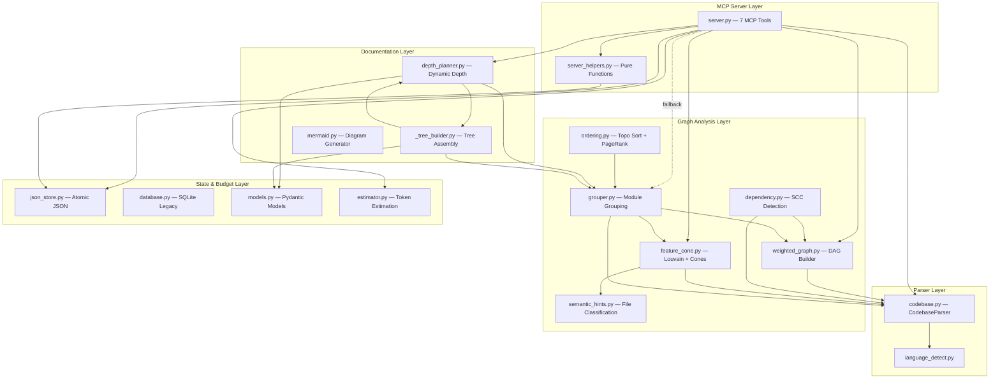

# Codebase Explorer — Architecture Documentation

> Auto-generated architecture documentation for `codebase-explorer` v1.0.0
> MCP Server + Agent Skill for codebase exploration and documentation generation.

## Project Summary

| Attribute | Value |
|-----------|-------|
| **Name** | `codebase-explorer` |
| **Version** | 1.0.0 |
| **Purpose** | MCP Server that auto-indexes codebases, groups modules via Louvain community detection, and produces dynamic N-layer architecture docs |
| **Language** | Python 3.12–3.13 |
| **Core Code** | 23 files, ~7,856 lines across 6 modules |
| **Tests** | 20 test files (unit + integration + E2E + regression scoring) |
| **License** | MIT |

## Module Map

| Module | Location | Lines | Purpose |
|--------|----------|-------|---------|
| [Server](server/OVERVIEW.md) | `src/server.py` + `src/server_helpers.py` | 1,361 | FastMCP entry point, 7 tool registrations, pure helper functions |
| [Parser](parser/OVERVIEW.md) | `src/parser/` | 781 | Source code AST parsing with dual-strategy (graph-sitter + stdlib fallback) |
| [Graph](graph/OVERVIEW.md) | `src/graph/` | 2,084 | Weighted DAG, Louvain grouping, feature cone extraction, topological ordering |
| [Doc](doc/OVERVIEW.md) | `src/doc/` | 1,086 | Dynamic depth planning, doc tree assembly, Mermaid diagram generation |
| [State](state/OVERVIEW.md) | `src/state/` | 854 | Dual-generation persistence (V2 JSON atomic / V1 SQLite legacy), Pydantic models |
| [Budget](budget/OVERVIEW.md) | `src/budget/` | 190 | Language-aware token estimation, zero external dependencies |

## System Architecture



## Data Pipeline

```
Source Code
    │
    ▼
┌──────────────────────────────────────────────────────┐
│  Phase 1: Parse                                       │
│  CodebaseParser.parse(path) → CodebaseSnapshot        │
│  graph-sitter (Python/TS/JS) ──or── stdlib ast (Py)  │
└───────────────────────┬──────────────────────────────┘
                        │
                        ▼
┌──────────────────────────────────────────────────────┐
│  Phase 2: Graph Construction                          │
│  build_weighted_dependency_graph(snapshot)             │
│  → nx.DiGraph (import=1, call=2, inherit=3 weights)  │
└───────────────────────┬──────────────────────────────┘
                        │
                        ▼
┌──────────────────────────────────────────────────────┐
│  Phase 3: Feature Cone Extraction                     │
│  extract_feature_cones(dag, snapshot)                  │
│  Louvain → merge small → infra detection → rename    │
└───────────────────────┬──────────────────────────────┘
                        │
                        ▼
┌──────────────────────────────────────────────────────┐
│  Phase 4: Task Planning                               │
│  build_task_manifest(cones, file_tokens, budget)      │
│  First-Fit Decreasing bin packing                    │
└───────────────────────┬──────────────────────────────┘
                        │
                        ▼
┌──────────────────────────────────────────────────────┐
│  Phase 5: Output (6 JSON files)                       │
│  01_structure → 02_dag → 03_feature_cones            │
│  04_file_tokens → 05_task_manifest → state.json      │
└──────────────────────────────────────────────────────┘
```

## Key Dependencies

| Library | Version | Purpose |
|---------|---------|---------|
| `mcp` (FastMCP) | >=1.0.0 | MCP protocol server, tool registration |
| `networkx` | >=3.0 | Directed graphs, SCC, Louvain, PageRank |
| `python-louvain` | >=0.16 | Alternative Louvain implementation |
| `graph-sitter` (codegen) | >=0.2.0 | Multi-language AST parsing (optional, has stdlib fallback) |
| `pydantic` | >=2.12.5 | Immutable data models (frozen BaseModel) |
| `aiosqlite` | >=0.22.1 | V1 legacy persistence (SQLite WAL mode) |
| `jinja2` | >=3.1.0 | Documentation template rendering |

## Design Principles

| Principle | Implementation |
|-----------|---------------|
| **Full Immutability** | All data models use `frozen=True` (dataclass or Pydantic) |
| **Deterministic Pipeline** | `analyze_codebase` has zero LLM calls — pure algorithmic, reproducible |
| **Graceful Degradation** | AST (graph-sitter → stdlib), PageRank (scipy → power iteration → uniform), Louvain (python-louvain → networkx builtin) |
| **Atomic Persistence** | V2 JSON store uses write-tmp-then-rename for POSIX atomicity |
| **Resumable Sessions** | File completion markers `<!-- codebase-explorer: end -->` + task manifest ordering |
| **Testable Helpers** | `server_helpers.py` extracted as pure functions, zero FastMCP dependency |

## Document Index

- [INDEX.md](INDEX.md) — This file (project overview)
- [server/OVERVIEW.md](server/OVERVIEW.md) — MCP Server + Helpers
- [parser/OVERVIEW.md](parser/OVERVIEW.md) — AST Parsing
- [graph/OVERVIEW.md](graph/OVERVIEW.md) — Graph Analysis
- [doc/OVERVIEW.md](doc/OVERVIEW.md) — Documentation Planning
- [state/OVERVIEW.md](state/OVERVIEW.md) — State Persistence
- [budget/OVERVIEW.md](budget/OVERVIEW.md) — Token Estimation
