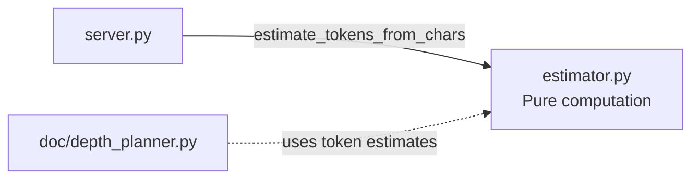

# Budget Module — OVERVIEW

> `src/budget/` — 2 files, 190 lines

Language-aware token estimation with zero external dependencies. Deliberately decoupled from the parser module via a local `FileInfo` duck-type.

## Architecture



## Constants

```python
CHARS_PER_TOKEN: dict[str, float] = {
    "python": 3.5,
    "typescript": 4.0,
    "javascript": 3.8,
    "default": 3.8,
}

TOKENS_PER_LINE: dict[str, int] = {
    "python": 12,
    "typescript": 15,
    "javascript": 15,
    "default": 15,
}
```

## Data Models

```python
@dataclass(frozen=True)
class TokenEstimate:
    source_tokens: int
    char_count: int
    line_count: int
    language: str
    method: str             # "chars" | "lines" | "tiktoken"

@dataclass(frozen=True)
class ModuleTokenEstimate:
    module_name: str
    total_chars: int
    total_lines: int
    estimated_tokens: int
    language: str
    file_count: int

@dataclass(frozen=True)
class FileInfo:             # local duck-type, decoupled from parser
    filepath: str
    language: str
    line_count: int
    char_count: int
```

## Public Functions

### estimate_tokens_from_chars (primary, recommended)

```python
def estimate_tokens_from_chars(char_count: int, language: str = "python") -> int
```

Primary V2 estimation method. Divides `char_count` by language-specific `CHARS_PER_TOKEN` ratio. Accuracy ±15%. Raises `ValueError` if `char_count < 0`.

### estimate_tokens_from_lines (deprecated)

```python
def estimate_tokens_from_lines(line_count: int, language: str = "python") -> int
```

Deprecated line-based estimator (accuracy ±20%). Emits `logger.warning`. Multiplies `line_count` by `TOKENS_PER_LINE` ratio. Raises `ValueError` if `line_count < 0`.

### estimate_file_tokens

```python
def estimate_file_tokens(filepath: str, language: str = "python") -> TokenEstimate
```

Reads file from disk, computes char and line counts, delegates to `estimate_tokens_from_chars`. Raises `FileNotFoundError` if missing.

### estimate_module_tokens

```python
def estimate_module_tokens(files: list[FileInfo], module_name: str = "") -> ModuleTokenEstimate
```

Aggregates per-file char-based estimates across a module. Primary language determined by file-count majority vote. Returns zero-valued result for empty file list.

## Design Notes

- **Zero external dependencies** — stdlib only (`dataclasses`, `pathlib`, `logging`)
- **Decoupled from parser** — defines its own `FileInfo` rather than importing `parser.FileInfo`
- **Char-based > line-based** — `estimate_tokens_from_chars` is 5% more accurate and is the recommended method
- **Language-aware** — Python code is denser (3.5 chars/token) vs TypeScript (4.0 chars/token)
