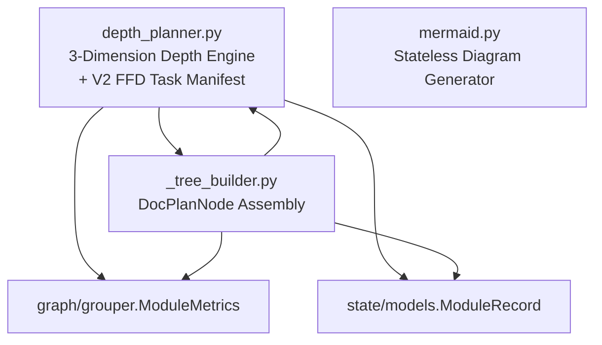

# Documentation Module — OVERVIEW

> `src/doc/` — 4 files, 1,086 lines

Dynamic depth planning, documentation tree assembly, and Mermaid diagram generation. The depth engine evaluates each module independently along three dimensions and assigns documentation depth 0–5.

## Architecture



## Core Data Models

### SplitStrategy (Enum)

```python
class SplitStrategy(Enum):
    SUBPACKAGE       # split by subdirectory
    CLASS            # split by class (OOP-heavy)
    FUNCTION_GROUP   # split by function clusters
    FILE             # split by individual files (fallback)
    HYBRID           # file-rich + mixed content
```

### DocumentPlan

```python
@dataclass(frozen=True)
class DocumentPlan:
    depth: int                          # 0-5
    split_strategy: SplitStrategy
    doc_budget_per_level: tuple[int, ...]
    should_merge_parent: bool           # too small to stand alone
    termination_reason: str
```

### DocPlanNode

```python
@dataclass(frozen=True)
class DocPlanNode:
    path: str                           # e.g. "mymod/OVERVIEW.md"
    level: int                          # 0=INDEX, 1=OVERVIEW, 2+=DETAIL
    target: str                         # what this doc covers
    token_budget: int
    doc_type: str                       # "index" | "overview" | "detail"
    parent_path: str | None
    children_paths: tuple[str, ...]
```

### DocStructurePlan

```python
@dataclass(frozen=True)
class DocStructurePlan:
    doc_tree: tuple[DocPlanNode, ...]   # flat list of all nodes
    total_docs: int
    max_depth: int
    depth_decisions: dict[str, dict]    # per-module decision metadata
```

## Dynamic Depth Algorithm (Three Dimensions)

```python
def calculate_depth(metrics: ModuleMetrics) -> int
    # depth = max(structural, complexity, token), then override rules applied
```

| Dimension | Input | 0 | 1 | 2 | 3 | 4 | 5 |
|-----------|-------|---|---|---|---|---|---|
| **Structural** | `subpackage_count` | 0 | ≤2 | ≤5 | ≤10 | ≤20 | >20 |
| **Complexity** | `fn×1 + cls×3 + lines/100 + cyclo×2` | <10 | <30 | <100 | <300 | <600 | ≥600 |
| **Token** | `estimated_tokens` | <500 | <2k | <8k | <32k | <128k | ≥128k |

**Override rules (applied after max):**
- Utility modules: capped at depth 2
- < 100 lines + < 5 functions: forced to depth 0
- < 10 components + < 200 lines: capped at depth 1
- Hard cap: depth 5

## Public Functions — depth_planner.py

| Function | Signature | Purpose |
|----------|-----------|---------|
| `calculate_depth` | `(metrics: ModuleMetrics) → int` | Three-dimension max + override rules |
| `select_split_strategy` | `(metrics: ModuleMetrics) → SplitStrategy` | SUBPACKAGE(≥2) > CLASS(≥3, ratio≥0.3) > FUNCTION_GROUP(≥5, cls≤2) > HYBRID > FILE |
| `should_terminate` | `(current_depth: int, metrics: ModuleMetrics, remaining_budget: int) → tuple[bool, str]` | Check 6 termination conditions |
| `calculate_total_budget` | `(metrics: ModuleMetrics, depth: int) → int` | `clamp(tokens × ratio × (1 + depth×0.5), 500, 50000)` |
| `allocate_budget_per_level` | `(total_budget: int, depth: int) → tuple[int, ...]` | Geometric decay `0.6^i`, per-level minimums enforced |
| `plan_documentation` | `(metrics: ModuleMetrics) → DocumentPlan` | Orchestrate depth + strategy + budget for one module |
| `plan_doc_structure` | `(project_id: str, modules: list[ModuleRecord], metrics: dict[str, ModuleMetrics]) → DocStructurePlan` | Top-level entry: all modules → doc tree |

## V2 Task Manifest (FFD Bin Packing)

```python
def build_task_manifest(
    cones: dict[str, dict],
    file_tokens: dict[str, int],
    context_budget: int = 100_000,
) -> dict  # schema v2.0
```

| Cone Size | Strategy | Task Type |
|-----------|----------|-----------|
| Oversized (> budget) | DAG-layer split, greedy fill 80% budget | `split` (sequential deps) |
| Medium | One task per cone | `single` |
| Small | Batch multiple cones together | `batch` |
| — | Final aggregation | `index` (depends on all detail tasks) |

```python
def _split_cone_by_dag_layer(cone_id, cone_data, file_tokens, usable_budget, start_id) -> list[dict]
    # Sort files by DAG layer desc → token count, greedy pack into parts

def calculate_feature_cone_depth(cone_tokens: int, dag_layers: int = 1, token_budget: int = 100000) -> int
    # V2 depth: min(dag_layers, 5) capped by token size
```

## Tree Builder (_tree_builder.py)

```python
def build_doc_tree(
    project_id: str,
    modules: list[ModuleRecord],
    plans: dict[str, DocumentPlan],
    metrics: dict[str, ModuleMetrics],
) -> list[DocPlanNode]

def depth_reason(metrics: ModuleMetrics, plan: DocumentPlan) -> str
```

**Tree structure (max 3 levels):**

```
Level 0: INDEX.md                          (1 node, doc_type="index")
Level 1:   {module}/OVERVIEW.md            (1 per module, doc_type="overview")
Level 2:     {module}/{target}/DETAIL.md   (0-5 per module, only when depth ≥ 2)
```

Detail targets per split strategy: CLASS → `class_0..4`, FUNCTION_GROUP → `func_group_0..4`, SUBPACKAGE → `subpkg_0..4`, FILE/HYBRID → `file_0..4`.

## Mermaid Generator (mermaid.py)

Stateless class, no project-internal imports. All methods are pure functions.

```python
class MermaidGenerator:
    def generate_module_diagram(self, modules, dependencies, *, max_nodes=30) -> str
    def generate_class_diagram(self, classes: list[ClassDiagramInfo], *, max_classes=20) -> str
    def generate_flow_diagram(self, steps: list[FlowStep], *, max_edges=50) -> str
    def generate_dependency_mermaid(self, edges, *, scope="project", target=None, max_nodes=30) -> str
    def generate_call_graph_mermaid(self, calls, *, max_edges=50) -> str
    def generate_class_hierarchy_mermaid(self, classes, *, max_classes=20) -> str
```

### Helper Data Models

```python
@dataclass(frozen=True)
class ClassDiagramInfo:
    name: str; base_classes: tuple[str, ...]; methods: tuple[str, ...]

@dataclass(frozen=True)
class FlowStep:
    id: str; label: str; next_ids: tuple[str, ...]
```

## Budget Decay Model

Level weights follow `0.6^i`. For depth=2: weights `[1.0, 0.6, 0.36]`, normalized against total budget. Per-level minimums: `{0: 800, 1: 1200, 2: 2000, 3-5: 1500}`.
