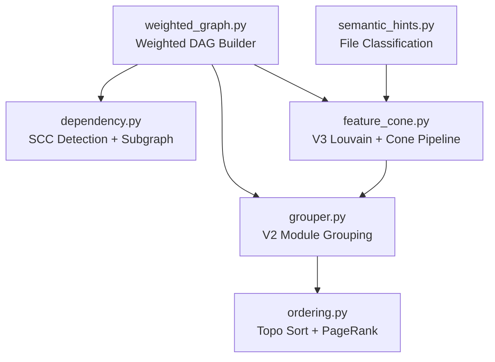

# Graph Analysis Module — OVERVIEW

> `src/graph/` — 6 files, 2,084 lines

Transforms `CodebaseSnapshot` into weighted dependency graphs, performs Louvain community detection for module grouping, extracts Feature Cones, and computes topological analysis ordering. The heaviest module in the project.

## Architecture



## Sub-module: weighted_graph.py (185 lines)

Builds a multi-relation weighted `nx.DiGraph` combining three edge types with accumulated weights.

```python
EDGE_WEIGHTS = {"import": 1, "call": 2, "inherit": 3}

@dataclass(frozen=True)
class WeightedGraphResult:
    graph: nx.DiGraph       # edge attrs: weight (int), edge_types (list[str])
    node_count: int
    edge_count: int
    total_weight: int
    summary: str            # human-readable statistics

def build_weighted_dependency_graph(snapshot: CodebaseSnapshot) -> WeightedGraphResult
```

**Construction steps:**
1. Build unique name→file lookup (skip ambiguous names with count > 1)
2. Add all file nodes
3. Three-pass weight accumulation: import edges → call edges → inheritance edges
4. Merge same `(src, tgt)` pairs: sum weights, combine type lists

## Sub-module: dependency.py (307 lines)

File-level dependency graph with SCC-based circular dependency detection.

```python
@dataclass(frozen=True)
class DependencyEdge:
    source: str; target: str; weight: int; edge_type: str

@dataclass(frozen=True)
class DependencyGraphResult:
    graph: nx.DiGraph
    file_count: int; edge_count: int
    edges: tuple[DependencyEdge, ...]
    circular_deps: tuple[tuple[str, ...], ...]  # SCC groups with >1 member

def build_dependency_graph(snapshot: CodebaseSnapshot) -> DependencyGraphResult
def get_module_dependency_subgraph(graph: nx.DiGraph, module_files: list[str]) -> nx.DiGraph
def get_file_dependency_subgraph(graph: nx.DiGraph, file_path: str, hops: int = 1) -> nx.DiGraph
```

## Sub-module: feature_cone.py (393 lines)

V3 feature cone extraction: Louvain community detection on weighted DAG → small-community merging → infrastructure identification → test separation → semantic renaming.

```python
@dataclass(frozen=True)
class FeatureCone:
    cone_id: str
    entry_point: str               # file with highest out-degree in community
    exclusive_files: tuple[str, ...]
    shared_deps: tuple[str, ...]   # infrastructure files
    layer: int = 0
    token_count: int = 0

def extract_feature_cones(
    dag: nx.DiGraph,
    snapshot: CodebaseSnapshot,
    shared_threshold: int | None = None,
) -> tuple[dict[str, FeatureCone], frozenset[str]]
```

### 5-Step Pipeline

| Step | Function | Algorithm |
|------|----------|-----------|
| 1. Community detection | `_louvain_communities` | Louvain on undirected graph (resolution=1.0, seed=42) |
| 2. Small community merge | `_merge_small_communities` | Score = edge_count + avg_directory_affinity × max_edges (min_size=3) |
| 3. Infrastructure identification | `_identify_infrastructure` | 4 criteria (union): semantic class + median in-degree, infra stems, `__init__.py` re-export facades, 40% community cross-cut |
| 4. Test separation | `_separate_testing_files` | `classify_file == "testing"` → `<cone_id>::testing` sub-cone |
| 5. Rename | `_rename_cones` + `_generate_cone_name` | Semantic category (≥40%) → common dir prefix → deepest dir → file stem → numeric suffix |

## Sub-module: grouper.py (513 lines)

V2 module grouping layer using Louvain with utility node isolation.

```python
@dataclass(frozen=True)
class ModuleMetrics:
    name: str
    file_count: int; function_count: int; class_count: int
    line_count: int; estimated_tokens: int  # line_count * 15
    internal_edges: int; external_edges: int
    subpackage_count: int

@dataclass(frozen=True)
class GroupingResult:
    modules: dict[str, tuple[str, ...]]   # module_name → file_paths
    utility_files: frozenset[str]
    modularity_score: float
    module_count: int

def group_modules(graph, snapshot=None, resolution=1.0, utility_threshold=0.1) -> GroupingResult
def recursive_subgroup(graph, module_files, min_size=5, resolution=1.5) -> dict[str, list[str]]
def get_module_metrics(graph, modules, file_lookup=None) -> dict[str, ModuleMetrics]
def identify_utility_nodes(graph, threshold=0.1, utility_dir_patterns=None) -> frozenset[str]
def get_cone_metrics(cone: FeatureCone, file_lookup=None) -> ModuleMetrics
```

**Utility node detection:** in-degree > `threshold × total_nodes` OR resides in utility directory (`utils`, `util`, `common`, `shared`, `helpers`, `lib`, `tools`).

## Sub-module: ordering.py (349 lines)

Layered topological ordering via SCC condensation + PageRank prioritization.

```python
@dataclass(frozen=True)
class AnalysisPlan:
    project_name: str; total_modules: int
    analysis_layers: tuple[tuple[str, ...], ...]  # layered analysis order
    module_metrics: dict[str, ModuleMetrics]
    has_cycles: bool
    cycle_info: tuple[tuple[str, ...], ...] | None

def topological_order(graph, modules) -> list[list[str]]
def compute_pagerank(graph, alpha=0.85, max_iter=100) -> dict[str, float]
def create_analysis_plan(modules, order, metrics, project_name="project", graph=None) -> AnalysisPlan
```

**Topological sort 4-step pipeline:**
1. Build module-level DAG from file-level graph
2. Condense SCCs via `nx.condensation` to handle cycles
3. Compute PageRank on module graph
4. Kahn-style layered sort, intra-layer sorted by PageRank descending

**PageRank 3-tier fallback:** scipy-backed `nx.pagerank` → pure Python power iteration → uniform `1/n`.

## Sub-module: semantic_hints.py (273 lines)

Stateless semantic classification utilities. Zero project-internal imports.

```python
def classify_file(filepath: str) -> str
    # → "testing" | "models" | "api" | "cli" | "config" | "middleware"
    #   | "security" | "utils" | "exceptions" | "unknown"
    # Pre-compiled regex patterns matched against file stem + directory components

def directory_affinity_score(file_a: str, file_b: str) -> float
    # Same dir = 1.0 | Parent-child = 0.7 | Sibling = 0.4 | Other = 0.0

def is_reexport_facade(filepath: str, root_path: str) -> bool
    # AST-parses __init__.py, returns True if relative_imports / (imports + defs) > 0.8
```

## Inter-Submodule Dependencies

```
weighted_graph.py    ← dependency.py, grouper.py, feature_cone.py
semantic_hints.py    ← feature_cone.py
feature_cone.py      ← grouper.py
grouper.py           ← ordering.py (ModuleMetrics type only)
```

All sub-modules import `CodebaseSnapshot` / `FileInfo` from `src.parser.codebase`. All use `networkx` as the core graph library.
