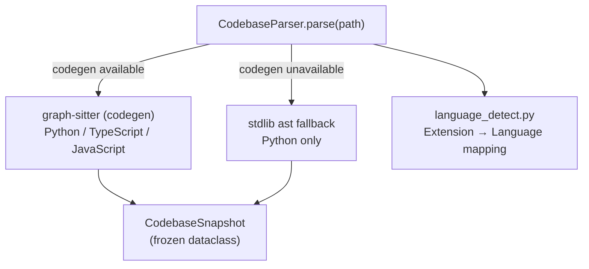

# Parser Module — OVERVIEW

> `src/parser/` — 3 files, 781 lines

Source code AST parsing with dual-strategy architecture. Produces an immutable `CodebaseSnapshot` containing all files, functions, classes, and their relationships.

## Architecture



## Core Data Structures

All structures are `frozen=True` dataclasses — fully immutable.

### FileInfo

```python
@dataclass(frozen=True)
class FileInfo:
    filepath: str                      # relative to project root
    language: str                      # "python" | "typescript" | "javascript"
    line_count: int
    function_names: tuple[str, ...]
    class_names: tuple[str, ...]
    import_sources: tuple[str, ...]    # resolved import target file paths
    char_count: int = 0                # populated by AST fallback
```

### FunctionInfo

```python
@dataclass(frozen=True)
class FunctionInfo:
    name: str
    filepath: str
    start_line: int
    end_line: int
    parameters: tuple[str, ...]        # excludes 'self'
    return_type: str | None
    calls: tuple[str, ...]             # callee function names
    dependencies: tuple[str, ...]      # cross-file call target paths
```

### ClassInfo

```python
@dataclass(frozen=True)
class ClassInfo:
    name: str
    filepath: str
    start_line: int
    end_line: int
    methods: tuple[str, ...]
    base_classes: tuple[str, ...]
    subclasses: tuple[str, ...]        # empty in fallback path
```

### CodebaseSnapshot

```python
@dataclass(frozen=True)
class CodebaseSnapshot:
    root_path: str
    files: tuple[FileInfo, ...]
    functions: tuple[FunctionInfo, ...]
    classes: tuple[ClassInfo, ...]
    languages_detected: tuple[str, ...]
    total_lines: int
```

## Exception Hierarchy

```
GraphSitterError (base)
├── CodebaseParseError          # invalid path or parse failure
└── UnsupportedLanguageError    # language not in SUPPORTED_LANGUAGES
```

## Public API

### CodebaseParser

```python
class CodebaseParser:
    def parse(self, path: str, languages: list[str] | None = None) -> CodebaseSnapshot
    def get_file_content(self, filepath: str) -> str
```

### Module-level convenience

```python
def parse_project(path: str, languages: list[str] | None = None) -> CodebaseSnapshot
    # Equivalent to CodebaseParser().parse(path, languages=languages)
```

## Dual-Strategy AST Parsing

| Strategy | Condition | Languages | Import Resolution |
|----------|-----------|-----------|-------------------|
| **graph-sitter** (codegen) | `codegen` importable | Python, TS, JS | `resolved_symbol.file.filepath` (cross-file symbol resolution) |
| **stdlib `ast` fallback** | `codegen` unavailable | Python only | Two-pass: build `module_map` → resolve `from X import Y` |

### Fallback Path Details (`_fallback_parse_python`)

- **Two-pass design:**
  - Pass 1: `ast.walk(tree)` collects FunctionDef/AsyncFunctionDef, ClassDef, Import/ImportFrom nodes. Detects dynamic imports (`importlib.import_module`, `__import__`).
  - Pass 2: Builds `func_name → filepath` lookup (skips ambiguous duplicates), rewrites `FunctionInfo.dependencies` to cross-file targets.
- **Resilience:** `SyntaxError` files recorded as empty `FileInfo` (not dropped). `RecursionError` triggers one retry with `sys.setrecursionlimit(5000)`.
- **Relative imports:** Fully supported via `level >= 1` resolution against `module_map`.

## Language Detection (`language_detect.py`)

```python
SUPPORTED_LANGUAGES: tuple[str, ...] = ("python", "typescript", "javascript")

_EXTENSION_MAP: dict[str, str] = {
    ".py": "python", ".ts": "typescript", ".tsx": "typescript",
    ".js": "javascript", ".jsx": "javascript",
}
```

| Function | Signature | Purpose |
|----------|-----------|---------|
| `detect_language` | `(file_path: str) → str` | Single file extension → language name |
| `detect_languages` | `(dir_path: str) → LanguageProfile` | Recursive directory scan → language distribution |
| `detect_project_language` | `(dir_path: str) → str` | Returns primary language only |
| `is_supported_language` | `(language: str) → bool` | Case-insensitive membership check |

### LanguageProfile

```python
@dataclass(frozen=True)
class LanguageProfile:
    languages: dict[str, int]      # e.g. {"python": 42, "typescript": 10}
    primary_language: str          # most frequent, or "unsupported"
    total_files: int
```

## Internal Dependencies

```python
# codebase.py imports:
from src.parser.language_detect import detect_languages, is_supported_language

# language_detect.py:
# No project-internal imports (stdlib only)
```
