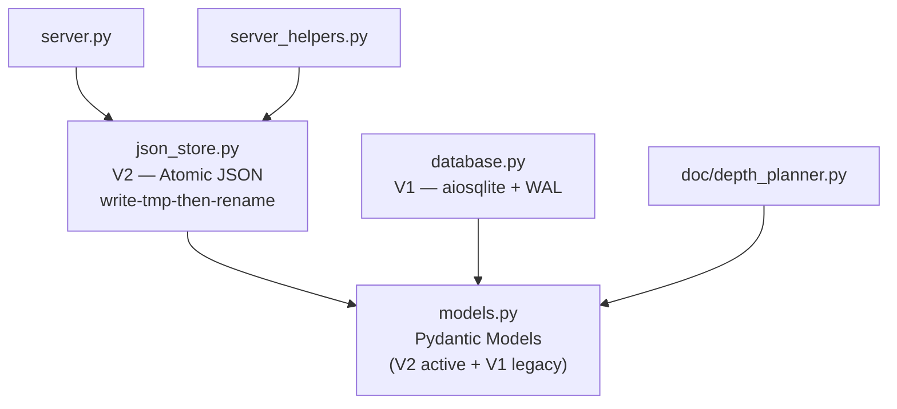

# State Module — OVERVIEW

> `src/state/` — 4 files, 854 lines

Dual-generation persistence layer (V2 atomic JSON + V1 SQLite legacy) and Pydantic data models. All models are `frozen=True` for full immutability.

## Architecture



## V2 Persistence — json_store.py (active)

Single `state.json` file with POSIX-atomic write-then-rename (`os.replace`). Zero external dependencies (stdlib only).

### Public Functions

```python
def atomic_write_state(state_path: Path, state: dict) -> None
    # Write to .json.tmp → os.replace() → atomic swap

def read_state(state_path: Path) -> dict | None
    # Returns None if file missing or malformed

def update_task_status(
    state_path: Path,
    task_id: str,
    status: Literal["pending", "in_progress", "complete", "failed"],
    output_files: list[dict] | None = None,
    error: str | None = None,
) -> dict
    # Read → mutate task → set timestamps → atomic write → return state
    # Raises ValueError if state or task not found

def resume_from_state(project_root: Path) -> list[str]
    # Recovery: check in_progress tasks for file completion markers
    # Complete if file > 200 bytes + has "<!-- codebase-explorer: end -->"
    # Reset to pending otherwise
    # Returns pending task IDs in 05_task_manifest.json order
```

### File Completion Detection

```python
def _check_file_complete(file_path: Path) -> bool
    # True if: exists AND > 200 bytes AND last 10 lines contain
    # "<!-- codebase-explorer: end -->"
```

## V1 Persistence — database.py (legacy)

Async SQLite via `aiosqlite` with WAL mode, foreign keys, 5-second busy timeout. List/dict model fields serialized as JSON strings in TEXT columns.

### Database Class

```python
class Database:
    def __init__(self, db_path: Path) -> None
```

| Method | Signature | Purpose |
|--------|-----------|---------|
| `initialize` | `async () → None` | Create tables via SCHEMA_SQL, enable WAL/FK/timeout |
| `close` | `async () → None` | Close connection |
| `insert_project` | `async (project: ProjectRecord) → None` | Insert project row |
| `get_project` | `async (project_id: str) → ProjectRecord \| None` | Fetch by ID |
| `get_latest_project` | `async () → ProjectRecord \| None` | Most recently created |
| `update_project_status` | `async (project_id: str, status: str) → None` | Update status column |
| `insert_modules` | `async (modules: list[ModuleRecord]) → None` | Bulk upsert (INSERT OR REPLACE) |
| `get_modules` | `async (project_id: str) → list[ModuleRecord]` | All modules, ordered by name |
| `get_module` | `async (project_id: str, name: str) → ModuleRecord \| None` | Single module lookup |
| `create_tasks` | `async (tasks: list[AnalysisTask]) → None` | Bulk upsert tasks |
| `get_next_pending_tasks` | `async (project_id: str, batch_size: int = 3) → list[AnalysisTask]` | Atomic fetch + mark in_progress |
| `claim_task` | `async (task_id: str, agent_id: str) → bool` | CAS-style claim (pending → in_progress) |
| `complete_task` | `async (task_id: str, status: str) → None` | Set final status + completed_at |
| `get_task_status_summary` | `async (project_id: str) → dict` | Aggregated counts + progress % |
| `insert_result` | `async (result: AnalysisResult) → None` | Upsert analysis result |
| `get_result` | `async (project_id: str, module_name: str) → AnalysisResult \| None` | Fetch single result |
| `get_all_results` | `async (project_id: str) → list[AnalysisResult]` | All results, ordered by module |
| `save_checkpoint` | `async (checkpoint: CheckpointRecord) → None` | Upsert checkpoint |
| `get_latest_checkpoint` | `async (project_id: str) → CheckpointRecord \| None` | Most recent checkpoint |
| `get_checkpoint` | `async (checkpoint_id: str) → CheckpointRecord \| None` | Fetch by ID |
| `insert_doc_nodes` | `async (nodes: list[DocNode]) → None` | Bulk upsert doc tree nodes |
| `get_doc_tree` | `async (project_id: str) → list[DocNode]` | All nodes, ordered by level+path |
| `update_doc_node_content` | `async (node_id: str, content: str, actual_tokens: int) → None` | Set content, mark generated |

## Pydantic Models — models.py

### Type Aliases

| Alias | Values |
|-------|--------|
| `ProjectStatus` | `"pending" \| "indexing" \| "indexed" \| "failed"` |
| `TaskStatus` | `"pending" \| "in_progress" \| "complete" \| "failed" \| "skipped"` |
| `CheckpointStatus` | `"in_progress" \| "complete" \| "interrupted" \| "failed"` |
| `AnalysisPhase` | `"indexing" \| "module_analysis" \| "cross_reference" \| "doc_generation"` |
| `DocNodeStatus` | `"planned" \| "generated" \| "failed"` |

### V2 Models (active, JSON-based)

**StateFile** — root schema for `state.json`:

```python
class StateFile(BaseModel, frozen=True):
    schema_version: str = "2.0"
    project: ProjectMeta
    analysis_files: dict[str, str] = {}
    tasks: dict[str, TaskRecord] = {}
    documentation: DocumentationMeta = DocumentationMeta()
    metadata: dict = {}
```

**ProjectMeta:**

```python
class ProjectMeta(BaseModel, frozen=True):
    id: str; root_path: str; analyzed_at: datetime
    languages: list[str] = []
    file_count: int = 0; function_count: int = 0
    class_count: int = 0; total_lines: int = 0
    total_chars: int = 0; total_tokens: int = 0
    analysis_status: Literal["pending", "in_progress", "complete", "failed"] = "pending"
```

**TaskRecord:**

```python
class TaskRecord(BaseModel, frozen=True):
    type: Literal["batch", "single", "split", "index"]
    status: TaskStatus = "pending"
    cone_ids: list[str] = []
    estimated_tokens: int = 0
    output_files: list[OutputFileRecord] = []
    split_subtasks: list[str] | None = None
    depends_on: list[str] | None = None
    started_at: datetime | None = None
    completed_at: datetime | None = None
    error: str | None = None
```

**DocumentationMeta:**

```python
class DocumentationMeta(BaseModel, frozen=True):
    output_dir: str = ".codebase-docs/"
    index_written: bool = False
    overviews_written: int = 0; details_written: int = 0; snippets_written: int = 0
    total_planned: int = 0
    source_files_covered: list[str] = []
    source_file_coverage_percent: float = 0.0
    total_tokens_written: int = 0
```

### V1 Legacy Models (SQLite-based)

| Model | Key Fields | Purpose |
|-------|-----------|---------|
| `ProjectRecord` | `id, path, created_at, status, languages, file_count, ...` | Indexed codebase project |
| `ModuleRecord` | `id, project_id, name, files, is_utility, description` | Louvain-detected module group |
| `AnalysisTask` | `id, project_id, module_name, status, assigned_agent, batch_index` | Queued analysis task |
| `AnalysisResult` | `id, task_id, module_name, description, public_interfaces, dependencies, mermaid_diagram, token_count` | Module analysis output |
| `CheckpointRecord` | `id, project_id, phase, analyzed_modules, pending_modules, total_tokens_processed` | Session resume checkpoint |
| `DocNode` | `id, project_id, path, level, target, token_budget, content, actual_tokens, status` | Doc hierarchy node |

## Internal Dependencies

```python
# models.py: pydantic only (no project imports)
# json_store.py: stdlib only (no project imports)
# database.py: aiosqlite + models.py
```
