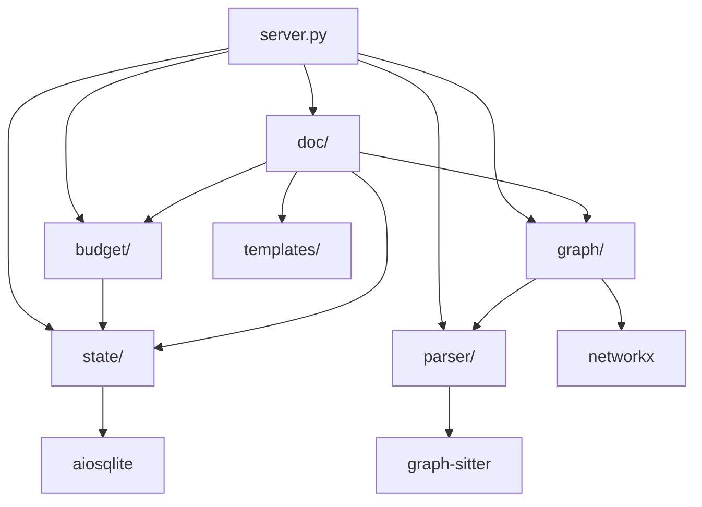

# Codebase Explorer 架构设计

> **作者**：架构设计 Agent
> **创建时间**：2026-03-22
> **状态**：设计文档（T-01）
> **依赖项**：CRITICAL_REVIEW.md, results/01-07, design/depth_strategy.md, design/doc_templates.md

---

## 目录

1. [系统概览](#1-系统概览)
2. [源码模块接口](#2-源码模块接口)
3. [MCP 工具签名](#3-mcp-工具签名)
4. [数据流图](#4-数据流图)
5. [SQLite 数据库模式](#5-sqlite-数据库模式)
6. [Graph-sitter 封装策略](#6-graph-sitter-封装策略)
7. [错误处理策略](#7-错误处理策略)

---

## 1. 系统概览

Codebase Explorer 是一个本地 MCP Server + Agent Skill 工具，用于分析 Python/TypeScript/JavaScript 代码库并生成渐进式披露架构文档。系统使用 graph-sitter 作为唯一的解析引擎，FastMCP 3.0 作为 MCP 框架。

### 1.1 架构层次

```
┌──────────────────────────────────────────────────────────┐
│  AI Agent（Claude Code / Gemini CLI / Codex CLI）        │
│  读取 SKILL.md → 调用 MCP 工具 → 写入文档               │
└────────────────────┬─────────────────────────────────────┘
                     │ STDIO JSON-RPC
┌────────────────────▼─────────────────────────────────────┐
│  server.py  — FastMCP 3.0 入口点                         │
│  ├── 15 个 MCP 工具已注册                                │
│  └── 生命周期：SQLite + graph-sitter 初始化              │
├──────────────────────────────────────────────────────────┤
│  parser/   │  graph/    │  budget/  │  doc/     │ state/ │
│  codebase  │  dependency│  estimator│  planner  │ db     │
│  lang_det  │  grouper   │  control  │  generator│ ckpt   │
│            │  ordering  │           │  mermaid  │ models │
│            │            │           │  templates│        │
├──────────────────────────────────────────────────────────┤
│  graph-sitter（Codebase API）│  SQLite（WAL 模式）       │
│  NetworkX（DiGraph）         │  aiosqlite               │
└──────────────────────────────────────────────────────────┘
```

### 1.2 模块依赖图



---

## 2. 源码模块接口

### 2.1 parser/ — 代码解析层

封装 graph-sitter 的 Codebase API。包含两个文件。

#### parser/codebase.py（约 250 行）

```python
from __future__ import annotations
from dataclasses import dataclass
from pathlib import Path

@dataclass(frozen=True)
class FileInfo:
    """解析后的源文件的不可变表示。"""
    filepath: str
    language: str
    line_count: int
    function_names: tuple[str, ...]
    class_names: tuple[str, ...]
    import_sources: tuple[str, ...]  # 已解析的文件路径

@dataclass(frozen=True)
class FunctionInfo:
    """解析后的函数的不可变表示。"""
    name: str
    filepath: str
    start_line: int
    end_line: int
    parameters: tuple[str, ...]
    return_type: str | None
    calls: tuple[str, ...]       # 被调用函数的名称
    dependencies: tuple[str, ...]  # 依赖文件的路径

@dataclass(frozen=True)
class ClassInfo:
    """解析后的类的不可变表示。"""
    name: str
    filepath: str
    start_line: int
    end_line: int
    methods: tuple[str, ...]
    base_classes: tuple[str, ...]
    subclasses: tuple[str, ...]

@dataclass(frozen=True)
class CodebaseSnapshot:
    """解析后代码库的不可变快照。"""
    root_path: str
    files: tuple[FileInfo, ...]
    functions: tuple[FunctionInfo, ...]
    classes: tuple[ClassInfo, ...]
    languages_detected: tuple[str, ...]
    total_lines: int

class CodebaseParser:
    """封装 graph-sitter Codebase API 用于代码分析。"""

    def parse(self, path: str, languages: list[str] | None = None) -> CodebaseSnapshot:
        """解析代码库目录并返回不可变快照。

        Args:
            path: 代码库根目录的绝对路径。
            languages: 可选的语言过滤器。
                       接受值："python"、"typescript"、"javascript"。
                       None 表示自动检测。

        Returns:
            包含所有文件、函数和类的 CodebaseSnapshot。

        Raises:
            CodebaseParseError: 如果路径无效或解析失败。
            UnsupportedLanguageError: 如果请求了不支持的语言。
        """
        ...

    def get_file_content(self, filepath: str) -> str:
        """读取特定文件的内容。

        Args:
            filepath: 源文件的绝对路径。

        Returns:
            文件内容字符串。

        Raises:
            FileNotFoundError: 如果文件不存在。
        """
        ...
```

**依赖项**：`graph-sitter`（codegen），`parser/language_detect.py`

#### parser/language_detect.py（约 80 行）

```python
from pathlib import Path

SUPPORTED_LANGUAGES = ("python", "typescript", "javascript")

@dataclass(frozen=True)
class LanguageProfile:
    """目录的检测语言分布。"""
    languages: dict[str, int]  # 语言 -> 文件数量
    primary_language: str
    total_files: int

def detect_languages(path: str) -> LanguageProfile:
    """检测目录中存在的编程语言。

    通过扫描文件扩展名确定语言分布。
    仅统计 SUPPORTED_LANGUAGES 中的文件。

    Args:
        path: 要扫描的目录路径。

    Returns:
        包含语言分布的 LanguageProfile。

    Raises:
        InvalidPathError: 如果路径不存在或不是目录。
    """
    ...

def is_supported_language(language: str) -> bool:
    """检查某语言是否受 graph-sitter 支持。"""
    ...
```

**依赖项**：无（纯 Python 标准库）。

---

### 2.2 graph/ — 图构建与分析层

将解析数据转换为 NetworkX 图并执行社区检测。包含三个文件。

#### graph/dependency.py（约 250 行）

```python
import networkx as nx
from parser.codebase import CodebaseSnapshot

@dataclass(frozen=True)
class DependencyEdge:
    """依赖图中的有向边。"""
    source: str       # 源文件路径
    target: str       # 目标文件路径
    weight: int       # 导入/调用引用数量
    edge_type: str    # "import" | "call" | "inherit"

@dataclass(frozen=True)
class DependencyGraphResult:
    """依赖图构建的不可变结果。"""
    graph: nx.DiGraph
    file_count: int
    edge_count: int
    circular_deps: tuple[tuple[str, ...], ...]  # SCC 组

def build_dependency_graph(snapshot: CodebaseSnapshot) -> DependencyGraphResult:
    """从代码库快照构建文件级依赖图。

    构建 NetworkX DiGraph，其中：
    - 节点为源文件路径。
    - 边表示导入/调用/继承关系。
    - 边的权重反映引用频率。

    Args:
        snapshot: 来自解析层的 CodebaseSnapshot。

    Returns:
        包含图和元数据的 DependencyGraphResult。
    """
    ...
```

**依赖项**：`networkx`，`parser/codebase.py`

#### graph/grouper.py（约 300 行）

```python
import networkx as nx

@dataclass(frozen=True)
class ModuleGroup:
    """社区检测发现的模块组。"""
    name: str
    files: tuple[str, ...]
    file_count: int
    line_count: int
    function_count: int
    class_count: int
    is_utility: bool

@dataclass(frozen=True)
class GroupingResult:
    """模块分组过程的结果。"""
    modules: tuple[ModuleGroup, ...]
    utility_modules: tuple[ModuleGroup, ...]
    modularity_score: float
    coverage: float

def group_modules(
    graph: nx.DiGraph,
    snapshot: "CodebaseSnapshot",
    resolution: float = 1.0,
    utility_threshold: float = 0.1,
) -> GroupingResult:
    """将代码库文件分组为逻辑模块。

    使用两阶段方法：
    1. 基于目录的初始分组（第 0 级）。
    2. Louvain 社区检测精化（第 1 级）。

    高入度的工具节点在社区检测之前被识别和隔离，
    然后分配到一个特殊组。

    Args:
        graph: 来自 dependency.py 的依赖图。
        snapshot: 文件元数据的 CodebaseSnapshot。
        resolution: Louvain 分辨率参数（>1 = 更小的组）。
        utility_threshold: 工具节点的入度比率阈值。

    Returns:
        包含模块组和质量指标的 GroupingResult。
    """
    ...
```

**依赖项**：`networkx`，`parser/codebase.py`

#### graph/ordering.py（约 200 行）

```python
import networkx as nx

@dataclass(frozen=True)
class AnalysisOrder:
    """模块分析层的有序列表。"""
    layers: tuple[tuple[str, ...], ...]  # ((层0模块), (层1模块), ...)
    pagerank_scores: dict[str, float]
    total_layers: int

def compute_analysis_order(
    graph: nx.DiGraph,
    module_groups: "GroupingResult",
) -> AnalysisOrder:
    """使用 DAG 拓扑排序计算最优模块分析顺序。

    策略：
    1. 将 SCC 压缩为超节点（nx.condensation）。
    2. 对压缩后的 DAG 进行拓扑排序。
    3. 在每个拓扑层内，按 PageRank 排序（分数高的优先）。
    4. 工具模块不论拓扑顺序如何均优先放置。

    Args:
        graph: 模块级依赖图。
        module_groups: 模块分组结果。

    Returns:
        包含分层处理序列的 AnalysisOrder。
    """
    ...
```

**依赖项**：`networkx`

---

### 2.3 state/ — 状态管理层

基于 SQLite 的持久化存储，用于分析状态、检查点和结果。包含三个文件。

#### state/models.py（约 200 行）

```python
from pydantic import BaseModel, Field
from typing import Literal
from datetime import datetime

class ProjectRecord(BaseModel):
    """存储的项目索引记录。"""
    id: str
    path: str
    created_at: datetime
    status: Literal["pending", "indexing", "indexed", "failed"]
    languages: list[str]
    file_count: int
    function_count: int
    class_count: int
    total_lines: int

class ModuleRecord(BaseModel):
    """存储的模块组记录。"""
    id: str
    project_id: str
    name: str
    files: list[str]
    file_count: int
    line_count: int
    function_count: int
    class_count: int
    is_utility: bool
    description: str | None = None

class AnalysisTask(BaseModel):
    """队列中的单个分析任务。"""
    id: str
    project_id: str
    module_name: str
    status: Literal["pending", "in_progress", "completed", "failed", "skipped"]
    assigned_agent: str | None = None
    batch_index: int
    created_at: datetime
    completed_at: datetime | None = None

class AnalysisResult(BaseModel):
    """模块的已提交分析结果。"""
    id: str
    task_id: str
    module_name: str
    description: str
    public_interfaces: list[str]
    key_data_structures: list[str]
    dependencies: list[str]
    dependents: list[str]
    patterns_identified: list[str]
    detailed_analysis: str | None = None
    mermaid_diagram: str | None = None
    token_count: int
    created_at: datetime

class CheckpointRecord(BaseModel):
    """用于恢复支持的分析检查点。"""
    id: str
    project_id: str
    status: Literal["in_progress", "completed", "interrupted", "failed"]
    phase: Literal["indexing", "module_analysis", "cross_reference", "doc_generation"]
    analyzed_modules: list[str]
    pending_modules: list[str]
    total_modules: int
    total_tokens_processed: int
    errors: list[dict]
    created_at: datetime
    updated_at: datetime

class DocNode(BaseModel):
    """文档树中的一个节点。"""
    id: str
    project_id: str
    path: str           # 例如 "core/OVERVIEW.md"
    level: int          # 0=INDEX, 1=OVERVIEW, 2+=DETAIL
    target: str         # 模块或组件名称
    token_budget: int
    parent_path: str | None = None
    children_paths: list[str] = Field(default_factory=list)
    content: str | None = None
    actual_tokens: int | None = None
    status: Literal["planned", "generated", "failed"] = "planned"
```

**依赖项**：`pydantic`

#### state/database.py（约 350 行）

```python
import aiosqlite
from pathlib import Path

class Database:
    """用于状态持久化的异步 SQLite 数据库。

    使用 WAL 模式支持并发读取。
    所有写操作通过 aiosqlite 串行化。
    """

    def __init__(self, db_path: Path) -> None: ...

    async def initialize(self) -> None:
        """创建表并运行迁移。幂等操作。"""
        ...

    async def close(self) -> None:
        """关闭数据库连接。"""
        ...

    # --- 项目 ---
    async def insert_project(self, project: ProjectRecord) -> None: ...
    async def get_project(self, project_id: str) -> ProjectRecord | None: ...
    async def get_latest_project(self) -> ProjectRecord | None: ...
    async def update_project_status(self, project_id: str, status: str) -> None: ...

    # --- 模块 ---
    async def insert_modules(self, modules: list[ModuleRecord]) -> None: ...
    async def get_modules(self, project_id: str) -> list[ModuleRecord]: ...
    async def get_module(self, project_id: str, name: str) -> ModuleRecord | None: ...

    # --- 分析任务 ---
    async def create_tasks(self, tasks: list[AnalysisTask]) -> None: ...
    async def get_next_pending_tasks(
        self, project_id: str, batch_size: int = 3,
    ) -> list[AnalysisTask]: ...
    async def claim_task(self, task_id: str, agent_id: str) -> bool: ...
    async def complete_task(self, task_id: str, status: str) -> None: ...
    async def get_task_status_summary(self, project_id: str) -> dict: ...

    # --- 分析结果 ---
    async def insert_result(self, result: AnalysisResult) -> None: ...
    async def get_result(self, module_name: str) -> AnalysisResult | None: ...
    async def get_all_results(self, project_id: str) -> list[AnalysisResult]: ...

    # --- 检查点 ---
    async def save_checkpoint(self, checkpoint: CheckpointRecord) -> None: ...
    async def get_latest_checkpoint(self, project_id: str) -> CheckpointRecord | None: ...

    # --- 文档节点 ---
    async def insert_doc_nodes(self, nodes: list[DocNode]) -> None: ...
    async def get_doc_tree(self, project_id: str) -> list[DocNode]: ...
    async def update_doc_node_content(
        self, node_id: str, content: str, actual_tokens: int,
    ) -> None: ...
```

**依赖项**：`aiosqlite`，`state/models.py`

#### state/checkpoint.py（约 200 行）

```python
from state.database import Database
from state.models import CheckpointRecord, AnalysisResult

class CheckpointManager:
    """管理分析检查点以支持会话恢复。"""

    def __init__(self, db: Database) -> None: ...

    async def create_checkpoint(
        self,
        project_id: str,
        phase: str,
        analyzed_modules: list[str],
        pending_modules: list[str],
    ) -> CheckpointRecord:
        """创建新检查点以记录当前分析进度。

        Args:
            project_id: 正在分析的项目。
            phase: 当前分析阶段。
            analyzed_modules: 已分析的模块。
            pending_modules: 剩余的模块。

        Returns:
            创建的 CheckpointRecord。
        """
        ...

    async def restore_checkpoint(
        self, project_id: str,
    ) -> tuple[CheckpointRecord, list[AnalysisResult]] | None:
        """加载最新检查点及其关联结果。

        Returns:
            (checkpoint, results) 的元组，如果不存在检查点则返回 None。
        """
        ...

    async def update_checkpoint(
        self,
        checkpoint_id: str,
        analyzed_modules: list[str],
        pending_modules: list[str],
        status: str,
        tokens_processed: int,
    ) -> None:
        """更新现有检查点的进度信息。"""
        ...
```

**依赖项**：`state/database.py`，`state/models.py`

---

### 2.4 budget/ — 预算控制层

Token 估算和分析预算管理。包含两个文件。

#### budget/estimator.py（约 150 行）

```python
CHARS_PER_TOKEN: dict[str, float] = {
    "python": 4.2,
    "typescript": 3.8,
    "javascript": 3.8,
    "default": 3.8,
}

TOKENS_PER_LINE: dict[str, int] = {
    "python": 12,
    "typescript": 15,
    "javascript": 15,
    "default": 15,
}

@dataclass(frozen=True)
class TokenEstimate:
    """代码单元的不可变 Token 估算。"""
    source_tokens: int
    char_count: int
    line_count: int
    language: str
    method: str  # "chars" | "lines" | "tiktoken"

def estimate_tokens_from_chars(char_count: int, language: str = "python") -> int:
    """根据字符数估算 Token 数量。

    使用特定语言的字符/Token 比率。精度：+/- 15%。
    """
    ...

def estimate_tokens_from_lines(line_count: int, language: str = "python") -> int:
    """根据行数估算 Token 数量。

    使用特定语言的每行 Token 比率。精度：+/- 20%。
    """
    ...

def estimate_file_tokens(filepath: str, language: str = "python") -> TokenEstimate:
    """估算单个源文件的 Token 数量。"""
    ...

def estimate_module_tokens(
    files: list[str],
    language: str = "python",
) -> dict[str, TokenEstimate]:
    """估算模块中所有文件的 Token 数量。"""
    ...
```

**依赖项**：无（纯 Python 标准库）。

#### budget/controller.py（约 200 行）

```python
@dataclass(frozen=True)
class BudgetAllocation:
    """模块分析的 Token 预算分配。"""
    total_budget: int
    code_budget: int         # 50% - 目标模块代码
    cross_ref_budget: int    # 20% - 依赖摘要
    prior_results_budget: int  # 10% - 先前分析
    instruction_budget: int  # 10% - 模板和指令
    output_reserve: int      # 10% - 输出空间

@dataclass(frozen=True)
class BudgetStatus:
    """当前预算消耗状态。"""
    total_budget: int
    used_tokens: int
    remaining_tokens: int
    usage_percent: float
    should_stop: bool
    stop_reason: str  # 如果不应停止则为 ""

class AnalysisBudgetController:
    """控制 Token 预算分配和消耗跟踪。

    决定 Agent 何时应停止分析并保存进度。
    """

    def __init__(
        self,
        model_context_window: int = 200_000,
        safety_margin: float = 0.3,
        system_prompt_tokens: int = 3000,
        output_reserve_tokens: int = 8000,
    ) -> None: ...

    def allocate_budget(self, module_token_count: int) -> BudgetAllocation:
        """为模块分析会话分配 Token 预算。"""
        ...

    def check_status(
        self,
        used_tokens: int,
        modules_completed: int,
        pending_cross_refs: int,
        elapsed_minutes: float,
    ) -> BudgetStatus:
        """检查 Agent 是否应停止并保存进度。

        停止条件：
        1. Token 使用量 > 总预算的 85%。
        2. 待处理交叉引用 > 3 个未分析模块。
        3. 经过时间 > 15 分钟。
        """
        ...
```

**依赖项**：`budget/estimator.py`

---

### 2.5 doc/ — 文档生成层

动态 N 层文档规划与生成。包含四个文件。

#### doc/depth_planner.py（约 300 行）

```python
from enum import Enum

class SplitStrategy(Enum):
    SUBPACKAGE = "subpackage"     # 按子包拆分
    CLASS = "class"               # 按类拆分
    FUNCTION_GROUP = "function_group"  # 按函数组拆分
    FILE = "file"                 # 按文件拆分
    HYBRID = "hybrid"             # 混合拆分

@dataclass(frozen=True)
class ModuleMetrics:
    """用于深度决策的指标。"""
    file_count: int
    function_count: int
    class_count: int
    line_count: int
    estimated_tokens: int
    subpackage_count: int
    dependency_count: int
    cyclomatic_complexity: float
    is_utility_module: bool
    has_clear_entry_point: bool

@dataclass(frozen=True)
class DocumentPlan:
    """单个文档节点的规划。"""
    depth: int
    split_strategy: SplitStrategy
    doc_budget_per_level: tuple[int, ...]
    should_merge_parent: bool
    termination_reason: str

def calculate_depth(metrics: ModuleMetrics) -> int:
    """计算模块的最优文档深度（0-5）。

    depth = max(structural_depth, complexity_depth, token_depth)

    阈值详情参见 design/depth_strategy.md 第 2.2 节。
    """
    ...

def select_split_strategy(metrics: ModuleMetrics) -> SplitStrategy:
    """选择子文档的最优拆分策略。

    优先级：SUBPACKAGE > CLASS > FUNCTION_GROUP > FILE。
    参见 design/depth_strategy.md 第 3.2 节。
    """
    ...

def plan_documentation(metrics: ModuleMetrics) -> DocumentPlan:
    """主入口：创建完整的文档规划。

    步骤：
    1. 根据指标计算深度。
    2. 检查模块是否应合并到父文档。
    3. 选择拆分策略。
    4. 按层分配 Token 预算。
    """
    ...
```

**依赖项**：`budget/estimator.py`

#### doc/generator.py（约 400 行）

```python
@dataclass(frozen=True)
class GeneratedDocument:
    """不可变的生成文档。"""
    path: str
    content: str
    actual_tokens: int
    level: int
    target: str

class DocumentGenerator:
    """基于分析结果和规划生成文档。"""

    def plan_doc_structure(
        self,
        project_id: str,
        modules: list["ModuleRecord"],
        plans: dict[str, DocumentPlan],
    ) -> list[DocNode]:
        """规划完整的文档树结构。

        生成表示规划文档层次的 DocNode 条目列表。
        每个节点有路径、层级、Token 预算和父子链接。
        """
        ...

    def generate_doc(
        self,
        node: DocNode,
        analysis_result: AnalysisResult | None,
        cross_ref_context: str,
        children_summaries: list[dict],
    ) -> GeneratedDocument:
        """为给定文档节点生成单个文档。

        根据层级选择适当的 Jinja2 模板：
        - 层级 0：index.md.j2
        - 层级 1：overview.md.j2
        - 层级 2+：detail.md.j2

        内容使用基于优先级的内容选择裁剪到 Token 预算内。
        """
        ...
```

**依赖项**：`state/models.py`，`doc/depth_planner.py`，`doc/templates.py`，`doc/mermaid.py`

#### doc/mermaid.py（约 200 行）

```python
import networkx as nx

def generate_dependency_mermaid(
    graph: nx.DiGraph,
    scope: str = "project",
    target: str | None = None,
    max_nodes: int = 30,
) -> str:
    """从依赖图生成 Mermaid 流程图。

    将输出限制为 max_nodes 个节点以保证可读性。
    超出限制的节点被折叠为 "... 还有 N 个" 节点。
    """
    ...

def generate_call_graph_mermaid(
    calls: list[tuple[str, str]],
    max_edges: int = 50,
) -> str:
    """从调用关系生成 Mermaid 时序图或流程图。"""
    ...

def generate_class_hierarchy_mermaid(
    classes: list["ClassInfo"],
    max_classes: int = 20,
) -> str:
    """从类层次数据生成 Mermaid classDiagram。"""
    ...
```

**依赖项**：`networkx`

#### doc/templates.py（约 100 行）

```python
from pathlib import Path
from jinja2 import Environment, FileSystemLoader

class TemplateRenderer:
    """加载并渲染 Jinja2 文档模板。"""

    def __init__(self, templates_dir: Path | None = None) -> None:
        """初始化模板渲染器。

        Args:
            templates_dir: 包含 .j2 模板的目录。
                          默认为 src/templates/。
        """
        ...

    def render_index(self, context: dict) -> str:
        """渲染层级 0 INDEX.md 模板。"""
        ...

    def render_overview(self, context: dict) -> str:
        """渲染层级 1 OVERVIEW.md 模板。"""
        ...

    def render_detail(self, context: dict) -> str:
        """渲染层级 2+ DETAIL.md 模板（通用，适用于任意深度 >= 2）。"""
        ...
```

**依赖项**：`jinja2`

---

### 2.6 templates/ — Jinja2 模板文件

三个模板文件，如 `design/doc_templates.md` 中设计：

| 文件             | 层级 | 使用场景             |
| ---------------- | ---- | -------------------- |
| `index.md.j2`    | 0    | 每个项目使用一次     |
| `overview.md.j2` | 1    | 每个模块使用一次     |
| `detail.md.j2`   | 2+   | 通用，适用于任意深度 |

完整模板规范参见 `design/doc_templates.md`。

---

### 2.7 server.py — FastMCP 入口点（约 350 行）

```python
from fastmcp import FastMCP, Context
from fastmcp.server.lifespan import lifespan
from fastmcp.exceptions import ToolError

# 生命周期：初始化 Database + CodebaseParser
# 注册所有 15 个 MCP 工具
# 入口点：if __name__ == "__main__": mcp.run()
```

**依赖项**：所有其他模块。

---

## 3. MCP 工具签名

### 3.1 索引与分析（4 个工具）

#### index_codebase

```python
@mcp.tool(
    annotations={"readOnlyHint": False, "idempotentHint": True},
    timeout=120.0,
)
async def index_codebase(
    path: Annotated[str, Field(description="代码库根目录的绝对路径")],
    languages: Annotated[
        list[Literal["python", "typescript", "javascript"]] | None,
        Field(description="要分析的语言。None = 自动检测。")
    ] = None,
    ctx: Context = None,
) -> dict:
    """使用 graph-sitter 解析代码库，构建依赖图，
    运行 Louvain 社区检测，并将结果存储在 SQLite 中。

    必须在其他分析工具之前调用。

    Returns:
        {
            "status": "success",
            "summary": "已索引 42 个文件，156 个函数，28 个类",
            "data": {
                "project_id": "abc123",
                "file_count": 42,
                "function_count": 156,
                "class_count": 28,
                "languages": ["python"],
                "module_count": 6,
            }
        }
    """
```

#### get_modules

```python
@mcp.tool(annotations={"readOnlyHint": True})
async def get_modules(
    project_id: Annotated[
        str | None,
        Field(description="项目 ID。None = 使用最新项目。")
    ] = None,
    sort_by: Annotated[
        Literal["name", "size", "complexity", "dependency"],
        Field(description="模块列表的排序方式。")
    ] = "name",
    ctx: Context = None,
) -> dict:
    """获取 Louvain 分组后的模块列表。

    每个模块包含文件数、函数数、行数和工具标志。
    使用 sort_by='dependency' 获取拓扑顺序。

    前置条件：必须已调用 index_codebase。
    """
```

#### get_module_detail

```python
@mcp.tool(annotations={"readOnlyHint": True})
async def get_module_detail(
    module_name: Annotated[str, Field(description="要查询的模块名称")],
    project_id: Annotated[str | None, Field(description="项目 ID。None = 最新项目。")] = None,
    ctx: Context = None,
) -> dict:
    """获取特定模块的详细信息。

    返回文件列表、公共函数/类签名、依赖关系、被依赖方
    和 Mermaid 依赖子图。

    前置条件：必须已调用 index_codebase。
    """
```

#### get_dependency_graph

```python
@mcp.tool(annotations={"readOnlyHint": True})
async def get_dependency_graph(
    scope: Annotated[
        Literal["project", "module"],
        Field(description="图的范围。")
    ] = "project",
    target: Annotated[
        str | None,
        Field(description="模块名称（scope='module' 时必填）。")
    ] = None,
    project_id: Annotated[str | None, Field(description="项目 ID。")] = None,
    ctx: Context = None,
) -> dict:
    """以 Mermaid 格式获取依赖图。

    返回节点、边、循环依赖和 Mermaid 图定义。
    """
```

### 3.2 预算与分块（3 个工具）

#### estimate_module_tokens

```python
@mcp.tool(annotations={"readOnlyHint": True})
async def estimate_module_tokens(
    module_name: Annotated[str | None, Field(description="模块名称。None = 估算所有模块。")] = None,
    project_id: Annotated[str | None, Field(description="项目 ID。")] = None,
    ctx: Context = None,
) -> dict:
    """使用字符/行数启发式方法估算模块的 Token 数量。

    Python：约 4.2 字符/Token。
    TypeScript/JavaScript：约 3.8 字符/Token。
    """
```

#### create_analysis_plan

```python
@mcp.tool(
    annotations={"readOnlyHint": False, "idempotentHint": True},
)
async def create_analysis_plan(
    project_id: Annotated[str | None, Field(description="项目 ID。")] = None,
    max_tokens_per_batch: Annotated[
        int,
        Field(description="每批的最大 Token 数（10000-200000）。", ge=10000, le=200000)
    ] = 60000,
    ctx: Context = None,
) -> dict:
    """生成带有 DAG 拓扑排序的分块分析计划。

    叶子模块（无依赖）优先批处理。幂等操作。
    """
```

#### check_budget_status

```python
@mcp.tool(annotations={"readOnlyHint": True})
async def check_budget_status(
    used_tokens: Annotated[int, Field(description="到目前为止已消耗的 Token 数。")],
    modules_completed: Annotated[int, Field(description="本次会话已分析的模块数。")] = 0,
    pending_cross_refs: Annotated[int, Field(description="未解决的交叉引用数。")] = 0,
    elapsed_minutes: Annotated[float, Field(description="会话开始以来的分钟数。")] = 0.0,
    ctx: Context = None,
) -> dict:
    """检查 Agent 是否应停止并保存进度。"""
```

### 3.3 任务管理（3 个工具）

#### get_next_batch

```python
@mcp.tool(annotations={"readOnlyHint": False})
async def get_next_batch(
    project_id: Annotated[str | None, Field(description="项目 ID。")] = None,
    batch_size: Annotated[int, Field(description="每批的最大模块数（1-10）。", ge=1, le=10)] = 3,
    ctx: Context = None,
) -> dict:
    """获取下一批待分析的模块。

    前置条件：必须已调用 create_analysis_plan。

    返回模块名称、文件列表、估算 Token 数和依赖摘要。
    通过乐观锁机制声明任务（自动处理并发 Agent）。
    """
```

#### submit_analysis

```python
@mcp.tool(annotations={"readOnlyHint": False})
async def submit_analysis(
    module_name: Annotated[str, Field(description="模块名称。")],
    description: Annotated[str, Field(description="一行描述。")],
    public_interfaces: Annotated[list[str], Field(description="公共函数/类签名列表。")],
    key_data_structures: Annotated[list[str], Field(description="重要数据结构列表。")],
    dependencies: Annotated[list[str], Field(description="模块依赖关系列表。")],
    patterns_identified: Annotated[list[str], Field(description="发现的设计模式列表。")],
    detailed_analysis: Annotated[str | None, Field(description="完整 Markdown 格式分析。")] = None,
    mermaid_diagram: Annotated[str | None, Field(description="内部结构图。")] = None,
    token_count: Annotated[int, Field(description="本次分析消耗的 Token 数。")] = 0,
    project_id: Annotated[str | None, Field(description="项目 ID。")] = None,
    ctx: Context = None,
) -> dict:
    """提交模块的结构化分析结果。"""
```

#### get_analysis_status

```python
@mcp.tool(annotations={"readOnlyHint": True})
async def get_analysis_status(
    project_id: Annotated[str | None, Field(description="项目 ID。")] = None,
    ctx: Context = None,
) -> dict:
    """获取整体分析进度和任务状态。"""
```

### 3.4 检查点与交叉引用（3 个工具）

#### save_checkpoint

```python
@mcp.tool(annotations={"readOnlyHint": False})
async def save_checkpoint(
    phase: Annotated[
        Literal["indexing", "module_analysis", "cross_reference", "doc_generation"],
        Field(description="当前阶段。")
    ],
    status: Annotated[
        Literal["in_progress", "completed", "interrupted"],
        Field(description="状态。")
    ] = "in_progress",
    tokens_processed: Annotated[int, Field(description="已处理的总 Token 数。")] = 0,
    project_id: Annotated[str | None, Field(description="项目 ID。")] = None,
    ctx: Context = None,
) -> dict:
    """保存分析检查点以便会话恢复。"""
```

#### load_checkpoint

```python
@mcp.tool(annotations={"readOnlyHint": True})
async def load_checkpoint(
    checkpoint_id: Annotated[str | None, Field(description="检查点 ID。None = 加载最新。")] = None,
    project_id: Annotated[str | None, Field(description="项目 ID。")] = None,
    ctx: Context = None,
) -> dict:
    """加载分析检查点以恢复上一次会话。"""
```

#### get_cross_ref_context

```python
@mcp.tool(annotations={"readOnlyHint": True})
async def get_cross_ref_context(
    module_name: Annotated[str, Field(description="正在分析的模块。")],
    max_tokens: Annotated[
        int,
        Field(description="上下文最大 Token 数（500-30000）。", ge=500, le=30000)
    ] = 16000,
    project_id: Annotated[str | None, Field(description="项目 ID。")] = None,
    ctx: Context = None,
) -> dict:
    """从依赖摘要构建交叉引用上下文。

    返回依赖关系的摘要（而非源代码），按引用权重排序。
    未分析的依赖关系显示文件列表和"待处理"状态。
    """
```

### 3.5 文档生成（2 个工具）

#### plan_doc_structure

```python
@mcp.tool(
    annotations={"readOnlyHint": False, "idempotentHint": True},
)
async def plan_doc_structure(
    project_id: Annotated[str | None, Field(description="项目 ID。")] = None,
    ctx: Context = None,
) -> dict:
    """使用动态深度决策规划完整的文档树。

    前置条件：所有模块必须已完成分析（submit_analysis 已全部提交）。

    Returns:
        {
            "status": "success",
            "summary": "已规划 12 个文档，共 3 个深度层级",
            "data": {
                "doc_tree": [...],
                "total_docs": 12,
                "max_depth": 3,
                "depth_decisions": {
                    "core": {"depth": 2, "reason": "1453 行，28 个组件",
                             "split_strategy": "subpackage"},
                    ...
                }
            }
        }
    """
```

#### generate_doc

```python
@mcp.tool(annotations={"readOnlyHint": False})
async def generate_doc(
    target: Annotated[str, Field(description="模块名称，或 INDEX 用 'root'。")],
    level: Annotated[int, Field(description="0=INDEX, 1=OVERVIEW, 2+=DETAIL（0-5）。", ge=0, le=5)],
    token_budget: Annotated[int, Field(description="本文档的 Token 预算（>= 200）。", ge=200)],
    parent_path: Annotated[str | None, Field(description="父文档路径（用于反向链接）。")] = None,
    children: Annotated[list[str] | None, Field(description="子文档路径列表（用于前向链接）。")] = None,
    project_id: Annotated[str | None, Field(description="项目 ID。")] = None,
    ctx: Context = None,
) -> dict:
    """使用 Jinja2 模板生成单个文档。

    模板选择：
    - 层级 0：index.md.j2
    - 层级 1：overview.md.j2
    - 层级 2+：detail.md.j2（通用，适用于任意深度）
    """
```

---

## 4. 数据流图

```
┌──────────────────────────────────────────────────────────────┐
│                       分析管道                               │
├──────────────────────────────────────────────────────────────┤
│                                                              │
│  输入：代码库路径                                            │
│        │                                                     │
│        ▼                                                     │
│  [parser/] ──────────────────────────────────────────────   │
│  graph-sitter 解析所有源文件                                 │
│  → CodebaseSnapshot（文件、函数、类）                        │
│        │                                                     │
│        ▼                                                     │
│  [graph/dependency] ─────────────────────────────────────   │
│  构建文件级 NetworkX DiGraph                                 │
│  → DependencyGraphResult（节点、边、循环依赖）               │
│        │                                                     │
│        ▼                                                     │
│  [graph/grouper] ──────────────────────────────────────     │
│  Louvain 社区检测 + 工具节点识别                             │
│  → GroupingResult（ModuleGroup 列表）                        │
│        │                                                     │
│        ▼                                                     │
│  [graph/ordering] ─────────────────────────────────────     │
│  DAG 拓扑排序 + PageRank 排序                                │
│  → AnalysisOrder（分层处理序列）                             │
│        │                                                     │
│        ▼                                                     │
│  [state/] ─────────────────────────────────────────────     │
│  将快照、模块、任务写入 SQLite                               │
│        │                                                     │
│        ▼                                                     │
│  [budget/] + Agent 循环 ────────────────────────────────    │
│  按批次分析模块 → 提交 AnalysisResult                        │
│  每 3 个模块保存 CheckpointRecord                           │
│        │                                                     │
│        ▼                                                     │
│  [doc/depth_planner] ──────────────────────────────────     │
│  为每个模块计算深度和拆分策略                                │
│  → DocumentPlan 列表                                         │
│        │                                                     │
│        ▼                                                     │
│  [doc/generator] ──────────────────────────────────────     │
│  使用 Jinja2 模板自底向上生成文档                            │
│  → GeneratedDocument 列表                                    │
│        │                                                     │
│        ▼                                                     │
│  输出：.md 文件 + doc-index.json                             │
│                                                              │
└──────────────────────────────────────────────────────────────┘
```

### 4.1 数据转换链

```
代码库目录
  └─[graph-sitter]─► CodebaseSnapshot
      └─[networkx]─► DependencyGraphResult
          └─[louvain]─► GroupingResult
              └─[topo-sort]─► AnalysisOrder
                  └─[aiosqlite]─► SQLite 存储
                      └─[Agent]─► AnalysisResult
                          └─[depth_planner]─► DocumentPlan
                              └─[jinja2]─► .md 文件
```

---

## 5. SQLite 数据库模式

```sql
-- 项目索引记录
CREATE TABLE projects (
    id TEXT PRIMARY KEY,
    path TEXT NOT NULL,
    created_at TEXT NOT NULL,          -- ISO 8601
    status TEXT NOT NULL,              -- pending|indexing|indexed|failed
    languages TEXT NOT NULL,           -- JSON 数组
    file_count INTEGER NOT NULL DEFAULT 0,
    function_count INTEGER NOT NULL DEFAULT 0,
    class_count INTEGER NOT NULL DEFAULT 0,
    total_lines INTEGER NOT NULL DEFAULT 0
);

-- 模块组记录
CREATE TABLE modules (
    id TEXT PRIMARY KEY,
    project_id TEXT NOT NULL REFERENCES projects(id),
    name TEXT NOT NULL,
    files TEXT NOT NULL,               -- JSON 数组
    file_count INTEGER NOT NULL DEFAULT 0,
    line_count INTEGER NOT NULL DEFAULT 0,
    function_count INTEGER NOT NULL DEFAULT 0,
    class_count INTEGER NOT NULL DEFAULT 0,
    is_utility INTEGER NOT NULL DEFAULT 0,   -- 布尔值
    description TEXT,
    UNIQUE(project_id, name)
);

-- 分析任务队列
CREATE TABLE analysis_tasks (
    id TEXT PRIMARY KEY,
    project_id TEXT NOT NULL REFERENCES projects(id),
    module_name TEXT NOT NULL,
    status TEXT NOT NULL DEFAULT 'pending', -- pending|in_progress|completed|failed|skipped
    assigned_agent TEXT,
    batch_index INTEGER NOT NULL DEFAULT 0,
    created_at TEXT NOT NULL,
    completed_at TEXT,
    UNIQUE(project_id, module_name)
);

-- 模块分析结果
CREATE TABLE analysis_results (
    id TEXT PRIMARY KEY,
    task_id TEXT NOT NULL REFERENCES analysis_tasks(id),
    module_name TEXT NOT NULL,
    description TEXT NOT NULL,
    public_interfaces TEXT NOT NULL,   -- JSON 数组
    key_data_structures TEXT NOT NULL, -- JSON 数组
    dependencies TEXT NOT NULL,        -- JSON 数组
    dependents TEXT NOT NULL,          -- JSON 数组
    patterns_identified TEXT NOT NULL, -- JSON 数组
    detailed_analysis TEXT,
    mermaid_diagram TEXT,
    token_count INTEGER NOT NULL DEFAULT 0,
    created_at TEXT NOT NULL
);

-- 分析检查点
CREATE TABLE checkpoints (
    id TEXT PRIMARY KEY,
    project_id TEXT NOT NULL REFERENCES projects(id),
    status TEXT NOT NULL,              -- in_progress|completed|interrupted|failed
    phase TEXT NOT NULL,               -- indexing|module_analysis|cross_reference|doc_generation
    analyzed_modules TEXT NOT NULL,    -- JSON 数组
    pending_modules TEXT NOT NULL,     -- JSON 数组
    total_modules INTEGER NOT NULL DEFAULT 0,
    total_tokens_processed INTEGER NOT NULL DEFAULT 0,
    errors TEXT NOT NULL DEFAULT '[]', -- JSON 数组
    created_at TEXT NOT NULL,
    updated_at TEXT NOT NULL
);

-- 文档树节点
CREATE TABLE doc_nodes (
    id TEXT PRIMARY KEY,
    project_id TEXT NOT NULL REFERENCES projects(id),
    path TEXT NOT NULL,                -- 例如 "core/OVERVIEW.md"
    level INTEGER NOT NULL,            -- 0=INDEX, 1=OVERVIEW, 2+=DETAIL
    target TEXT NOT NULL,              -- 模块或组件名称
    token_budget INTEGER NOT NULL,
    parent_path TEXT,
    children_paths TEXT NOT NULL DEFAULT '[]',  -- JSON 数组
    content TEXT,
    actual_tokens INTEGER,
    status TEXT NOT NULL DEFAULT 'planned', -- planned|generated|failed
    UNIQUE(project_id, path)
);

-- 性能优化索引
CREATE INDEX idx_modules_project ON modules(project_id);
CREATE INDEX idx_tasks_project_status ON analysis_tasks(project_id, status);
CREATE INDEX idx_results_module ON analysis_results(module_name);
CREATE INDEX idx_checkpoints_project ON checkpoints(project_id, created_at DESC);
CREATE INDEX idx_doc_nodes_project ON doc_nodes(project_id, level);
```

---

## 6. Graph-sitter 封装策略

### 6.1 初始化模式

```python
# server.py 的生命周期函数
@asynccontextmanager
async def lifespan(app: FastMCP):
    """初始化 graph-sitter 和数据库。"""
    try:
        # 延迟导入 graph-sitter 以避免加载时的副作用
        from codegen import Codebase
        _gs_available = True
    except ImportError:
        _gs_available = False
        logger.warning(
            "graph-sitter 不可用。"
            "将使用有限功能运行（仅支持文件系统分析）。"
        )

    db = Database(db_path=Path.home() / ".codebase-explorer" / "state.db")
    await db.initialize()

    yield {"db": db, "gs_available": _gs_available}

    await db.close()
```

### 6.2 解析器封装

```python
class CodebaseParser:
    """封装 graph-sitter：初始化、解析、错误处理。"""

    def __init__(self, gs_available: bool) -> None:
        self._gs_available = gs_available

    def parse(self, path: str, languages: list[str] | None = None) -> CodebaseSnapshot:
        if not self._gs_available:
            raise CodebaseParseError(
                "graph-sitter 未安装。请运行：pip install codegen"
            )

        try:
            from codegen import Codebase
            codebase = Codebase(path)
            return self._extract_snapshot(codebase, languages)
        except Exception as exc:
            # 将 graph-sitter 异常转换为我们的错误类型
            raise CodebaseParseError(
                f"解析 {path} 失败：{exc}"
            ) from exc

    def _extract_snapshot(self, codebase, languages: list[str] | None) -> CodebaseSnapshot:
        """从 graph-sitter Codebase 对象提取结构化数据。"""
        # 实现细节参见 graph-sitter API 文档
        ...
```

### 6.3 错误降级策略

当 graph-sitter 不可用时，系统降级为仅文件系统分析：

```python
# 降级功能矩阵
DEGRADED_CAPABILITIES = {
    "file_discovery": True,       # 始终可用
    "line_counting": True,        # 始终可用
    "language_detection": True,   # 基于扩展名
    "import_analysis": False,     # 需要 graph-sitter
    "function_extraction": False, # 需要 graph-sitter
    "class_extraction": False,    # 需要 graph-sitter
    "call_graph": False,          # 需要 graph-sitter
    "dependency_graph": False,    # 需要 graph-sitter（受限）
    "community_detection": False, # 需要依赖图
}
```

---

## 7. 错误处理策略

### 7.1 自定义错误层次

```python
# 基础错误类型
class CodebaseExplorerError(Exception):
    """所有 Codebase Explorer 错误的基类。"""
    pass

# 解析层错误
class CodebaseParseError(CodebaseExplorerError):
    """graph-sitter 解析失败。"""
    pass

class UnsupportedLanguageError(CodebaseParseError):
    """请求了不支持的语言。"""
    pass

class InvalidPathError(CodebaseParseError):
    """路径不存在或不可访问。"""
    pass

# 状态层错误
class ProjectNotFoundError(CodebaseExplorerError):
    """请求的项目 ID 不存在。"""
    pass

class ModuleNotFoundError(CodebaseExplorerError):
    """请求的模块名称不存在。"""
    pass

class AnalysisPlanNotCreatedError(CodebaseExplorerError):
    """在创建分析计划之前尝试获取批次。"""
    pass

class AnalysisIncompleteError(CodebaseExplorerError):
    """在所有模块分析完成之前请求文档结构。"""
    pass

# 预算层错误
class BudgetExceededError(CodebaseExplorerError):
    """文档生成超出 Token 预算。"""
    pass

# 文档层错误
class DocumentGenerationError(CodebaseExplorerError):
    """文档生成失败。"""
    pass

class TemplateRenderError(DocumentGenerationError):
    """Jinja2 模板渲染失败。"""
    pass

# 检查点错误
class CheckpointNotFoundError(CodebaseExplorerError):
    """请求的检查点 ID 不存在。"""
    pass

class TaskClaimedError(CodebaseExplorerError):
    """模块已被另一个 Agent 锁定。"""
    pass
```

### 7.2 MCP 工具错误处理模式

```python
@mcp.tool()
async def example_tool(module_name: str, ctx: Context) -> dict:
    try:
        # 正常操作
        result = await do_work(module_name)
        return {"status": "success", "data": result}

    except ModuleNotFoundError as exc:
        # 用户错误 - 返回友好消息，不抛出异常
        return {
            "status": "error",
            "error": "MODULE_NOT_FOUND",
            "message": str(exc),
            "suggestion": "使用 get_modules 查看有效名称"
        }

    except CodebaseExplorerError as exc:
        # 已知错误 - 记录并返回结构化错误
        await ctx.info(f"操作失败：{exc}")
        return {
            "status": "error",
            "error": type(exc).__name__,
            "message": str(exc)
        }

    except Exception as exc:
        # 未知错误 - 抛出 ToolError 让 FastMCP 处理
        raise ToolError(f"内部错误：{exc}") from exc
```

### 7.3 错误代码快速参考

| 错误代码               | 场景                 | 用户操作                          |
| ---------------------- | -------------------- | --------------------------------- |
| `PROJECT_NOT_FOUND`    | 未索引任何项目       | 运行 `index_codebase`             |
| `MODULE_NOT_FOUND`     | 无效的模块名称       | 检查 `get_modules`                |
| `PLAN_NOT_CREATED`     | 在规划之前请求批次   | 先运行 `create_analysis_plan`     |
| `ANALYSIS_INCOMPLETE`  | 文档生成前分析未完成 | 完成待处理的分析                  |
| `INVALID_PATH`         | 路径不存在           | 提供绝对路径                      |
| `BUDGET_EXCEEDED`      | 内容超出 Token 预算  | 缩减范围或增加预算                |
| `CHECKPOINT_NOT_FOUND` | 无检查点             | 从阶段一重新开始                  |
| `TASK_CLAIMED`         | 模块已被锁定         | 跳到下一个模块                    |
| `UNSUPPORTED_LANGUAGE` | 不支持的语言         | 使用 python/typescript/javascript |
| `TIMEOUT`              | 索引超时             | 索引更小的子目录                  |
