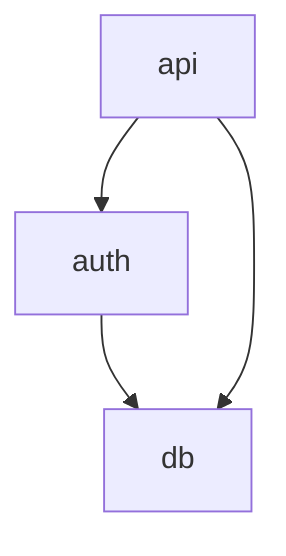

# 文档模板系统设计

> **设计日期**：2026-03-22
> **状态**：草稿
> **依赖项**：`results/04_progressive_doc_standards.md`

---

## 目录

1. [概览](#1-概览)
2. [模板架构](#2-模板架构)
3. [Token 预算策略](#3-token-预算策略)
4. [模板规范](#4-模板规范)
5. [doc-meta HTML 注释格式](#5-doc-meta-html-注释格式)
6. [doc-index.json 结构](#6-doc-indexjson-结构)
7. [输出示例](#7-输出示例)
8. [模板渲染管道](#8-模板渲染管道)

---

## 1. 概览

### 1.1 设计目标

模板系统实现**动态 N 层渐进式披露**文档：

- **非固定 3 层**：不同规模的模块获得不同的文档深度
- **递归结构**：`detail.md.j2` 适用于任意深度（2, 3, 4, 5...）
- **Token 高效**：基于层次深度的渐进式 Token 预算分配
- **LLM 优化**：结构化元数据和自包含文档

### 1.2 与固定 3 层方案的关键差异

| 维度       | 固定 3 层      | 动态 N 层                        |
| ---------- | -------------- | -------------------------------- |
| 深度       | 始终 3 层      | 可变（根据模块复杂度为 2-5+ 层） |
| 模板       | 3 个独立模板   | 3 个模板（detail.md.j2 通用）    |
| 导航       | 硬编码父子关系 | 递归面包屑链                     |
| Token 预算 | 每层固定       | 递减或稳定分配                   |
| 子文档     | 固定子节点     | 递归子文档链接                   |

### 1.3 模板清单

| 模板             | 用途     | 层级 | 使用场景             |
| ---------------- | -------- | ---- | -------------------- |
| `index.md.j2`    | 项目概览 | 0    | 每个项目使用一次     |
| `overview.md.j2` | 模块概览 | 1    | 每个模块使用一次     |
| `detail.md.j2`   | 组件详情 | 2+   | 通用，适用于任意深度 |

---

## 2. 模板架构

### 2.1 层次模型

```
项目根目录/
+-- INDEX.md                           （层级 0：index.md.j2）
+-- docs/
    +-- auth/
    |   +-- OVERVIEW.md                （层级 1：overview.md.j2）
    |   +-- login/
    |   |   +-- DETAIL.md              （层级 2：detail.md.j2）
    |   |   +-- handlers/
    |   |   |   +-- DETAIL.md          （层级 3：detail.md.j2）
    |   |   |   +-- oauth/
    |   |   |   |   +-- DETAIL.md      （层级 4：detail.md.j2）
    |   +-- oauth/
    |       +-- DETAIL.md              （层级 2：detail.md.j2）
    +-- api/
        +-- OVERVIEW.md                （层级 1：overview.md.j2）
        +-- routes/
            +-- DETAIL.md              （层级 2：detail.md.j2）
```

### 2.2 层级确定逻辑

```python
def determine_documentation_depth(module: Module) -> int:
    """确定模块的适当文档深度。

    Returns:
        int: 最大深度层级（0 = index, 1 = overview, 2+ = detail）
    """
    # 基础规则
    if module.file_count > 50:
        return 4  # 大型模块：4 层
    elif module.file_count > 20:
        return 3  # 中型模块：3 层
    elif module.file_count > 5:
        return 2  # 小型模块：2 层
    else:
        return 1  # 微型模块：仅概览（无详情）
```

### 2.3 递归详情模板策略

`detail.md.j2` 模板是**通用的**，适用于任意深度（2+）：

```
层级 2：module/subcomponent/DETAIL.md
         │
         +-- 链接到层级 3 子文档
         +-- 面包屑：INDEX > OVERVIEW > DETAIL

层级 3：module/subcomponent/subsub/DETAIL.md
         │
         +-- 链接到层级 4 子文档
         +-- 面包屑：INDEX > OVERVIEW > DETAIL > DETAIL

层级 4：module/subcomponent/subsub/deep/DETAIL.md
         │
         +-- 无子节点（叶节点）
         +-- 面包屑：INDEX > OVERVIEW > DETAIL > DETAIL > DETAIL
```

---

## 3. Token 预算策略

### 3.1 每层 Token 预算范围

| 层级 | 模板             | 最小值 | 最大值 | 推荐值      | 策略             |
| ---- | ---------------- | ------ | ------ | ----------- | ---------------- |
| 0    | `index.md.j2`    | 600    | 1,200  | 800-1,000   | 固定预算         |
| 1    | `overview.md.j2` | 1,000  | 2,000  | 1,200-1,500 | 按模块复杂度缩放 |
| 2    | `detail.md.j2`   | 1,500  | 3,500  | 2,000-2,500 | 稳定分配         |
| 3    | `detail.md.j2`   | 1,200  | 2,500  | 1,500-2,000 | 递减             |
| 4    | `detail.md.j2`   | 800    | 2,000  | 1,000-1,500 | 递减             |
| 5+   | `detail.md.j2`   | 500    | 1,500  | 800-1,000   | 最低可行值       |

### 3.2 Token 预算计算

```python
def calculate_token_budget(level: int, component_complexity: float) -> int:
    """计算给定层级文档的 Token 预算。

    Args:
        level: 文档层级（0-5+）
        component_complexity: 归一化复杂度分数（0.0-1.0）

    Returns:
        本文档的 Token 预算
    """
    BASE_BUDGETS = {
        0: 1000,   # Index
        1: 1500,   # Overview
        2: 2500,   # Detail L2
        3: 2000,   # Detail L3
        4: 1500,   # Detail L4
        5: 1000,   # Detail L5+
    }

    # 更深层级的递减系数
    REDUCTION_FACTOR = 0.85 if level >= 3 else 1.0

    base = BASE_BUDGETS.get(level, BASE_BUDGETS[5])
    adjusted = base * REDUCTION_FACTOR

    # 按组件复杂度缩放
    min_budget = int(adjusted * 0.8)
    max_budget = int(adjusted * 1.2)

    return int(min_budget + (max_budget - min_budget) * component_complexity)
```

### 3.3 内容裁剪优先级

当内容超出 Token 预算时，按以下顺序裁剪：

1. **始终保留**：名称、签名、一行描述
2. **高优先级**：核心类、公共接口、依赖图
3. **中优先级**：方法详情、数据流描述
4. **低优先级**：内部辅助函数、详细理由、边缘情况
5. **优先裁剪**：设计决策、大量示例

```python
def truncate_content(content: DocumentContent, budget: int) -> DocumentContent:
    """将文档内容裁剪到 Token 预算内。"""
    sections_by_priority = [
        ("identifiers", 1.0),      # 100% 保留
        ("signatures", 1.0),       # 100% 保留
        ("core_classes", 0.9),     # 90% 保留
        ("public_interfaces", 0.9),
        ("dependency_graph", 0.85),
        ("methods", 0.7),
        ("data_flow", 0.6),
        ("internal_helpers", 0.3),
        ("design_decisions", 0.2),
        ("examples", 0.1),
    ]

    # 应用裁剪逻辑...
    return truncated_content
```

---

## 4. 模板规范

### 4.1 `index.md.j2` — 层级 0 项目概览

````jinja2
{# ========================================================================== #}
{# index.md.j2 - 层级 0：项目概览模板                                         #}
{# ========================================================================== #}
{#
  变量参考：
  -------------------
  project:
    .name: str                    - 项目名称
    .description: str             - 一行描述
    .version: str                 - 项目版本
    .repository_url: str | none   - 可选的仓库 URL

  tech_stack: list[str]           - 技术栈列表

  modules: list[Module]
    .id: str                      - 模块标识符（slug）
    .name: str                    - 显示名称
    .description: str             - 简短描述（最多 80 个字符）
    .file_count: int              - 文件数量
    .complexity_score: float      - 归一化复杂度（0.0-1.0）
    .doc_path: str                - OVERVIEW.md 的路径

  entry_points: list[EntryPoint]
    .name: str                    - 入口点名称（例如 "main"）
    .file: str                    - 源文件路径
    .line: int                    - 行号

  dependency_graph: str           - Mermaid 图定义

  metrics:
    .total_files: int
    .total_functions: int
    .total_classes: int
    .total_loc: int

  generation:
    .timestamp: str               - ISO 8601 时间戳
    .tool_version: str            - codebase-explorer 版本
    .model_used: str              - 使用的 LLM 模型标识符

  computed:
    .token_count: int             - 估算的 Token 数
    .coverage: float              - 文档覆盖率
#}
<!-- doc-meta
level: 0
target: {{ project.name | slugify }}
type: index
token_budget: {{ token_budget }}
generated_at: {{ generation.timestamp }}
version: 1.0
-->
# {{ project.name }}


> {{ project.description }}



**仓库地址**: [{{ project.repository_url }}]({{ project.repository_url }})


## 概览


### 技术栈


- {{ tech }}


- _... 还有 {{ tech_stack | length - 5 }} 项_



### 架构

```mermaid
{{ dependency_graph }}
````

## 模块

| 模块 | 描述 | 文件数 | 复杂度 |
| ---- | ---- | ------ | ------ |


| [**{{ module.name }}**]({{ module.doc_path }}) | {{ module.description | truncate(60) }} | {{ module.file_count }} | {{ module.complexity_score | format_complexity }} |


## 入口点



- `{{ entry.name }}` — [`{{ entry.file }}:{{ entry.line }}`]({{ entry.file }}#L{{ entry.line }})
  

## 指标

| 指标     | 值                            |
| -------- | ----------------------------- |
| 文件数   | {{ metrics.total_files }}     |
| 函数数   | {{ metrics.total_functions }} |
| 类数     | {{ metrics.total_classes }}   |
| 代码行数 | {{ metrics.total_loc }}       |

---

_由 {{ generation.tool_version }} 使用 {{ generation.model_used }} 于 {{ generation.timestamp }} 生成_

````

### 4.2 `overview.md.j2` — 层级 1 模块概览

```jinja2
{# ========================================================================== #}
{# overview.md.j2 - 层级 1：模块概览模板                                       #}
{# ========================================================================== #}
<!-- doc-meta
level: 1
target: {{ module.id }}
type: overview
token_budget: {{ token_budget }}
generated_at: {{ generation.timestamp }}
parent: {{ module.parent_path }}
children:

  - {{ comp.doc_path }}

-->
# {{ module.name }}

> {{ module.description }}

## 导航

| 层级 | 文档 |
|------|------|
| 上级 | [项目概览]({{ module.parent_path }}) |

| 下级 | [{{ comp.name }}]({{ comp.doc_path }}) |


| | _... 还有 {{ components | length - 5 }} 个组件_ |


## 依赖关系

```mermaid
{{ dependency_graph }}
````

### 导入


| 模块 | 用途 |
|------|------|

| [{{ dep.name }}]({{ dep.doc_path }}) | {{ dep.description | truncate(50) }} |


_无_


### 被引用方


| 模块 | 使用方式 |
|------|---------|

| [{{ dep.name }}]({{ dep.doc_path }}) | {{ dep.description | truncate(50) }} |


_无（叶子模块）_


## 公共接口




- `class const {{ iface.signature }}` — {{ iface.description }}
  
  
  _未检测到公共接口_
  

## 组件


| 组件 | 描述 | 文档 |
|------|------|------|

| **{{ comp.name }}** | {{ comp.description | truncate(50) }} | [详情 (L{{ comp.depth }})]({{ comp.doc_path }}) |


_无子组件（叶子模块）_


## 文件



- `{{ file.path }}` — {{ file.description }}
  
  
- _... 还有 {{ files | length - 15 }} 个文件_
  

## 指标

| 指标       | 值                           |
| ---------- | ---------------------------- | ----------- |
| 文件数     | {{ metrics.file_count }}     |
| 函数数     | {{ metrics.function_count }} |
| 类数       | {{ metrics.class_count }}    |
| 平均复杂度 | {{ metrics.avg_complexity    | round(1) }} |

---

_由 {{ generation.tool_version }} 于 {{ generation.timestamp }} 生成_

````

### 4.3 `detail.md.j2` — 通用详情模板（层级 2+）

```jinja2
{# ========================================================================== #}
{# detail.md.j2 - 通用详情模板（层级 2+）                                      #}
{# ========================================================================== #}
{#
  该模板是递归的，适用于任意深度（2, 3, 4, 5...）。
  面包屑链随深度增长，子组件链接指向更深的 DETAIL 文档。
#}
<!-- doc-meta
level: {{ document.level }}
target: {{ document.target_id }}
type: detail
token_budget: {{ token_budget }}
generated_at: {{ generation.timestamp }}
parent: {{ parent.path }}

children:

  - {{ child.path }}


-->
# {{ document.target_name }}

> {{ document.description }}

## 面包屑导航

````



{{ crumb.name }}（当前）

{{ crumb.name }} →



````

| 层级 | 文档 |
|------|------|

| {{ crumb.level }} | [{{ crumb.name }}]({{ crumb.path }}) *(当前)* |


## 内部结构

```mermaid
{{ structure_graph }}
````



## 类



### {{ cls.name }}

{{ cls.description }}


**继承关系**: `{{ base }} → `


| 方法 | 签名 | 描述 |
| ---- | ---- | ---- |



| `{{ method.name }}` | `{{ method.signature }}` | {{ method.description | truncate(40) }} |





<details>
<summary>私有/受保护方法</summary>

| 方法 | 签名 |
| ---- | ---- |



| `{{ method.name }}` | `{{ method.signature }}` |



</details>







## 函数

| 函数 | 签名 | 描述 |
| ---- | ---- | ---- |


| `{{ func.name }}` | `{{ func.signature }}` | {{ func.description | truncate(50) }} |


### 调用关系



**`{{ func.name }}`**：


- 被调用：`{{ caller }}, `
  
  
- 调用：`{{ callee }}, `
  
  
  
  



## 数据流

```mermaid
{{ data_flow_graph }}
```





## 子组件

该组件包含 {{ children | length }} 个子组件：

| 组件 | 描述 | 详情 |
| ---- | ---- | ---- |


| **{{ child.name }}** | {{ child.description | truncate(50) }} | [L{{ document.level + 1 }} 详情]({{ child.path }}) |






## 设计决策



### {{ decision.title }}

{{ decision.description }}

**设计理由**：{{ decision.rationale }}




## 源文件



- `{{ file }}`
  

---

_由 {{ generation.tool_version }} 于 {{ generation.timestamp }} 生成 | 层级 {{ document.level }}_

````

---

## 5. doc-meta HTML 注释格式

### 5.1 规范

每个生成的文档必须在文件顶部包含一个 `doc-meta` HTML 注释：

```html
<!-- doc-meta
level: <整数>
target: <字符串>
type: <"index" | "overview" | "detail">
token_budget: <整数>
generated_at: <ISO8601 格式>
parent: <相对路径 | null>
children: <相对路径列表 | null>
version: <字符串>
-->
````

### 5.2 字段定义

| 字段           | 类型    | 必填 | 描述                                |
| -------------- | ------- | ---- | ----------------------------------- |
| `level`        | integer | 是   | 文档层级（0, 1, 2, 3, 4, 5+）       |
| `target`       | string  | 是   | 被文档化实体的唯一标识符            |
| `type`         | enum    | 是   | 文档类型：index、overview 或 detail |
| `token_budget` | integer | 是   | 本文档的目标 Token 预算             |
| `generated_at` | ISO8601 | 是   | UTC 格式的生成时间戳                |
| `parent`       | string  | 否\* | 父文档的相对路径                    |
| `children`     | list    | 否   | 子文档的相对路径列表                |
| `version`      | string  | 否   | 文档格式版本（默认："1.0"）         |

\*除 INDEX.md（层级 0）外，其他文档均为必填

### 5.3 解析示例

```python
import re
from typing import Optional
from pydantic import BaseModel
from datetime import datetime

class DocMeta(BaseModel):
    level: int
    target: str
    type: str  # "index" | "overview" | "detail"
    token_budget: int
    generated_at: datetime
    parent: Optional[str] = None
    children: Optional[list[str]] = None
    version: str = "1.0"

    class Config:
        extra = "allow"  # 允许扩展元数据

def parse_doc_meta(content: str) -> Optional[DocMeta]:
    """解析文档内容中的 doc-meta HTML 注释。"""
    pattern = r'<!--\s*doc-meta\s*\n(.*?)\n-->'
    match = re.search(pattern, content, re.DOTALL)

    if not match:
        return None

    import yaml
    meta_yaml = match.group(1)
    meta_dict = yaml.safe_load(meta_yaml)

    return DocMeta(**meta_dict)
```

---

## 6. doc-index.json 结构

### 6.1 模式定义

```json
{
  "$schema": "http://json-schema.org/draft-07/schema#",
  "title": "doc-index",
  "type": "object",
  "required": ["version", "project_name", "generated_at", "max_depth", "docs"],
  "properties": {
    "version": {
      "type": "string",
      "description": "索引格式版本"
    },
    "project_name": {
      "type": "string",
      "description": "项目标识符"
    },
    "generated_at": {
      "type": "string",
      "format": "date-time",
      "description": "生成时间戳（ISO 8601）"
    },
    "max_depth": {
      "type": "integer",
      "description": "项目中的最大文档深度"
    },
    "total_tokens": {
      "type": "integer",
      "description": "所有文档的总 Token 数"
    },
    "total_coverage": {
      "type": "number",
      "description": "总体文档覆盖率"
    },
    "docs": {
      "type": "array",
      "items": {
        "type": "object",
        "required": ["level", "target", "path", "type"],
        "properties": {
          "level": { "type": "integer" },
          "target": { "type": "string" },
          "path": { "type": "string" },
          "type": { "enum": ["index", "overview", "detail"] },
          "token_count": { "type": "integer" },
          "token_budget": { "type": "integer" },
          "coverage": { "type": "number" },
          "parent": { "type": "string" },
          "children": { "type": "array", "items": { "type": "string" } },
          "source_files": { "type": "array", "items": { "type": "string" } }
        }
      }
    }
  }
}
```

### 6.2 doc-index.json 示例

```json
{
  "version": "1.0",
  "project_name": "codebase-explorer",
  "generated_at": "2026-03-22T10:30:00Z",
  "max_depth": 4,
  "total_tokens": 15680,
  "total_coverage": 0.87,
  "docs": [
    {
      "level": 0,
      "target": "codebase-explorer",
      "path": "INDEX.md",
      "type": "index",
      "token_count": 920,
      "token_budget": 1000,
      "coverage": 1.0,
      "children": ["docs/core/OVERVIEW.md", "docs/analysis/OVERVIEW.md"]
    },
    {
      "level": 1,
      "target": "core",
      "path": "docs/core/OVERVIEW.md",
      "type": "overview",
      "token_count": 1450,
      "token_budget": 1500,
      "coverage": 0.92,
      "parent": "INDEX.md",
      "children": ["docs/core/graph/DETAIL.md", "docs/core/parser/DETAIL.md"],
      "source_files": [
        "src/core/__init__.py",
        "src/core/graph.py",
        "src/core/parser.py"
      ]
    },
    {
      "level": 2,
      "target": "core.graph",
      "path": "docs/core/graph/DETAIL.md",
      "type": "detail",
      "token_count": 2100,
      "token_budget": 2500,
      "coverage": 0.88,
      "parent": "docs/core/OVERVIEW.md",
      "source_files": [
        "src/core/graph/__init__.py",
        "src/core/graph/builder.py"
      ]
    }
  ]
}
```

---

## 7. 输出示例

### 7.1 层级 0：INDEX.md 示例

````markdown
<!-- doc-meta
level: 0
target: my-web-app
type: index
token_budget: 1000
generated_at: 2026-03-22T10:30:00Z
children:
  - docs/auth/OVERVIEW.md
  - docs/api/OVERVIEW.md
version: 1.0
-->

# My Web App

> 一个具有身份验证和数据持久化的现代 REST API 服务器。

## 概览

### 技术栈

- Python 3.11
- FastAPI 0.104
- PostgreSQL 15

### 架构


````

## 模块

| 模块                              | 描述                | 文件数 | 复杂度 |
| --------------------------------- | ------------------- | ------ | ------ |
| [**auth**](docs/auth/OVERVIEW.md) | 用户身份验证和授权  | 12     | 高     |
| [**api**](docs/api/OVERVIEW.md)   | REST API 端点和路由 | 18     | 中     |

## 指标

| 指标     | 值    |
| -------- | ----- |
| 文件数   | 38    |
| 函数数   | 124   |
| 类数     | 22    |
| 代码行数 | 4,521 |

---

_由 codebase-explorer v0.1.0 使用 claude-sonnet-4 于 2026-03-22T10:30:00Z 生成_

````

### 7.2 层级 1：OVERVIEW.md 示例

```markdown
<!-- doc-meta
level: 1
target: auth
type: overview
token_budget: 1500
generated_at: 2026-03-22T10:30:00Z
parent: INDEX.md
children:
  - docs/auth/login/DETAIL.md
  - docs/auth/oauth/DETAIL.md
version: 1.0
-->
# Auth 模块

> 处理用户身份验证、授权和会话管理。

## 导航

| 层级 | 文档 |
|------|------|
| 上级 | [项目概览](../INDEX.md) |
| 下级 | [Login](login/DETAIL.md) |
| 下级 | [OAuth](oauth/DETAIL.md) |

## 依赖关系

```mermaid
graph LR
    auth --> db
    auth --> cache
    api --> auth
````

## 公共接口

- `function login(username: str, password: str) -> Token` — 用户身份验证并返回 Token
- `function logout(token: str) -> None` — 使用户会话失效
- `class AuthMiddleware` — FastAPI 请求身份验证中间件

````

### 7.3 层级 2：DETAIL.md 示例

```markdown
<!-- doc-meta
level: 2
target: auth.login
type: detail
token_budget: 2500
generated_at: 2026-03-22T10:30:00Z
parent: docs/auth/OVERVIEW.md
children:
  - docs/auth/login/handlers/DETAIL.md
version: 1.0
-->
# Login 组件

> 处理用户名/密码身份验证，支持速率限制和 MFA。

## 面包屑导航

````

My Web App → Auth → Login（当前）

````

| 层级 | 文档 |
|------|------|
| 0 | [My Web App](../../INDEX.md) |
| 1 | [Auth](../OVERVIEW.md) |
| 2 | [Login](./DETAIL.md) *(当前)* |

## 内部结构

```mermaid
classDiagram
    LoginService --> UserRepository
    LoginService --> RateLimiter
    LoginHandler --> LoginService
    LoginHandler --> LoginValidator
````

## 类

### LoginService

核心身份验证服务，处理凭据验证和 MFA。

| 方法           | 签名                                                  | 描述                 |
| -------------- | ----------------------------------------------------- | -------------------- |
| `authenticate` | `authenticate(username: str, password: str) -> Token` | 验证凭据并发放 Token |
| `verify_mfa`   | `verify_mfa(token: str, code: str) -> bool`           | 验证 MFA 代码        |

```

---

## 8. 模板渲染管道

### 8.1 渲染流程

```

┌─────────────────────────────────────────────────────────────────┐
│ 模板渲染管道 │
├─────────────────────────────────────────────────────────────────┤
│ │
│ 1. 加载数据 │
│ ┌──────────┐ ┌──────────┐ ┌──────────┐ │
│ │ 图 │ │ 模块 │ │ 源代码 │ │
│ │ 分析 │────▶│ 分组 │────▶│ 解析 │ │
│ └──────────┘ └──────────┘ └──────────┘ │
│ │ │ │
│ v v │
│ ┌──────────────────────────────────────────────┐ │
│ │ 文档上下文 │ │
│ │ - 模块信息 │ │
│ │ - 依赖图 │ │
│ │ - 类/函数元数据 │ │
│ │ - Token 预算 │ │
│ └──────────────────────────────────────────────┘ │
│ │ │
│ 2. 选择模板 │ │
│ v │
│ ┌──────────────────────────────────────────────┐ │
│ │ level == 0 ──▶ index.md.j2 │ │
│ │ level == 1 ──▶ overview.md.j2 │ │
│ │ level >= 2 ──▶ detail.md.j2 │ │
│ └──────────────────────────────────────────────┘ │
│ │ │
│ 3. 渲染 v │
│ ┌──────────────────────────────────────────────┐ │
│ │ Jinja2 模板引擎 │ │
│ │ - 变量替换 │ │
│ │ - 条件渲染 │ │
│ │ - 循环迭代 │ │
│ │ - 自定义过滤器 │ │
│ └──────────────────────────────────────────────┘ │
│ │ │
│ 4. 后处理 v │
│ ┌──────────────────────────────────────────────┐ │
│ │ - Token 计数 │ │
│ │ - 内容裁剪（如超出预算） │ │
│ │ - 链接验证 │ │
│ │ - Mermaid 语法验证 │ │
│ └──────────────────────────────────────────────┘ │
│ │ │
│ 5. 输出 v │
│ ┌──────────────────────────────────────────────┐ │
│ │ - 写入 .md 文件 │ │
│ │ - 更新 doc-index.json │ │
│ │ - 生成 llms.txt │ │
│ └──────────────────────────────────────────────┘ │
│ │
└─────────────────────────────────────────────────────────────────┘

````

### 8.2 自定义 Jinja2 过滤器

```python
def truncate(text: str, max_length: int = 50) -> str:
    """将文本截断到 max_length 长度，超出部分用省略号代替。"""
    if len(text) <= max_length:
        return text
    return text[:max_length - 3] + "..."

def slugify(text: str) -> str:
    """将文本转换为 URL 安全的 slug 格式。"""
    import re
    text = text.lower().strip()
    text = re.sub(r'[^\w\s-]', '', text)
    text = re.sub(r'[\s_-]+', '-', text)
    return text

def format_complexity(score: float) -> str:
    """将复杂度分数格式化为人类可读的标签。"""
    if score >= 0.8:
        return "高"
    elif score >= 0.5:
        return "中"
    else:
        return "低"

def setup_jinja_env(template_dir: str) -> Environment:
    """配置带有自定义过滤器的 Jinja2 环境。"""
    env = Environment(
        loader=FileSystemLoader(template_dir),
        trim_blocks=True,
        lstrip_blocks=True,
    )

    env.filters['truncate'] = truncate
    env.filters['slugify'] = slugify
    env.filters['format_complexity'] = format_complexity

    return env
````

---

## 附录 A：模板文件位置

```
codebase-explorer/
+-- src/
    +-- templates/
        +-- index.md.j2
        +-- overview.md.j2
        +-- detail.md.j2
        +-- partials/
            +-- breadcrumb.md.j2      # 面包屑导航片段
            +-- class_table.md.j2     # 类方法表片段
            +-- function_table.md.j2  # 函数表片段
            +-- mermaid_graph.md.j2   # Mermaid 图片段
            +-- nav_table.md.j2       # 导航表片段
```

## 附录 B：Token 预算配置

```yaml
# doc-config.yaml
token_budgets:
  index:
    min: 600
    max: 1200
    default: 1000

  overview:
    min: 1000
    max: 2000
    default: 1500
    complexity_scaling: true # 按复杂度缩放

  detail:
    level_2:
      min: 1500
      max: 3500
      default: 2500
    level_3:
      min: 1200
      max: 2500
      default: 2000
    level_4:
      min: 800
      max: 2000
      default: 1500
    level_5_plus:
      min: 500
      max: 1500
      default: 1000

truncation:
  priority_order:
    - identifiers # 标识符（最高优先级）
    - signatures # 签名
    - core_classes # 核心类
    - public_interfaces # 公共接口
    - dependency_graph # 依赖图
    - methods # 方法
    - data_flow # 数据流
    - internal_helpers # 内部辅助函数
    - design_decisions # 设计决策
    - examples # 示例（优先裁剪）

  fold_threshold: 15 # 超过此数量的列表项折叠显示
```

## 附录 C：验证清单

在最终确定文档之前，验证以下内容：

- [ ] doc-meta 注释存在且有效
- [ ] Token 数在预算内
- [ ] 所有内部链接有效
- [ ] Mermaid 语法正确
- [ ] 面包屑导航完整
- [ ] 父子关系一致
- [ ] 覆盖率指标已计算
- [ ] 源文件列表正确
