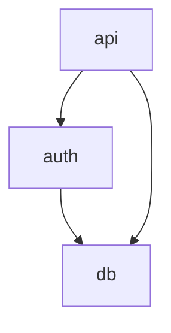

# 文档模板参考文档

> 当需要模板变量列表、输出示例或 Token 预算指南时，请加载本文件。

## 目录

1. [模板清单](#1-模板清单)
2. [index.md.j2 变量（层级 0）](#2-indexmdj2-变量层级-0)
3. [overview.md.j2 变量（层级 1）](#3-overviewmdj2-变量层级-1)
4. [detail.md.j2 变量（层级 2+）](#4-detailmdj2-变量层级-2)
5. [Token 预算指南](#5-token-预算指南)
6. [输出示例](#6-输出示例)
7. [doc-meta 注释格式](#7-doc-meta-注释格式)

---

## 1. 模板清单

| 模板             | 层级 | 用途     | 使用场景             |
| ---------------- | ---- | -------- | -------------------- |
| `index.md.j2`    | 0    | 项目概览 | 每个项目使用一次     |
| `overview.md.j2` | 1    | 模块概览 | 每个模块使用一次     |
| `detail.md.j2`   | 2+   | 组件详情 | 通用，适用于任意深度 |

`detail.md.j2` 模板是**递归的**——它在深度 2、3、4 或 5 时
使用相同的结构。面包屑链随深度增长，子组件链接指向更深的 DETAIL 文档。

---

## 2. index.md.j2 变量（层级 0）

```
project:
  .name: str                    - 项目名称
  .description: str             - 一行描述
  .version: str                 - 项目版本
  .repository_url: str | none   - 可选的仓库 URL

tech_stack: list[str]           - 技术栈列表

modules: list[Module]
  .id: str                      - 模块标识符（slug）
  .name: str                    - 显示名称
  .description: str             - 简短描述（最多 80 个字符）
  .file_count: int              - 文件数量
  .complexity_score: float      - 归一化复杂度分数（0.0-1.0）
  .doc_path: str                - OVERVIEW.md 的路径

entry_points: list[EntryPoint]
  .name: str                    - 入口点名称
  .file: str                    - 源文件路径
  .line: int                    - 行号

dependency_graph: str           - Mermaid 图定义

metrics:
  .total_files: int
  .total_functions: int
  .total_classes: int
  .total_loc: int               - 总代码行数

generation:
  .timestamp: str               - ISO 8601 时间戳
  .tool_version: str            - codebase-explorer 版本
  .model_used: str              - 使用的 LLM 模型标识符
```

---

## 3. overview.md.j2 变量（层级 1）

```
module:
  .id: str                      - 模块标识符
  .name: str                    - 显示名称
  .description: str             - 模块用途描述
  .parent_path: str             - INDEX.md 的路径

files: list[File]
  .path: str                    - 相对文件路径
  .description: str             - 简短文件描述
  .loc: int                     - 代码行数

dependencies:
  .imports: list[Dep]           - 本模块导入的模块
  .imported_by: list[Dep]       - 导入本模块的模块
  Dep.name: str
  Dep.doc_path: str
  Dep.description: str

public_interfaces: list[Interface]
  .name: str                    - 函数/类名称
  .signature: str               - 完整签名
  .description: str             - 简短描述
  .type: str                    - "function" | "class" | "constant"

components: list[Component]
  .id: str                      - 组件标识符
  .name: str                    - 显示名称
  .description: str             - 简短描述
  .doc_path: str                - DETAIL.md 的路径
  .depth: int                   - 文档深度（2+）

dependency_graph: str           - Mermaid 依赖图

metrics:
  .file_count: int
  .function_count: int
  .class_count: int
  .avg_complexity: float        - 平均复杂度
```

---

## 4. detail.md.j2 变量（层级 2+）

```
document:
  .level: int                   - 当前文档层级（2+）
  .type: str                    - "detail"
  .target_id: str               - 组件标识符
  .target_name: str             - 显示名称
  .description: str             - 组件用途

breadcrumbs: list[Breadcrumb]   - 面包屑导航
  .level: int                   - 文档层级
  .name: str                    - 显示名称
  .path: str                    - 文档路径

parent:
  .name: str                    - 父组件名称
  .path: str                    - 父文档路径

children: list[Child] | none    - 子组件（递归）
  .id: str
  .name: str
  .description: str
  .path: str                    - 子 DETAIL.md 的路径
  .has_children: bool           - 该子节点是否有更深的子文档

classes: list[ClassInfo]        - 类信息
  .name: str
  .description: str
  .base_classes: list[str]
  .methods: list[MethodInfo]
    .name: str
    .signature: str
    .description: str
    .visibility: str            - "public" | "private" | "protected"

functions: list[FuncInfo]       - 函数信息
  .name: str
  .signature: str
  .description: str
  .called_by: list[str]         - 调用此函数的函数列表
  .calls: list[str]             - 此函数调用的函数列表

structure_graph: str            - Mermaid 内部结构图
data_flow_graph: str | none     - Mermaid 数据流图（深层级时可选）

design_decisions: list[Decision] | none  - 设计决策
  .title: str
  .description: str
  .rationale: str               - 设计理由

source_files: list[str]         - 涵盖的源文件路径列表
```

---

## 5. Token 预算指南

### 每层级预算范围

| 层级 | 模板           | 最小值 | 最大值 | 推荐值      | 策略         |
| ---- | -------------- | ------ | ------ | ----------- | ------------ |
| 0    | index.md.j2    | 600    | 1,200  | 800-1,000   | 固定         |
| 1    | overview.md.j2 | 1,000  | 2,000  | 1,200-1,500 | 按复杂度缩放 |
| 2    | detail.md.j2   | 1,500  | 3,500  | 2,000-2,500 | 稳定分配     |
| 3    | detail.md.j2   | 1,200  | 2,500  | 1,500-2,000 | 递减         |
| 4    | detail.md.j2   | 800    | 2,000  | 1,000-1,500 | 递减         |
| 5+   | detail.md.j2   | 500    | 1,500  | 800-1,000   | 最低可行值   |

### 预算分配公式

```
total_budget = source_tokens * 0.15 * (1 + depth * 0.5)

每层分配：几何衰减，衰减系数 0.6
  层级 0 权重：1.0
  层级 1 权重：0.6
  层级 2 权重：0.36
  层级 3 权重：0.216
  ...
```

### 内容裁剪优先级

超出预算时，按以下顺序裁剪（优先级最低的先裁剪）：

| 优先级 | 内容               | 权重     |
| ------ | ------------------ | -------- |
| 1.0    | 模块名称、一行描述 | 始终保留 |
| 1.0    | 公共接口签名       | 始终保留 |
| 0.9    | 依赖关系列表       | 高优先级 |
| 0.85   | 架构图（Mermaid）  | 高优先级 |
| 0.8    | 入口点             | 高优先级 |
| 0.7    | 类职责             | 中优先级 |
| 0.65   | 函数描述           | 中优先级 |
| 0.6    | 数据流图           | 中优先级 |
| 0.4    | 实现说明           | 低优先级 |
| 0.35   | 代码示例           | 低优先级 |
| 0.3    | 边缘情况           | 低优先级 |
| 0.2    | 内部辅助函数       | 优先裁剪 |
| 0.1    | 已废弃的 API       | 优先裁剪 |

---

## 6. 输出示例

### 层级 0：INDEX.md

````markdown
<!-- doc-meta
level: 0
target: my-web-app
type: index
token_budget: 1000
generated_at: 2026-03-22T10:30:00Z
children:
  - docs/auth/OVERVIEW.md
  - docs/api/OVERVIEW.md
version: 1.0
-->

# My Web App

> 一个具有身份验证和数据持久化的现代 REST API 服务器。

## 概览

### 技术栈

- Python 3.11
- FastAPI 0.104
- PostgreSQL 15

### 架构


````

## 模块

| 模块                              | 描述          | 文件数 | 复杂度 |
| --------------------------------- | ------------- | ------ | ------ |
| [**auth**](docs/auth/OVERVIEW.md) | 用户身份验证  | 12     | 高     |
| [**api**](docs/api/OVERVIEW.md)   | REST API 端点 | 18     | 中     |

## 入口点

- `main` -- [`src/main.py:15`](src/main.py#L15)

## 指标

| 指标   | 值  |
| ------ | --- |
| 文件数 | 38  |
| 函数数 | 124 |

````

### 层级 1：OVERVIEW.md

```markdown
<!-- doc-meta
level: 1
target: auth
type: overview
token_budget: 1500
generated_at: 2026-03-22T10:30:00Z
parent: ../../INDEX.md
children:
  - login/DETAIL.md
  - oauth/DETAIL.md
-->
# auth

> 用户身份验证和授权模块。

## 导航

| 层级 | 文档 |
|------|------|
| 上级 | [项目概览](../../INDEX.md) |
| 下级 | [login](login/DETAIL.md) |
| 下级 | [oauth](oauth/DETAIL.md) |

## 依赖关系

```mermaid
graph TD
    auth --> db
    auth --> config
    api --> auth
````

## 公共接口

- `def login(username: str, password: str) -> Token`
- `def verify_token(token: str) -> User`
- `class AuthMiddleware` -- 请求身份验证中间件

## 组件

| 组件      | 描述           | 文档                         |
| --------- | -------------- | ---------------------------- |
| **login** | 登录流程处理器 | [详情 (L2)](login/DETAIL.md) |
| **oauth** | OAuth2 集成    | [详情 (L2)](oauth/DETAIL.md) |

````

### 层级 2+：DETAIL.md

```markdown
<!-- doc-meta
level: 2
target: auth.login
type: detail
token_budget: 2000
generated_at: 2026-03-22T10:30:00Z
parent: ../OVERVIEW.md
children:
  - handlers/DETAIL.md
-->
# 登录处理器

> 核心登录流程：凭据验证、Token 生成、会话管理。

## 面包屑导航

| 层级 | 文档 |
|------|------|
| 0 | [项目概览](../../../INDEX.md) |
| 1 | [auth](../OVERVIEW.md) |
| 2 | 登录处理器 *(当前)* |

## 内部结构

```mermaid
classDiagram
    LoginHandler --> TokenService
    LoginHandler --> UserRepository
    TokenService --> JWTProvider
````

## 类

### LoginHandler

处理登录请求：验证凭据、发放 Token。

| 方法     | 签名                            | 描述         |
| -------- | ------------------------------- | ------------ |
| `login`  | `(username, password) -> Token` | 主要登录流程 |
| `logout` | `(token) -> None`               | 使会话失效   |

## 源文件

- `src/auth/login/handler.py`
- `src/auth/login/validators.py`

````

---

## 7. doc-meta 注释格式

每个生成的文档都在顶部包含一个 `doc-meta` HTML 注释：

```html
<!-- doc-meta
level: <整数>
target: <字符串>
type: <"index" | "overview" | "detail">
token_budget: <整数>
generated_at: <ISO8601 格式>
parent: <相对路径 | null>
children:
  - <子路径>
version: <字符串>
-->
````

| 字段           | 类型    | 必填 | 描述                              |
| -------------- | ------- | ---- | --------------------------------- |
| `level`        | integer | 是   | 文档层级（0-5+）                  |
| `target`       | string  | 是   | 被文档化实体的标识符              |
| `type`         | enum    | 是   | 文档类型：index、overview、detail |
| `token_budget` | integer | 是   | 目标 Token 预算                   |
| `generated_at` | ISO8601 | 是   | 生成时间戳（UTC）                 |
| `parent`       | string  | 否\* | 父文档的相对路径                  |
| `children`     | list    | 否   | 子文档的相对路径列表              |
| `version`      | string  | 否   | 格式版本（默认 "1.0"）            |

\*除 INDEX.md（层级 0）外，其他文档均为必填。
