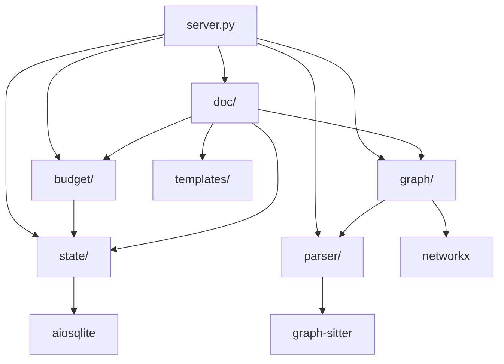
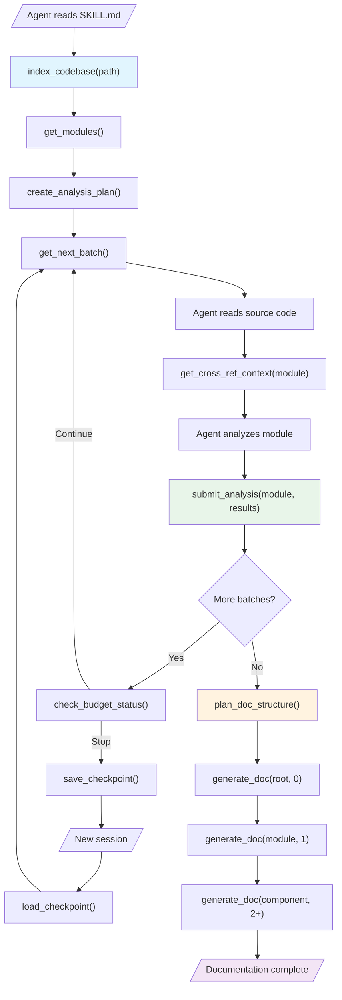

# Codebase Explorer Architecture

> **Author**: architect agent
> **Created**: 2026-03-22
> **Status**: Design Document (T-01)
> **Dependencies**: CRITICAL_REVIEW.md, results/01-07, design/depth_strategy.md, design/doc_templates.md

---

## Table of Contents

1. [System Overview](#1-system-overview)
2. [Source Module Interfaces](#2-source-module-interfaces)
3. [MCP Tool Signatures](#3-mcp-tool-signatures)
4. [Data Flow Diagram](#4-data-flow-diagram)
5. [SQLite Schema](#5-sqlite-schema)
6. [Graph-sitter Encapsulation Strategy](#6-graph-sitter-encapsulation-strategy)
7. [Error Handling Strategy](#7-error-handling-strategy)

---

## 1. System Overview

Codebase Explorer is a local MCP Server + Agent Skill tool that analyzes Python/TypeScript/JavaScript codebases and generates progressive-disclosure architecture documentation. The system uses graph-sitter as its sole parsing engine and FastMCP 3.0 as the MCP framework.

### 1.1 Architecture Layers

```
┌──────────────────────────────────────────────────────────┐
│  AI Agent (Claude Code / Gemini CLI / Codex CLI)         │
│  reads SKILL.md → calls MCP tools → writes documents     │
└────────────────────┬─────────────────────────────────────┘
                     │ STDIO JSON-RPC
┌────────────────────▼─────────────────────────────────────┐
│  server.py  — FastMCP 3.0 entry point                    │
│  ├── 15 MCP tools registered                             │
│  └── Lifespan: SQLite + graph-sitter init                │
├──────────────────────────────────────────────────────────┤
│  parser/   │  graph/    │  budget/  │  doc/     │ state/ │
│  codebase  │  dependency│  estimator│  planner  │ db     │
│  lang_det  │  grouper   │  control  │  generator│ ckpt   │
│            │  ordering  │           │  mermaid  │ models │
│            │            │           │  templates│        │
├──────────────────────────────────────────────────────────┤
│  graph-sitter (Codebase API) │  SQLite (WAL mode)        │
│  NetworkX (DiGraph)          │  aiosqlite                │
└──────────────────────────────────────────────────────────┘
```

### 1.2 Module Dependency Graph



---

## 2. Source Module Interfaces

### 2.1 parser/ — Code Parsing Layer

Encapsulates graph-sitter's Codebase API. Two files.

#### parser/codebase.py (~250 lines)

```python
from __future__ import annotations
from dataclasses import dataclass
from pathlib import Path

@dataclass(frozen=True)
class FileInfo:
    """Immutable representation of a parsed source file."""
    filepath: str
    language: str
    line_count: int
    function_names: tuple[str, ...]
    class_names: tuple[str, ...]
    import_sources: tuple[str, ...]  # resolved file paths

@dataclass(frozen=True)
class FunctionInfo:
    """Immutable representation of a parsed function."""
    name: str
    filepath: str
    start_line: int
    end_line: int
    parameters: tuple[str, ...]
    return_type: str | None
    calls: tuple[str, ...]       # names of functions called
    dependencies: tuple[str, ...]  # filepaths of dependencies

@dataclass(frozen=True)
class ClassInfo:
    """Immutable representation of a parsed class."""
    name: str
    filepath: str
    start_line: int
    end_line: int
    methods: tuple[str, ...]
    base_classes: tuple[str, ...]
    subclasses: tuple[str, ...]

@dataclass(frozen=True)
class CodebaseSnapshot:
    """Immutable snapshot of a parsed codebase."""
    root_path: str
    files: tuple[FileInfo, ...]
    functions: tuple[FunctionInfo, ...]
    classes: tuple[ClassInfo, ...]
    languages_detected: tuple[str, ...]
    total_lines: int

class CodebaseParser:
    """Wraps graph-sitter Codebase API for code analysis."""

    def parse(self, path: str, languages: list[str] | None = None) -> CodebaseSnapshot:
        """Parse a codebase directory and return an immutable snapshot.

        Args:
            path: Absolute path to the codebase root directory.
            languages: Optional filter for languages to analyze.
                       Accepted values: "python", "typescript", "javascript".
                       None means auto-detect.

        Returns:
            CodebaseSnapshot with all files, functions, and classes.

        Raises:
            CodebaseParseError: If the path is invalid or parsing fails.
            UnsupportedLanguageError: If an unsupported language is requested.
        """
        ...

    def get_file_content(self, filepath: str) -> str:
        """Read the content of a specific file.

        Args:
            filepath: Absolute path to the source file.

        Returns:
            File content as a string.

        Raises:
            FileNotFoundError: If the file does not exist.
        """
        ...
```

**Dependencies**: `graph-sitter` (codegen), `parser/language_detect.py`

#### parser/language_detect.py (~80 lines)

```python
from pathlib import Path

SUPPORTED_LANGUAGES = ("python", "typescript", "javascript")

@dataclass(frozen=True)
class LanguageProfile:
    """Detected language distribution for a directory."""
    languages: dict[str, int]  # language -> file count
    primary_language: str
    total_files: int

def detect_languages(path: str) -> LanguageProfile:
    """Detect programming languages present in a directory.

    Scans file extensions to determine language distribution.
    Only counts files in SUPPORTED_LANGUAGES.

    Args:
        path: Directory path to scan.

    Returns:
        LanguageProfile with language distribution.

    Raises:
        InvalidPathError: If path does not exist or is not a directory.
    """
    ...

def is_supported_language(language: str) -> bool:
    """Check if a language is supported by graph-sitter."""
    ...
```

**Dependencies**: None (pure Python stdlib).

---

### 2.2 graph/ — Graph Construction and Analysis Layer

Transforms parsed data into NetworkX graphs and performs community detection. Three files.

#### graph/dependency.py (~250 lines)

```python
import networkx as nx
from parser.codebase import CodebaseSnapshot

@dataclass(frozen=True)
class DependencyEdge:
    """A directed edge in the dependency graph."""
    source: str       # source file path
    target: str       # target file path
    weight: int       # number of import/call references
    edge_type: str    # "import" | "call" | "inherit"

@dataclass(frozen=True)
class DependencyGraphResult:
    """Immutable result of dependency graph construction."""
    graph: nx.DiGraph
    file_count: int
    edge_count: int
    circular_deps: tuple[tuple[str, ...], ...]  # SCC groups

def build_dependency_graph(snapshot: CodebaseSnapshot) -> DependencyGraphResult:
    """Build a file-level dependency graph from a codebase snapshot.

    Constructs a NetworkX DiGraph where:
    - Nodes are source file paths.
    - Edges represent import/call/inherit relationships.
    - Edge weights reflect reference frequency.

    Args:
        snapshot: CodebaseSnapshot from the parser layer.

    Returns:
        DependencyGraphResult with the graph and metadata.
    """
    ...

def get_module_dependency_subgraph(
    graph: nx.DiGraph,
    module_files: list[str],
) -> nx.DiGraph:
    """Extract a subgraph for a specific module's files.

    Args:
        graph: Full dependency graph.
        module_files: File paths belonging to the module.

    Returns:
        Subgraph containing only the specified files and their edges.
    """
    ...
```

**Dependencies**: `networkx`, `parser/codebase.py`

#### graph/grouper.py (~300 lines)

```python
import networkx as nx
from dataclasses import dataclass

@dataclass(frozen=True)
class ModuleGroup:
    """A detected module group from community detection."""
    name: str
    files: tuple[str, ...]
    file_count: int
    line_count: int
    function_count: int
    class_count: int
    is_utility: bool

@dataclass(frozen=True)
class GroupingResult:
    """Result of the module grouping process."""
    modules: tuple[ModuleGroup, ...]
    utility_modules: tuple[ModuleGroup, ...]
    modularity_score: float
    coverage: float

def group_modules(
    graph: nx.DiGraph,
    snapshot: "CodebaseSnapshot",
    resolution: float = 1.0,
    utility_threshold: float = 0.1,
) -> GroupingResult:
    """Group codebase files into logical modules.

    Uses a two-phase approach:
    1. Directory-based initial grouping (Level 0).
    2. Louvain community detection refinement (Level 1).

    Utility nodes (high in-degree) are identified and isolated
    before community detection, then assigned to a special group.

    Args:
        graph: Dependency graph from dependency.py.
        snapshot: CodebaseSnapshot for file metadata.
        resolution: Louvain resolution parameter (>1 = smaller groups).
        utility_threshold: In-degree ratio threshold for utility nodes.

    Returns:
        GroupingResult with module groups and quality metrics.
    """
    ...

def identify_utility_nodes(
    graph: nx.DiGraph,
    threshold: float = 0.1,
) -> frozenset[str]:
    """Identify utility/shared nodes with high in-degree.

    Args:
        graph: Dependency graph.
        threshold: Fraction of total nodes above which a node is utility.

    Returns:
        Frozen set of file paths identified as utility nodes.
    """
    ...
```

**Dependencies**: `networkx`, `parser/codebase.py`

#### graph/ordering.py (~200 lines)

```python
import networkx as nx
from dataclasses import dataclass

@dataclass(frozen=True)
class AnalysisOrder:
    """Ordered list of module analysis layers."""
    layers: tuple[tuple[str, ...], ...]  # ((layer0_modules), (layer1_modules), ...)
    pagerank_scores: dict[str, float]
    total_layers: int

def compute_analysis_order(
    graph: nx.DiGraph,
    module_groups: "GroupingResult",
) -> AnalysisOrder:
    """Compute the optimal module analysis order using DAG topological sort.

    Strategy:
    1. Condense SCCs into super-nodes (nx.condensation).
    2. Topological sort on the condensed DAG.
    3. Within each topological layer, sort by PageRank (higher first).
    4. Utility modules are placed first regardless of topology.

    Args:
        graph: Module-level dependency graph.
        module_groups: Module grouping result.

    Returns:
        AnalysisOrder with layered processing sequence.
    """
    ...

def compute_pagerank(graph: nx.DiGraph) -> dict[str, float]:
    """Compute PageRank scores for all nodes in the dependency graph.

    Args:
        graph: Dependency graph (DiGraph).

    Returns:
        Dict mapping node names to PageRank scores.
    """
    ...
```

**Dependencies**: `networkx`

---

### 2.3 state/ — State Management Layer

SQLite-backed persistence for analysis state, checkpoints, and results. Three files.

#### state/models.py (~200 lines)

```python
from pydantic import BaseModel, Field
from typing import Literal
from datetime import datetime

class ProjectRecord(BaseModel):
    """Stored project index record."""
    id: str
    path: str
    created_at: datetime
    status: Literal["pending", "indexing", "indexed", "failed"]
    languages: list[str]
    file_count: int
    function_count: int
    class_count: int
    total_lines: int

class ModuleRecord(BaseModel):
    """Stored module group record."""
    id: str
    project_id: str
    name: str
    files: list[str]
    file_count: int
    line_count: int
    function_count: int
    class_count: int
    is_utility: bool
    description: str | None = None

class AnalysisTask(BaseModel):
    """A single analysis task in the queue."""
    id: str
    project_id: str
    module_name: str
    status: Literal["pending", "in_progress", "completed", "failed", "skipped"]
    assigned_agent: str | None = None
    batch_index: int
    created_at: datetime
    completed_at: datetime | None = None

class AnalysisResult(BaseModel):
    """Submitted analysis result for a module."""
    id: str
    task_id: str
    module_name: str
    description: str
    public_interfaces: list[str]
    key_data_structures: list[str]
    dependencies: list[str]
    dependents: list[str]
    patterns_identified: list[str]
    detailed_analysis: str | None = None
    mermaid_diagram: str | None = None
    token_count: int
    created_at: datetime

class CheckpointRecord(BaseModel):
    """Analysis checkpoint for resume support."""
    id: str
    project_id: str
    status: Literal["in_progress", "completed", "interrupted", "failed"]
    phase: Literal["indexing", "module_analysis", "cross_reference", "doc_generation"]
    analyzed_modules: list[str]
    pending_modules: list[str]
    total_modules: int
    total_tokens_processed: int
    errors: list[dict]
    created_at: datetime
    updated_at: datetime

class DocNode(BaseModel):
    """A node in the documentation tree."""
    id: str
    project_id: str
    path: str           # e.g. "core/OVERVIEW.md"
    level: int          # 0=INDEX, 1=OVERVIEW, 2+=DETAIL
    target: str         # module or component name
    token_budget: int
    parent_path: str | None = None
    children_paths: list[str] = Field(default_factory=list)
    content: str | None = None
    actual_tokens: int | None = None
    status: Literal["planned", "generated", "failed"] = "planned"
```

**Dependencies**: `pydantic`

#### state/database.py (~350 lines)

```python
import aiosqlite
from pathlib import Path
from state.models import (
    ProjectRecord, ModuleRecord, AnalysisTask,
    AnalysisResult, CheckpointRecord, DocNode,
)

class Database:
    """Async SQLite database for state persistence.

    Uses WAL mode for concurrent read support.
    All writes are serialized through aiosqlite.
    """

    def __init__(self, db_path: Path) -> None: ...

    async def initialize(self) -> None:
        """Create tables and run migrations. Idempotent."""
        ...

    async def close(self) -> None:
        """Close the database connection."""
        ...

    # --- Projects ---
    async def insert_project(self, project: ProjectRecord) -> None: ...
    async def get_project(self, project_id: str) -> ProjectRecord | None: ...
    async def get_latest_project(self) -> ProjectRecord | None: ...
    async def update_project_status(self, project_id: str, status: str) -> None: ...

    # --- Modules ---
    async def insert_modules(self, modules: list[ModuleRecord]) -> None: ...
    async def get_modules(self, project_id: str) -> list[ModuleRecord]: ...
    async def get_module(self, project_id: str, name: str) -> ModuleRecord | None: ...

    # --- Analysis Tasks ---
    async def create_tasks(self, tasks: list[AnalysisTask]) -> None: ...
    async def get_next_pending_tasks(
        self, project_id: str, batch_size: int = 3,
    ) -> list[AnalysisTask]: ...
    async def claim_task(self, task_id: str, agent_id: str) -> bool: ...
    async def complete_task(self, task_id: str, status: str) -> None: ...
    async def get_task_status_summary(self, project_id: str) -> dict: ...

    # --- Analysis Results ---
    async def insert_result(self, result: AnalysisResult) -> None: ...
    async def get_result(self, module_name: str) -> AnalysisResult | None: ...
    async def get_all_results(self, project_id: str) -> list[AnalysisResult]: ...

    # --- Checkpoints ---
    async def save_checkpoint(self, checkpoint: CheckpointRecord) -> None: ...
    async def get_latest_checkpoint(self, project_id: str) -> CheckpointRecord | None: ...

    # --- Doc Nodes ---
    async def insert_doc_nodes(self, nodes: list[DocNode]) -> None: ...
    async def get_doc_tree(self, project_id: str) -> list[DocNode]: ...
    async def update_doc_node_content(
        self, node_id: str, content: str, actual_tokens: int,
    ) -> None: ...
```

**Dependencies**: `aiosqlite`, `state/models.py`

#### state/checkpoint.py (~200 lines)

```python
from state.database import Database
from state.models import CheckpointRecord, AnalysisResult

class CheckpointManager:
    """Manages analysis checkpoints for session resume."""

    def __init__(self, db: Database) -> None: ...

    async def create_checkpoint(
        self,
        project_id: str,
        phase: str,
        analyzed_modules: list[str],
        pending_modules: list[str],
    ) -> CheckpointRecord:
        """Create a new checkpoint capturing current analysis progress.

        Args:
            project_id: The project being analyzed.
            phase: Current analysis phase.
            analyzed_modules: Modules already analyzed.
            pending_modules: Modules remaining.

        Returns:
            The created CheckpointRecord.
        """
        ...

    async def restore_checkpoint(
        self, project_id: str,
    ) -> tuple[CheckpointRecord, list[AnalysisResult]] | None:
        """Load the latest checkpoint and associated results.

        Returns:
            Tuple of (checkpoint, results) or None if no checkpoint exists.
        """
        ...

    async def update_checkpoint(
        self,
        checkpoint_id: str,
        analyzed_modules: list[str],
        pending_modules: list[str],
        status: str,
        tokens_processed: int,
    ) -> None:
        """Update an existing checkpoint with new progress.

        Args:
            checkpoint_id: ID of the checkpoint to update.
            analyzed_modules: Updated list of analyzed modules.
            pending_modules: Updated list of pending modules.
            status: New status.
            tokens_processed: Cumulative tokens processed.
        """
        ...
```

**Dependencies**: `state/database.py`, `state/models.py`

---

### 2.4 budget/ — Budget Control Layer

Token estimation and analysis budget management. Two files.

#### budget/estimator.py (~150 lines)

```python
from dataclasses import dataclass

CHARS_PER_TOKEN: dict[str, float] = {
    "python": 4.2,
    "typescript": 3.8,
    "javascript": 3.8,
    "default": 3.8,
}

TOKENS_PER_LINE: dict[str, int] = {
    "python": 12,
    "typescript": 15,
    "javascript": 15,
    "default": 15,
}

@dataclass(frozen=True)
class TokenEstimate:
    """Immutable token estimate for a code unit."""
    source_tokens: int
    char_count: int
    line_count: int
    language: str
    method: str  # "chars" | "lines" | "tiktoken"

def estimate_tokens_from_chars(char_count: int, language: str = "python") -> int:
    """Estimate token count from character count.

    Uses language-specific chars-per-token ratio. Accuracy: +/- 15%.

    Args:
        char_count: Number of characters in the source code.
        language: Programming language for ratio lookup.

    Returns:
        Estimated token count.
    """
    ...

def estimate_tokens_from_lines(line_count: int, language: str = "python") -> int:
    """Estimate token count from line count.

    Uses language-specific tokens-per-line ratio. Accuracy: +/- 20%.

    Args:
        line_count: Number of source code lines.
        language: Programming language for ratio lookup.

    Returns:
        Estimated token count.
    """
    ...

def estimate_file_tokens(filepath: str, language: str = "python") -> TokenEstimate:
    """Estimate tokens for a single source file.

    Reads the file and applies character-based estimation.

    Args:
        filepath: Path to the source file.
        language: Programming language.

    Returns:
        TokenEstimate with detailed breakdown.
    """
    ...

def estimate_module_tokens(
    files: list[str],
    language: str = "python",
) -> dict[str, TokenEstimate]:
    """Estimate tokens for all files in a module.

    Args:
        files: List of file paths in the module.
        language: Primary language.

    Returns:
        Dict mapping file path to its TokenEstimate.
    """
    ...
```

**Dependencies**: None (pure Python stdlib).

#### budget/controller.py (~200 lines)

```python
from dataclasses import dataclass
from budget.estimator import TokenEstimate

@dataclass(frozen=True)
class BudgetAllocation:
    """Token budget allocation for a module analysis."""
    total_budget: int
    code_budget: int         # 50% - target module code
    cross_ref_budget: int    # 20% - dependency summaries
    prior_results_budget: int  # 10% - previous analysis
    instruction_budget: int  # 10% - templates and instructions
    output_reserve: int      # 10% - output space

@dataclass(frozen=True)
class BudgetStatus:
    """Current budget consumption status."""
    total_budget: int
    used_tokens: int
    remaining_tokens: int
    usage_percent: float
    should_stop: bool
    stop_reason: str  # "" if should not stop

class AnalysisBudgetController:
    """Controls token budget allocation and consumption tracking.

    Determines when an agent should stop analyzing and save progress.
    """

    def __init__(
        self,
        model_context_window: int = 200_000,
        safety_margin: float = 0.3,
        system_prompt_tokens: int = 3000,
        output_reserve_tokens: int = 8000,
    ) -> None: ...

    def allocate_budget(self, module_token_count: int) -> BudgetAllocation:
        """Allocate token budget for a module analysis session.

        Distributes the available budget across code, cross-references,
        prior results, instructions, and output reserve.

        Args:
            module_token_count: Estimated tokens for the module.

        Returns:
            BudgetAllocation with per-category budgets.
        """
        ...

    def check_status(
        self,
        used_tokens: int,
        modules_completed: int,
        pending_cross_refs: int,
        elapsed_minutes: float,
    ) -> BudgetStatus:
        """Check whether the agent should stop and save progress.

        Stop conditions:
        1. Token usage > 85% of total budget.
        2. Pending cross-references > 3 unanalyzed modules.
        3. Elapsed time > 15 minutes.

        Args:
            used_tokens: Tokens consumed so far.
            modules_completed: Number of modules analyzed.
            pending_cross_refs: Unresolved cross-references.
            elapsed_minutes: Time elapsed since analysis start.

        Returns:
            BudgetStatus indicating whether to stop and why.
        """
        ...
```

**Dependencies**: `budget/estimator.py`

---

### 2.5 doc/ — Document Generation Layer

Dynamic N-layer document planning and generation. Four files.

#### doc/depth_planner.py (~300 lines)

```python
from dataclasses import dataclass
from enum import Enum

class SplitStrategy(Enum):
    SUBPACKAGE = "subpackage"
    CLASS = "class"
    FUNCTION_GROUP = "function_group"
    FILE = "file"
    HYBRID = "hybrid"

@dataclass(frozen=True)
class ModuleMetrics:
    """Metrics used for depth decision."""
    file_count: int
    function_count: int
    class_count: int
    line_count: int
    estimated_tokens: int
    subpackage_count: int
    dependency_count: int
    cyclomatic_complexity: float
    is_utility_module: bool
    has_clear_entry_point: bool

@dataclass(frozen=True)
class DocumentPlan:
    """Plan for a single documentation node."""
    depth: int
    split_strategy: SplitStrategy
    doc_budget_per_level: tuple[int, ...]
    should_merge_parent: bool
    termination_reason: str

def calculate_depth(metrics: ModuleMetrics) -> int:
    """Calculate optimal documentation depth (0-5) for a module.

    depth = max(structural_depth, complexity_depth, token_depth)

    See design/depth_strategy.md Section 2.2 for threshold details.

    Args:
        metrics: Module metrics from static analysis.

    Returns:
        Integer depth from 0 (summary only) to 5 (maximum nesting).
    """
    ...

def select_split_strategy(metrics: ModuleMetrics) -> SplitStrategy:
    """Select the optimal split strategy for sub-documents.

    Priority: SUBPACKAGE > CLASS > FUNCTION_GROUP > FILE.
    See design/depth_strategy.md Section 3.2.

    Args:
        metrics: Module metrics.

    Returns:
        Selected SplitStrategy enum value.
    """
    ...

def plan_documentation(metrics: ModuleMetrics) -> DocumentPlan:
    """Main entry point: create a complete documentation plan.

    Steps:
    1. Calculate depth from metrics.
    2. Check if module should merge into parent.
    3. Select split strategy.
    4. Allocate token budget per level.

    Args:
        metrics: Module metrics from static analysis.

    Returns:
        DocumentPlan with depth, strategy, and budgets.
    """
    ...
```

**Dependencies**: `budget/estimator.py`

#### doc/generator.py (~400 lines)

```python
from state.models import DocNode, AnalysisResult
from doc.depth_planner import DocumentPlan
from doc.templates import TemplateRenderer
from doc.mermaid import MermaidGenerator

@dataclass(frozen=True)
class GeneratedDocument:
    """Immutable generated document."""
    path: str
    content: str
    actual_tokens: int
    level: int
    target: str

class DocumentGenerator:
    """Generates documentation based on analysis results and plans."""

    def __init__(
        self,
        template_renderer: TemplateRenderer,
        mermaid_generator: MermaidGenerator,
    ) -> None: ...

    def plan_doc_structure(
        self,
        project_id: str,
        modules: list["ModuleRecord"],
        plans: dict[str, DocumentPlan],
    ) -> list[DocNode]:
        """Plan the full documentation tree structure.

        Produces a flat list of DocNode entries representing the
        planned document hierarchy. Each node has a path, level,
        token budget, and parent/children links.

        Args:
            project_id: The project identifier.
            modules: List of module records from the database.
            plans: Dict mapping module name to its DocumentPlan.

        Returns:
            List of DocNode entries forming the documentation tree.
        """
        ...

    def generate_doc(
        self,
        node: DocNode,
        analysis_result: AnalysisResult | None,
        cross_ref_context: str,
        children_summaries: list[dict],
    ) -> GeneratedDocument:
        """Generate a single document for a given doc node.

        Selects the appropriate Jinja2 template based on level:
        - Level 0: index.md.j2
        - Level 1: overview.md.j2
        - Level 2+: detail.md.j2

        Content is trimmed to fit within the token budget using
        priority-based content selection.

        Args:
            node: The DocNode to generate content for.
            analysis_result: Analysis result for the target module.
            cross_ref_context: Pre-built cross-reference context string.
            children_summaries: Summaries of child documents.

        Returns:
            GeneratedDocument with content and token count.
        """
        ...
```

**Dependencies**: `state/models.py`, `doc/depth_planner.py`, `doc/templates.py`, `doc/mermaid.py`

#### doc/mermaid.py (~200 lines)

```python
import networkx as nx

def generate_dependency_mermaid(
    graph: nx.DiGraph,
    scope: str = "project",
    target: str | None = None,
    max_nodes: int = 30,
) -> str:
    """Generate a Mermaid flowchart from a dependency graph.

    Limits output to max_nodes for readability. Nodes beyond
    the limit are collapsed into a "... and N more" node.

    Args:
        graph: NetworkX DiGraph with dependency data.
        scope: "project", "module", or "component".
        target: Optional target name to center the view on.
        max_nodes: Maximum number of nodes to render.

    Returns:
        Mermaid flowchart definition string.
    """
    ...

def generate_call_graph_mermaid(
    calls: list[tuple[str, str]],
    max_edges: int = 50,
) -> str:
    """Generate a Mermaid sequence or flowchart from call relationships.

    Args:
        calls: List of (caller, callee) tuples.
        max_edges: Maximum edges to render.

    Returns:
        Mermaid diagram string.
    """
    ...

def generate_class_hierarchy_mermaid(
    classes: list["ClassInfo"],
    max_classes: int = 20,
) -> str:
    """Generate a Mermaid classDiagram from class hierarchy data.

    Args:
        classes: List of ClassInfo with base_classes and subclasses.
        max_classes: Maximum classes to render.

    Returns:
        Mermaid classDiagram string.
    """
    ...
```

**Dependencies**: `networkx`

#### doc/templates.py (~100 lines)

```python
from pathlib import Path
from jinja2 import Environment, FileSystemLoader

class TemplateRenderer:
    """Loads and renders Jinja2 documentation templates."""

    def __init__(self, templates_dir: Path | None = None) -> None:
        """Initialize the template renderer.

        Args:
            templates_dir: Directory containing .j2 templates.
                          Defaults to src/templates/.
        """
        ...

    def render_index(self, context: dict) -> str:
        """Render the Level 0 INDEX.md template.

        Args:
            context: Template variables (project_name, modules, diagram, etc.).

        Returns:
            Rendered markdown string.
        """
        ...

    def render_overview(self, context: dict) -> str:
        """Render the Level 1 OVERVIEW.md template.

        Args:
            context: Template variables (module_name, files, interfaces, etc.).

        Returns:
            Rendered markdown string.
        """
        ...

    def render_detail(self, context: dict) -> str:
        """Render the Level 2+ DETAIL.md template.

        This template is universal and works at any depth >= 2.

        Args:
            context: Template variables (component_name, depth, classes, etc.).

        Returns:
            Rendered markdown string.
        """
        ...
```

**Dependencies**: `jinja2`

---

### 2.6 templates/ — Jinja2 Template Files

Three template files as designed in `design/doc_templates.md`:

| File | Level | Usage |
|------|-------|-------|
| `index.md.j2` | 0 | Once per project |
| `overview.md.j2` | 1 | Once per module |
| `detail.md.j2` | 2+ | Universal for any depth |

See `design/doc_templates.md` for full template specifications.

---

### 2.7 server.py — FastMCP Entry Point (~350 lines)

```python
from fastmcp import FastMCP, Context
from fastmcp.server.lifespan import lifespan
from fastmcp.exceptions import ToolError

# Lifespan: initializes Database + CodebaseParser
# Registers all 15 MCP tools
# Entry point: if __name__ == "__main__": mcp.run()
```

**Dependencies**: All other modules.

---

## 3. MCP Tool Signatures

### 3.1 Indexing and Analysis (4 tools)

#### index_codebase

```python
@mcp.tool(
    annotations={"readOnlyHint": False, "idempotentHint": True},
    timeout=120.0,
)
async def index_codebase(
    path: Annotated[str, Field(description="Absolute path to the codebase root directory")],
    languages: Annotated[
        list[Literal["python", "typescript", "javascript"]] | None,
        Field(description="Languages to analyze. None = auto-detect.")
    ] = None,
    ctx: Context = None,
) -> dict:
    """Index a codebase: parse with graph-sitter, build dependency graph,
    run Louvain community detection, and store results in SQLite.

    Must be called before any other analysis tools.

    Returns:
        {
            "status": "success",
            "summary": "Indexed 42 files, 156 functions, 28 classes",
            "data": {
                "project_id": "abc123",
                "file_count": 42,
                "function_count": 156,
                "class_count": 28,
                "languages": ["python"],
                "module_count": 6,
            }
        }
    """
```

#### get_modules

```python
@mcp.tool(annotations={"readOnlyHint": True})
async def get_modules(
    project_id: Annotated[
        str | None,
        Field(description="Project ID. None = use latest project.")
    ] = None,
    sort_by: Annotated[
        Literal["name", "size", "complexity", "dependency"],
        Field(description="Sort order for the module list.")
    ] = "name",
    ctx: Context = None,
) -> dict:
    """Get the list of detected modules after Louvain grouping.

    Each module includes file count, function count, line count,
    and a utility flag. Use sort_by='dependency' for topological order.

    Precondition: index_codebase must have been called.

    Returns:
        {
            "status": "success",
            "data": {
                "project_id": "abc123",
                "modules": [
                    {"name": "core", "file_count": 8, "line_count": 2400,
                     "function_count": 45, "class_count": 12, "is_utility": false},
                    ...
                ],
                "total_modules": 6
            }
        }
    """
```

#### get_module_detail

```python
@mcp.tool(annotations={"readOnlyHint": True})
async def get_module_detail(
    module_name: Annotated[str, Field(description="Name of the module to inspect")],
    project_id: Annotated[str | None, Field(description="Project ID. None = latest.")] = None,
    ctx: Context = None,
) -> dict:
    """Get detailed information about a specific module.

    Returns file list, public function/class signatures, dependencies,
    dependents, and a Mermaid dependency subgraph.

    Precondition: index_codebase must have been called.

    Returns:
        {
            "status": "success",
            "data": {
                "name": "core",
                "files": ["src/core/app.py", ...],
                "functions": [{"name": "create_app", "params": "...", "file": "..."}],
                "classes": [{"name": "Flask", "methods": [...], "file": "..."}],
                "dependencies": ["utils", "config"],
                "dependents": ["api", "cli"],
                "metrics": {"line_count": 2400, "complexity": 3.2},
                "mermaid_graph": "graph TD\n  ..."
            }
        }
    """
```

#### get_dependency_graph

```python
@mcp.tool(annotations={"readOnlyHint": True})
async def get_dependency_graph(
    scope: Annotated[
        Literal["project", "module"],
        Field(description="Scope: 'project' for full graph, 'module' for a single module.")
    ] = "project",
    target: Annotated[
        str | None,
        Field(description="Module name (required when scope='module').")
    ] = None,
    project_id: Annotated[str | None, Field(description="Project ID. None = latest.")] = None,
    ctx: Context = None,
) -> dict:
    """Get the dependency graph in Mermaid format.

    Returns nodes, edges, circular dependencies, and a Mermaid diagram.

    Precondition: index_codebase must have been called.

    Returns:
        {
            "status": "success",
            "data": {
                "nodes": [{"name": "core", "type": "module"}, ...],
                "edges": [{"from": "api", "to": "core", "weight": 5}, ...],
                "circular_deps": [["models", "schemas"]],
                "mermaid_graph": "graph TD\n  ..."
            }
        }
    """
```

---

### 3.2 Budget and Chunking (3 tools)

#### estimate_module_tokens

```python
@mcp.tool(annotations={"readOnlyHint": True})
async def estimate_module_tokens(
    module_name: Annotated[
        str | None,
        Field(description="Module name. None = estimate all modules.")
    ] = None,
    project_id: Annotated[str | None, Field(description="Project ID. None = latest.")] = None,
    ctx: Context = None,
) -> dict:
    """Estimate token counts for module(s) using character/line heuristics.

    Uses chars/4 for Python and chars/3.8 for TypeScript/JavaScript.

    Precondition: index_codebase must have been called.

    Returns:
        {
            "status": "success",
            "data": {
                "estimates": [
                    {"module": "core", "estimated_tokens": 28800,
                     "line_count": 2400, "file_count": 8, "language": "python"},
                    ...
                ],
                "total_tokens": 92000
            }
        }
    """
```

#### create_analysis_plan

```python
@mcp.tool(annotations={"readOnlyHint": False, "idempotentHint": True})
async def create_analysis_plan(
    project_id: Annotated[str | None, Field(description="Project ID. None = latest.")] = None,
    max_tokens_per_batch: Annotated[
        int, Field(description="Max tokens per analysis batch.", ge=10000, le=200000)
    ] = 60000,
    ctx: Context = None,
) -> dict:
    """Generate a chunked analysis plan with DAG topological ordering.

    Creates analysis tasks in the database, ordered by dependency
    topology (leaf modules first, entry points last). Large modules
    are split into sub-batches if they exceed max_tokens_per_batch.

    Precondition: index_codebase must have been called.

    Returns:
        {
            "status": "success",
            "summary": "Created 8 analysis tasks in 4 layers",
            "data": {
                "tasks": [
                    {"batch": 0, "modules": ["utils", "config"],
                     "estimated_tokens": 12000, "reason": "leaf_modules"},
                    {"batch": 1, "modules": ["models"],
                     "estimated_tokens": 18000, "reason": "layer_1"},
                    ...
                ],
                "total_batches": 4,
                "total_modules": 8
            }
        }
    """
```

#### check_budget_status

```python
@mcp.tool(annotations={"readOnlyHint": True})
async def check_budget_status(
    used_tokens: Annotated[
        int, Field(description="Tokens consumed so far in this session.")
    ],
    modules_completed: Annotated[
        int, Field(description="Number of modules analyzed in this session.")
    ] = 0,
    pending_cross_refs: Annotated[
        int, Field(description="Unresolved cross-module references.")
    ] = 0,
    elapsed_minutes: Annotated[
        float, Field(description="Minutes elapsed since session start.")
    ] = 0.0,
    ctx: Context = None,
) -> dict:
    """Check whether the agent should stop and save progress.

    Evaluates multiple stop conditions:
    1. Token usage > 85% of budget.
    2. Pending cross-references > 3.
    3. Elapsed time > 15 minutes.

    Returns:
        {
            "status": "success",
            "data": {
                "total_budget": 129000,
                "used_tokens": 85000,
                "remaining_tokens": 44000,
                "usage_percent": 65.9,
                "should_stop": false,
                "stop_reason": ""
            }
        }
    """
```

---

### 3.3 Task Management and Mutual Exclusion (3 tools)

#### get_next_batch

```python
@mcp.tool(annotations={"readOnlyHint": True})
async def get_next_batch(
    project_id: Annotated[str | None, Field(description="Project ID. None = latest.")] = None,
    batch_size: Annotated[
        int, Field(description="Maximum modules per batch.", ge=1, le=10)
    ] = 3,
    ctx: Context = None,
) -> dict:
    """Get the next batch of modules to analyze.

    Returns pending modules in topological order, skipping any that
    are currently claimed by another agent. Includes pre-built
    cross-reference context from already-analyzed dependencies.

    Precondition: create_analysis_plan must have been called.

    Returns:
        {
            "status": "success",
            "data": {
                "batch_index": 2,
                "modules": [
                    {"name": "services", "files": [...],
                     "estimated_tokens": 24000,
                     "dependency_summaries": "# Module: utils\n..."},
                    ...
                ],
                "remaining_batches": 2,
                "total_progress_percent": 50.0
            }
        }
    """
```

#### submit_analysis

```python
@mcp.tool(annotations={"readOnlyHint": False})
async def submit_analysis(
    module_name: Annotated[str, Field(description="Name of the analyzed module")],
    description: Annotated[str, Field(description="One-line module description")],
    public_interfaces: Annotated[
        list[str], Field(description="List of public function/class signatures")
    ],
    key_data_structures: Annotated[
        list[str], Field(description="Important data structures identified")
    ],
    dependencies: Annotated[list[str], Field(description="Module dependencies")],
    patterns_identified: Annotated[
        list[str], Field(description="Design patterns identified")
    ],
    detailed_analysis: Annotated[
        str | None, Field(description="Full analysis text in Markdown")
    ] = None,
    mermaid_diagram: Annotated[
        str | None, Field(description="Mermaid diagram for internal structure")
    ] = None,
    token_count: Annotated[
        int, Field(description="Approximate tokens consumed for this analysis")
    ] = 0,
    project_id: Annotated[str | None, Field(description="Project ID. None = latest.")] = None,
    ctx: Context = None,
) -> dict:
    """Submit analysis results for a module.

    Stores the analysis result and marks the corresponding task
    as completed. The result's summary is available as cross-reference
    context for subsequent module analyses.

    Returns:
        {
            "status": "success",
            "summary": "Analysis for 'services' saved. 6/8 modules complete.",
            "data": {
                "result_id": "res_abc",
                "modules_completed": 6,
                "modules_remaining": 2,
                "progress_percent": 75.0
            }
        }
    """
```

#### get_analysis_status

```python
@mcp.tool(annotations={"readOnlyHint": True})
async def get_analysis_status(
    project_id: Annotated[str | None, Field(description="Project ID. None = latest.")] = None,
    ctx: Context = None,
) -> dict:
    """Get overall analysis progress and task status.

    Returns counts for pending, in-progress, completed, and failed tasks,
    along with a list of completed module names and any errors.

    Returns:
        {
            "status": "success",
            "data": {
                "total_tasks": 8,
                "pending": 2,
                "in_progress": 0,
                "completed": 6,
                "failed": 0,
                "completed_modules": ["utils", "config", "models", ...],
                "errors": [],
                "progress_percent": 75.0
            }
        }
    """
```

---

### 3.4 Checkpoint and Cross-Reference (3 tools)

#### save_checkpoint

```python
@mcp.tool(annotations={"readOnlyHint": False})
async def save_checkpoint(
    phase: Annotated[
        Literal["indexing", "module_analysis", "cross_reference", "doc_generation"],
        Field(description="Current analysis phase")
    ],
    status: Annotated[
        Literal["in_progress", "completed", "interrupted"],
        Field(description="Checkpoint status")
    ] = "in_progress",
    tokens_processed: Annotated[
        int, Field(description="Total tokens processed so far")
    ] = 0,
    project_id: Annotated[str | None, Field(description="Project ID. None = latest.")] = None,
    ctx: Context = None,
) -> dict:
    """Save an analysis checkpoint for session resume.

    Captures current progress: analyzed modules, pending modules,
    tokens processed, and phase. A new session can restore from
    this checkpoint using load_checkpoint.

    Returns:
        {
            "status": "success",
            "summary": "Checkpoint saved: 6/8 modules analyzed, phase=module_analysis",
            "data": {
                "checkpoint_id": "ckpt_abc",
                "analyzed_modules": ["utils", "config", ...],
                "pending_modules": ["api", "cli"],
                "progress_percent": 75.0
            }
        }
    """
```

#### load_checkpoint

```python
@mcp.tool(annotations={"readOnlyHint": True})
async def load_checkpoint(
    checkpoint_id: Annotated[
        str | None,
        Field(description="Checkpoint ID. None = load latest checkpoint.")
    ] = None,
    project_id: Annotated[str | None, Field(description="Project ID. None = latest.")] = None,
    ctx: Context = None,
) -> dict:
    """Load an analysis checkpoint to resume a previous session.

    Returns the checkpoint state including analyzed modules, pending
    modules, and summaries of previously analyzed modules. The agent
    can use this to continue from where it left off.

    Returns:
        {
            "status": "success",
            "summary": "Restored checkpoint: 6/8 modules analyzed",
            "data": {
                "checkpoint_id": "ckpt_abc",
                "phase": "module_analysis",
                "analyzed_modules": ["utils", "config", ...],
                "pending_modules": ["api", "cli"],
                "module_summaries": {
                    "utils": {"description": "...", "public_interfaces": [...]},
                    ...
                },
                "progress_percent": 75.0,
                "tokens_processed": 45000
            }
        }
    """
```

#### get_cross_ref_context

```python
@mcp.tool(annotations={"readOnlyHint": True})
async def get_cross_ref_context(
    module_name: Annotated[str, Field(description="Module being analyzed")],
    max_tokens: Annotated[
        int, Field(description="Maximum tokens for cross-reference context.", ge=500, le=30000)
    ] = 16000,
    project_id: Annotated[str | None, Field(description="Project ID. None = latest.")] = None,
    ctx: Context = None,
) -> dict:
    """Build cross-reference context for a module's dependencies.

    Returns summaries (not full code) of modules that the target
    module depends on. Summaries are ordered by dependency weight
    (most-referenced first) and trimmed to fit within max_tokens.

    If a dependency has not been analyzed yet, only its file list
    and a "pending" status are included.

    Precondition: index_codebase and create_analysis_plan must have been called.

    Returns:
        {
            "status": "success",
            "data": {
                "target_module": "services",
                "context": "# Module: utils\\nDescription: ...\\n---\\n# Module: models\\n...",
                "dependencies_resolved": 3,
                "dependencies_pending": 1,
                "context_tokens": 8500
            }
        }
    """
```

---

### 3.5 Document Generation (2 tools)

#### plan_doc_structure

```python
@mcp.tool(annotations={"readOnlyHint": False, "idempotentHint": True})
async def plan_doc_structure(
    project_id: Annotated[str | None, Field(description="Project ID. None = latest.")] = None,
    ctx: Context = None,
) -> dict:
    """Plan the full documentation tree structure.

    Uses the depth decision engine (design/depth_strategy.md) to
    determine document depth and split strategy for each module.
    Produces a flat list of planned doc nodes with paths, levels,
    token budgets, and parent/child links.

    Precondition: All modules must be analyzed (submit_analysis complete).

    Returns:
        {
            "status": "success",
            "summary": "Planned 12 documents across 3 depth levels",
            "data": {
                "doc_tree": [
                    {"path": "INDEX.md", "level": 0, "target": "root",
                     "token_budget": 1200, "parent": null, "children": ["core/OVERVIEW.md", ...]},
                    {"path": "core/OVERVIEW.md", "level": 1, "target": "core",
                     "token_budget": 2000, "parent": "INDEX.md",
                     "children": ["core/app/DETAIL.md", ...]},
                    {"path": "core/app/DETAIL.md", "level": 2, "target": "core.app",
                     "token_budget": 3000, "parent": "core/OVERVIEW.md", "children": []},
                    ...
                ],
                "total_docs": 12,
                "max_depth": 3,
                "depth_decisions": {
                    "core": {"depth": 2, "reason": "1453 lines, 28 components",
                             "split_strategy": "subpackage"},
                    "utils": {"depth": 1, "reason": "utility module, 200 lines",
                              "split_strategy": "file"},
                    ...
                }
            }
        }
    """
```

#### generate_doc

```python
@mcp.tool(annotations={"readOnlyHint": False})
async def generate_doc(
    target: Annotated[str, Field(description="Target: module name or 'root' for INDEX")],
    level: Annotated[int, Field(description="Level: 0=INDEX, 1=OVERVIEW, 2+=DETAIL", ge=0, le=5)],
    token_budget: Annotated[int, Field(description="Token budget for this document", ge=200)],
    parent_path: Annotated[
        str | None, Field(description="Parent document path for back-link generation")
    ] = None,
    children: Annotated[
        list[str] | None, Field(description="Child document paths for forward-link generation")
    ] = None,
    project_id: Annotated[str | None, Field(description="Project ID. None = latest.")] = None,
    ctx: Context = None,
) -> dict:
    """Generate a single document for a target at a given level.

    Uses Jinja2 templates:
    - Level 0: index.md.j2 (project overview with module list)
    - Level 1: overview.md.j2 (module overview with dependency graph)
    - Level 2+: detail.md.j2 (component detail, universal template)

    Content is trimmed to fit within token_budget using priority-based
    content selection (interfaces > dependencies > diagrams > details).

    Precondition: plan_doc_structure must have been called.
    Analysis results for the target module must exist.

    Returns:
        {
            "status": "success",
            "data": {
                "path": "core/OVERVIEW.md",
                "content": "# Core Module\\n\\n...",
                "actual_tokens": 1850,
                "level": 1,
                "target": "core"
            }
        }
    """
```

---

## 4. Data Flow Diagram

### 4.1 Complete Analysis Pipeline



### 4.2 Data Transformation Chain

```mermaid
flowchart LR
    SRC["Source Code<br/>(Py/TS/JS files)"]
    -->|"graph-sitter"| SNAP["CodebaseSnapshot<br/>(files, functions, classes)"]
    -->|"dependency.py"| GRAPH["nx.DiGraph<br/>(nodes=files, edges=deps)"]
    -->|"grouper.py"| MODULES["ModuleGroups<br/>(Louvain communities)"]
    -->|"ordering.py"| ORDER["AnalysisOrder<br/>(DAG topo layers)"]
    -->|"Agent analysis"| RESULTS["AnalysisResults<br/>(summaries per module)"]
    -->|"depth_planner.py"| PLAN["DocumentPlan<br/>(depth, strategy, budget)"]
    -->|"generator.py"| DOCS["Markdown Docs<br/>(INDEX + OVERVIEWs + DETAILs)"]
```



---

## 5. SQLite Schema

### 5.1 Table Definitions (6 tables)

```sql
-- ==============================================================
-- Table 1: projects — Project index records
-- ==============================================================
CREATE TABLE IF NOT EXISTS projects (
    id          TEXT PRIMARY KEY,
    path        TEXT NOT NULL,
    created_at  TEXT NOT NULL DEFAULT (datetime('now')),
    status      TEXT NOT NULL DEFAULT 'pending',
    -- CHECK(status IN ('pending','indexing','indexed','failed'))
    languages   TEXT NOT NULL DEFAULT '[]',     -- JSON array
    file_count  INTEGER NOT NULL DEFAULT 0,
    function_count INTEGER NOT NULL DEFAULT 0,
    class_count INTEGER NOT NULL DEFAULT 0,
    total_lines INTEGER NOT NULL DEFAULT 0
);

-- ==============================================================
-- Table 2: modules — Module grouping results
-- ==============================================================
CREATE TABLE IF NOT EXISTS modules (
    id          TEXT PRIMARY KEY,
    project_id  TEXT NOT NULL,
    name        TEXT NOT NULL,
    files       TEXT NOT NULL DEFAULT '[]',     -- JSON array of file paths
    file_count  INTEGER NOT NULL DEFAULT 0,
    line_count  INTEGER NOT NULL DEFAULT 0,
    function_count INTEGER NOT NULL DEFAULT 0,
    class_count INTEGER NOT NULL DEFAULT 0,
    is_utility  BOOLEAN NOT NULL DEFAULT 0,
    description TEXT,
    UNIQUE(project_id, name),
    FOREIGN KEY (project_id) REFERENCES projects(id)
);

-- ==============================================================
-- Table 3: analysis_tasks — Task queue with mutual exclusion
-- ==============================================================
CREATE TABLE IF NOT EXISTS analysis_tasks (
    id              TEXT PRIMARY KEY,
    project_id      TEXT NOT NULL,
    module_name     TEXT NOT NULL,
    status          TEXT NOT NULL DEFAULT 'pending',
    -- CHECK(status IN ('pending','in_progress','completed','failed','skipped'))
    assigned_agent  TEXT,
    batch_index     INTEGER NOT NULL DEFAULT 0,
    created_at      TEXT NOT NULL DEFAULT (datetime('now')),
    completed_at    TEXT,
    UNIQUE(project_id, module_name),
    FOREIGN KEY (project_id) REFERENCES projects(id)
);

-- ==============================================================
-- Table 4: analysis_results — Module analysis results
-- ==============================================================
CREATE TABLE IF NOT EXISTS analysis_results (
    id                  TEXT PRIMARY KEY,
    task_id             TEXT NOT NULL,
    project_id          TEXT NOT NULL,
    module_name         TEXT NOT NULL,
    description         TEXT NOT NULL,
    public_interfaces   TEXT NOT NULL DEFAULT '[]',  -- JSON array
    key_data_structures TEXT NOT NULL DEFAULT '[]',  -- JSON array
    dependencies        TEXT NOT NULL DEFAULT '[]',  -- JSON array
    dependents          TEXT NOT NULL DEFAULT '[]',  -- JSON array
    patterns_identified TEXT NOT NULL DEFAULT '[]',  -- JSON array
    detailed_analysis   TEXT,
    mermaid_diagram     TEXT,
    token_count         INTEGER NOT NULL DEFAULT 0,
    created_at          TEXT NOT NULL DEFAULT (datetime('now')),
    UNIQUE(project_id, module_name),
    FOREIGN KEY (task_id) REFERENCES analysis_tasks(id),
    FOREIGN KEY (project_id) REFERENCES projects(id)
);

-- ==============================================================
-- Table 5: checkpoints — Analysis checkpoints for resume
-- ==============================================================
CREATE TABLE IF NOT EXISTS checkpoints (
    id                      TEXT PRIMARY KEY,
    project_id              TEXT NOT NULL,
    status                  TEXT NOT NULL DEFAULT 'in_progress',
    -- CHECK(status IN ('in_progress','completed','interrupted','failed'))
    phase                   TEXT NOT NULL DEFAULT 'indexing',
    -- CHECK(phase IN ('indexing','module_analysis','cross_reference','doc_generation'))
    analyzed_modules        TEXT NOT NULL DEFAULT '[]',  -- JSON array
    pending_modules         TEXT NOT NULL DEFAULT '[]',  -- JSON array
    total_modules           INTEGER NOT NULL DEFAULT 0,
    total_tokens_processed  INTEGER NOT NULL DEFAULT 0,
    errors                  TEXT NOT NULL DEFAULT '[]',  -- JSON array
    created_at              TEXT NOT NULL DEFAULT (datetime('now')),
    updated_at              TEXT NOT NULL DEFAULT (datetime('now')),
    FOREIGN KEY (project_id) REFERENCES projects(id)
);

-- ==============================================================
-- Table 6: doc_nodes — Documentation tree nodes
-- ==============================================================
CREATE TABLE IF NOT EXISTS doc_nodes (
    id              TEXT PRIMARY KEY,
    project_id      TEXT NOT NULL,
    path            TEXT NOT NULL,          -- e.g. "core/OVERVIEW.md"
    level           INTEGER NOT NULL,       -- 0=INDEX, 1=OVERVIEW, 2+=DETAIL
    target          TEXT NOT NULL,          -- module or component name
    token_budget    INTEGER NOT NULL,
    parent_path     TEXT,
    children_paths  TEXT NOT NULL DEFAULT '[]',  -- JSON array
    content         TEXT,
    actual_tokens   INTEGER,
    status          TEXT NOT NULL DEFAULT 'planned',
    -- CHECK(status IN ('planned','generated','failed'))
    created_at      TEXT NOT NULL DEFAULT (datetime('now')),
    UNIQUE(project_id, path),
    FOREIGN KEY (project_id) REFERENCES projects(id)
);

-- ==============================================================
-- Indexes
-- ==============================================================
CREATE INDEX IF NOT EXISTS idx_modules_project ON modules(project_id);
CREATE INDEX IF NOT EXISTS idx_tasks_project ON analysis_tasks(project_id);
CREATE INDEX IF NOT EXISTS idx_tasks_status ON analysis_tasks(project_id, status);
CREATE INDEX IF NOT EXISTS idx_results_project ON analysis_results(project_id);
CREATE INDEX IF NOT EXISTS idx_results_module ON analysis_results(module_name);
CREATE INDEX IF NOT EXISTS idx_checkpoints_project ON checkpoints(project_id);
CREATE INDEX IF NOT EXISTS idx_doc_nodes_project ON doc_nodes(project_id);
CREATE INDEX IF NOT EXISTS idx_doc_nodes_level ON doc_nodes(project_id, level);
```

### 5.2 Database Configuration

```sql
PRAGMA journal_mode = WAL;      -- Write-Ahead Logging for concurrent reads
PRAGMA foreign_keys = ON;       -- Enforce referential integrity
PRAGMA busy_timeout = 5000;     -- Wait up to 5s for locks
```

### 5.3 Schema Version Management

```sql
CREATE TABLE IF NOT EXISTS schema_version (
    version INTEGER PRIMARY KEY
);
INSERT OR IGNORE INTO schema_version (version) VALUES (1);
```

Migrations are managed programmatically in `state/database.py` using a version-keyed dict of SQL statements.

---

## 6. Graph-sitter Encapsulation Strategy

### 6.1 Initialization

Graph-sitter is initialized once during the MCP server lifespan and cached for the duration of the session.

```python
from codegen import Codebase  # graph-sitter package name is "codegen"

# Initialization: single call, may take seconds for large codebases
codebase = Codebase(path)
```

Key considerations:
- The `Codebase()` constructor performs full project parsing (AST + cross-file resolution).
- For large codebases (>10K files), initialization may take 30-120 seconds.
- The result is kept in memory and shared across tool calls via lifespan context.
- Python 3.12+ may encounter `RecursionError` for deeply nested code; workaround: `sys.setrecursionlimit(5000)`.

### 6.2 Extracting Functions, Classes, and Imports

```python
# Functions
for func in codebase.functions:
    name = func.name
    filepath = str(func.filepath)
    params = [p.name for p in func.parameters]
    calls = [c.function_definition.name for c in func.function_calls
             if c.function_definition]
    deps = [str(d.filepath) for d in func.dependencies
            if hasattr(d, 'filepath')]

# Classes
for cls in codebase.classes:
    name = cls.name
    filepath = str(cls.filepath)
    methods = [m.name for m in cls.methods]
    bases = [b.name for b in cls.superclasses] if hasattr(cls, 'superclasses') else []
    subs = [s.name for s in cls.subclasses]

# File-level imports
for file in codebase.files:
    filepath = str(file.filepath)
    for imp in file.imports:
        if imp.resolved_symbol and imp.resolved_symbol.file:
            target = str(imp.resolved_symbol.file.filepath)
```

### 6.3 Building Dependency Relationships

The dependency graph is built from three sources:

1. **File imports**: `file.imports` with resolved symbols.
2. **Function calls**: `func.function_calls` with cross-file resolution.
3. **Class inheritance**: `cls.subclasses` for hierarchy edges.

All three are merged into a single `nx.DiGraph` where nodes are file paths and edges are weighted by reference count.

### 6.4 Error Handling for Graph-sitter

```python
class GraphSitterError(Exception):
    """Base error for graph-sitter operations."""
    pass

class CodebaseParseError(GraphSitterError):
    """Raised when graph-sitter fails to parse the codebase."""
    pass

class UnsupportedLanguageError(GraphSitterError):
    """Raised when an unsupported language is requested."""
    pass

# Encapsulation pattern:
try:
    codebase = Codebase(path)
except RecursionError:
    # Known issue with deeply nested Python code
    import sys
    sys.setrecursionlimit(5000)
    codebase = Codebase(path)
except Exception as e:
    raise CodebaseParseError(
        f"Failed to parse codebase at {path}: {e}"
    ) from e
```

### 6.5 What Graph-sitter Does NOT Provide

Per CRITICAL_REVIEW.md, graph-sitter lacks:

| Missing Feature | Our Solution |
|----------------|-------------|
| Complexity calculation (McCabe) | Approximate via function line count and nesting depth |
| Module boundary detection | Louvain community detection on dependency graph |
| Architecture tier inference | LLM analysis guided by SKILL.md |
| Dynamic call resolution | Not supported; document as limitation |

---

## 7. Error Handling Strategy

### 7.1 Error Type Hierarchy

```python
# Base errors
class CodebaseExplorerError(Exception):
    """Base error for all codebase-explorer errors."""
    pass

# Parser errors
class GraphSitterError(CodebaseExplorerError):
    """Errors from the graph-sitter parsing layer."""
    pass

class CodebaseParseError(GraphSitterError):
    """Failed to parse codebase."""
    pass

class UnsupportedLanguageError(GraphSitterError):
    """Requested language is not supported."""
    pass

# Graph errors
class GraphError(CodebaseExplorerError):
    """Errors from the graph analysis layer."""
    pass

class EmptyGraphError(GraphError):
    """Dependency graph has no nodes or edges."""
    pass

class GroupingError(GraphError):
    """Module grouping failed."""
    pass

# State errors
class StateError(CodebaseExplorerError):
    """Errors from the state management layer."""
    pass

class DatabaseError(StateError):
    """SQLite operation failed."""
    pass

class ProjectNotFoundError(StateError):
    """Referenced project does not exist."""
    pass

class CheckpointNotFoundError(StateError):
    """Referenced checkpoint does not exist."""
    pass

# Budget errors
class BudgetError(CodebaseExplorerError):
    """Errors from the budget control layer."""
    pass

class BudgetExhaustedError(BudgetError):
    """Token budget has been exhausted."""
    pass

# Document errors
class DocumentError(CodebaseExplorerError):
    """Errors from the document generation layer."""
    pass

class TemplateRenderError(DocumentError):
    """Jinja2 template rendering failed."""
    pass

class DocumentPlanError(DocumentError):
    """Failed to create documentation plan."""
    pass
```

### 7.2 Per-Module Error Handling

| Module | Error Types | Handling Pattern |
|--------|-------------|-----------------|
| **parser/** | `CodebaseParseError`, `UnsupportedLanguageError` | Raise `ToolError` to agent with user-friendly message |
| **graph/** | `EmptyGraphError`, `GroupingError` | Return `{"status": "error"}` with suggestion |
| **state/** | `DatabaseError`, `ProjectNotFoundError`, `CheckpointNotFoundError` | Raise `ToolError` for missing data; log and retry for transient DB errors |
| **budget/** | `BudgetExhaustedError` | Return `{"should_stop": true}` with reason; never raise |
| **doc/** | `TemplateRenderError`, `DocumentPlanError` | Return partial result with error details |

### 7.3 Global MCP Tool Error Handling

All MCP tools follow a three-layer error handling pattern:

```python
@mcp.tool
async def some_tool(param: str, ctx: Context = None) -> dict:
    # Layer 1: Input validation -> ToolError (sent to client)
    if not param:
        raise ToolError("Parameter 'param' is required and cannot be empty.")

    try:
        result = await do_work(param)

        # Layer 2: Business errors -> return error status
        if result.has_warnings:
            return {
                "status": "partial",
                "summary": "Completed with warnings",
                "data": result.data,
                "warnings": result.warnings,
            }

        return {
            "status": "success",
            "summary": "Operation completed successfully",
            "data": result.data,
        }

    except ProjectNotFoundError as e:
        # Known error -> user-friendly message
        raise ToolError(
            f"Project not found. Please call index_codebase first. Detail: {e}"
        )

    except Exception as e:
        # Layer 3: Unexpected errors -> ToolError with context
        await ctx.error(f"Unexpected error in some_tool: {e}")
        raise ToolError(f"Internal error: {e}. Please report this issue.")
```

### 7.4 User-Friendly Error Messages

All error messages presented to the agent follow these rules:

1. **State the problem clearly**: "Project not found" not "NoneType has no attribute 'id'".
2. **Suggest a fix**: "Please call index_codebase first" not just "missing data".
3. **Include the failing input**: "Path '/foo/bar' does not exist" not "invalid path".
4. **Never expose internal details**: No stack traces, SQL queries, or file system paths in ToolError messages to the agent. Internal details go to `ctx.error()` logging.

### 7.5 Graceful Degradation

When non-critical operations fail, the system degrades gracefully:

| Scenario | Degradation Behavior |
|----------|---------------------|
| Mermaid diagram generation fails | Return document without diagram; add warning |
| One file in module fails to parse | Skip file; continue with remaining files; report in warnings |
| Cross-reference module not yet analyzed | Include file list with "pending" status instead of summary |
| Token estimation inaccurate | Use conservative estimate (chars / 3.5); document margin |
| Louvain produces single giant cluster | Fall back to directory-based grouping |
| Template rendering exceeds budget | Trim content using priority-based selection |

---

*End of Architecture Document*
