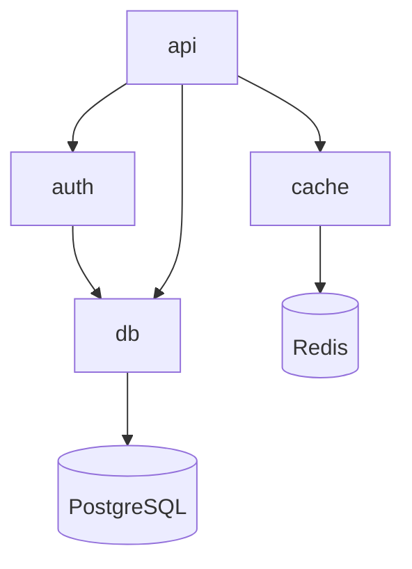
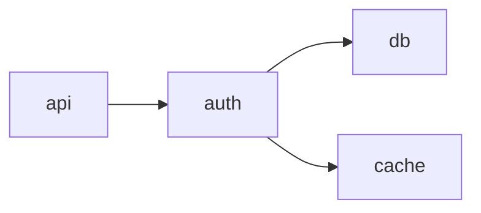
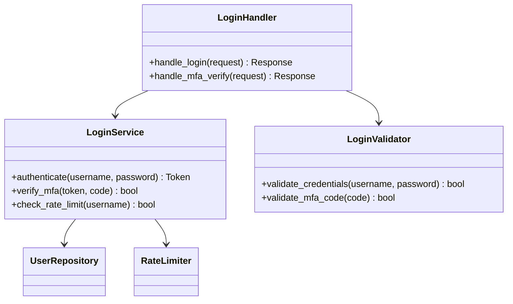
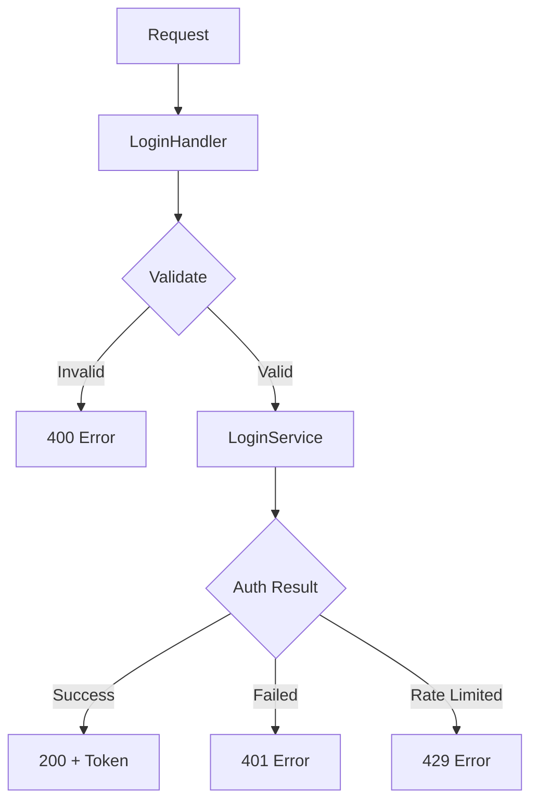

# Document Templates System Design

> **Design Date**: 2026-03-22
> **Status**: Draft
> **Depends On**: `results/04_progressive_doc_standards.md`

---

## Table of Contents

1. [Overview](#1-overview)
2. [Template Architecture](#2-template-architecture)
3. [Token Budget Strategy](#3-token-budget-strategy)
4. [Template Specifications](#4-template-specifications)
5. [doc-meta HTML Comment Format](#5-doc-meta-html-comment-format)
6. [doc-index.json Structure](#6-doc-indexjson-structure)
7. [Example Output Fragments](#7-example-output-fragments)
8. [Template Rendering Pipeline](#8-template-rendering-pipeline)

---

## 1. Overview

### 1.1 Design Goals

The template system implements **dynamic N-layer progressive disclosure** documentation:

- **Not fixed 3-layer**: Modules of different sizes get different documentation depths
- **Recursive structure**: `detail.md.j2` works for any depth level (2, 3, 4, 5...)
- **Token-efficient**: Progressive token budget allocation based on hierarchy depth
- **LLM-optimized**: Structured metadata and self-contained documentation

### 1.2 Key Differences from Fixed 3-Layer Approach

| Aspect | Fixed 3-Layer | Dynamic N-Layer |
|--------|---------------|-----------------|
| Depth | Always 3 levels | Variable (2-5+ based on module complexity) |
| Templates | 3 separate templates | 3 templates (detail.md.j2 is universal) |
| Navigation | Hardcoded parent/child | Recursive breadcrumb chain |
| Token Budget | Fixed per level | Progressive reduction or steady allocation |
| Sub-documents | Fixed children | Recursive sub-document links |

### 1.3 Template Inventory

| Template | Purpose | Level | Usage |
|----------|---------|-------|-------|
| `index.md.j2` | Project overview | 0 | Once per project |
| `overview.md.j2` | Module overview | 1 | Once per module |
| `detail.md.j2` | Component detail | 2+ | Universal for any depth |

---

## 2. Template Architecture

### 2.1 Hierarchy Model

```
Project Root/
+-- INDEX.md                           (Level 0: index.md.j2)
+-- docs/
    +-- auth/
    |   +-- OVERVIEW.md                (Level 1: overview.md.j2)
    |   +-- login/
    |   |   +-- DETAIL.md              (Level 2: detail.md.j2)
    |   |   +-- handlers/
    |   |   |   +-- DETAIL.md          (Level 3: detail.md.j2)
    |   |   |   +-- oauth/
    |   |   |   |   +-- DETAIL.md      (Level 4: detail.md.j2)
    |   +-- oauth/
    |       +-- DETAIL.md              (Level 2: detail.md.j2)
    +-- api/
        +-- OVERVIEW.md                (Level 1: overview.md.j2)
        +-- routes/
            +-- DETAIL.md              (Level 2: detail.md.j2)
```

### 2.2 Level Determination Logic

```python
def determine_documentation_depth(module: Module) -> int:
    """
    Determine the appropriate documentation depth for a module.

    Returns:
        int: Maximum depth level (0 = index, 1 = overview, 2+ = detail)
    """
    # Base rules
    if module.file_count > 50:
        return 4  # Large modules: 4 levels
    elif module.file_count > 20:
        return 3  # Medium modules: 3 levels
    elif module.file_count > 5:
        return 2  # Small modules: 2 levels
    else:
        return 1  # Tiny modules: only overview (no detail)
```

### 2.3 Recursive Detail Template Strategy

The `detail.md.j2` template is **universal** and works at any depth level (2+):

```
Level 2: module/subcomponent/DETAIL.md
         |
         +-- Links to Level 3 sub-documents
         +-- Breadcrumb: INDEX > OVERVIEW > DETAIL

Level 3: module/subcomponent/subsub/DETAIL.md
         |
         +-- Links to Level 4 sub-documents
         +-- Breadcrumb: INDEX > OVERVIEW > DETAIL > DETAIL

Level 4: module/subcomponent/subsub/deep/DETAIL.md
         |
         +-- No children (leaf node)
         +-- Breadcrumb: INDEX > OVERVIEW > DETAIL > DETAIL > DETAIL
```

---

## 3. Token Budget Strategy

### 3.1 Per-Level Token Budget Ranges

| Level | Template | Min Tokens | Max Tokens | Recommended | Strategy |
|-------|----------|------------|------------|-------------|----------|
| 0 | `index.md.j2` | 600 | 1,200 | 800-1,000 | Fixed budget |
| 1 | `overview.md.j2` | 1,000 | 2,000 | 1,200-1,500 | Module complexity scaled |
| 2 | `detail.md.j2` | 1,500 | 3,500 | 2,000-2,500 | Steady allocation |
| 3 | `detail.md.j2` | 1,200 | 2,500 | 1,500-2,000 | Progressive reduction |
| 4 | `detail.md.j2` | 800 | 2,000 | 1,000-1,500 | Progressive reduction |
| 5+ | `detail.md.j2` | 500 | 1,500 | 800-1,000 | Minimum viable |

### 3.2 Token Budget Calculation

```python
def calculate_token_budget(level: int, component_complexity: float) -> int:
    """
    Calculate token budget for a document at a given level.

    Args:
        level: Documentation level (0-5+)
        component_complexity: Normalized complexity score (0.0-1.0)

    Returns:
        Token budget for this document
    """
    BASE_BUDGETS = {
        0: 1000,   # Index
        1: 1500,   # Overview
        2: 2500,   # Detail L2
        3: 2000,   # Detail L3
        4: 1500,   # Detail L4
        5: 1000,   # Detail L5+
    }

    # Progressive reduction factor for deeper levels
    REDUCTION_FACTOR = 0.85 if level >= 3 else 1.0

    base = BASE_BUDGETS.get(level, BASE_BUDGETS[5])
    adjusted = base * REDUCTION_FACTOR

    # Scale by component complexity
    min_budget = int(adjusted * 0.8)
    max_budget = int(adjusted * 1.2)

    return int(min_budget + (max_budget - min_budget) * component_complexity)
```

### 3.3 Content Truncation Priority

When content exceeds token budget, apply truncation in this order:

1. **Always Keep**: Names, signatures, one-line descriptions
2. **High Priority**: Core classes, public interfaces, dependency graphs
3. **Medium Priority**: Method details, data flow descriptions
4. **Low Priority**: Internal helpers, detailed rationale, edge cases
5. **First to Cut**: Design decisions, extensive examples

```python
def truncate_content(content: DocumentContent, budget: int) -> DocumentContent:
    """
    Truncate document content to fit within token budget.
    """
    sections_by_priority = [
        ("identifiers", 1.0),      # 100% keep
        ("signatures", 1.0),       # 100% keep
        ("core_classes", 0.9),     # 90% keep
        ("public_interfaces", 0.9),
        ("dependency_graph", 0.85),
        ("methods", 0.7),
        ("data_flow", 0.6),
        ("internal_helpers", 0.3),
        ("design_decisions", 0.2),
        ("examples", 0.1),
    ]

    # Apply truncation logic...
    return truncated_content
```

---

## 4. Template Specifications

### 4.1 `index.md.j2` - Level 0 Project Overview

```jinja2
{# ========================================================================== #}
{# index.md.j2 - Level 0: Project Overview Template                            #}
{# ========================================================================== #}
{#
  Variable Reference:
  -------------------
  project:
    .name: str                    - Project name
    .description: str             - One-line description
    .version: str                 - Project version
    .repository_url: str | none   - Optional repository URL

  tech_stack: list[str]           - Technology stack items

  modules: list[Module]
    .id: str                      - Module identifier (slug)
    .name: str                    - Display name
    .description: str             - Brief description (max 80 chars)
    .file_count: int              - Number of files
    .complexity_score: float      - Normalized complexity (0.0-1.0)
    .doc_path: str                - Path to OVERVIEW.md

  entry_points: list[EntryPoint]
    .name: str                    - Entry point name (e.g., "main")
    .file: str                    - Source file path
    .line: int                    - Line number

  dependency_graph: str           - Mermaid graph definition

  metrics:
    .total_files: int
    .total_functions: int
    .total_classes: int
    .total_loc: int

  generation:
    .timestamp: str               - ISO 8601 timestamp
    .tool_version: str            - codebase-explorer version
    .model_used: str              - LLM model identifier

  computed:
    .token_count: int             - Approximate token count
    .coverage: float              - Documentation coverage ratio
#}
<!-- doc-meta
level: 0
target: {{ project.name | slugify }}
type: index
token_budget: {{ token_budget }}
generated_at: {{ generation.timestamp }}
version: 1.0
-->
# {{ project.name }}


> {{ project.description }}



**Repository**: [{{ project.repository_url }}]({{ project.repository_url }})


## Overview


### Technology Stack


- {{ tech }}


- _... and {{ tech_stack | length - 5 }} more_



### Architecture

```mermaid
{{ dependency_graph }}
```

## Modules

| Module | Description | Files | Complexity |
|--------|-------------|-------|------------|

| [**{{ module.name }}**]({{ module.doc_path }}) | {{ module.description | truncate(60) }} | {{ module.file_count }} | {{ module.complexity_score | format_complexity }} |


## Entry Points


- `{{ entry.name }}` — [`{{ entry.file }}:{{ entry.line }}`]({{ entry.file }}#L{{ entry.line }})


## Metrics

| Metric | Value |
|--------|-------|
| Files | {{ metrics.total_files }} |
| Functions | {{ metrics.total_functions }} |
| Classes | {{ metrics.total_classes }} |
| Lines of Code | {{ metrics.total_loc }} |

---

_Generated by {{ generation.tool_version }} using {{ generation.model_used }} on {{ generation.timestamp }}_
```

### 4.2 `overview.md.j2` - Level 1 Module Overview

```jinja2
{# ========================================================================== #}
{# overview.md.j2 - Level 1: Module Overview Template                          #}
{# ========================================================================== #}
{#
  Variable Reference:
  -------------------
  module:
    .id: str                      - Module identifier
    .name: str                    - Display name
    .description: str             - Module purpose description
    .parent_path: str             - Path to INDEX.md

  files: list[File]
    .path: str                    - Relative file path
    .description: str             - Brief file description
    .loc: int                     - Lines of code

  dependencies:
    .imports: list[Dep]           - Modules this module imports
    .imported_by: list[Dep]       - Modules that import this module
    Dep.name: str
    Dep.doc_path: str
    Dep.description: str

  public_interfaces: list[Interface]
    .name: str                    - Function/class name
    .signature: str               - Full signature
    .description: str             - Brief description
    .type: str                    - "function" | "class" | "constant"

  components: list[Component]
    .id: str                      - Component identifier
    .name: str                    - Display name
    .description: str             - Brief description
    .doc_path: str                - Path to DETAIL.md
    .depth: int                   - Documentation depth (2+)

  dependency_graph: str           - Mermaid dependency diagram

  metrics:
    .file_count: int
    .function_count: int
    .class_count: int
    .avg_complexity: float

  generation:
    .timestamp: str
    .tool_version: str

  computed:
    .token_budget: int
    .coverage: float
#}
<!-- doc-meta
level: 1
target: {{ module.id }}
type: overview
token_budget: {{ token_budget }}
generated_at: {{ generation.timestamp }}
parent: {{ module.parent_path }}
children:

  - {{ comp.doc_path }}

-->
# {{ module.name }}

> {{ module.description }}

## Navigation

| Level | Document |
|-------|----------|
| Up | [Project Overview]({{ module.parent_path }}) |

| Down | [{{ comp.name }}]({{ comp.doc_path }}) |


| | _... and {{ components | length - 5 }} more components_ |


## Dependencies

```mermaid
{{ dependency_graph }}
```

### Imports


| Module | Purpose |
|--------|---------|

| [{{ dep.name }}]({{ dep.doc_path }}) | {{ dep.description | truncate(50) }} |


_None_


### Imported By


| Module | Usage |
|--------|-------|

| [{{ dep.name }}]({{ dep.doc_path }}) | {{ dep.description | truncate(50) }} |


_None (leaf module)_


## Public Interfaces



- `class const {{ iface.signature }}` — {{ iface.description }}


_No public interfaces detected_


## Components


| Component | Description | Documentation |
|-----------|-------------|---------------|

| **{{ comp.name }}** | {{ comp.description | truncate(50) }} | [Detail (L{{ comp.depth }})]({{ comp.doc_path }}) |


_No sub-components (leaf module)_


## Files


- `{{ file.path }}` — {{ file.description }}


- _... and {{ files | length - 15 }} more files_


## Metrics

| Metric | Value |
|--------|-------|
| Files | {{ metrics.file_count }} |
| Functions | {{ metrics.function_count }} |
| Classes | {{ metrics.class_count }} |
| Avg Complexity | {{ metrics.avg_complexity | round(1) }} |

---

_Generated by {{ generation.tool_version }} on {{ generation.timestamp }}_
```

### 4.3 `detail.md.j2` - Universal Detail Template (Level 2+)

```jinja2
{# ========================================================================== #}
{# detail.md.j2 - Universal Detail Template (Level 2+)                        #}
{# ========================================================================== #}
{#
  This template is RECURSIVE and works at any depth level (2, 3, 4, 5...).

  Variable Reference:
  -------------------
  document:
    .level: int                   - Current documentation level (2+)
    .type: str                    - "detail"
    .target_id: str               - Component identifier
    .target_name: str             - Display name
    .description: str             - Component purpose

  breadcrumbs: list[Breadcrumb]
    .level: int                   - Documentation level
    .name: str                    - Display name
    .path: str                    - Path to document

  parent:
    .name: str                    - Parent component name
    .path: str                    - Path to parent document

  children: list[Child] | none    - Sub-components (recursive)
    .id: str
    .name: str
    .description: str
    .path: str                    - Path to child DETAIL.md
    .has_children: bool           - Whether child has further sub-documents

  classes: list[ClassInfo]
    .name: str
    .description: str
    .base_classes: list[str]
    .methods: list[MethodInfo]
      .name: str
      .signature: str
      .description: str
      .visibility: str            - "public" | "private" | "protected"

  functions: list[FuncInfo]
    .name: str
    .signature: str
    .description: str
    .called_by: list[str]
    .calls: list[str]

  structure_graph: str            - Mermaid internal structure diagram
  data_flow_graph: str | none     - Mermaid data flow (optional at deep levels)

  design_decisions: list[Decision] | none
    .title: str
    .description: str
    .rationale: str

  source_files: list[str]         - Source file paths covered

  generation:
    .timestamp: str
    .tool_version: str

  computed:
    .token_budget: int
    .coverage: float
#}
<!-- doc-meta
level: {{ document.level }}
target: {{ document.target_id }}
type: detail
token_budget: {{ token_budget }}
generated_at: {{ generation.timestamp }}
parent: {{ parent.path }}

children:

  - {{ child.path }}


-->
# {{ document.target_name }}

> {{ document.description }}

## Breadcrumb Navigation

```


{{ crumb.name }} (current)

{{ crumb.name }} →


```

| Level | Document |
|-------|----------|

| {{ crumb.level }} | [{{ crumb.name }}]({{ crumb.path }}) *(current)* |


## Internal Structure

```mermaid
{{ structure_graph }}
```


## Classes


### {{ cls.name }}

{{ cls.description }}


**Inheritance**: `{{ base }} → `


| Method | Signature | Description |
|--------|-----------|-------------|


| `{{ method.name }}` | `{{ method.signature }}` | {{ method.description | truncate(40) }} |




<details>
<summary>Private/Protected Methods</summary>

| Method | Signature |
|--------|-----------|


| `{{ method.name }}` | `{{ method.signature }}` |


</details>






## Functions

| Function | Signature | Description |
|----------|-----------|-------------|

| `{{ func.name }}` | `{{ func.signature }}` | {{ func.description | truncate(50) }} |


### Call Relationships



**`{{ func.name }}`**:

- Called by: `{{ caller }}, `


- Calls: `{{ callee }}, `






## Data Flow

```mermaid
{{ data_flow_graph }}
```



## Sub-Components

This component contains {{ children | length }} sub-component(s):

| Component | Description | Detail |
|-----------|-------------|--------|

| **{{ child.name }}** | {{ child.description | truncate(50) }} | [L{{ document.level + 1 }} Detail]({{ child.path }}) |





## Design Decisions


### {{ decision.title }}

{{ decision.description }}

**Rationale**: {{ decision.rationale }}




## Source Files


- `{{ file }}`


---

_Generated by {{ generation.tool_version }} on {{ generation.timestamp }} | Level {{ document.level }}_
```

---

## 5. doc-meta HTML Comment Format

### 5.1 Specification

Every generated document MUST include a `doc-meta` HTML comment at the top of the file:

```html
<!-- doc-meta
level: <integer>
target: <string>
type: <"index" | "overview" | "detail">
token_budget: <integer>
generated_at: <ISO8601 datetime>
parent: <relative_path | null>
children: <list of relative_paths | null>
version: <string>
-->
```

### 5.2 Field Definitions

| Field | Type | Required | Description |
|-------|------|----------|-------------|
| `level` | integer | Yes | Documentation level (0, 1, 2, 3, 4, 5+) |
| `target` | string | Yes | Unique identifier for the documented entity |
| `type` | enum | Yes | Document type: index, overview, or detail |
| `token_budget` | integer | Yes | Target token budget for this document |
| `generated_at` | ISO8601 | Yes | Generation timestamp in UTC |
| `parent` | string | No* | Relative path to parent document |
| `children` | list | No | List of relative paths to child documents |
| `version` | string | No | Document format version (default: "1.0") |

*Required for all documents except INDEX.md (level 0)

### 5.3 Extended Metadata (Optional)

```html
<!-- doc-meta
level: 2
target: auth.login.handlers
type: detail
token_budget: 2000
generated_at: 2026-03-22T10:30:00Z
parent: ../OVERVIEW.md
children:
  - oauth/DETAIL.md
  - jwt/DETAIL.md
version: 1.0

# Extended metadata
coverage: 0.85
source_hash: sha256:abc123...
metrics:
  file_count: 12
  function_count: 24
  class_count: 3
-->
```

### 5.4 Parsing Example

```python
import re
from typing import Optional
from pydantic import BaseModel
from datetime import datetime

class DocMeta(BaseModel):
    level: int
    target: str
    type: str  # "index" | "overview" | "detail"
    token_budget: int
    generated_at: datetime
    parent: Optional[str] = None
    children: Optional[list[str]] = None
    version: str = "1.0"

    class Config:
        extra = "allow"  # Allow extended metadata

def parse_doc_meta(content: str) -> Optional[DocMeta]:
    """Parse doc-meta HTML comment from document content."""
    pattern = r'<!--\s*doc-meta\s*\n(.*?)\n-->'
    match = re.search(pattern, content, re.DOTALL)

    if not match:
        return None

    import yaml
    meta_yaml = match.group(1)
    meta_dict = yaml.safe_load(meta_yaml)

    return DocMeta(**meta_dict)
```

---

## 6. doc-index.json Structure

### 6.1 Schema Definition

```json
{
  "$schema": "http://json-schema.org/draft-07/schema#",
  "title": "doc-index",
  "type": "object",
  "required": ["version", "project_name", "generated_at", "max_depth", "docs"],
  "properties": {
    "version": {
      "type": "string",
      "pattern": "^\\d+\\.\\d+$",
      "description": "Index format version"
    },
    "project_name": {
      "type": "string",
      "description": "Project identifier"
    },
    "generated_at": {
      "type": "string",
      "format": "date-time",
      "description": "Generation timestamp (ISO 8601)"
    },
    "max_depth": {
      "type": "integer",
      "minimum": 0,
      "description": "Maximum documentation depth in the project"
    },
    "total_tokens": {
      "type": "integer",
      "description": "Total token count across all documents"
    },
    "total_coverage": {
      "type": "number",
      "minimum": 0,
      "maximum": 1,
      "description": "Overall documentation coverage ratio"
    },
    "docs": {
      "type": "array",
      "items": {
        "$ref": "#/definitions/DocumentEntry"
      }
    }
  },
  "definitions": {
    "DocumentEntry": {
      "type": "object",
      "required": ["level", "target", "path", "type"],
      "properties": {
        "level": { "type": "integer" },
        "target": { "type": "string" },
        "path": { "type": "string" },
        "type": { "enum": ["index", "overview", "detail"] },
        "token_count": { "type": "integer" },
        "token_budget": { "type": "integer" },
        "coverage": { "type": "number" },
        "parent": { "type": "string" },
        "children": {
          "type": "array",
          "items": { "type": "string" }
        },
        "source_files": {
          "type": "array",
          "items": { "type": "string" }
        }
      }
    }
  }
}
```

### 6.2 Example doc-index.json

```json
{
  "version": "1.0",
  "project_name": "codebase-explorer",
  "generated_at": "2026-03-22T10:30:00Z",
  "max_depth": 4,
  "total_tokens": 15680,
  "total_coverage": 0.87,
  "docs": [
    {
      "level": 0,
      "target": "codebase-explorer",
      "path": "INDEX.md",
      "type": "index",
      "token_count": 920,
      "token_budget": 1000,
      "coverage": 1.0,
      "children": [
        "docs/core/OVERVIEW.md",
        "docs/analysis/OVERVIEW.md",
        "docs/generation/OVERVIEW.md"
      ]
    },
    {
      "level": 1,
      "target": "core",
      "path": "docs/core/OVERVIEW.md",
      "type": "overview",
      "token_count": 1450,
      "token_budget": 1500,
      "coverage": 0.92,
      "parent": "INDEX.md",
      "children": [
        "docs/core/graph/DETAIL.md",
        "docs/core/parser/DETAIL.md"
      ],
      "source_files": [
        "src/core/__init__.py",
        "src/core/graph.py",
        "src/core/parser.py"
      ]
    },
    {
      "level": 2,
      "target": "core.graph",
      "path": "docs/core/graph/DETAIL.md",
      "type": "detail",
      "token_count": 2100,
      "token_budget": 2500,
      "coverage": 0.88,
      "parent": "docs/core/OVERVIEW.md",
      "children": [
        "docs/core/graph/builders/DETAIL.md",
        "docs/core/graph/visitors/DETAIL.md"
      ],
      "source_files": [
        "src/core/graph/__init__.py",
        "src/core/graph/builder.py",
        "src/core/graph/visitor.py"
      ]
    },
    {
      "level": 3,
      "target": "core.graph.builders",
      "path": "docs/core/graph/builders/DETAIL.md",
      "type": "detail",
      "token_count": 1650,
      "token_budget": 2000,
      "coverage": 0.85,
      "parent": "docs/core/graph/DETAIL.md",
      "children": [],
      "source_files": [
        "src/core/graph/builders/__init__.py",
        "src/core/graph/builders/module_builder.py",
        "src/core/graph/builders/call_graph_builder.py"
      ]
    }
  ]
}
```

### 6.3 Index Operations

```python
from pathlib import Path
from typing import Optional
import json

class DocIndex:
    """Manager for doc-index.json operations."""

    def __init__(self, index_path: Path):
        self.index_path = index_path
        self._data: dict = {}

    def load(self) -> None:
        """Load index from file."""
        with open(self.index_path) as f:
            self._data = json.load(f)

    def save(self) -> None:
        """Save index to file."""
        with open(self.index_path, 'w') as f:
            json.dump(self._data, f, indent=2)

    def get_document(self, target: str) -> Optional[dict]:
        """Get document entry by target identifier."""
        for doc in self._data.get("docs", []):
            if doc["target"] == target:
                return doc
        return None

    def get_children(self, target: str) -> list[dict]:
        """Get all direct children of a document."""
        doc = self.get_document(target)
        if not doc or "children" not in doc:
            return []

        children = []
        for child_path in doc["children"]:
            child = self.get_document_by_path(child_path)
            if child:
                children.append(child)
        return children

    def get_document_by_path(self, path: str) -> Optional[dict]:
        """Get document entry by path."""
        for doc in self._data.get("docs", []):
            if doc["path"] == path:
                return doc
        return None

    def get_breadcrumbs(self, target: str) -> list[dict]:
        """Get breadcrumb trail from root to target."""
        breadcrumbs = []
        doc = self.get_document(target)

        while doc:
            breadcrumbs.insert(0, doc)
            if "parent" in doc:
                doc = self.get_document_by_path(doc["parent"])
            else:
                doc = None

        return breadcrumbs

    def get_all_at_level(self, level: int) -> list[dict]:
        """Get all documents at a specific level."""
        return [
            doc for doc in self._data.get("docs", [])
            if doc["level"] == level
        ]
```

---

## 7. Example Output Fragments

### 7.1 Level 0: INDEX.md Example

```markdown
<!-- doc-meta
level: 0
target: my-web-app
type: index
token_budget: 1000
generated_at: 2026-03-22T10:30:00Z
children:
  - docs/auth/OVERVIEW.md
  - docs/api/OVERVIEW.md
  - docs/db/OVERVIEW.md
version: 1.0
-->
# My Web App

> A modern REST API server with authentication and data persistence.

**Repository**: [https://github.com/example/my-web-app](https://github.com/example/my-web-app)

## Overview

### Technology Stack

- Python 3.11
- FastAPI 0.104
- PostgreSQL 15
- Redis 7.2
- SQLAlchemy 2.0

### Architecture



## Modules

| Module | Description | Files | Complexity |
|--------|-------------|-------|------------|
| [**auth**](docs/auth/OVERVIEW.md) | User authentication and authorization | 12 | High |
| [**api**](docs/api/OVERVIEW.md) | REST API endpoints and routing | 18 | Medium |
| [**db**](docs/db/OVERVIEW.md) | Database models and migrations | 8 | Low |

## Entry Points

- `main` — [`src/main.py:15`](src/main.py#L15)
- `cli` — [`src/cli.py:1`](src/cli.py#L1)

## Metrics

| Metric | Value |
|--------|-------|
| Files | 38 |
| Functions | 124 |
| Classes | 22 |
| Lines of Code | 4,521 |

---

_Generated by codebase-explorer v0.1.0 using claude-sonnet-4 on 2026-03-22T10:30:00Z_
```

### 7.2 Level 1: OVERVIEW.md Example

```markdown
<!-- doc-meta
level: 1
target: auth
type: overview
token_budget: 1500
generated_at: 2026-03-22T10:30:00Z
parent: INDEX.md
children:
  - docs/auth/login/DETAIL.md
  - docs/auth/oauth/DETAIL.md
  - docs/auth/middleware/DETAIL.md
version: 1.0
-->
# Auth Module

> Handles user authentication, authorization, and session management.

## Navigation

| Level | Document |
|-------|----------|
| Up | [Project Overview](../INDEX.md) |
| Down | [Login](login/DETAIL.md) |
| Down | [OAuth](oauth/DETAIL.md) |
| Down | [Middleware](middleware/DETAIL.md) |

## Dependencies



### Imports

| Module | Purpose |
|--------|---------|
| [db](../db/OVERVIEW.md) | User data persistence |
| [cache](../cache/OVERVIEW.md) | Session token caching |

### Imported By

| Module | Usage |
|--------|-------|
| [api](../api/OVERVIEW.md) | Request authentication |

## Public Interfaces

- `function login(username: str, password: str) -> Token` — Authenticate user and return token
- `function logout(token: str) -> None` — Invalidate user session
- `function validate_token(token: str) -> User` — Validate and decode JWT token
- `class AuthMiddleware` — FastAPI middleware for request authentication
- `const TOKEN_EXPIRY: int` — Default token expiration time in seconds

## Components

| Component | Description | Documentation |
|-----------|-------------|---------------|
| **Login** | Username/password authentication flow | [Detail (L2)](login/DETAIL.md) |
| **OAuth** | Third-party OAuth2 integration | [Detail (L2)](oauth/DETAIL.md) |
| **Middleware** | Request authentication middleware | [Detail (L2)](middleware/DETAIL.md) |

## Files

- `src/auth/__init__.py` — Module exports
- `src/auth/login.py` — Login logic
- `src/auth/oauth.py` — OAuth providers
- `src/auth/middleware.py` — Auth middleware
- `src/auth/token.py` — JWT token utilities
- `src/auth/models.py` — Auth-related models
- _... and 6 more files_

## Metrics

| Metric | Value |
|--------|-------|
| Files | 12 |
| Functions | 28 |
| Classes | 4 |
| Avg Complexity | 3.2 |

---

_Generated by codebase-explorer v0.1.0 on 2026-03-22T10:30:00Z_
```

### 7.3 Level 2: DETAIL.md Example

```markdown
<!-- doc-meta
level: 2
target: auth.login
type: detail
token_budget: 2500
generated_at: 2026-03-22T10:30:00Z
parent: docs/auth/OVERVIEW.md
children:
  - docs/auth/login/handlers/DETAIL.md
  - docs/auth/login/validators/DETAIL.md
version: 1.0
-->
# Login Component

> Handles username/password authentication with rate limiting and MFA support.

## Breadcrumb Navigation

```
My Web App → Auth → Login (current)
```

| Level | Document |
|-------|----------|
| 0 | [My Web App](../../INDEX.md) |
| 1 | [Auth](../OVERVIEW.md) |
| 2 | [Login](./DETAIL.md) *(current)* |

## Internal Structure



## Classes

### LoginService

Core authentication service handling credential verification and MFA.

| Method | Signature | Description |
|--------|-----------|-------------|
| `authenticate` | `authenticate(username: str, password: str) -> Token` | Verify credentials and issue token |
| `verify_mfa` | `verify_mfa(token: str, code: str) -> bool` | Validate MFA code |
| `check_rate_limit` | `check_rate_limit(username: str) -> bool` | Check if login attempts exceeded |

<details>
<summary>Private/Protected Methods</summary>

| Method | Signature |
|--------|-----------|
| `_hash_password` | `_hash_password(password: str) -> str` |
| `_generate_token` | `_generate_token(user: User) -> Token` |
</details>

### LoginHandler

FastAPI route handlers for login endpoints.

| Method | Signature | Description |
|--------|-----------|-------------|
| `handle_login` | `handle_login(request: LoginRequest) -> Response` | POST /auth/login |
| `handle_mfa_verify` | `handle_mfa_verify(request: MFARequest) -> Response` | POST /auth/mfa/verify |

## Functions

| Function | Signature | Description |
|----------|-----------|-------------|
| `create_login_service` | `create_login_service(config: Config) -> LoginService` | Factory function for LoginService |
| `get_rate_limiter` | `get_rate_limiter(redis: Redis) -> RateLimiter` | Get rate limiter instance |

### Call Relationships

**`create_login_service`**:
- Called by: `main.setup_services`
- Calls: `UserRepository`, `RateLimiter`

## Sub-Components

This component contains 2 sub-component(s):

| Component | Description | Detail |
|-----------|-------------|--------|
| **Handlers** | HTTP request/response handling | [L3 Detail](handlers/DETAIL.md) |
| **Validators** | Input validation logic | [L3 Detail](validators/DETAIL.md) |

## Design Decisions

### Rate Limiting Strategy

Implemented token bucket algorithm with Redis backend for distributed rate limiting.

**Rationale**: Token bucket allows burst handling while preventing sustained abuse. Redis enables rate limit sharing across multiple API instances.

### MFA Integration

TOTP-based MFA with backup codes stored in database.

**Rationale**: TOTP is widely supported by authenticator apps. Backup codes provide recovery path.

## Source Files

- `src/auth/login/__init__.py`
- `src/auth/login/service.py`
- `src/auth/login/handler.py`
- `src/auth/login/validator.py`
- `src/auth/login/rate_limiter.py`

---

_Generated by codebase-explorer v0.1.0 on 2026-03-22T10:30:00Z | Level 2_
```

### 7.4 Level 3: DETAIL.md Example (Deeper Level)

```markdown
<!-- doc-meta
level: 3
target: auth.login.handlers
type: detail
token_budget: 2000
generated_at: 2026-03-22T10:30:00Z
parent: docs/auth/login/DETAIL.md
children: []
version: 1.0
-->
# Login Handlers

> HTTP request handlers for login and MFA verification endpoints.

## Breadcrumb Navigation

```
My Web App → Auth → Login → Handlers (current)
```

| Level | Document |
|-------|----------|
| 0 | [My Web App](../../../INDEX.md) |
| 1 | [Auth](../../OVERVIEW.md) |
| 2 | [Login](../DETAIL.md) |
| 3 | [Handlers](./DETAIL.md) *(current)* |

## Internal Structure



## Classes

### LoginHandler

| Method | Signature | Description |
|--------|-----------|-------------|
| `handle_login` | `async handle_login(request: LoginRequest) -> JSONResponse` | Process login request |
| `handle_mfa_verify` | `async handle_mfa_verify(request: MFARequest) -> JSONResponse` | Verify MFA code |

### MFAHandler

| Method | Signature | Description |
|--------|-----------|-------------|
| `handle_setup` | `async handle_setup(user: User) -> MFASetupResponse` | Initialize MFA for user |
| `handle_verify` | `async handle_verify(request: MFAVerifyRequest) -> JSONResponse` | Verify and enable MFA |

## Source Files

- `src/auth/login/handlers/__init__.py`
- `src/auth/login/handlers/login_handler.py`
- `src/auth/login/handlers/mfa_handler.py`

---

_Generated by codebase-explorer v0.1.0 on 2026-03-22T10:30:00Z | Level 3_
```

---

## 8. Template Rendering Pipeline

### 8.1 Rendering Flow

```
┌─────────────────────────────────────────────────────────────────┐
│                    Template Rendering Pipeline                   │
├─────────────────────────────────────────────────────────────────┤
│                                                                  │
│  1. Load Data                                                    │
│     ┌──────────┐     ┌──────────┐     ┌──────────┐              │
│     │ Graph    │     │ Module   │     │ Source   │              │
│     │ Analysis │────▶│ Grouping │────▶│ Parsing  │              │
│     └──────────┘     └──────────┘     └──────────┘              │
│           │                                    │                 │
│           v                                    v                 │
│     ┌──────────────────────────────────────────────┐            │
│     │              Document Context                 │            │
│     │  - module info                                │            │
│     │  - dependency graph                           │            │
│     │  - class/function metadata                    │            │
│     │  - token budget                               │            │
│     └──────────────────────────────────────────────┘            │
│                          │                                       │
│  2. Select Template     │                                       │
│                          v                                       │
│     ┌──────────────────────────────────────────────┐            │
│     │  level == 0  ──▶  index.md.j2                │            │
│     │  level == 1  ──▶  overview.md.j2             │            │
│     │  level >= 2  ──▶  detail.md.j2               │            │
│     └──────────────────────────────────────────────┘            │
│                          │                                       │
│  3. Render              v                                       │
│     ┌──────────────────────────────────────────────┐            │
│     │           Jinja2 Template Engine              │            │
│     │  - Variable substitution                      │            │
│     │  - Conditional rendering                      │            │
│     │  - Loop iteration                             │            │
│     │  - Custom filters                             │            │
│     └──────────────────────────────────────────────┘            │
│                          │                                       │
│  4. Post-Process       v                                       │
│     ┌──────────────────────────────────────────────┐            │
│     │  - Token counting                             │            │
│     │  - Content truncation (if over budget)        │            │
│     │  - Link validation                            │            │
│     │  - Mermaid syntax validation                  │            │
│     └──────────────────────────────────────────────┘            │
│                          │                                       │
│  5. Output             v                                       │
│     ┌──────────────────────────────────────────────┐            │
│     │  - Write .md file                             │            │
│     │  - Update doc-index.json                      │            │
│     │  - Generate llms.txt                          │            │
│     └──────────────────────────────────────────────┘            │
│                                                                  │
└─────────────────────────────────────────────────────────────────┘
```

### 8.2 Custom Jinja2 Filters

```python
from jinja2 import Environment, FileSystemLoader

def truncate(text: str, max_length: int = 50) -> str:
    """Truncate text to max_length with ellipsis."""
    if len(text) <= max_length:
        return text
    return text[:max_length - 3] + "..."

def slugify(text: str) -> str:
    """Convert text to URL-safe slug."""
    import re
    text = text.lower().strip()
    text = re.sub(r'[^\w\s-]', '', text)
    text = re.sub(r'[\s_-]+', '-', text)
    return text

def format_complexity(score: float) -> str:
    """Format complexity score as human-readable label."""
    if score >= 0.8:
        return "High"
    elif score >= 0.5:
        return "Medium"
    else:
        return "Low"

def setup_jinja_env(template_dir: str) -> Environment:
    """Configure Jinja2 environment with custom filters."""
    env = Environment(
        loader=FileSystemLoader(template_dir),
        trim_blocks=True,
        lstrip_blocks=True,
    )

    env.filters['truncate'] = truncate
    env.filters['slugify'] = slugify
    env.filters['format_complexity'] = format_complexity

    return env
```

### 8.3 Recursive Document Generation

```python
from dataclasses import dataclass
from typing import Optional
from pathlib import Path

@dataclass
class DocumentContext:
    """Context for document generation."""
    level: int
    target_id: str
    target_name: str
    token_budget: int
    parent_path: Optional[str] = None
    children: Optional[list['DocumentContext']] = None

def generate_document_tree(
    root_context: DocumentContext,
    output_dir: Path,
    jinja_env: Environment,
    max_depth: int = 5
) -> list[str]:
    """
    Recursively generate documentation tree.

    Returns list of generated file paths.
    """
    generated_files = []

    def generate_recursive(context: DocumentContext, depth: int):
        if depth > max_depth:
            return

        # Select template based on level
        if context.level == 0:
            template = jinja_env.get_template("index.md.j2")
        elif context.level == 1:
            template = jinja_env.get_template("overview.md.j2")
        else:
            template = jinja_env.get_template("detail.md.j2")

        # Build template variables
        variables = build_template_variables(context)

        # Render document
        content = template.render(**variables)

        # Apply token budget truncation
        content = apply_token_budget(content, context.token_budget)

        # Write file
        output_path = output_dir / get_document_path(context)
        output_path.parent.mkdir(parents=True, exist_ok=True)
        output_path.write_text(content)

        generated_files.append(str(output_path))

        # Recursively generate children
        if context.children:
            for child in context.children:
                generate_recursive(child, depth + 1)

    generate_recursive(root_context, 0)
    return generated_files

def build_template_variables(context: DocumentContext) -> dict:
    """Build template variables from document context."""
    # Implementation depends on data sources
    return {
        "document": {
            "level": context.level,
            "target_id": context.target_id,
            "target_name": context.target_name,
            "description": "...",
        },
        "breadcrumbs": build_breadcrumbs(context),
        "parent": {
            "name": "...",
            "path": context.parent_path,
        } if context.parent_path else None,
        "children": context.children,
        "token_budget": context.token_budget,
        "generation": {
            "timestamp": datetime.utcnow().isoformat() + "Z",
            "tool_version": "codebase-explorer v0.1.0",
        },
        # ... more variables
    }

def build_breadcrumbs(context: DocumentContext) -> list[dict]:
    """Build breadcrumb navigation from context hierarchy."""
    # Walk up parent chain to build breadcrumbs
    breadcrumbs = []
    current = context
    while current:
        breadcrumbs.insert(0, {
            "level": current.level,
            "name": current.target_name,
            "path": get_document_path(current),
        })
        current = current.parent  # Assuming parent reference exists
    return breadcrumbs
```

---

## Appendix A: Template File Locations

```
codebase-explorer/
+-- src/
    +-- templates/
        +-- index.md.j2
        +-- overview.md.j2
        +-- detail.md.j2
        +-- partials/
            +-- breadcrumb.md.j2
            +-- class_table.md.j2
            +-- function_table.md.j2
            +-- mermaid_graph.md.j2
            +-- nav_table.md.j2
```

## Appendix B: Token Budget Configuration

```yaml
# doc-config.yaml
token_budgets:
  index:
    min: 600
    max: 1200
    default: 1000

  overview:
    min: 1000
    max: 2000
    default: 1500
    complexity_scaling: true

  detail:
    level_2:
      min: 1500
      max: 3500
      default: 2500
    level_3:
      min: 1200
      max: 2500
      default: 2000
    level_4:
      min: 800
      max: 2000
      default: 1500
    level_5_plus:
      min: 500
      max: 1500
      default: 1000

truncation:
  priority_order:
    - identifiers
    - signatures
    - core_classes
    - public_interfaces
    - dependency_graph
    - methods
    - data_flow
    - internal_helpers
    - design_decisions
    - examples

  fold_threshold: 15  # Number of items before folding
```

## Appendix C: Validation Checklist

Before finalizing a document, validate:

- [ ] doc-meta comment present and valid
- [ ] Token count within budget
- [ ] All internal links valid
- [ ] Mermaid syntax correct
- [ ] Breadcrumb navigation complete
- [ ] Parent/child relationships consistent
- [ ] Coverage metric calculated
- [ ] Source files listed correctly
