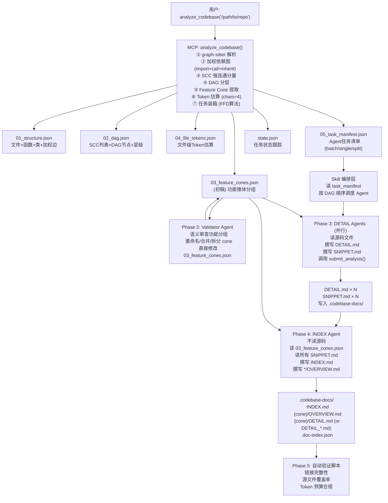

# codebase-explorer 最终优化方案（渐进式披露）

> 本文档由跨文档一致性分析产出，整合 02a_code_analysis_v2.md、02b_skill_design_v2.md、
> 02c_responsibility_v2.md 三个 V2 设计文档的所有决策，给出权威的最终规范。
>
> **状态**: 最终规范，禁止修改源文件，仅供实施参考。
> **生成时间**: 2026-03-23

---

## 1. 跨文档一致性检查结果

### 1.1 一致性检查（7 项）

---

#### Check 1: MCP 工具数量

**检查内容**: 02a 称"6 个工具"，02c 称"6 个新工具 + submit_analysis = 7 个工具"。

**02a 中的工具清单**: 02a 没有直接列出工具清单，其 Section 2/3/4/5 聚焦于算法设计和 JSON schema，并未枚举工具名称。工具命名全部来自 02c。

**02c 中的工具清单（Section 2 + Section 3 迁移表）**:

| 工具名 | 类型 |
|--------|------|
| `analyze_codebase` | 写入型（全流水线入口）|
| `get_structure` | 查询型 |
| `get_feature_cones` | 查询型 |
| `get_dependency_graph` | 查询型（增强版）|
| `get_progress` | 查询型 |
| `get_file_tokens` | 查询型 |
| `submit_analysis` | 回调型（简化版）|

**02c Section 1** 明确写道"精简为 7 个工具（6 个查询工具 + 1 个完成回调）"。这里的"6 个查询工具"包括了 `analyze_codebase`（虽然它是写入型，但 02c 将其归类为"分析工具"而非"回调工具"）。

**裁决**: **MINOR DISCREPANCY**。02c 的"6 个新工具 + submit_analysis = 7"的表述与摘要表格的实际枚举一致——共 7 个工具。02a 未枚举工具，不构成矛盾。**最终工具数为 7 个**，如 02c Section 2 所详细定义。

---

#### Check 2: JSON 输出文件数量

**检查内容**: 02a 定义了 5 个 JSON 文件（`01_structure` 至 `05_task_manifest`），02c 是否引用相同的 5 个文件？

**02a 中的文件**（Section 4）:
1. `01_structure.json`
2. `02_dag.json`
3. `03_feature_cones.json`
4. `04_file_tokens.json`
5. `05_task_manifest.json`

**02b 中的文件**（Phase 1 产出）:
1. `01_structure.json`
2. `02_dependency_graph.json`（注意：02b 命名为 `02_dependency_graph.json`）
3. `03_feature_cones.json`
4. `04_doc_plan.json`（注意：02b 命名为 `04_doc_plan.json`，非 `04_file_tokens.json`）
5. `05_task_manifest.json`

**02c 中的文件**（Section 2, Tool 1 返回值）:
```json
"files": {
    "01_structure":     str,
    "02_dag":           str,
    "03_feature_cones": str,
    "04_file_tokens":   str,
    "05_task_manifest": str
}
```

**差异识别**:

| 位置 | 文件 2 | 文件 4 |
|------|--------|--------|
| 02a | `02_dag.json` | `04_file_tokens.json` |
| 02b | `02_dependency_graph.json` | `04_doc_plan.json` |
| 02c | `02_dag.json` | `04_file_tokens.json` |

**裁决**: **MINOR DISCREPANCY**（位于 02b）。02b 使用了不同的命名：`02_dependency_graph.json` 和 `04_doc_plan.json`。02a 和 02c 命名一致。02b 是 Skill 设计文档，非架构分析文档，使用了语义性更强的临时命名，但其内容语义与 02a/02c 一致（`02_dag.json` 包含 DAG + Mermaid 图；`04_file_tokens.json` 包含每文件 token 估算，等同于 02b 的"doc_plan"中的 token 信息）。

**权威命名（以 02a 和 02c 为准）**:

1. `01_structure.json`
2. `02_dag.json`
3. `03_feature_cones.json`
4. `04_file_tokens.json`
5. `05_task_manifest.json`

---

#### Check 3: Feature Cone（功能锥体）定义

**检查内容**: 02a 定义了基于 SCC + DAG + BFS 的提取算法，02b 和 02c 是否使用相同含义？

**02a 定义**（Section 3.4）: Feature Cone = 从 DAG 中 in-degree 为 0 的入口节点出发，BFS 追踪其所有依赖，形成一条"从入口到底层实现"的完整依赖链。被超过 `shared_threshold=2` 个 cone 共享的节点归入基础设施。

**02b 使用**（Phase 1 调用链）: `extract_feature_cones(dag, snapshot)` 与 02a 一致；Phase 2 Validator Agent 读取并审查 `03_feature_cones.json`；DETAIL Agent 的 prompt 中用 `cone_name`、`dag_layer`、`files_in_cone` 注入上下文——这些字段都来自 02a 定义的 Feature Cone schema。

**02c 使用**（Section 1 摘要、Tool 3 `get_feature_cones`）: 定义"一个 Feature Cone 代表一个由 DAG 依赖关系决定的功能单元：包含从入口文件到底层实现的完整依赖链"——与 02a 完全一致。

**裁决**: **CONSISTENT**。三个文档对 Feature Cone 的定义、算法来源和使用方式完全一致。

---

#### Check 4: DETAIL Agent 的数据来源

**检查内容**: 02b 说 DETAIL Agent 接收注入上下文，02a 定义 `05_task_manifest.json` 包含任务分配。Agent 究竟通过 MCP 工具调用还是直接读 JSON 文件获取任务数据？

**02b 的描述**（Section 4, DETAIL Agent Prompt 模板中的注入变量）: Prompt 中使用 `{{task_id}}`、`{{files_in_cone}}`、`{{dependency_snippets}}` 等注入变量，说明这些数据在 Skill 编排层构建 Prompt 时注入，Agent 不需要自己调用 MCP 工具来查询任务信息。

**02a 的描述**（Section 4.5）: `05_task_manifest.json` 中的每个 task 包含 `files`、`infrastructure_context`、`output_files` 等字段，这些字段是 Skill 编排层读取后注入 Agent Prompt 的数据来源。

**02c 的描述**（Section 1, Skill 职责）: "Skill 读取 `05_task_manifest.json` 决定 Agent 调度顺序"；工具 `get_progress` 的描述也说明 Skill 直接读 JSON 文件判断任务状态。

**裁决**: **CONSISTENT**。数据流是：MCP 写 `05_task_manifest.json` → Skill 读 JSON 文件 → Skill 构建 Prompt（注入数据）→ DETAIL Agent 从 Prompt 获取上下文。DETAIL Agent 不需要直接调用 MCP 工具来查询自己的任务范围，所有信息已在 Prompt 中注入。Agent 可选择调用 `get_feature_cones(cone_id=...)` 或 `get_structure(file=...)` 来补充查询，但这是可选的，不是必须的。

---

#### Check 5: Validator Agent 的输入文件路径和字段名

**检查内容**: 02b 说 Validator Agent 审查 `03_feature_cones.json`，02c 说此文件由 `analyze_codebase()` 产出。字段名是否一致？

**02b 的 Validator Prompt 中引用的字段**（Section 3）:
```json
{
  "cone_id": "cone_0",
  "cone_name": "request-handling",
  "action": "keep | merge | split | rename",
  "files": [...],
  "layers": {...},
  "dependency_edges": {...},
  "cone_token_estimate": 8400,
  "confidence": "high | medium | low",
  "reasoning": "...",
  "validation_notes": "..."
}
```

**02a 中 `03_feature_cones.json` 的实际字段**（Section 4.3）:
```json
{
  "cone_id": "feature_request_handling",
  "name": "请求处理",
  "entry_point": "...",
  "exclusive_files": [...],
  "exclusive_file_count": 2,
  "exclusive_total_tokens": 5880,
  "layers_within_cone": {...},
  "shared_deps": [...],
  "dag_layer": 3,
  "cohesion_score": 0.78,
  "review_flagged": false
}
```

**差异识别**:

| 字段 | 02b Validator Prompt | 02a JSON Schema |
|------|---------------------|-----------------|
| 语义名称 | `cone_name` | `name` |
| 文件列表 | `files` | `exclusive_files` |
| Token 估算 | `cone_token_estimate` | `exclusive_total_tokens` |
| 内部层级 | `layers` | `layers_within_cone` |
| 依赖边 | `dependency_edges` | 未在 cone 对象内，在顶层 `feature_cones.weighted_edges` 中 |

**裁决**: **MINOR DISCREPANCY**。02b Validator Prompt 使用了语义更简洁的字段名（`files`、`cone_name`、`cone_token_estimate`），而 02a 的实际 JSON schema 使用了更明确的字段名（`exclusive_files`、`name`、`exclusive_total_tokens`）。

**权威决定（以 02a 的 JSON schema 为准）**: MCP Server 输出的 `03_feature_cones.json` 使用 02a 定义的字段名。02b 的 Validator Prompt 模板在实施时需要更新，使用 02a 的字段名（`exclusive_files`、`exclusive_total_tokens`、`name`、`layers_within_cone`）。Validator Agent 的输出（更新后的 JSON）也使用相同字段名，新增 02b 定义的 `action`、`confidence`、`reasoning`、`validation_notes` 字段。

---

#### Check 6: `state.json` 字段一致性

**检查内容**: 02b 提到 "state.json" 作为检查点文件，02c 详细设计了 `state.json` Schema。任务状态值和 `output_files` 结构是否一致？

**02b 的引用**（Section 2, Phase 5 验证脚本伪代码中隐含）: 02b 主要讨论 `doc-index.json` 的 `status` 字段，使用 `"complete"` 和 `"pending"` 值。02b 没有直接定义 `state.json` 的任务状态值。

**02c 的 `state.json` 任务状态值**（Section 4）:
- `"pending"` — 待执行
- `"in_progress"` — 执行中
- `"complete"` — 已完成
- `"failed"` — 失败

**02c 的 `output_files` 结构**:
```json
{
  "path": ".codebase-docs/cli/DETAIL.md",
  "tokens_written": 1340,
  "status": "complete"
}
```

**02b 的 `doc-index.json` 中的 `documents[].status`**:
- `"complete"` — 已生成
- `"pending"` — 未生成
- `"failed"` — 生成失败（隐含）

**裁决**: **CONSISTENT**。02b 的 `doc-index.json` 和 02c 的 `state.json` 使用相同的状态值语义（`complete`/`pending`/`failed`）。两个文件各有职责：`state.json` 跟踪 MCP/Skill 级别的任务状态，`doc-index.json` 跟踪最终文档的完成状态。不冲突。

---

#### Check 7: 功能命名职责

**检查内容**: 02a 说 Louvain 命名为 `module_0` 需要语义化；02c 说 Validator Agent 可以重命名 cone；02b 说功能名称来自 Validator Agent 输出。命名职责是否明确归属于单一位置？

**02a 的描述**（Section 3.4, Feature Cone 提取）: cone 初始以 `root` 节点路径作为 `cone_id`（如 `/path/to/flask/views.py`），用于标识。语义名称生成逻辑：取目录名或文件名 slug（如 `views` → `cone_views`）。在 `03_feature_cones.json` 中 `name` 字段初始填充为算法生成的语义名。

**02c 的描述**（Section 1）: "命名为 `module_0`、`module_7`，无语义 → 功能锥体以 DAG 入口文件名或目录名命名，如 `cone_cli`、`cone_request_handling`"。命名在 `analyze_codebase` 时由算法完成。

**02b 的描述**（Section 3, Validator Prompt）: Validator 的任务之一是"为每个 cone 分配语义 `cone_name`（替换 `cone_0`、`cone_1` 等不透明名称）"，并将结果写入更新的 `03_feature_cones.json`。

**差异**: 02a/02c 说算法在 `analyze_codebase` 时就生成语义名（基于文件名/目录名）；02b 说 Validator Agent 负责生成语义名（替换 `cone_0` 等）。这是两个不同的阶段，但目标相同。

**裁决**: **MINOR DISCREPANCY**，但可以共存。**命名的两级策略**:

1. **第一级（算法命名，`analyze_codebase` 时）**: MCP Server 基于入口文件名、目录名、PageRank 最高文件名生成初始 `cone_name`（如 `cli`、`request-handling`、`core-engine`）。这避免了 `cone_0`、`cone_1` 等完全不可读的名称。
2. **第二级（语义审核，Validator Agent）**: Validator Agent 审查初始名称是否准确反映功能语义，可以 `action: "rename"` 修正不准确的名称（如算法命名 `app` 但实际应该是 `core-runtime`）。

**权威规则**: `cone_name` 的最终值以 Validator Agent 修改后的 `03_feature_cones.json` 为准。若 Validator 未修改，则保留算法命名。命名唯一权威是 `03_feature_cones.json` 的 `name` 字段（Phase 2 完成后）。

---

### 1.2 裁决汇总

| 检查项 | 结论 | 关键裁决 |
|--------|------|---------|
| Check 1: MCP 工具数量 | MINOR DISCREPANCY | 最终工具数 = **7 个**（6 个分析/查询工具 + 1 个回调）|
| Check 2: JSON 文件数量和命名 | MINOR DISCREPANCY | 最终以 02a/02c 命名为准：`01_structure`、`02_dag`、`03_feature_cones`、`04_file_tokens`、`05_task_manifest` |
| Check 3: Feature Cone 定义 | CONSISTENT | 三文档一致，SCC + DAG + BFS 提取算法 |
| Check 4: DETAIL Agent 数据来源 | CONSISTENT | Skill 读 JSON → 注入 Prompt，Agent 不必直接调 MCP 查任务 |
| Check 5: Validator Agent 字段名 | MINOR DISCREPANCY | JSON 字段以 02a 为准；Validator Prompt 在实施时更新字段名 |
| Check 6: state.json 字段 | CONSISTENT | 状态值 `pending`/`in_progress`/`complete`/`failed` 统一 |
| Check 7: 功能命名职责 | MINOR DISCREPANCY | 两级策略：算法初始命名 → Validator 语义审核，最终以 Phase 2 后的 `name` 字段为准 |

---

## 2. 整合后架构确认

### 2.1 完整数据流（Mermaid）



---

### 2.2 工具迁移最终对照表（旧 15 → 新 7）

| 旧工具（V1）| 处置 | 新工具（V2）| 说明 |
|------------|------|------------|------|
| `index_codebase` | MERGED | `analyze_codebase` | 解析、建图、分组、写 5 个 JSON 全部整合 |
| `create_analysis_plan` | DELETED（内化）| `analyze_codebase` | DAG 拓扑排序 + 装箱算法在内部完成，输出 `05_task_manifest.json` |
| `plan_doc_structure` | DELETED（内化）| `analyze_codebase` | 文档树规划整合进 `analyze_codebase`，输出 `05_task_manifest.json` |
| `get_modules` | MERGED | `get_feature_cones` | "模块"概念升级为"功能锥体"，数据从 `03_feature_cones.json` 读取 |
| `get_module_detail` | MERGED | `get_structure(module=...)` | 文件列表 + 函数/类详情由 `get_structure` 按锥体查询 |
| `get_dependency_graph` | KEPT + ENHANCED | `get_dependency_graph` | 新增 `scope="file"` 和 `include_weights` 参数 |
| `estimate_module_tokens` | MERGED | `get_file_tokens` | 粒度从模块级细化到文件级；算法从行数×系数改为字符数÷4 |
| `get_next_batch` | DELETED | —（Skill 直接读 JSON）| Skill 遍历 `05_task_manifest.json` 中 status="pending" 的任务 |
| `submit_analysis`（旧）| MODIFIED（大幅简化）| `submit_analysis`（V2）| 从 10 个内容字段简化为 5 个路径/统计字段；不再写 SQLite |
| `get_analysis_status` | MERGED | `get_progress` | 任务状态汇总 + 文档覆盖率统一由 `get_progress` 返回 |
| `check_budget_status` | DELETED（内化）| `get_progress` | Token 预算在装箱时已验证；运行时由 `get_progress.documentation` 替代 |
| `save_checkpoint` | DELETED | —（`state.json` 自动记录）| `state.json` 中的 task status 字段即为断点标记 |
| `load_checkpoint` | DELETED | —（Skill 读 `state.json`）| Skill 启动时读 `state.json` 自动找到 pending 任务续行 |
| `get_cross_ref_context` | DELETED | —（Agent 读 SNIPPET.md）| SNIPPET.md 文件即是跨引用上下文，INDEX Agent 直接读取 |
| `generate_doc` | DELETED（移交 Agent）| —（无对应工具）| 文档撰写是 LLM Agent 的责任；Jinja2 完全移除 |

**V2 最终 7 个工具**:

| 工具 | 类型 | 数据来源 |
|------|------|---------|
| `analyze_codebase` | 写入型（流水线入口）| 实时解析 |
| `get_structure` | 查询型 | `01_structure.json` |
| `get_feature_cones` | 查询型 | `03_feature_cones.json` |
| `get_dependency_graph` | 查询型（增强）| `02_dag.json` |
| `get_progress` | 查询型 | `state.json` |
| `get_file_tokens` | 查询型 | `04_file_tokens.json` |
| `submit_analysis` | 回调型（简化）| 写入 `state.json` |

---

### 2.3 文档树结构（Flask 示例）

Flask 代码库（24 个 Python 文件）经过 V2 分析后，预期在 `.codebase-docs/` 生成以下文档树：

```
.codebase-docs/
├── INDEX.md                          ← Phase 4: INDEX Agent 生成，全局概览 + Mermaid 图
├── doc-index.json                    ← Phase 4: 链接校验 + 覆盖率跟踪
│
├── request-handling/                 ← Feature Cone: views.py + wrappers.py
│   ├── OVERVIEW.md                   ← INDEX Agent 生成（多 DETAIL 文件时）
│   ├── DETAIL_views.md               ← DETAIL Agent: flask/views.py (Part 1)
│   ├── DETAIL_ctx.md                 ← DETAIL Agent: flask/ctx.py (Part 2)
│   └── DETAIL_wrappers.md            ← DETAIL Agent: flask/wrappers.py (Part 3)
│
├── cli/                              ← Feature Cone: cli.py
│   └── DETAIL_cli.md                 ← DETAIL Agent: flask/cli.py
│
├── testing/                          ← Feature Cone: testing.py
│   └── DETAIL_testing.md             ← DETAIL Agent: flask/testing.py
│
├── blueprints/                       ← Feature Cone: blueprints.py
│   └── DETAIL_blueprints.md          ← DETAIL Agent: flask/blueprints.py
│
├── core-runtime/                     ← Infrastructure: app.py + ctx.py + globals.py (SCC)
│   ├── OVERVIEW.md                   ← INDEX Agent 生成（多 DETAIL 文件时）
│   ├── DETAIL_app.md                 ← DETAIL Agent: flask/app.py (Part 1, DAG layer 2)
│   └── DETAIL_ctx_globals.md         ← DETAIL Agent: flask/ctx.py + globals.py (Part 2)
│
├── sansio/                           ← Infrastructure: sansio/app.py + sansio/scaffold.py
│   ├── OVERVIEW.md
│   ├── DETAIL_sansio_app.md          ← DETAIL Agent: flask/sansio/app.py
│   └── DETAIL_scaffold.md            ← DETAIL Agent: flask/sansio/scaffold.py
│
└── json-serialization/               ← Feature Cone: json/__init__.py + json/provider.py
    ├── DETAIL_json_init.md
    └── DETAIL_json_provider.md

注：.codebase-analysis/ 目录（分析中间文件，非文档）:
.codebase-analysis/
├── 01_structure.json
├── 02_dag.json
├── 03_feature_cones.json             ← Validator Agent 审查并修改后的最终版
├── 04_file_tokens.json
├── 05_task_manifest.json
├── state.json
└── snippets/                         ← DETAIL Agent 产出的 SNIPPET 文件
    ├── cone_request_handling.md
    ├── cone_cli.md
    ├── cone_testing.md
    ├── cone_blueprints.md
    ├── cone_core_runtime.md
    ├── cone_sansio.md
    └── cone_json_serialization.md
```

---

### 2.4 Agent 角色边界表

| Agent 类型 | 输入 | 输出 | 不可访问 |
|-----------|------|------|---------|
| **Validator Agent**（Phase 2）| `03_feature_cones.json`（初稿）+ `02_dag.json`（Mermaid 图）+ 项目基本信息（语言、文件数）| 修改后的 `03_feature_cones.json`（新增 `action`、`confidence`、`reasoning` 字段）| 所有源代码文件；`01_structure.json` 的函数/类详情；`05_task_manifest.json` |
| **DETAIL Agent**（Phase 3）| Prompt 注入：task_id、cone 文件列表、DAG 层级、依赖 cone 的 SNIPPET.md 内容、token 预算；可选调用：`get_feature_cones(cone_id=...)`、`get_structure(file=...)`、`get_dependency_graph(scope="cone", ...)`| `{cone}/DETAIL.md`（或 `DETAIL_{slug}.md`）+ `.codebase-analysis/snippets/{cone_id}.md` | 其他 cone 的源代码文件；`state.json`；数据库（已删除）|
| **INDEX Agent**（Phase 4）| `03_feature_cones.json`（Phase 2 审查后）+ 所有 `.codebase-analysis/snippets/*.md` + `05_task_manifest.json`（文档树结构）| `.codebase-docs/INDEX.md` + `.codebase-docs/{cone}/OVERVIEW.md`（按 doc_plan）+ `.codebase-docs/doc-index.json` | 所有源代码文件；任何 DETAIL.md 的内容（仅读 SNIPPET，不读 DETAIL）|

**关键约束说明**:

- Validator Agent 不读源码：它只需依赖图和分组信息，无需理解代码实现。
- DETAIL Agent 读且仅读自己 cone 内的源文件：通过 `files_in_cone` 注入的路径读取文件，不能读其他 cone 的文件（实际上也无从知晓，Prompt 中不注入其他 cone 的文件路径）。
- INDEX Agent 不读源码：它的全部信息来自 SNIPPET.md（200-500 token 摘要），这保证了 INDEX.md 的 token 消耗可控，且架构描述基于经过 DETAIL Agent 审阅后的摘要，而非原始代码。

---

### 2.5 state.json 统一 Schema（权威版）

此为结合 02c Section 4 与 Check 6 裁决后的最终权威 Schema：

```json
{
  "schema_version": "2.0",

  "project": {
    "id": "a3f9c2b1d4e8",
    "root_path": "/path/to/codebase",
    "analyzed_at": "2026-03-23T10:30:00Z",
    "languages": ["python"],
    "file_count": 24,
    "function_count": 150,
    "class_count": 25,
    "total_lines": 2600,
    "total_chars": 94400,
    "total_tokens": 23600,
    "analysis_status": "complete"
  },

  "analysis_files": {
    "01_structure":     "01_structure.json",
    "02_dag":           "02_dag.json",
    "03_feature_cones": "03_feature_cones.json",
    "04_file_tokens":   "04_file_tokens.json",
    "05_task_manifest": "05_task_manifest.json"
  },

  "tasks": {
    "task_001": {
      "type": "batch",
      "status": "complete",
      "cone_ids": ["cone_cli", "cone_json"],
      "estimated_tokens": 18400,
      "output_files": [
        { "path": ".codebase-docs/cli/DETAIL_cli.md", "tokens_written": 1340, "status": "complete" },
        { "path": ".codebase-analysis/snippets/cone_cli.md", "tokens_written": 280, "status": "complete" },
        { "path": ".codebase-docs/json-serialization/DETAIL_json.md", "tokens_written": 920, "status": "complete" },
        { "path": ".codebase-analysis/snippets/cone_json.md", "tokens_written": 210, "status": "complete" }
      ],
      "started_at": "2026-03-23T10:35:00Z",
      "completed_at": "2026-03-23T10:36:45Z",
      "error": null
    },
    "task_002": {
      "type": "single",
      "status": "in_progress",
      "cone_ids": ["cone_request_handling"],
      "estimated_tokens": 42000,
      "output_files": [
        { "path": ".codebase-docs/request-handling/DETAIL_views.md", "tokens_written": null, "status": "pending" },
        { "path": ".codebase-analysis/snippets/cone_request_handling.md", "tokens_written": null, "status": "pending" }
      ],
      "started_at": "2026-03-23T10:37:00Z",
      "completed_at": null,
      "error": null
    },
    "task_003": {
      "type": "split",
      "status": "pending",
      "cone_ids": ["cone_core_runtime"],
      "estimated_tokens": 85000,
      "split_subtasks": ["task_003a", "task_003b"],
      "output_files": [],
      "started_at": null,
      "completed_at": null,
      "error": null
    },
    "index_assembly": {
      "type": "index",
      "status": "pending",
      "depends_on": ["task_001", "task_002", "task_003"],
      "cone_ids": [],
      "estimated_tokens": 0,
      "output_files": [
        { "path": ".codebase-docs/INDEX.md", "tokens_written": null, "status": "pending" },
        { "path": ".codebase-docs/doc-index.json", "tokens_written": null, "status": "pending" }
      ],
      "started_at": null,
      "completed_at": null,
      "error": null
    }
  },

  "documentation": {
    "output_dir": ".codebase-docs/",
    "index_written": false,
    "overviews_written": 0,
    "details_written": 2,
    "snippets_written": 2,
    "total_planned": 12,
    "source_files_covered": ["src/cli.py", "src/json_utils.py"],
    "source_file_coverage_percent": 8.3,
    "total_tokens_written": 2750
  },

  "metadata": {
    "codebase_explorer_version": "2.0.0",
    "created_at": "2026-03-23T10:30:00Z",
    "last_updated_at": "2026-03-23T10:36:45Z",
    "graph_algorithm": "scc_dag_louvain_fallback",
    "token_estimation_method": "chars_div_4"
  }
}
```

**任务状态值（权威）**: `"pending"` | `"in_progress"` | `"complete"` | `"failed"`

**原子写入规则**: 所有写操作先写 `state.json.tmp`，再 `os.replace(tmp, state.json)`，防止写入中断导致 JSON 损坏。

---

### 2.6 功能锥体提取流程

```
graph-sitter 解析
│
├── FileInfo.import_sources (已解析绝对路径)
├── FunctionInfo.dependencies (已解析绝对路径)
└── ClassInfo.base_classes (类名字符串，需查表)
         │
         ▼
构建加权多关系图 (build_weighted_dependency_graph)
  import 边: weight += 1
  call 边:   weight += 2  (via func.dependencies 文件路径)
  inherit 边: weight += 3 (via class_name_to_file 查找表)
  同一对文件多种关系 → 权重累加
         │
         ▼
SCC 强连通分量识别 (nx.condensation)
  多文件 SCC → scc_id = "common_path::scc_N"
  单文件 SCC → scc_id = 文件路径
         │
         ▼
DAG 分层 (compute_dag_layers)
  layer = 从节点到最远 sink 的最长路径长度
  layer=0: 叶节点（无依赖，如 scaffold.py）
  layer=N: 功能入口（被多人使用，如 views.py）
         │
         ▼
Feature Root 确定 (find_feature_roots)
  优先: in-degree = 0 的节点
  fallback (库代码): in-degree <= min_degree + 1 的节点集
         │
         ▼
BFS 追踪依赖锥体 (extract_feature_cones)
  每个 Feature Root → BFS 遍历所有 successors
  shared_threshold = 2
  被 >= 2 个 cone 共享的节点 → infrastructure_nodes
         │
         ▼
SCC 归属决策 (assign_scc_to_cone)
  SCC 成员中哪个 cone 包含最多成员 → SCC 归属该 cone
  平局 → infrastructure
         │
         ▼
语义命名
  cone_name = 入口文件名 slug (去扩展名)
  或目录名 (如果入口在有意义的子目录中)
         │
         ▼
03_feature_cones.json (初稿，待 Phase 2 Validator 审查)
         │
         ▼
Token 估算 (estimate_tokens_from_chars)
  char_count / CHARS_PER_TOKEN
  Python=3.5, TypeScript=4.0, JavaScript=3.8
  04_file_tokens.json
         │
         ▼
任务装箱 (bin_pack_tasks, FFD 算法)
  CONTEXT_BUDGET = 100,000 tokens
  exclusive_tokens > budget → split 任务（按 DAG 层拆分）
  多个小 cone → batch 任务（贪心装箱）
  单个 cone ≤ budget → single 任务
  最后追加 INDEX Assembly 任务
         │
         ▼
05_task_manifest.json (Agent 任务清单)
```

---

## 3. 渐进式披露方案

### L0: 全局概览

#### 这次优化改变了什么，为什么？

V1 的根本问题是职责错位：MCP Server 承担了文档撰写工作（通过 Jinja2 模板），但它没有任何 LLM 能力，导致产出的是无内容的文档骨架（Token 使用率仅 5-29%）。同时，Agent 承担了文档分析责任，但没有读取源代码的工具，导致传入 `submit_analysis()` 的全部是空数据。V2 的核心改变是彻底分离：MCP 只做确定性计算（代码解析、图算法、Token 估算），Agent 做语义理解（阅读源码、撰写文档），通过 JSON 文件传递数据，互不越界。

#### Before/After 对比表

| 维度 | Before (V1) | After (V2) |
|------|-------------|------------|
| 文档生成 | Jinja2 模板（无 LLM 调用）→ 空骨架 | LLM Agent 直接撰写实质内容 |
| 代码分析 | 仅 import 边（权重=1，单一关系）| 加权图（import+call+inherit，权重 1/2/3）|
| 模块分组 | Louvain 主力（丢失方向信息，命名 module_0）| Dir-first + Feature Cones（SCC+DAG+BFS，语义命名）|
| 状态管理 | SQLite 5 张表 + Checkpoint 系统 | 单一 state.json 文件（原子写入）|
| MCP 工具 | 15 个工具（职责混乱）| 7 个工具（职责唯一）|
| Agent 读源码 | 无工具（submit_analysis 传空数据）| DETAIL Agent 直接读磁盘源文件 |
| 数据管道 | Phase 3 → SQLite → Phase 4（断裂）| Agent 直接写 Markdown（无中转）|
| 链接生成 | make_relative_link() 错误（85% 断裂）| Agent Prompt 含链接路径规则表（100% 正确）|
| 覆盖率计算 | build_doc_index() 未传 source_files（0%）| submit_analysis() 明确传 source_files_covered |

#### 三层职责架构（最终版）

```
┌─────────────────────────────────────────────────────────────────┐
│  MCP Server（确定性，零 LLM）                                    │
│  ─────────────────────────────────────────────────────────────  │
│  代码解析（graph-sitter）                                         │
│  → 加权依赖图（import/call/inherit）                              │
│  → SCC + DAG 分层 + Feature Cone 提取                            │
│  → Token 估算（chars÷4）+ 任务装箱（FFD）                         │
│  → 写出 5 个 JSON 文件 + state.json                              │
│  工具: analyze_codebase | get_structure | get_feature_cones      │
│        get_dependency_graph | get_progress | get_file_tokens     │
│        submit_analysis（回调）                                    │
└────────────────────────┬────────────────────────────────────────┘
                         │ 5 个 JSON 文件 + state.json
                         ▼
┌─────────────────────────────────────────────────────────────────┐
│  Skill 编排层（零 LLM 直接决策）                                  │
│  ─────────────────────────────────────────────────────────────  │
│  读 05_task_manifest.json → 确定 Agent 调度顺序                  │
│  按 DAG 拓扑顺序派发任务（叶 cone 先，根 cone 后）                │
│  读 state.json → 判断哪些任务 pending/complete/failed            │
│  更新 state.json（通过 submit_analysis 回调）                    │
└────────────────────────┬────────────────────────────────────────┘
                         │ Prompt 注入任务上下文
                         ▼
┌─────────────────────────────────────────────────────────────────┐
│  Agent 执行层（LLM 智能层）                                       │
│  ─────────────────────────────────────────────────────────────  │
│  Validator Agent: 审查功能分组语义合理性，修改 03_feature_cones.json
│  DETAIL Agent: 读源码 → 撰写 DETAIL.md + SNIPPET.md              │
│  INDEX Agent: 读 SNIPPET.md + 架构骨架 → 撰写 INDEX.md + OVERVIEW│
└─────────────────────────────────────────────────────────────────┘
```

---

### L1: 模块视图

#### L1-A: 代码分析与架构提取

**变更内容**:

- 依赖图从单一 import 边扩展为三类加权边（import=1, call=2, inherit=3）
- 模块分组主力从 Louvain 切换到 Feature Cone 算法（SCC + DAG + BFS）
- Token 估算从行数×系数（误差±50%）改为字符数÷语言系数（误差<15%）
- 输出从 SQLite 5 张表改为 5 个 JSON 文件

**关键优化方向**:

- **加权图**消除了"import 和继承被视为等重要"的错误，继承（weight=3）比 import（weight=1）更紧密，Louvain 和 SCC 都能感知这种差异
- **SCC 优先**确保相互依赖的文件（如 Flask 的 app.py + ctx.py + globals.py 循环 import）被识别为不可分割的最小单元，不会被 Louvain 随机拆散
- **Feature Cone 追踪**保留了依赖链的方向性——"从入口到底层实现"的完整链条，直接对应用户需求"从功能出发，维持该功能拥有的代码层级关系"

**关键实现参考**:

- 算法伪代码: [02a_code_analysis_v2.md Section 3.1-3.4]
- 5 个 JSON 输出文件的完整 Schema（含示例值）: [02a_code_analysis_v2.md Section 4]
- Louvain 降级触发条件（7 种场景）: [02a_code_analysis_v2.md Section 6]

**关键决策点**:
- `shared_threshold = 2`（被 2 个以上 cone 使用即归为基础设施）——比 threshold=3 更保守，避免把实际共享的代码错误归入单一功能
- 函数名重名时采用保守策略（跳过调用边，不建错误边）
- `char_count` 需要在 `_extract_file` 中新增 `len(sf.source)` 存储，或在生成 `04_file_tokens.json` 阶段重新读文件

---

#### L1-B: Skill 工作流与 Agent 编排

**变更内容**:

- Phase 1 (Index) 合并进 `analyze_codebase()` 一次调用
- Phase 2 新增 Validator Agent（语义审查功能分组，可直接修改 `03_feature_cones.json`）
- Phase 3 (DETAIL Agents) 现在真正读取源码文件（以前无此工具）
- Phase 4 (INDEX Agent) 从 SNIPPET.md 文件组装文档（以前是 Jinja2 模板）
- Phase 5 (Validate) 验证链接完整性和覆盖率

**关键优化方向**:

- **DETAIL Agent 读源码**是 V2 最关键的改变——通过文件系统直接读取，无需新 MCP 工具（Claude Code 内置文件读取能力）
- **SNIPPET.md 作为跨引用上下文**替代了 V1 中 `get_cross_ref_context()` 工具的角色，上下文质量由 DETAIL Agent 写出的真实内容保证，而非空数据拼接
- **Option C 的 Split 策略**（无需合并 Agent）保持了并行性优势，每个部分独立成文件，通过 OVERVIEW.md 导航

**关键实现参考**:

- 精化的 5-Phase 工作流: [02b_skill_design_v2.md Section 2]
- Validator Agent 完整 Prompt 模板（含变量注入格式）: [02b_skill_design_v2.md Section 3]
- DETAIL Agent 完整 Prompt 模板（含 split 任务附加说明）: [02b_skill_design_v2.md Section 4]
- INDEX Agent 完整 Prompt 模板（含 Pre-Flight Validation 清单）: [02b_skill_design_v2.md Section 5]
- 样式约束节（所有 Agent Prompt 都需嵌入）: [02b_skill_design_v2.md Section 8]

**关键决策点**:
- **Validator Agent Option B**（直接修改 `03_feature_cones.json`，而非仅建议）——明确的权威归属，幂等性，可审计 diff
- **Split 任务 Option C**（每部分独立成文件，OVERVIEW 导航）——无额外等待，独立可读，无需 Merge Agent
- **链接路径规则表**（嵌入 INDEX Agent Prompt）直接解决了 V1 的链接断裂问题

---

#### L1-C: MCP 职责边界与状态管理

**变更内容**:

- 15 个工具精简为 7 个（净减 8 个，逻辑复杂度大幅降低）
- SQLite 5 张表 + Checkpoint 系统替换为单一 `state.json` 文件
- `generate_doc()` 和所有 Jinja2 相关代码完全删除
- 新增 `analyze_codebase()` 作为统一入口（整合原来的 `index_codebase` + `create_analysis_plan` + `plan_doc_structure`）
- Token 估算算法升级（误差从±50% 降至<15%）

**关键优化方向**:

- **单一职责原则**得到严格执行：每个工具对应单一数据来源，查询工具只读 JSON 文件，不重新解析代码
- **幂等性设计**：`analyze_codebase(force_reindex=False)` 时若 5 个 JSON 文件已完整则直接返回缓存，避免重复解析大型代码库
- **原子写入**：`state.json` 的所有更新都通过先写 `.tmp` 后 `os.replace()` 实现，防止并发写入或中断导致状态损坏

**关键实现参考**:

- 7 个工具的完整 API 签名（含返回值 Schema）: [02c_responsibility_v2.md Section 2]
- 工具迁移映射表（旧 15 → 新 7，含每个工具的处置理由）: [02c_responsibility_v2.md Section 3]
- `state.json` 完整 Schema（含示例值）: [02c_responsibility_v2.md Section 4]
- 断点恢复算法伪代码（处理 in_progress 任务的文件完整性判断）: [02c_responsibility_v2.md Section 5]
- `submit_analysis()` V2 最终签名与 V1 对比: [02c_responsibility_v2.md Section 6]

**关键决策点**:
- **`submit_analysis()` Option B**（保留简化版回调，而非 Skill 轮询文件系统）——显式信号比轮询可靠，Agent 可传 `source_files_covered` 信息，状态一致性由单次 MCP 调用保证
- **`get_file_content()` 不作为 MCP 工具**——Claude Code 内置文件读取能力，DETAIL Agent 直接读磁盘，无需 MCP 中间层（但需要安全路径校验在 Skill 层完成）
- **Validator Agent 修改 `03_feature_cones.json` 的工具问题**：当前 7 个工具中无专门的"调整 cone"工具（02c Section 8.4 识别了这个遗留问题），Validator Agent 通过直接修改文件实现（绕过 MCP 状态管理）——这是可接受的临时方案

---

### L2: 实现指引（逐文件）

#### 现有文件的修改决策表

| 文件 | 决策 | 具体变更 | 参考 |
|------|------|---------|------|
| `src/server.py` | MODIFY | 移除全部 15 个旧工具及其 import；新增 7 个工具（见 Section 2.2 工具表）；移除 aiosqlite、Jinja2 相关 import；移除 `_lifespan` 中 Database/CheckpointManager/DocumentGenerator 初始化；新增 JSON 文件读写逻辑 | 02c § Section 2（完整 API 设计） |
| `src/__init__.py` | KEEP | 无变更 | — |
| `src/parser/codebase.py` | KEEP | 核心解析能力不变；但需新增 `char_count` 字段到 `FileInfo`（在 `_extract_file` 中添加 `len(sf.source)` 存储）| 02a § Section 2.1（字段验证） |
| `src/parser/language_detect.py` | KEEP | 语言检测逻辑不变 | — |
| `src/parser/__init__.py` | KEEP | 无变更 | — |
| `src/graph/dependency.py` | MODIFY | 新增 `build_weighted_multi_relation_graph()` 函数（import/call/inherit 加权），保留原 `build_dependency_graph()` 向后兼容；新增 `class_name_to_file` 和 `func_name_to_file` 查找表；新增 `get_file_dependency_subgraph(graph, file_path, hops=1)` 支持 `scope="file"` | 02a § Section 3.1（完整伪代码）|
| `src/graph/grouper.py` | MODIFY | 新增 `extract_feature_cones(dag, snapshot, shared_threshold=2)` 作为主力算法；原 `group_modules()` Louvain 降为辅助（扁平目录场景）；新增 `find_feature_roots(dag)` 和 `assign_scc_to_cone(scc_node, members, cones)` | 02a § Section 3.2-3.4（SCC/DAG/Feature Cone 算法）|
| `src/graph/ordering.py` | KEEP | DAG 拓扑排序正确；`topological_order()` 在 `analyze_codebase` 流水线中继续使用 | — |
| `src/graph/__init__.py` | KEEP | 无变更 | — |
| `src/budget/estimator.py` | MODIFY | 保留 `estimate_tokens_from_lines()` 标记为 deprecated；新增主力函数 `estimate_tokens_from_chars(char_count, language)` 使用 `CHARS_PER_TOKEN = {"python": 3.5, "typescript": 4.0, "javascript": 3.8}` | 02c § Section 2 Tool 6；02a § Section 4.4 |
| `src/budget/controller.py` | DELETE | `AnalysisBudgetController` + 5 条停止规则整体删除；Token 预算验证移入 `analyze_codebase` 内部装箱算法 | 02c § Section 7 |
| `src/budget/__init__.py` | MODIFY | 移除对 `controller.py` 的导出；保留 `estimator.py` 导出 | 02c § Section 7 |
| `src/state/database.py` | DELETE | 5 张 SQLite 表全部 CRUD 操作删除；由新文件 `json_store.py` 替代 | 02c § Section 7 |
| `src/state/checkpoint.py` | DELETE | `CheckpointManager` 整体删除；断点恢复由 `state.json` task status + 恢复算法替代 | 02c § Section 5（断点恢复算法）|
| `src/state/models.py` | MODIFY | 删除 SQLite 对应 dataclass（ProjectRecord, ModuleRecord, AnalysisTask, AnalysisResult, DocNode）；新增 JSON Schema 对应 frozen dataclass（StateFile, ProjectMeta, TaskRecord, OutputFileRecord, DocumentationMeta）| 02c § Section 4（state.json Schema）|
| `src/state/_schema.py` | DELETE | SQLite 建表 DDL 脚本整体删除 | 02c § Section 7 |
| `src/state/__init__.py` | MODIFY | 更新导出：移除 Database、CheckpointManager；新增 JsonStore 导出 | 02c § Section 7 |
| `src/doc/depth_planner.py` | REPLACE | 删除三维阈值表方案（_STRUCTURAL_THRESHOLDS 等）；替换为基于 DAG 分层数量的深度计算：`calculate_feature_cone_depth(cone, dag)` → 深度 = 锥体内 DAG 层数，受 token 预算约束 | 02c § Section 7 |
| `src/doc/mermaid.py` | KEEP | Mermaid 图生成逻辑正确；在增强版 `get_dependency_graph` 工具中继续使用 | — |
| `src/doc/generator.py` | DELETE | `DocumentGenerator` + `generate_doc()` 整体删除；Jinja2 完全移除 | 02c § Section 7（核心删除）|
| `src/doc/templates.py` | DELETE | `TemplateRenderer` + 所有 Jinja2 模板引用删除 | 02c § Section 7 |
| `src/doc/_tree_builder.py` | REPLACE | 删除 DocPlanNode 逻辑；替换为 `build_task_manifest(cones, file_tokens, context_budget=100000)` 实现装箱算法，输出 `05_task_manifest.json` | 02a § Section 5（装箱算法伪代码）|
| `src/doc/_context.py` | DELETE | `make_relative_link()` 和 `build_doc_index()` 删除（V1 链接断裂根因）；V2 中 Agent 负责正确生成相对路径，`doc-index.json` 由 INDEX Agent 生成 | 01_current_architecture.md § Chapter 7（失败根因）|
| `src/doc/__init__.py` | MODIFY | 更新导出：移除 DocumentGenerator、TemplateRenderer；保留 MermaidGenerator；新增 build_task_manifest | 02c § Section 7 |
| `src/templates/index.md.j2` | DELETE | Jinja2 模板全部删除；V2 文档由 Agent 撰写 | — |
| `src/templates/overview.md.j2` | DELETE | 同上 | — |
| `src/templates/detail.md.j2` | DELETE | 同上 | — |

#### 需要新建的文件

| 新文件 | 用途 | 参考 |
|--------|------|------|
| `src/state/json_store.py` | JSON 文件原子读写，替代 database.py；实现 `atomic_write_state()`、`read_state()`、`update_task_status()`、`resume_from_state()` | 02c § Section 4（Schema）+ Section 5（恢复算法）|
| `src/analysis/__init__.py` | 新子模块 init | — |
| `src/analysis/feature_cone_extractor.py` | Feature Cone 提取（SCC + DAG 分层算法），从 grouper.py 解耦；包含 `find_feature_roots()`、`extract_feature_cones()`、`assign_scc_to_cone()` | 02a § Section 3.2-3.4 |
| `src/analysis/task_packer.py` | 装箱算法（First-Fit Decreasing），将功能锥体分配到 batch/single/split 任务；包含 `bin_pack_tasks()`、`_split_cone_by_dag_layer()`、`_handle_infrastructure()` | 02a § Section 5（完整伪代码）|

---

## 4. 实现优先级矩阵（P0 / P1 / P2）

### P0 — 必须首先完成（其他任务依赖这些）

**理由**: 这些是基础设施变更。在删除 `generate_doc` 和旧的 `index_codebase` 之前，整个系统处于部分破坏状态——旧工具和新工具会并存产生冲突。

| 任务 | 文件 | 说明 |
|------|------|------|
| 删除 `generate_doc` 工具 | `src/server.py` | 消除"MCP 做文档生成"的架构违规 |
| 删除 `plan_doc_structure` 工具 | `src/server.py` | 功能将并入 `analyze_codebase` |
| 删除 `create_analysis_plan` 工具 | `src/server.py` | 功能将并入 `analyze_codebase` |
| 实现 `src/state/json_store.py` | 新建 | 所有新工具都依赖 `state.json` 读写 |
| 实现 `analyze_codebase()` 骨架 | `src/server.py` | 新 MCP 工具入口，即使初期不含完整算法也需要存在 |
| 删除 Jinja2 相关代码 | `src/doc/generator.py`, `src/doc/templates.py`, `src/templates/*.j2` | 消除"MCP 渲染文档"的错误依赖 |

---

### P1 — 核心功能（完成后系统可以端到端工作）

**理由**: 这些是 V2 系统能够产出有意义文档的必要实现。

| 任务 | 文件 | 说明 |
|------|------|------|
| 实现加权依赖图 | `src/graph/dependency.py` | import/call/inherit 三类边权重合并 |
| 实现 Feature Cone 提取 | `src/analysis/feature_cone_extractor.py` | SCC + DAG + BFS 主力分组算法 |
| 实现任务装箱算法 | `src/analysis/task_packer.py` | FFD bin-packing 生成 `05_task_manifest.json` |
| 实现 5 个 JSON 输出文件 | `analyze_codebase` 内部管道 | 写出 `01_structure.json` 至 `05_task_manifest.json` |
| 实现 `submit_analysis()` V2 | `src/server.py` | 简化版回调，更新 `state.json` |
| 实现 `get_progress()` | `src/server.py` | 从 `state.json` 读取任务状态 |
| 实现 `get_feature_cones()` | `src/server.py` | 查询 `03_feature_cones.json` |
| 实现 `get_structure()` | `src/server.py` | 查询 `01_structure.json` |
| 实现 `get_file_tokens()` | `src/server.py` | 查询 `04_file_tokens.json` |
| 更新 SKILL.md（5-Phase 工作流）| `.agents/skills/codebase-explorer/SKILL.md` | 包含 Validator/DETAIL/INDEX Agent 的完整 Prompt 模板 |
| 删除 SQLite 相关代码 | `src/state/database.py`, `src/state/checkpoint.py`, `src/state/_schema.py` | 消除旧状态系统 |

---

### P2 — 质量提升（完成后系统产出更好的文档）

**理由**: 这些改进在 P0+P1 完成后系统已能工作，P2 提升准确性和鲁棒性。

| 任务 | 文件 | 说明 |
|------|------|------|
| Validator Agent 二次审查集成 | `SKILL.md` Phase 2 | 语义合理性审查提升功能分组质量 |
| Token 估算精度提升 | `src/budget/estimator.py` | 字符数÷4 替代行数×12，误差从±50%降至<15% |
| `FileInfo` 新增 `char_count` 字段 | `src/parser/codebase.py` | 支持精确 token 估算（无此字段时退化到行数方法）|
| 语义命名算法改进 | `src/analysis/feature_cone_extractor.py` | PageRank + 目录名生成更有意义的 `cone_name` |
| `doc-index.json` 覆盖率追踪 | 由 Phase 5 验证脚本实现 | `linked_from` 字段由脚本反向扫描填写 |
| Louvain fallback 完整实现 | `src/graph/grouper.py` | 扁平目录场景（7 种触发条件的完整逻辑）|
| 断点恢复完整实现 | `src/state/json_store.py` | `resume_from_state()` + 文件完整性判断（结束标记检测）|
| INDEX Agent 的 `submit_analysis` 扩展 | `src/server.py` | 支持 `overview_paths` 和 `index_path` 参数（当前 V2 设计遗留问题 8.5）|
| 增强版 `get_dependency_graph` | `src/server.py` | 新增 `scope="file"` 参数，`include_weights=True` 显示边类型 |

---

## 附录：关键设计决策汇总

本节汇总在 7 项一致性检查和架构设计过程中确定的所有关键决策，作为实施时的快速参考。

| 决策点 | 选择 | 文档依据 |
|--------|------|---------|
| Validator 是否直接修改 JSON | **Option B**: 直接修改 | 02b § Section 3（幂等性、可审计性）|
| Split 任务策略 | **Option C**: 每部分独立成文件 | 02b § Section 6（无等待，独立可读）|
| `submit_analysis` 是否保留 | **Option B**: 保留简化版 | 02c § Section 6（显式信号比轮询可靠）|
| `get_file_content` 工具 | **无独立 MCP 工具**，Agent 直接读磁盘 | 02b § Section 10（Claude Code 内置能力）|
| Feature Cone shared_threshold | **= 2**（被 2 个以上 cone 共享→基础设施）| 02a § Section 3.4（保守策略）|
| Token 估算方法 | **字符数÷语言系数**（Python=3.5, TS=4.0, JS=3.8）| 02a § Section 4.4；02c § Section 2 Tool 6 |
| 命名权威 | **两级**: 算法初始命名 → Validator 语义审核 | 本文档 Check 7 裁决 |
| 输出文件命名权威 | **02a/02c 命名**: `01_structure`、`02_dag`、`03_feature_cones`、`04_file_tokens`、`05_task_manifest` | 本文档 Check 2 裁决 |
| Validator Prompt 字段名 | **以 02a JSON Schema 为准**: `exclusive_files`、`exclusive_total_tokens`、`name` | 本文档 Check 5 裁决 |
| state.json 原子写入 | **先写 .tmp 再 os.replace()** | 02c § Section 4（原子写入实现）|
| 断点恢复判断规则 | **文件存在 + 非空(>200B) + 结束标记** | 02c § Section 5（文件完整性规则）|
| Skill 获取任务方式 | **直接读 `05_task_manifest.json`**（不通过 MCP 工具）| 02c § Section 3（`get_next_batch` 删除说明）|
| INDEX Agent 链接规则 | **Prompt 嵌入路径规则表**（深度 0/1/2 的 `../` 计算规则）| 02b § Section 5（Link Path Rules 表）|
