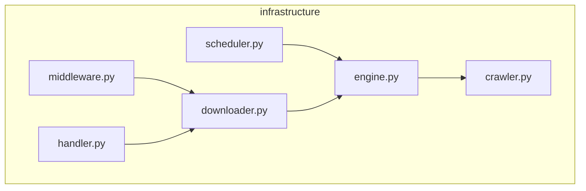

# V6 优化方向：层级化文档 + 大仓库模块化执行

> 日期：2026-03-28
> 分支：`feature/codebase-explorer-impl-2026-03-22`
> 前置文档：`06_v5_mcp_skill_redesign.md`（V5 设计）、`08_v5_iteration_final_report.md`（V5 最终报告）

---

## 背景

V5 在 5 个测试仓库上完成了迭代验证。4/5 达标（Flask 100%, Rich 82%, FastAPI 99%, Celery 80%），Scrapy 因模型执行能力限制未稳定通过。迭代过程中识别出的核心瓶颈：

| 瓶颈 | 表现 | 根因 |
|------|------|------|
| 扁平化文档 | 只有 INDEX + DETAIL 两层，无法表达 Scrapy 8 层 DAG 的深度 | 文档模型固定为两层，与 DAG 深度脱耦 |
| infrastructure 集中 | 51 个 infrastructure 文件塞入一个模块，单个 sub-agent 处理困难 | FFD bin-packing 不拆分模块内部结构 |
| Agent 上下文限制 | Sonnet 200K context 对 186+ 文件仓库不够用 | 无模块级 Agent 隔离机制 |
| 文件级依赖不可视 | DETAIL 内文件间层级关系只在依赖关系节文字描述 | 缺少文件级 Mermaid 子图 |
| 测试结果不持久 | 每次运行覆盖前一次的 artifacts | 已在 V5 后期通过 `test_history/` 解决 |

V6 的目标是从"扁平两层 + 并行 sub-agent"演进为"多层嵌套 + 模块化独立执行"，解决 V5 在深层/超大仓库上的限制。

---

## 一、层级化文档模型设计

### 1.1 核心思路

当前 V5 的文档模型是固定两层：

```
.codebase-docs/
├── INDEX.md       # 顶层模块概览
├── {module}/DETAIL.md  # 该模块所有文件的详细文档
└── doc-index.json
```

问题在于：浅层模块（2-3 个文件）和深层模块（51 个文件、8 层 DAG）使用同一个 DETAIL 文件。深层模块的 DETAIL 变得冗长且缺乏内部组织。

V6 方案：**基于 DAG `layers_within_cone` 动态决定模块需要几层文档**。

### 1.2 层级决策逻辑

```python
def decide_doc_depth(module) -> int:
    """
    返回该模块需要几层文档（0 = 扁平 DETAIL, 1 = 子模块 DETAIL, 2+ = 嵌套子模块）
    """
    dag_depth = module.layers_within_cone  # 模块内 DAG 的层数
    file_count = len(module.files)

    if dag_depth <= 2 and file_count <= 20:
        return 0   # 浅层：当前的扁平 DETAIL 模型
    elif dag_depth <= 4 and file_count <= 50:
        return 1   # 中层：拆分为子模块
    else:
        return 2   # 深层：递归嵌套
```

- **depth=0**（浅层，如 Flask 的 `templating` 模块）：维持当前 V5 模型，一个 DETAIL.md 覆盖所有文件。
- **depth=1**（中层，如 Rich 的 `rendering_engine` 模块）：拆分为子模块，每个子模块一个 DETAIL.md，模块目录下增加一个子 INDEX.md。
- **depth=2**（深层，如 Scrapy 的 `infrastructure` 模块）：递归嵌套，子模块内部可以再拆分。

### 1.3 目录结构生成规则

```
.codebase-docs/
├── INDEX.md                             # Level 0: 顶层模块概览
├── {module_a}/
│   ├── INDEX.md                         # Level 1: 子模块概览（depth>=1 的模块才有）
│   ├── {submodule_1}/DETAIL.md          # Level 2: 文件文档
│   └── {submodule_2}/DETAIL.md
├── {module_b}/
│   └── DETAIL.md                        # 浅层模块直接 DETAIL（depth=0）
├── {module_c}/
│   ├── INDEX.md                         # Level 1
│   ├── {sub_c1}/
│   │   ├── INDEX.md                     # Level 2（depth>=2 才有）
│   │   ├── {subsub_1}/DETAIL.md         # Level 3
│   │   └── {subsub_2}/DETAIL.md
│   └── {sub_c2}/DETAIL.md
└── doc-index.json
```

**规则：**
1. 顶层 INDEX.md 始终存在，列出所有顶层模块
2. depth=0 的模块只有一个 DETAIL.md
3. depth>=1 的模块目录下增加子 INDEX.md + 子模块目录
4. doc-index.json 记录完整的目录树结构，供工具导航

### 1.4 MCP 工具改进

#### `get_modules()` 增加 `depth` 字段

当前 `get_modules()` 的 summary 模式返回模块列表。V6 需增加：

```json
{
  "modules": [
    {
      "id": "infrastructure",
      "name": "基础设施层",
      "file_count": 51,
      "token_count": 85000,
      "depth": 2,
      "sub_module_count": 4
    }
  ]
}
```

- `depth`：该模块需要几层文档（由 `decide_doc_depth()` 计算）
- `sub_module_count`：depth>=1 时，该模块被拆分为几个子模块

**涉及文件：**
- `src/server.py`：`get_modules()` handler 增加 depth/sub_module_count 字段
- `src/doc/depth_planner.py`：新增 `decide_doc_depth()` 函数
- `src/graph/feature_cone.py`：确保 `layers_within_cone` 数据可从 cone 元数据获取

#### `get_modules(module_id=X)` 返回 `sub_modules` 字段

当 depth>=1 时，对特定模块的查询需返回子模块列表而非直接返回文件列表：

```json
{
  "module_id": "infrastructure",
  "depth": 2,
  "sub_modules": [
    {
      "id": "infrastructure/http_transport",
      "name": "HTTP 传输层",
      "files": ["downloader.py", "handler.py", ...],
      "file_count": 12,
      "token_count": 18000
    },
    {
      "id": "infrastructure/scheduling",
      "name": "调度引擎",
      "files": ["scheduler.py", "slot.py", ...],
      "file_count": 8,
      "token_count": 12000
    }
  ]
}
```

子模块分组策略：在现有 Louvain 分组结果的基础上，对 depth>=1 的模块内部**再次运行社区检测**，按文件间的依赖关系进一步拆分。

**涉及文件：**
- `src/server.py`：`get_modules()` handler 增加子模块分支逻辑
- `src/graph/grouper.py`：新增 `sub_group_module()` 方法，对单个模块内部再次 Louvain
- `src/graph/strategies.py`：`FeatureConeStrategy` 增加子分组接口

#### `doc_operation("update_index")` 支持递归汇编

当前 `update_index` 只汇编顶层 INDEX.md。V6 需支持：

1. **叶子→根**的递归汇编：先汇编最深层的子 INDEX，再逐层向上
2. 参数 `scope`：指定汇编范围
   - `scope="all"`：从叶子到根全部重建
   - `scope="module:infrastructure"`：只重建某模块的子 INDEX
   - `scope="root"`：只重建顶层 INDEX（当前行为）

**涉及文件：**
- `src/server.py`：`doc_operation()` handler 的 `update_index` 分支增加 scope 参数
- `src/server_helpers.py`：`assemble_index()` 函数改为递归实现

### 1.5 Skill 改进

#### Phase 3 对深层模块递归调用

当前 Phase 3 的执行模型是：主 Agent → 为每个模块 spawn 一个 sub-agent → sub-agent 写 DETAIL。

V6 对 depth>=1 的模块，执行模型变为：

```
主 Agent
├── 浅层模块 A → sub-agent → 写 DETAIL.md
├── 深层模块 B（depth=2）→ 模块 Agent
│   ├── 子模块 B1 → sub-agent → 写 DETAIL.md
│   ├── 子模块 B2 → sub-agent → 写 DETAIL.md
│   └── 汇编 B/INDEX.md
└── 中层模块 C（depth=1）→ 模块 Agent
    ├── 子模块 C1 → sub-agent → 写 DETAIL.md
    └── 汇编 C/INDEX.md
```

**涉及文件：**
- `.agents/skills/codebase-explorer/phases/phase3-detail.md`：增加"深层模块处理协议"
- `.agents/skills/codebase-explorer/SKILL.md`：Phase 3 概述中增加深层模块分支说明

#### Phase 4 递归 update_index

Phase 4 从叶子到根汇编所有 INDEX：

1. 对每个 depth>=2 的模块：先汇编最深层子 INDEX
2. 对每个 depth>=1 的模块：汇编模块级 INDEX
3. 最后汇编顶层 INDEX

**涉及文件：**
- `.agents/skills/codebase-explorer/phases/phase4-index.md`：增加递归汇编步骤
- `.agents/skills/codebase-explorer/SKILL.md`：Phase 4 概述中增加递归说明

---

## 二、大仓库模块化执行方案

### 2.1 问题定义

V5 的执行模型假设一个主 Agent 能在单个 session 中完成所有工作。对于 >300 文件的仓库（如 Scrapy 186 文件已接近极限），Sonnet 200K context 不够用。核心矛盾：**主 Agent 需要保持全局视图，但全局视图本身就消耗大量 context。**

以下三个方案按系统能力要求从高到低排列。

### 2.2 方案 A：嵌套 Agent（系统支持时）

**前提：** Claude Code 或执行环境支持 Agent 嵌套调用（即 Agent 可以 spawn 子 Agent，子 Agent 继承 MCP 配置）。

**执行流程：**

```
主 Agent（全局协调）
│
├── Phase 1: analyze_codebase → 获取模块列表 + depth 信息
├── Phase 2: 验证模块分割，规划任务
│
├── Phase 3: 为每个顶层模块 spawn 模块 Agent
│   ├── 模块 Agent A（继承 MCP 配置 + output_dir）
│   │   ├── get_modules(module_id="A") → 获取文件列表
│   │   ├── 读源码 → 写 DETAIL.md
│   │   └── 如果 depth>=1，内部再 spawn sub-agents
│   ├── 模块 Agent B（并行）
│   └── 模块 Agent C（并行）
│
└── Phase 4: 主 Agent 做整合
    ├── 递归 update_index
    └── 语义审查 + 重组
```

**优势：**
- 每个模块 Agent 有独立的 context window，互不干扰
- 主 Agent 只需保持模块级元数据，context 压力极小
- 天然支持并行执行

**限制：**
- 依赖系统对嵌套 Agent 的支持（当前 Claude Code 支持 `Task` 但嵌套层级有限）
- 模块 Agent 之间无法直接通信，跨模块依赖信息需通过 MCP 传递

**涉及文件：**
- `.agents/skills/codebase-explorer/SKILL.md`：增加"大仓库模块化执行"分支判断
- `.agents/skills/codebase-explorer/phases/phase3-detail.md`：增加"模块 Agent 协议"
- `src/server.py`：确保 MCP 在多个并行 Agent 访问时的线程安全（`json_store.py` 的文件锁已部分覆盖）

### 2.3 方案 B：用户侧嵌套调用（系统不支持嵌套时）

**前提：** 系统不支持 Agent 嵌套，但可以通过脚本依次启动多个独立 Agent。

**执行流程：**

```
Step 1: 主 Agent 执行 Phase 1-2
  └── 产出：模块列表 + 任务清单（JSON 或 Markdown）
  └── 为每个模块生成独立的执行 prompt

Step 2: 用户（或脚本）依次运行每个模块的 prompt
  └── claude -p "按照 .codebase-docs/tasks/module_A.md 的指示，完成模块 A 的 DETAIL 文档"
  └── claude -p "按照 .codebase-docs/tasks/module_B.md 的指示，完成模块 B 的 DETAIL 文档"
  └── ...（可并行运行多个）

Step 3: 运行整合 prompt
  └── claude -p "执行 Phase 4：汇编 INDEX，审查重组"
```

**任务清单格式（每个模块一个文件）：**

```markdown
# Module: infrastructure

## 元数据
- module_id: infrastructure
- depth: 2
- sub_modules: [http_transport, scheduling, ...]
- output_dir: /path/to/.codebase-docs

## 指令
1. 调用 get_modules(module_id="infrastructure", output_dir="...") 获取文件列表
2. 对每个子模块，按 Phase 3 协议生成 DETAIL.md
3. 汇编 infrastructure/INDEX.md
4. 调用 submit_analysis(module_id="infrastructure", status="complete")
```

**优势：**
- 不依赖系统嵌套能力，任何 CLI 工具都能用
- 每个模块 prompt 完全独立，天然支持并行
- 失败可重试，不影响其他模块

**限制：**
- 需要额外的脚本编排层（`run_modules.sh`）
- 模块间无法在运行时交互
- 用户需要理解执行流程

**涉及文件：**
- `.agents/skills/codebase-explorer/SKILL.md`：Phase 2 增加"生成模块任务清单"步骤
- `.agents/skills/codebase-explorer/phases/phase2-validation.md`：增加任务清单生成逻辑
- 新增文件 `scripts/run_modules.sh`：编排脚本，读取任务清单并依次/并行运行 `claude -p`
- `src/server.py`：`get_progress()` 需返回每个模块的独立完成状态

### 2.4 方案 C：分段执行 + `get_progress()` 恢复

**前提：** 单个 Agent 执行，但在 context 接近上限时主动保存进度并退出。

**执行流程：**

```
Session 1:
  Phase 1: analyze_codebase
  Phase 2: validate + plan
  Phase 3: 处理模块 A, B, C...
  → context 接近上限 → submit_analysis(status="partial") → 停止

Session 2:
  get_progress() → 发现模块 A, B, C 已完成，D, E 待处理
  Phase 3: 继续处理模块 D, E...
  Phase 4: 全部完成后汇编 INDEX

Session N:（如有需要）
  get_progress() → 检查是否所有模块完成
  Phase 4: 汇编 INDEX
```

**关键机制：**
1. `get_progress()` 已在 V5 实现，返回每个模块的完成状态
2. 需要新增：Agent 在 Phase 3 中的 context 使用量估算
3. 需要新增：Skill 中的"优雅退出"指令——当 Agent 检测到 context 紧张时，完成当前模块后停止

**优势：**
- 最简单，不需要系统嵌套支持
- 利用 V5 已有的 `get_progress()` 机制
- 适合用户手动操作

**限制：**
- 无法并行，执行效率最低
- 多次 session 之间的上下文衔接可能丢失信息
- Agent 对自身 context 使用量的感知不精确

**涉及文件：**
- `.agents/skills/codebase-explorer/SKILL.md`：增加"分段执行"模式说明
- `.agents/skills/codebase-explorer/phases/phase3-detail.md`：增加"context 预算检查 + 优雅退出"指令
- `src/server.py`：`get_progress()` 增加"推荐下一步操作"字段
- `src/state/json_store.py`：确保 partial 状态写入的原子性

---

## 三、MCP 渐进式披露保护

### 3.1 问题

当前 MCP 的 `get_modules()` 和 `get_file_tokens()` 在大仓库下可能返回大量数据。V5 已做了一些缓解（summary 模式、top-20 限制），但缺乏系统性的分层返回机制。

### 3.2 分层返回设计

```
Level 0: get_modules()
  └── 只返回顶层模块元数据（名称、文件数、token 数、depth）
  └── 不返回文件列表
  └── 预期大小：<2KB

Level 1: get_modules(module_id=X)
  └── 如果 depth=0：返回文件列表
  └── 如果 depth>=1：返回子模块列表（不含文件）
  └── 预期大小：<5KB

Level 2: get_modules(module_id=X, sub_module=Y)
  └── 返回子模块的文件列表 + 函数依赖
  └── 预期大小：<10KB
```

每次调用只返回"下一层"的信息，Agent 按需逐层深入。

### 3.3 响应大小保护

**硬性约束：** 任何单次 MCP 响应 <50KB。

实现方式：

```python
def enforce_response_limit(response: dict, limit_bytes: int = 50_000) -> dict:
    """
    如果响应超过 limit，截断并添加分页信息。
    """
    serialized = json.dumps(response)
    if len(serialized.encode()) <= limit_bytes:
        return response

    # 分页：保留元数据 + 前 N 条 + pagination cursor
    return {
        **response,
        "items": response["items"][:page_size],
        "pagination": {
            "total": len(response["items"]),
            "returned": page_size,
            "next_cursor": page_size
        }
    }
```

**涉及文件：**
- `src/server.py`：所有 handler 的返回路径增加 `enforce_response_limit()` 调用
- `src/server_helpers.py`：新增 `enforce_response_limit()` 函数

### 3.4 主 Agent 上下文预算

在 Phase 2 验证阶段，估算总任务量并决定执行模式：

```python
def estimate_execution_mode(modules: list, context_budget: int = 180_000) -> str:
    """
    估算所有模块的 Phase 3 任务需要多少 context，决定执行模式。
    context_budget 单位：token（Sonnet 200K 减去 Phase 1/2/4 的预估开销）
    """
    total_tokens = sum(m.token_count for m in modules)
    total_files = sum(m.file_count for m in modules)

    # 经验公式：每个文件的 Phase 3 处理大约消耗 1500 tokens context
    estimated_context = total_files * 1500

    if estimated_context <= context_budget:
        return "single_session"     # V5 模式，单 Agent 单 session
    elif estimated_context <= context_budget * 3:
        return "segmented"          # 方案 C：分段执行
    else:
        return "modular"            # 方案 A/B：模块化执行
```

Skill 的 Phase 2 增加一步：调用此估算，将结果写入 `state.json`，后续 Phase 根据模式选择不同的执行路径。

**涉及文件：**
- `src/doc/depth_planner.py`：新增 `estimate_execution_mode()` 函数
- `src/server.py`：`get_progress()` 或新增 `get_execution_plan()` 工具返回推荐模式
- `.agents/skills/codebase-explorer/phases/phase2-validation.md`：增加执行模式判断步骤
- `.agents/skills/codebase-explorer/SKILL.md`：Phase 2 概述中增加执行模式说明

---

## 四、文件级依赖关系可视化

### 4.1 问题

V5 的 INDEX.md 包含模块间依赖的 Mermaid 图，但 DETAIL.md 内部的文件间依赖关系只在"依赖关系"节用文字描述。用户反馈（需求 9）明确要求"漏斗形依赖关系可视化"在文件层面也可见。

### 4.2 模块内 Mermaid 子图

每个 DETAIL.md 头部（YAML front matter 之后、第一个文件节之前）添加文件间依赖的 Mermaid 图：

```markdown
---
module: infrastructure
doc_type: detail
---

# 基础设施层

## 文件依赖关系



## 文件文档

### scheduler.py
...
```

**数据来源：** `get_dependency_graph(scope="module", target=module_id)` 已在 V5 中实现，返回模块内文件间的依赖关系。只需在 Skill Phase 3 中要求 sub-agent 调用此工具并将结果嵌入 DETAIL 头部。

**涉及文件：**
- `.agents/skills/codebase-explorer/phases/phase3-detail.md`：Phase 3 协议增加"Step 0: 获取并嵌入模块内 Mermaid 图"
- `.agents/skills/codebase-explorer/references/DOC_TEMPLATES.md`：DETAIL 模板增加 Mermaid 图位置
- `scripts/count_sections.py`（如有验证脚本）：增加对 Mermaid 图存在性的检查

### 4.3 文件排序即层级

V5 已实现：DETAIL 中文件按 DAG layer 排序（底层文件在前、上层在后）。这使得文档的阅读顺序天然反映依赖层级——先理解被依赖的基础文件，再理解调用它们的上层文件。

**无需额外改动。**

### 4.4 层级标注（可选增强）

在每个文件节的头部标注该文件在 DAG 中的层级：

```markdown
### scheduler.py
<!-- Layer: 2 | Dependencies: engine.py, slot.py -->

**功能概述**
...
```

这个信息可以从 `get_modules(module_id=X)` 的文件列表中获取（V5 已返回每个文件的 `dag_layer`）。

**涉及文件：**
- `.agents/skills/codebase-explorer/phases/phase3-detail.md`：文件节模板增加 Layer 标注
- `.agents/skills/codebase-explorer/references/DOC_TEMPLATES.md`：更新文件节模板

---

## 五、实施优先级

| 优化项 | 优先级 | 复杂度 | 预期效果 | 涉及文件 |
|--------|--------|--------|---------|---------|
| 文件级 Mermaid 子图 | **P0** | 低 | DETAIL 内文件关系可视化，解决需求 9 | `phase3-detail.md`, `DOC_TEMPLATES.md` |
| 测试结果持久保存 | **P0** | 低 | 已实现（`test_history/`） | 已完成 |
| 大仓库方案 B（用户嵌套） | **P1** | 中 | Scrapy 级别仓库可完整覆盖 | `SKILL.md`, `phase2-validation.md`, 新增 `run_modules.sh` |
| 多层 INDEX/DETAIL | **P1** | 高 | 深层 DAG 的渐进式披露 | `server.py`, `depth_planner.py`, `grouper.py`, `phase3-detail.md`, `phase4-index.md` |
| MCP 子模块返回 | **P1** | 中 | 支持多层文档的 MCP 基础 | `server.py`, `server_helpers.py`, `grouper.py`, `strategies.py` |
| 执行模式自动判断 | **P1** | 中 | Phase 2 自动选择最优执行路径 | `depth_planner.py`, `server.py`, `phase2-validation.md` |
| 嵌套 Agent 方案 A | **P2** | 高 | 最优但依赖系统支持 | `SKILL.md`, `phase3-detail.md`, `server.py` |
| MCP 分页保护 | **P2** | 中 | 超大仓库的安全网 | `server.py`, `server_helpers.py` |
| Layer 标注（可选） | **P2** | 低 | 文件层级一目了然 | `phase3-detail.md`, `DOC_TEMPLATES.md` |

### 推荐实施顺序

```
Phase A（快速收益）：
  1. 文件级 Mermaid 子图（P0，只改 Skill，不改 MCP）
  2. Layer 标注（P2 但复杂度低，顺手做）

Phase B（MCP 基础设施）：
  3. get_modules() 增加 depth 字段
  4. get_modules(module_id=X) 返回 sub_modules
  5. MCP 分页保护

Phase C（文档模型升级）：
  6. 多层 INDEX/DETAIL 目录结构
  7. doc_operation("update_index") 递归汇编
  8. Phase 3/4 Skill 更新

Phase D（执行模型升级）：
  9. 执行模式自动判断
  10. 方案 B：用户嵌套脚本
  11. 方案 A：嵌套 Agent（等系统支持）
```

---

## 六、与 V5 的关系

### 6.1 继承

V5 的所有修复在 V6 中继续生效：

| V5 修复 | V6 状态 |
|---------|---------|
| `output_dir` 防串台 | 继承，模块化执行时每个模块 Agent 同样传递 `output_dir` |
| `locked_read_modify_write` 文件锁 | 继承，多 Agent 并行写入时更加关键 |
| `count_sections.py` 全量验证 | 继承，扩展为支持多层目录结构的验证 |
| `get_template()` 中文 header | 继承 |
| `get_file_tokens` top-20 限制 | 继承，V6 分页保护是其泛化 |
| `get_structure` slim 模式 | 继承 |
| `get_modules` summary 精简 | 继承，V6 的分层返回是其演进 |
| FFD bin-packing 任务分配 | 继承，V6 在模块内部再次应用 |
| Phase 4 强制重命名 gate | 继承 |

### 6.2 增量演进

V6 **不需要重写 V5 的核心代码**。变更范围：

| 层 | V5 代码 | V6 新增/修改 |
|----|---------|-------------|
| MCP 算法层 | `feature_cone.py`, `grouper.py`, `strategies.py` | `grouper.py` 增加子分组方法 |
| MCP 服务层 | `server.py`, `server_helpers.py` | 增加 depth/sub_modules 字段、分页保护、递归 update_index |
| 预算/规划层 | `depth_planner.py` | 增加 `decide_doc_depth()`, `estimate_execution_mode()` |
| 状态层 | `json_store.py`, `models.py` | 扩展 state.json 支持子模块状态 |
| Skill 层 | `SKILL.md`, `phase3-detail.md`, `phase4-index.md` | 增加深层模块协议、递归汇编、执行模式分支 |
| 脚本层 | `run_skill_judge.sh`, `verify_real_e2e.sh` | 新增 `run_modules.sh`，扩展验证脚本支持多层目录 |

### 6.3 核心不变量

以下 V5 设计决策在 V6 中保持不变：

1. **MCP = 确定性分析，Agent = 语义理解**——分工不变
2. **SCC + DAG + Louvain 三层图算法**——不变，只在模块内部复用 Louvain
3. **四阶段 Pipeline（Phase 1-4）**——不变，只在 Phase 3 内部增加递归
4. **持久化中间产物（JSON + state.json）**——不变，扩展为支持子模块粒度
5. **index-fragment 拼合 INDEX**——不变，扩展为递归拼合
