# celery Architecture

```mermaid
graph TD
    n0["Infrastructure"]
    n1["CLI Entry Points & Application Launcher"]
    n2["Task Annotations, Routing & Examples"]
    n3["AsynPool (Async Concurrency Pool)"]
    n4["AutoRetry & Scheduling Utilities"]
    n5["Worker Bootsteps & Cloud Backends"]
    n6["Backends — Result Store Implementations"]
    n7["Builtins (Built-in Tasks & Canvas Examples)"]
    n8["RPC Backend & Worker Loops"]
    n9["Broker Migration & Contrib Utilities"]
    n10["Remote Worker Control & Events"]
    n11["GCS (Google Cloud Storage Backend & Supporting Infrastructure)"]
    n12["Message Signing & Certificate Security"]
    n13["Testing — Conftest & Fixture Tests"]
    n14["Testing — AMQP & App Unit Tests"]
    n15["Testing — Backend Unit & Integration Tests"]
    n16["Testing — Beat Scheduler & Time Utilities"]
    n17["Canvas & Chord Integration Tests"]
    n18["Testing — Loader, Prefork Pool & Sysinfo"]
    n19["Testing — Backend & Schedule Unit Tests"]
    n20["Testing - Memory Leak & Exception Handling Tests"]
    n21["Testing - Multi-Process & Platform Tests"]
    n22["Testing - Test Security"]
    n23["Testing — Solo, Migrate & Functional Tests"]
    n24["Testing — App Core & Worker Integration Tests"]
    n1 -->|dep w=72| n0
    n1 -->|dep w=1| n3
    n1 -->|dep w=1| n4
    n1 -->|dep w=2| n5
    n1 -->|dep w=1| n9
    n1 -->|dep w=2| n10
    n1 -->|dep w=1| n21
    n1 -->|dep w=1| n23
    n2 -->|dep w=7| n0
    n2 -->|dep w=1| n14
    n3 -->|dep w=37| n0
    n3 -->|dep w=1| n5
    n4 -->|dep w=11| n0
    n4 -->|dep w=1| n16
    n5 -->|dep w=75| n0
    n5 -->|dep w=3| n10
    n5 -->|dep w=4| n20
    n6 -->|dep w=44| n0
    n6 -->|dep w=2| n1
    n6 -->|dep w=1| n11
    n6 -->|dep w=2| n15
    n7 -->|dep w=22| n0
    n7 -->|dep w=1| n17
    n8 -->|dep w=16| n0
    n8 -->|dep w=1| n5
    n8 -->|dep w=1| n19
    n8 -->|dep w=2| n20
    n9 -->|dep w=5| n0
    n9 -->|dep w=1| n1
    n9 -->|dep w=2| n23
    n10 -->|dep w=37| n0
    n10 -->|dep w=3| n1
    n10 -->|dep w=1| n5
    n10 -->|dep w=1| n6
    n10 -->|dep w=1| n20
    n10 -->|dep w=1| n24
    n11 -->|dep w=33| n0
    n11 -->|dep w=1| n6
    n11 -->|dep w=1| n7
    n11 -->|dep w=1| n10
    n11 -->|dep w=1| n19
    n12 -->|dep w=5| n0
    n13 -->|dep w=44| n0
    n13 -->|dep w=2| n3
    n13 -->|dep w=1| n7
    n13 -->|dep w=11| n11
    n13 -->|dep w=1| n19
    n14 -->|dep w=29| n0
    n14 -->|dep w=2| n2
    n14 -->|dep w=1| n6
    n14 -->|dep w=1| n10
    n15 -->|dep w=49| n0
    n15 -->|dep w=1| n5
    n15 -->|dep w=9| n6
    n16 -->|dep w=20| n0
    n16 -->|dep w=2| n4
    n17 -->|dep w=62| n0
    n17 -->|dep w=1| n1
    n17 -->|dep w=8| n7
    n17 -->|dep w=3| n10
    n17 -->|dep w=2| n15
    n18 -->|dep w=19| n0
    n18 -->|dep w=7| n3
    n19 -->|dep w=83| n0
    n19 -->|dep w=1| n4
    n19 -->|dep w=3| n5
    n19 -->|dep w=4| n6
    n19 -->|dep w=2| n7
    n19 -->|dep w=4| n8
    n19 -->|dep w=1| n9
    n19 -->|dep w=4| n12
    n19 -->|dep w=1| n15
    n20 -->|dep w=44| n0
    n20 -->|dep w=1| n1
    n20 -->|dep w=2| n3
    n20 -->|dep w=8| n5
    n20 -->|dep w=1| n19
    n20 -->|dep w=1| n23
    n21 -->|dep w=38| n0
    n21 -->|dep w=6| n1
    n21 -->|dep w=1| n3
    n21 -->|dep w=1| n5
    n22 -->|dep w=7| n0
    n22 -->|dep w=13| n12
    n23 -->|dep w=8| n0
    n23 -->|dep w=1| n9
    n23 -->|dep w=1| n10
    n23 -->|dep w=1| n17
    n23 -->|dep w=1| n19
    n24 -->|dep w=64| n0
    n24 -->|dep w=3| n1
    n24 -->|dep w=2| n5
    n24 -->|dep w=14| n10
    n24 -->|dep w=3| n20
```

<!-- module-index:testing-test_security -->
## Testing - Test Security
**Testing - Test Security** (4 files, 12908 tokens) — 覆盖 Celery 安全模块的完整测试套件，包含单元测试和集成测试两层。单元测试（`test_certificate.py`、`test_key.py`、`test_serialization.py`）通过固定 PEM 数据（来自 `t/unit/security/__init__.py`）和 `SecurityCase` 基类（`cryptography` 可选依赖保护）全面覆盖证书加载验签、私钥签名、安全序列化往返及 kombu 注册；集成测试（`test_integration/test_security.py`）在真实 worker 环境中验证端到端任务安全传输（当前 xfail，追踪 Issue #5269）。
Key entry points: `test_secureserializer`, `test_Certificate`, `test_PrivateKey`, `test_security`.
[→ DETAIL](testing-test_security/DETAIL.md)
<!-- end-module-index:testing-test_security -->

<!-- module-index:testing-test_beat -->
## Testing — Beat Scheduler, Signals & Time Utilities
**Testing — Test Beat** (7 files, 17177 tokens) — 覆盖 Celery 调度和周边工具的测试套件：`test_beat.py` 是核心，全面测试 beat 调度系统（Scheduler/PersistentScheduler/Service/ScheduleEntry）；`test_dumper.py` 验证事件格式化输出；`test_deprecated.py` 测试废弃属性描述符；`test_dispatcher.py` 测试弱引用信号分发；`test_iso8601.py` 和 `test_time.py` 覆盖时间解析和时区处理工具；`test_utils.py` 验证基础工具函数。所有 7 个文件均在 token 预算内完成文档化。
Key entry points: `test_Scheduler`, `test_PersistentScheduler`, `test_Service`, `test_ScheduleEntry`, `test_Signal`, `test_remaining`, `test_crontab_remaining_estimate` (via test_beat), `test_get_exponential_backoff_interval`.
[→ DETAIL](testing-test_beat/DETAIL.md)
<!-- end-module-index:testing-test_beat -->

<!-- module-index:testing-test_loaders -->
## Testing — Loader, Prefork Pool & Concurrency Sysinfo Tests
**Testing — Loader, Prefork Pool & Concurrency Sysinfo Tests** (6 files, ~14192 tokens) — Test suite group covering loader configuration, prefork concurrency pool internals, system information utilities, worker heartbeat, and the revoked-tasks state store. The dominant file is `test_prefork.py` which exercises `AsynPool` I/O multiplexing and `flush()` edge cases in depth; `test_loaders.py` provides broad coverage of all three loader classes and the `find_related_module` autodiscovery path.
Key entry points: `test_TaskPool`, `test_AsynPool`, `test_LoaderBase`, `test_DefaultLoader`, `test_autodiscovery`, `test_Heart`.
[→ DETAIL](testing-test_loaders/DETAIL.md)
<!-- end-module-index:testing-test_loaders -->

<!-- module-index:celery -->
## RPC Backend, Delayed Delivery & Worker Event Loops
**RPC Backend, Delayed Delivery & Worker Event Loops** (4 files, ~8363 tokens) — Covers core runtime infrastructure: the RPC result backend that routes task results directly to callers via per-process AMQP reply queues (`RPCBackend`, `ResultConsumer`), the native delayed delivery bootstep that configures RabbitMQ quorum-queue-based ETA support (`DelayedDelivery`), and the two fundamental worker event loops that drive message consumption (`asynloop`, `synloop`). These components collectively handle result delivery, delayed scheduling, and the innermost worker processing loop.
Key entry points: `RPCBackend.store_result()`, `RPCBackend.get_task_meta()`, `DelayedDelivery.start()`, `asynloop()`, `synloop()`.
[→ DETAIL](celery/DETAIL.md)
<!-- end-module-index:celery -->

<!-- module-index:annotations -->
## Task Annotations, Routing & Example Applications
**Task Annotations, Routing & Example Applications** (33 files, 6560 tokens) — The core of this module is `celery/app/annotations.py` and `celery/app/routes.py`, which implement task annotation (config-time monkey-patching via `task_annotations`) and task routing (queue selection via `task_routes`) respectively. The remaining files are example projects (standalone, Django, gevent, security, tutorial, next-steps), release utilities, and test fixtures for the Sphinx documentation extension.
Key entry points: `annotations.prepare()`, `annotations.resolve_all()`, `routes.prepare()`, `Router.route()`, `MapAnnotation`, `MapRoute`.
[→ DETAIL](annotations/DETAIL.md)
<!-- end-module-index:annotations -->

<!-- module-index:asynpool -->
## AsynPool (Async Concurrency Pool)
**AsynPool (Async Concurrency Pool)** (16 files, ~22000 tokens) — 实现了 Celery 的异步非阻塞进程池核心（`AsynPool`），通过事件循环集成（而非线程）驱动任务分发、结果接收和进程生命周期管理；同时包含 Eventlet、Gevent、Solo、Thread 四种替代并发后端，以及 loader、心跳服务等 worker 基础设施。
Key entry points: `AsynPool`, `AsynPool.register_with_event_loop()`, `TaskPool` (prefork/eventlet/gevent/thread/solo), `process_initializer()`, `Heart`.
[→ DETAIL](asynpool/DETAIL.md)
<!-- end-module-index:asynpool -->

<!-- module-index:autoretry -->
## AutoRetry & Scheduling Utilities
**AutoRetry & Scheduling Utilities** (6 files, ~13000 tokens) — 涵盖任务自动重试机制（`add_autoretry_behaviour`，支持指数退避/jitter/排除异常）、Beat 调度类型体系（`schedule`/`crontab`/`solar`）、Sphinx 文档集成插件、事件实时转储工具、以及任务系统抽象接口定义。
Key entry points: `add_autoretry_behaviour()`, `crontab`, `schedule`, `solar`, `evdump()`, `setup()` (sphinx), `CallableTask`.
[→ DETAIL](autoretry/DETAIL.md)
<!-- end-module-index:autoretry -->

<!-- module-index:azureblockblob -->
## Worker Bootsteps, Consumer Pipeline & Cloud Result Backends
**Worker Bootsteps, Consumer Pipeline & Cloud Result Backends** (19 files, ~25497 tokens) — Cloud-backend and worker infrastructure group covering three Azure/Consul/CosmosDB result backends, the bootsteps DAG framework, events snapshot system, worker autoscaler, all core worker-level and consumer-level bootsteps, the remote control command panel, and the pidbox mailbox. The backends implement `KeyValueStoreBackend` against cloud KV stores; the bootsteps govern ordered startup/shutdown of all worker subsystems; `Panel` registers and dispatches remote control commands; `Gossip`/`Mingle` provide worker-to-worker coordination.
Key entry points: `AzureBlockBlobBackend`, `ConsulBackend`, `CosmosDBSQLBackend`, `Blueprint.apply()`, `Panel.register()`, `Autoscaler`, `evcam()`, `Pidbox`, `Gossip`, `Mingle`.
[→ DETAIL](azureblockblob/DETAIL.md)
<!-- end-module-index:azureblockblob -->

<!-- module-index:backends -->
## Backends — Result Store Implementations
**Backends — Result Store Implementations** (13 files, 32545 tokens) — Celery 结果后端实现集合，涵盖 ArangoDB、Cassandra、Couchbase、CouchDB、Database(SQLAlchemy)、DynamoDB、Elasticsearch、Filesystem、MongoDB、Redis、S3 共 11 种存储。所有后端继承自 `KeyValueStoreBackend` 或 `BaseBackend`，统一实现 get/set/mget/delete/cleanup 接口；Redis 后端功能最完整，支持 pub/sub 异步通知、chord 原语和 Sentinel 高可用；Database 后端最健壮，具备完整的重试机制和连接池管理。
Key entry points: `RedisBackend`, `DatabaseBackend`, `MongoBackend`, `DynamoDBBackend`, `ElasticsearchBackend`, `CassandraBackend`, `S3Backend`, `FilesystemBackend`, `ArangoDbBackend`, `CouchBackend`, `CouchbaseBackend`, `SessionManager`.
[→ DETAIL](backends/DETAIL.md)
<!-- end-module-index:backends -->

<!-- module-index:builtins -->
## Builtins (Built-in Tasks & Canvas Examples)
**Builtins** (12 files, ~5,855 tokens) — This module covers Celery's built-in task registry (`celery/app/builtins.py`), the Django-integrated task base class (`celery/contrib/django/task.py`), and a collection of example and smoke-test tasks that demonstrate canvas primitives, stamping, revoke-by-header, eventlet concurrency, and Django integration patterns. The core entry point is `celery/app/builtins.py`, which auto-registers system tasks (`celery.backend_cleanup`, `celery.chord_unlock`, `celery.accumulate`, map/starmap/chunks primitives) at app finalization; `DjangoTask` in `celery/contrib/django/task.py` adds transactional dispatch safety for Django users.
Key entry points: `add_unlock_chord_task()`, `add_backend_cleanup_task()`, `DjangoTask`, `crawl()`, `StampingVisitor` subclasses.
[→ DETAIL](builtins/DETAIL.md)
<!-- end-module-index:builtins -->

<!-- module-index:contrib -->
## Broker Message Migration & Contrib Utilities
**Broker Message Migration & Contrib Utilities** (4 files, ~4103 tokens) — Contribution utilities module containing the broker message migration toolkit. The substantive file is `celery/contrib/migrate.py` which provides a complete framework for moving task messages between brokers or queues using predicate-based filtering, session-aware consumption loops, and queue re-declaration on the destination. The three `__init__.py` files are empty namespace markers.
Key entry points: `move()`, `migrate_tasks()`, `move_task_by_id()`, `move_by_idmap()`, `move_by_taskmap()`, `Filterer`, `republish()`.
[→ DETAIL](contrib/DETAIL.md)
<!-- end-module-index:contrib -->

<!-- module-index:gcs -->
## GCS (Google Cloud Storage Backend & Supporting Infrastructure)
**GCS** (16 files, ~13,793 tokens) — This module groups the Google Cloud Storage result backend implementation with the Django worker fixup, the worker message-handling strategy, supporting smoke test infrastructure, and tooling. The core entry point is `GCSBackend` in `celery/backends/gcs.py`, which stores task results in GCS and uses Firestore for atomic chord reference-counting; `celery/fixups/django.py` patches Django-Celery integration at worker startup; `celery/worker/strategy.py` provides the performance-critical `default()` message handler factory used by every worker.
Key entry points: `GCSBackend`, `GCSBackendBase`, `fixup()`, `DjangoFixup`, `DjangoWorkerFixup`, `default()`.
[→ DETAIL](gcs/DETAIL.md)
<!-- end-module-index:gcs -->

<!-- module-index:security -->
## Message Signing & Certificate-Based Security
**Message Signing & Certificate-Based Security** (7 files, 22516 tokens) — Celery 的消息签名安全模块，基于 RSA-PSS 数字签名和 X.509 证书实现 `auth` 序列化器，保证消息在传输过程中的完整性与来源可验证性。核心组件包括：`setup_security` 入口函数完成整体配置、`SecureSerializer` 执行签名/验签序列化、`Certificate`/`FSCertStore` 管理公钥证书、`PrivateKey` 封装签名操作，测试包则提供 RSA/ECDSA 密钥对固定数据和 `SecurityCase` 基类。
Key entry points: `setup_security()`, `SecureSerializer`, `register_auth()`, `FSCertStore`, `PrivateKey`.
[→ DETAIL](security/DETAIL.md)
<!-- end-module-index:security -->

<!-- module-index:testing-conftest -->
## Testing — Conftest & Fixture Tests
**Testing — Conftest & Fixture Tests** (10 files, 40095 tokens) — 涵盖 smoke 测试的 Docker 容器化基础设施（pytest-celery/pytest-docker-tools）、app 配置与 CLI preload 验证、cache/GCS 后端完整单元测试、Django fixup 两层集成（app + worker）、gevent 并发池、调试工具、worker 请求处理全生命周期（含 fast_trace_task 优化路径）以及消息协议转换（proto1/proto2/hybrid）。该模块的测试广泛依赖 `t/unit/conftest.py` 提供的 `patching`、`reset_modules`、`assert_signal_called` 等 pytest fixture 基础设施。
[→ DETAIL](testing-conftest/DETAIL.md)
<!-- end-module-index:testing-conftest -->

<!-- module-index:testing-test_amqp -->
## Testing — AMQP & App Unit Tests
**Testing — AMQP & App Unit Tests** (8 files, ~14000 tokens) — 覆盖 Celery AMQP 消息层（`as_task_v1/v2`、`Queues`、`ProducerPool`、路由系统）、backend 解析及线程安全、注解机制、导入工具（`find_module`、`qualname`）、`Proxy`/`PromiseProxy` 代理类、以及 `saferepr` 安全表示的单元测试集合。
Key entry points: `test_AMQP`, `test_Queues`, `test_backend_thread_safety()`, `test_lookup_route`, `test_Proxy`, `test_PromiseProxy`.
[→ DETAIL](testing-test_amqp/DETAIL.md)
<!-- end-module-index:testing-test_amqp -->

<!-- module-index:testing-test_backend -->
## Testing — Backend Implementation Unit & Integration Tests
**Testing — Backend Tests** (10 files read within budget, 57580 total tokens) — 覆盖 Celery 结果后端（AzureBlob 集成、CouchDB、Database/SQLAlchemy、DynamoDB、Elasticsearch、Filesystem、MongoDB）以及核心工具（异常、pickle、序列化）的单元与集成测试。测试策略统一使用 mock 替换外部服务连接，以 URL 解析验证配置正确性，并通过参数化测试覆盖多种序列化格式。
Key entry points: `test_AzureBlockBlobBackend`, `test_CouchBackend`, `test_DatabaseBackend`, `test_DynamoDBBackend`, `test_ElasticsearchBackend`, `test_FilesystemBackend`, `test_MongoBackend`, `test_SessionManager`, `test_Pickle`, `test_jsonify`.
[→ DETAIL](testing-test_backend/DETAIL.md)
<!-- end-module-index:testing-test_backend -->

<!-- module-index:testing-test_canvas -->
## Canvas, Group & Chord End-to-End Integration Tests
**Canvas & Task Integration Tests** (13 files, 96914 tokens) — 本模块包含 Celery canvas 原语（chain、group、chord）的完整集成测试套件，以及相关单元测试，验证任务编排在真实 broker/backend 上的端到端正确性，涵盖错误传播、任务替换、parent ID 追踪、dedup 去重快速路径等复杂场景。由于 token 预算限制（50000），本次仅完整记录了 4 个文件（conftest.py、test_canvas.py、test_dedup_chain_dispatch.py、test_builtins.py），累计 44897 tokens；其余 9 个文件（test_tasks.py、test_canvas unit、test_stamping.py 等）未在本次文档中覆盖。

关键入口点：`test_chain`、`test_chord`、`test_group`、`test_result_set`、`test_link_error`、`test_dedup_chain_dispatch`（集成测试类）；`test_chord`、`test_group`、`test_chain`（builtins 单元测试类）；`manager`、`flaky`、`celery_config`（fixtures）。
[→ DETAIL](testing-test_canvas/DETAIL.md)
<!-- end-module-index:testing-test_canvas -->

<!-- module-index:testing-test_loops -->
## Testing — Backend, Schedule & Chord Unit Tests
**Testing — Test Loops** (18 files, 44173 tokens) — 涵盖 Celery 测试套件中多个核心子系统的单元和集成测试：数据库后端重试逻辑、任务自动发现、调度系统（schedule/crontab/solar）、traceback 清理、多种结果后端（ArangoDB、Azure Blob、Cassandra、CosmosDB、Couchbase、RPC、S3）、并发池（base/thread）、pytest 插件注册、安全序列化及 chord 工作流。受限于 50000 token 预算，未覆盖 `t/unit/tasks/test_tasks.py` 及后续文件（acc=62650 超出限制）。
Key entry points: `test_database_backend_transient_failure_integration`, `test_ArangoDbBackend`, `test_Drainer_without_greenlets`, `test_greenletDrainer`, `test_RPCResultConsumer`, `test_unlock_chord_task`, `test_crontab_parser`, `test_crontab_remaining_estimate`, `test_BasePool`, `test_security`.
[→ DETAIL](testing-test_loops/DETAIL.md)
<!-- end-module-index:testing-test_loops -->

<!-- module-index:testing-test_mem_leak_in_exception_handling -->
## Testing - Memory Leak & Exception Handling Tests
**Testing - Memory Leak & Exception Handling Tests** (9 files, ~29749 tokens) — 该模块聚焦两个关注点：一是专项集成测试（`test_mem_leak_in_exception_handling.py`），使用 `tracemalloc`/`psutil` 验证任务异常不造成内存泄漏（Issue #8882）；二是覆盖多个基础设施组件的单元测试，包括 `ConsulBackend` KV 操作、事件快照 `Polaroid` 定时器、`DependencyGraph` 拓扑排序、线程本地存储原语（`Local`/`LocalStack`）、`Timer2` 定时器生命周期，以及 bootsteps 蓝图框架和 worker 控制面板（含 pidbox 消息路由、撤销、QoS、线程池管理）的全量测试。
[→ DETAIL](testing-test_mem_leak_in_exception_handling/DETAIL.md)
<!-- end-module-index:testing-test_mem_leak_in_exception_handling -->

<!-- module-index:testing-test_multi -->
## Testing - Multi-Process & Platform Tests
**Testing - Multi-Process & Platform Tests** (18 files, ~25173 tokens) — 该模块横跨集成与单元测试两个层次，围绕 Celery 的多进程管理和平台抽象展开。集成层覆盖 Django 配置兼容性、`inspect()` API 完整端到端验证（ping 到 conf 全部命令）以及多 Worker 并发序列化安全性；单元层深度覆盖 `celery multi` 的选项解析和集群生命周期（`NamespacedOptionParser`、`MultiParser`、`Node`、`Cluster`）、`celery.platforms` 的完整平台抽象（信号、守护化、PID 文件、权限降级），以及 CLI 命令（beat/control/worker/daemonization）的错误处理路径、Eventlet 并发池集成、远程 PDB 调试器（rdb）、curses 监控行格式化、节点名称工具和终端颜色渲染。
[→ DETAIL](testing-test_multi/DETAIL.md)
<!-- end-module-index:testing-test_multi -->

<!-- module-index:testing-test_solo -->
## Testing — Solo, Migrate & Functional Tests
**Testing — Solo, Migrate & Functional Tests** (3 files, 7607 tokens) — 覆盖三个独立功能领域的单元测试：Solo 并发池（最简单的同步执行模型，验证信号触发）、任务迁移工具（broker 队列间任务移动，验证完整迁移流程和 compression header 处理）以及 functional 工具函数（重点是 `regen` 迭代器包装器的复杂行为和 `head_from_fun` 的签名生成）。
Key entry points: `test_solo_TaskPool`, `test_migrate_tasks`, `test_regen`, `test_head_from_fun`, `test_fun_accepts_kwargs`.
[→ DETAIL](testing-test_solo/DETAIL.md)
<!-- end-module-index:testing-test_solo -->

<!-- module-index:testing-test_worker -->
## Testing — App Core, Events & Worker Integration Tests
**Testing — Worker Tests** (13 files, 43492 tokens) — 涵盖 RabbitMQ 集成场景（quorum 队列绑定、QoS 竞争、chord_unlock 路由、cycle detection、prefork 关闭 heartbeat）以及核心单元测试（App 配置系统、Control/Inspect 命令、事件分发与状态机、worker 测试工具、Sphinx 扩展）。集成测试均依赖 `celery.contrib.testing.worker.start_worker` 启动内嵌 worker，单元测试广泛使用 pytest conftest 提供的 patching/mock 基础设施。
[→ DETAIL](testing-test_worker/DETAIL.md)
<!-- end-module-index:testing-test_worker -->

<!-- module-index:__main__ -->
## CLI Entry Points & Application Launcher
**CLI Entry Points & Application Launcher** (33 files, 40681 tokens) — 本模块涵盖 Celery 所有面向用户的命令行入口：`celery/__main__.py` 提供 `python -m celery` 入口，`celery/bin/` 下包含基于 Click 的完整子命令集（worker、beat、multi、control/inspect/status、events、amqp、shell、purge、migrate、result、upgrade、list），`celery/apps/` 下的 `Worker` 和 `Beat` 类将命令行参数转化为可运行的应用程序服务（含信号处理、进程标题、PID 文件管理），`celery/apps/multi.py` 实现多 worker 节点的 subprocess 编排，`celery/contrib/rdb.py` 提供远程调试入口，`celery/events/cursesmon.py` 实现实时 curses 事件监视器。

Key entry points: `celery/__main__.main()`, `celery/bin/multi.MultiTool.execute_from_commandline()`, `celery/bin/worker.worker` (Click command), `celery/bin/beat.beat` (Click command), `celery/events/cursesmon.evtop()`.
[→ DETAIL](__main__/DETAIL.md)
<!-- end-module-index:__main__ -->

<!-- module-index:control -->
## Remote Worker Control, Events & Testing Infrastructure
**Remote Worker Control, Events & Testing Infrastructure** (25 files, ~30456 tokens) — Provides the complete remote worker control and monitoring subsystem for Celery, encompassing the client-side broadcast API (`Inspect`, `Control`), the in-memory cluster state tracker (`State`, `Worker`, `Task`), event dispatch and reception infrastructure (`EventDispatcher`, `EventReceiver`), abortable task support, pytest testing fixtures with embedded workers, and example applications demonstrating quorum queues, periodic tasks, eventlet concurrency, and canvas patterns.
Key entry points: `Control.broadcast()`, `Inspect._request()`, `State.event()`, `EventDispatcher.send()`, `EventReceiver.capture()`, `start_worker()`.
[→ DETAIL](control/DETAIL.md)
<!-- end-module-index:control -->

<!-- module-index:infrastructure -->
## Infrastructure & Shared Utilities
**Core Infrastructure & Shared Utilities** (15 files documented of 73 total, ~50000 tokens) — This module contains Celery's foundational components: the exception hierarchy, signal system, thread-local state management, proxy/lazy-loading utilities, the application base class, task base class, canvas workflow primitives (chain/group/chord/signature), result tracking, backend abstraction, async backend support, task execution tracing, AMQP messaging integration, and backend selection routing. These files are imported by nearly every other module in Celery and form the core execution pipeline.

Key entry points: `Celery` (app/base.py), `Task` (app/task.py), canvas primitives in canvas.py (`chain`/`group`/`chord`/`Signature`), `AsyncResult` (result.py), `BaseBackend` (backends/base.py), `build_tracer` (app/trace.py), `current_app`/`current_task` proxies (_state.py).
[→ DETAIL](infrastructure/DETAIL.md)
<!-- end-module-index:infrastructure -->

<!-- codebase-explorer: end -->
