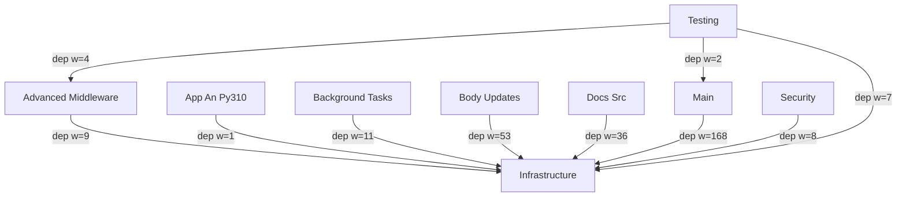

# fastapi Architecture

<!-- module-index:docs_src -->
## Response, WebSocket & File Upload Tutorials
**Response Customization, File Uploads, Streaming & WebSocket Tutorials** (50 files, 8012 tokens) — Documentation example modules covering FastAPI's HTTP response capabilities: additional OpenAPI response schemas (`additional_responses`), non-default status codes (`additional_status_codes`), custom response classes including HTML/streaming/file/orjson responses (`custom_response`), multiple file uploads (`request_files`), setting cookies and headers via response objects (`response_cookies`, `response_headers`), response model filtering with `response_model_exclude_unset/include/exclude` (`response_model`), streaming text and binary data with `StreamingResponse` (`stream_data`), and WebSocket echo + multi-client chat patterns (`websockets_`).
Key entry points: `StreamingResponse`, `WebSocket`, `ConnectionManager`, `response_model`, `response_model_exclude_unset`, `FileResponse`, `UploadFile`.
[→ DETAIL](docs_src/DETAIL.md)
<!-- end-module-index:docs_src -->

<!-- module-index:testing -->
## Test Client & Dependency Override Patterns
**Testing — Test Client Patterns & Dependency Override Examples** (6 files, 1530 tokens) — Documentation tutorials demonstrating FastAPI testing strategies: synchronous `TestClient`-based tests, multi-endpoint tests with header authentication, async tests using `httpx.AsyncClient` with `ASGITransport`, and dependency override testing for configuration isolation. These files serve as runnable documentation examples, not the FastAPI test suite itself.
Key entry points: `TestClient`, `app.dependency_overrides`, `pytest.mark.anyio`, `AsyncClient`.
[→ DETAIL](testing/DETAIL.md)
<!-- end-module-index:testing -->

<!-- module-index:advanced_middleware -->
## Middleware, App Setup & Core Tutorials
**Advanced Middleware, Core Tutorials & Application Infrastructure** (162 files, 14609 tokens) — Documents FastAPI's middleware re-exports (CORS, GZip, HTTPS redirect, trusted host, WSGI), the CLI entry point (`cli.py`, `__main__.py`), and a comprehensive set of documentation tutorials covering: first steps, request body patterns, nested models, path and query parameters, middleware configuration, CORS, settings management, OpenAPI metadata, path operation configuration, extra models, dataclasses support, OpenAPI callbacks/webhooks, separate input/output schemas, sub-application mounting, proxy configuration, Swagger UI configuration, testing infrastructure apps, Python type system reference, response status codes, GraphQL integration, debugging, and direct request access.
Key entry points: `fastapi/cli.py main()`, `CORSMiddleware`, `GZipMiddleware`, `HTTPSRedirectMiddleware`, `TrustedHostMiddleware`, `WSGIMiddleware`, `BaseSettings`, `@app.middleware("http")`.
[→ DETAIL](advanced_middleware/DETAIL.md)
<!-- end-module-index:advanced_middleware -->

<!-- module-index:app_an_py310 -->
## Bigger Applications: Multi-Router Structure Example
**Bigger Applications — Multi-Router FastAPI App Structure Example** (8 files, 719 tokens) — A complete documentation tutorial showing how to structure larger FastAPI applications using `APIRouter` for modular route organization. Demonstrates global app-level dependencies (`get_query_token`), router-level dependencies (`get_token_header`), sub-router composition, and relative imports across a multi-file package. The example covers items CRUD, user listing, and an authenticated admin endpoint.
Key entry points: `app` in `main.py`, `get_token_header()`, `get_query_token()`, `items.router`, `users.router`, `admin.router`.
[→ DETAIL](app_an_py310/DETAIL.md)
<!-- end-module-index:app_an_py310 -->

<!-- module-index:background_tasks -->
## Background Tasks, Static Files & Templates
**Background Tasks, Static Files & Template Serving** (13 files, 1420 tokens) — Documentation tutorials covering three FastAPI capabilities: background task scheduling with `BackgroundTasks` (both direct and dependency-injected patterns), serving static files via `StaticFiles` mount, and rendering Jinja2 HTML templates with `Jinja2Templates`. Also includes tutorials for customizing Swagger UI and ReDoc documentation pages. The `fastapi/staticfiles.py` and `fastapi/templating.py` files are thin re-export shims bridging Starlette capabilities into the FastAPI namespace.
Key entry points: `BackgroundTasks.add_task()`, `StaticFiles`, `Jinja2Templates.TemplateResponse()`, `get_swagger_ui_html()`.
[→ DETAIL](background_tasks/DETAIL.md)
<!-- end-module-index:background_tasks -->

<!-- module-index:main -->
## Security, SQL, Dependencies & Parameter Validation
**Main — Scripts, Security, SQL, Dependencies & Parameter Validation Tutorials** (197 files, 68539 tokens) — Covers the FastAPI documentation build infrastructure (`scripts/`), comprehensive security tutorials (OAuth2 password/JWT/scopes/Basic auth), SQL database integration with SQLModel, dependency injection patterns (yield deps, class deps, sub-deps, testing overrides), form/file upload handling, and the full parameter validation tutorial series (path numeric validation, query string validation, header/cookie/body models). Also includes WebSocket dependency injection, Pydantic v1 compatibility, and multiple tutorial app variants.
Key entry points: `scripts/docs.py`, `OAuth2PasswordBearer`, JWT `create_access_token()`, `get_session()` yield dependency, `Query(min_length, max_length, pattern)`, `Header()` model, `Cookie()` model, `UploadFile`, `Form()`.
[→ DETAIL](main/DETAIL.md)
<!-- end-module-index:main -->

<!-- module-index:security -->
## HTTP Auth & API Key Security Schemes
**Security — API Keys & HTTP Authentication Schemes** (7 files, 7727 tokens) — Implements all FastAPI security dependency classes: API key authentication via query param, header, or cookie (`APIKeyQuery`, `APIKeyHeader`, `APIKeyCookie`), HTTP Basic/Bearer/Digest authentication (`HTTPBasic`, `HTTPBearer`, `HTTPDigest`), and an OpenID Connect stub (`OpenIdConnect`). Each scheme is a callable dependency that extracts credentials from incoming requests and integrates with OpenAPI schema for `/docs` display.
Key entry points: `APIKeyHeader`, `APIKeyQuery`, `APIKeyCookie`, `HTTPBearer`, `HTTPBasic`, `OpenIdConnect`, `get_authorization_scheme_param()`.
[→ DETAIL](security/DETAIL.md)
<!-- end-module-index:security -->

<!-- module-index:body_updates -->
## Application Core, SSE & Advanced Route Patterns
**Body Updates, Application Configuration & Advanced Route Patterns** (52 files, 63146 tokens) — Documents the `FastAPI` application class (`applications.py`), concurrency utilities (`concurrency.py`), and a rich set of documentation tutorials covering: Server-Sent Events streaming, partial/full body updates with `jsonable_encoder`, error handling patterns, advanced OpenAPI path operation configuration, application lifespan management, custom OpenAPI schema extension, client code generation, direct response objects, WSGI app mounting, and custom `APIRoute` subclasses for request preprocessing.
Key entry points: `FastAPI.__init__()`, `FastAPI.openapi()`, `contextmanager_in_threadpool()`, `EventSourceResponse`, `@app.on_event`, `asynccontextmanager lifespan`.
[→ DETAIL](body_updates/DETAIL.md)
<!-- end-module-index:body_updates -->

<!-- module-index:infrastructure -->
## FastAPI Core: Types, DI Engine & OpenAPI
**Infrastructure — FastAPI Core API, Type System & Dependency Engine** (26 files, 75899 tokens) — The foundational layer of FastAPI. Includes the public namespace (`__init__.py`), all parameter declaration classes (`params.py`, `param_functions.py`), the dependency injection engine (`dependencies/utils.py`), JSON serialization (`encoders.py`), the full OpenAPI schema generation pipeline (`openapi/utils.py`, `openapi/models.py`, `openapi/docs.py`), all security base classes and OAuth2 implementations (`security/`), Pydantic v2 compatibility shims (`_compat/`), and shared utilities (`utils.py`, `datastructures.py`, `background.py`, `sse.py`). This module underpins every other FastAPI capability.
Key entry points: `FastAPI`, `APIRouter`, `Depends()`, `Query()`, `Body()`, `HTTPBearer`, `OAuth2PasswordBearer`, `jsonable_encoder()`, `get_openapi()`, `solve_dependencies()`.
[→ DETAIL](infrastructure/DETAIL.md)
<!-- end-module-index:infrastructure -->

<!-- codebase-explorer: end -->
