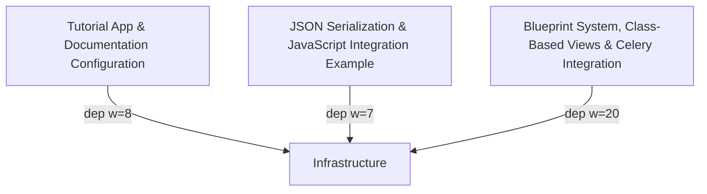

# flask Architecture

<!-- module-index:infrastructure -->
## Infrastructure & Shared Utilities
**Infrastructure & Shared Utilities** (16 files, 88609 tokens) — The core of Flask itself. Includes the WSGI application (`app.py`, `sansio/app.py`), context system (`globals.py`, `ctx.py`), HTTP wrappers (`wrappers.py`), configuration (`config.py`), session management (`sessions.py`), templating integration (`templating.py`), JSON utilities (`json/__init__.py`), CLI tooling (`cli.py`), test infrastructure (`testing.py`), request lifecycle utilities (`helpers.py`), blueprint registration system (`sansio/scaffold.py`, `sansio/blueprints.py`), public API (`__init__.py`), and the Flaskr blog tutorial demo. All other modules in the codebase depend on this layer.
Key entry points: `Flask`, `App`, `Blueprint`, `AppContext`, `current_app`, `request`, `g`, `session`, `ScriptInfo`.
[→ DETAIL](infrastructure/DETAIL.md)
<!-- end-module-index:infrastructure -->

<!-- module-index:conf -->
## Tutorial App & Documentation Configuration
**Tutorial App & Documentation Configuration** (5 files, 2714 tokens) — Groups the Sphinx documentation build configuration (`docs/conf.py`), the Celery integration entry point (`make_celery.py`), and the complete Flaskr tutorial application (`flaskr/__init__.py`, `auth.py`, `db.py`). The tutorial sub-package demonstrates the Flask application factory pattern, Blueprint-based routing with authentication, and SQLite database lifecycle management via Flask's `g` and teardown hooks.
Key entry points: `create_app()`, `login_required()`, `get_db()`, `init_app()`.
[→ DETAIL](conf/DETAIL.md)
<!-- end-module-index:conf -->

<!-- module-index:js_example -->
## JSON Serialization & JavaScript Integration Example
**JSON Serialization & JavaScript Integration Example** (5 files, 5663 tokens) — Combines Flask's JSON subsystem with a minimal JavaScript/AJAX example application. `provider.py` defines the `JSONProvider` abstraction and `DefaultJSONProvider` (used by all Flask apps for `jsonify` and JSON responses), while `tag.py` implements the tagged JSON serializer used for session cookie round-trip serialization. `logging.py` configures per-app loggers routing to WSGI error streams. The `js_example` app demonstrates these capabilities with XHR/jQuery/Fetch variants.
Key entry points: `DefaultJSONProvider`, `TaggedJSONSerializer`, `create_logger()`, `add()` (POST /add).
[→ DETAIL](js_example/DETAIL.md)
<!-- end-module-index:js_example -->

<!-- module-index:task_app -->
## Blueprint System, Class-Based Views & Celery Integration
**Blueprint System, Class-Based Views & Celery Integration** (9 files, 6832 tokens) — Covers Flask's Blueprint WSGI extension (`blueprints.py`), class-based view system (`views.py`), typed callback definitions (`typing.py`), Blinker lifecycle signals (`signals.py`), debug-mode error helpers (`debughelpers.py`), the `python -m flask` entry point (`__main__.py`), and a complete Celery+Flask background task example (`task_app/`). The Celery example demonstrates the `FlaskTask` pattern for running tasks within an application context.
Key entry points: `Blueprint`, `View`, `MethodView`, `create_app()` (celery example), `celery_init_app()`.
[→ DETAIL](task_app/DETAIL.md)
<!-- end-module-index:task_app -->

<!-- codebase-explorer: end -->
