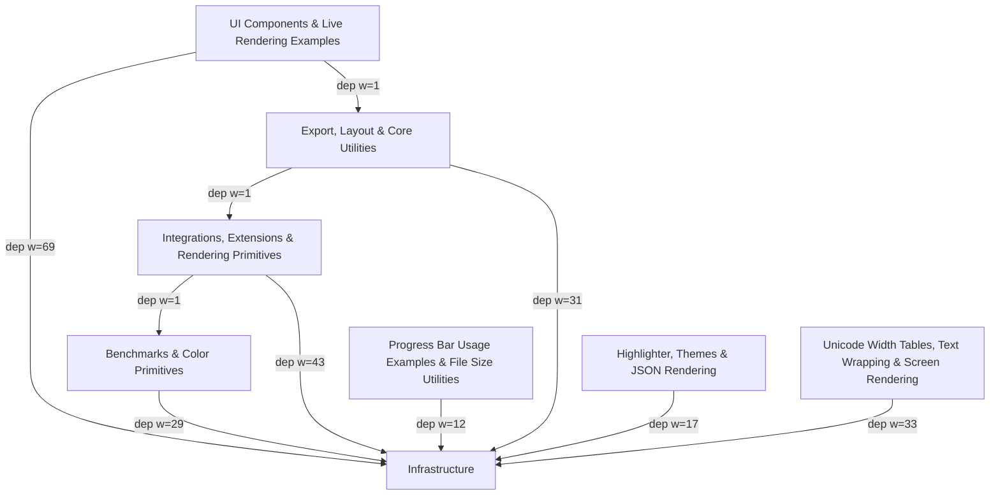

# rich Architecture

<!-- module-index:infrastructure -->
## Core Infrastructure — Console, Rendering, Styling & Layout
**Core Infrastructure — Console, Rendering, Styling & Layout** (45 files, ~180,000 tokens) — The foundational layer of the Rich library: the `Console` rendering hub, `Segment`/`Style`/`Text`/`Color` rendering primitives, the full layout system (`Table`, `Layout`, `Columns`, `Panel`, `Align`, `Padding`), live display management (`Live`), and all supporting utilities. Every user-facing feature in Rich is built on top of these infrastructure components.
Key entry points: `Console.print()`, `Console.render()`, `Text`, `Style`, `Segment`, `Table`, `Layout`, `Live`, `Progress`, `Traceback`, `Pretty`, `Syntax`.
[→ DETAIL](infrastructure/DETAIL.md)
<!-- end-module-index:infrastructure -->

<!-- module-index:unicode10-0-0 -->
## Unicode Width Tables, Text Wrapping & Screen Rendering
**Unicode Width Tables, Text Wrapping & Screen Rendering** (26 files, ~78,000 tokens) — Contains the 21 auto-generated Unicode character width data tables (versions 4.1.0–17.0.0) used for accurate terminal cell measurement, plus `_wrap.py` (cell-aware line break computation), `screen.py` (full-screen viewport renderable), and three developer tools for regenerating emoji and Unicode data tables.
Key entry points: `divide_line()`, `Screen.__rich_console__()`, `cell_table` (per unicode*.py version).
[→ DETAIL](unicode10-0-0/DETAIL.md)
<!-- end-module-index:unicode10-0-0 -->

<!-- module-index:benchmarks -->
## Benchmarks & Color Primitives
**Benchmarks & Color Primitives** (11 files, 12909 tokens) — Contains ASV benchmark suites for measuring Rich rendering performance across text, table, syntax, and color operations, plus the foundational color data types (`ColorTriplet`, color palettes) and platform adapters (`_windows.py`, `_windows_renderer.py`, `AnsiDecoder`) that the console rendering pipeline depends on.
Key entry points: `ProgressBar.__rich_console__()`, `AnsiDecoder.decode_line()`, `legacy_windows_render()`, `get_windows_console_features()`.
[→ DETAIL](benchmarks/DETAIL.md)
<!-- end-module-index:benchmarks -->

<!-- module-index:highlighter -->
## Highlighter, Themes & JSON Rendering
**Highlighter, Themes & JSON Rendering** (6 files, 4676 tokens) — Defines Rich's built-in theme system (`default_styles.py`, `themes.py`) with ~120 named styles, the `JSON` renderable for pretty-printing JSON data with syntax highlighting, and three example scripts demonstrating how to build custom `Highlighter` and `RegexHighlighter` subclasses.
Key entry points: `DEFAULT_STYLES`, `DEFAULT (Theme)`, `JSON.__init__()`, `JSON.from_data()`.
[→ DETAIL](highlighter/DETAIL.md)
<!-- end-module-index:highlighter -->

<!-- module-index:cp_progress -->
## Progress Bar Usage Examples & File Size Utilities
**Progress Bar Usage Examples & File Size Utilities** (6 files, 3305 tokens) — A collection of example scripts demonstrating Rich's progress bar system in real-world scenarios: file copying, concurrent URL downloads, multi-level nested progress, and file-stream wrapping. Also includes `filesize.py`, a utility for converting byte counts to human-readable SI strings.
Key entry points: `Progress`, `Progress.open()`, `wrap_file()`, `filesize.decimal()`.
[→ DETAIL](cp_progress/DETAIL.md)
<!-- end-module-index:cp_progress -->

<!-- module-index:conf -->
## Integrations, Extensions & Rendering Primitives
**Integrations, Extensions & Rendering Primitives** (16 files, ~39,000 tokens) — Contains Rich's integrations with external systems (IPython via `_extension.py`, Python logging via `RichHandler`, Sphinx docs via `conf.py`), plus core rendering primitives (`Markdown`, `Prompt`, `FileProxy`, `Inspect`, `RichRenderable` ABC) and internal utilities (`_spinners.py`, `_stack.py`). Example scripts demonstrate hyperlinks, columnar listing, `attrs` pretty-printing, repr decoration, and traceback suppression.
Key entry points: `RichHandler`, `Markdown`, `PromptBase.ask()`, `Inspect`, `load_ipython_extension()`, `FileProxy`.
[→ DETAIL](conf/DETAIL.md)
<!-- end-module-index:conf -->

<!-- module-index:export -->
## Export, Layout & Core Utilities
**Export, Layout & Core Utilities** (11 files, ~27,000 tokens) — Contains Console export/save methods (text, HTML, SVG) demonstrated via examples, the `python -m rich` demo card (`__main__.py`), the `EMOJI` lookup dict, the `_ratio.py` space-distribution algorithms for Layout/Table, versioned Unicode width table loader, and the library's exception hierarchy.
Key entry points: `Console.export_html()`, `Console.save_svg()`, `make_test_card()`, `ratio_resolve()`, `load()` (unicode_data), `EMOJI`.
[→ DETAIL](export/DETAIL.md)
<!-- end-module-index:export -->

<!-- module-index:bars -->
## UI Components & Live Rendering Examples
**UI Components & Live Rendering Examples** (25 files, 8954 tokens) — Contains the `Bar` (block-character range bar), `LiveRender` (in-place terminal update engine), `Status` (animated spinner), `Pager`/`SystemPager` (content pager), `_export_format.py` (HTML/SVG templates), and `_fileno.py` (safe file descriptor accessor), plus 17 example scripts demonstrating Rich's live rendering, layout, progress, and console capabilities.
Key entry points: `LiveRender.__rich_console__()`, `LiveRender.position_cursor()`, `Status.update()`, `Bar.__rich_console__()`, `get_fileno()`.
[→ DETAIL](bars/DETAIL.md)
<!-- end-module-index:bars -->

<!-- codebase-explorer: end -->
