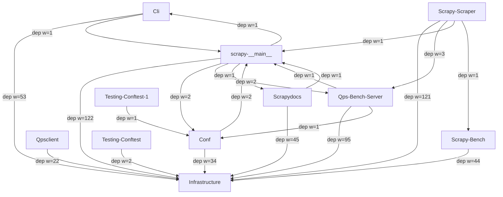

# scrapy Architecture

<!-- module-index:testing-conftest -->
## Testing-Conftest
**Root Test Configuration & Reactor Selection** (1 file, 1137 tokens) — Root-level pytest configuration that manages test collection exclusions, controls Twisted/asyncio reactor selection via a `--reactor` CLI option, and conditionally skips tests based on reactor compatibility markers and optional dependency availability. Initializes TLS certificates and provides a `MockServer` fixture for integration tests.
Key entry points: `pytest_configure()`, `pytest_runtest_setup()`, `mockserver` fixture.
[→ DETAIL](testing-conftest/DETAIL.md)
<!-- end-module-index:testing-conftest -->

<!-- module-index:testing-conftest-1 -->
## Testing-Conftest-1
**Docs Test Configuration** (1 file, 263 tokens) — Configures pytest to collect and run embedded doctests and Python code blocks from Scrapy's `.rst` documentation files using the `sybil` library. Provides a `load_response` helper that creates `HtmlResponse` fixtures from local test data files, enabling documentation examples to be verified as part of the test suite.
Key entry points: `load_response()`, `pytest_collect_file`.
[→ DETAIL](testing-conftest-1/DETAIL.md)
<!-- end-module-index:testing-conftest-1 -->

<!-- module-index:scrapydocs -->
## Scrapydocs
**Download Handlers, TLS Context Factories, HTTP/2 Client & Doc Tooling** (17 files, 15086 tokens) — Provides specialized download handlers for FTP, S3, HTTP/2, data URIs, local files, and httpx-based HTTP(S); TLS context factories (`ScrapyClientContextFactory`, `BrowserLikeContextFactory`) and custom TLS options; the HTTP/2 connection pool and agent (`H2ConnectionPool`, `H2Agent`); Sphinx documentation extensions for Scrapy-specific cross-references; and a benchmark HTTP server for throughput testing.
Key entry points: `FTPDownloadHandler`, `S3DownloadHandler`, `H2DownloadHandler`, `HttpxDownloadHandler`, `ScrapyClientContextFactory`, `H2ConnectionPool`.
[→ DETAIL](scrapydocs/DETAIL.md)
<!-- end-module-index:scrapydocs -->

<!-- module-index:qps-bench-server -->
## Qps-Bench-Server
**Middleware Managers, Downloader Middlewares, Exporters & Core Abstractions** (20 files, 18122 tokens) — Provides the QPS benchmark server, the `MiddlewareManager` base class and concrete managers (`DownloaderMiddlewareManager`, `SpiderMiddlewareManager`, `ExtensionManager`, `ItemPipelineManager`), downloader middlewares for cookies (`CookiesMiddleware`), proxies (`HttpProxyMiddleware`), offsite filtering (`OffsiteMiddleware`), redirects (`RedirectMiddleware`, `MetaRefreshMiddleware`), and stats (`DownloaderStats`). Also includes item exporters (`BaseItemExporter` + 7 concrete formats), HTTP cache extension, robots.txt parsing, the `signals` module, `CrawlSpider`, and deprecated HTTP/1.0 webclient helpers.
Key entry points: `MiddlewareManager`, `DownloaderMiddlewareManager`, `SpiderMiddlewareManager`, `CrawlSpider`, `BaseItemExporter`, `CookiesMiddleware`, `RedirectMiddleware`, `signals`.
[→ DETAIL](qps-bench-server/DETAIL.md)
<!-- end-module-index:qps-bench-server -->

<!-- module-index:scrapy-__main__ -->
## scrapy-__main__
**核心入口与基础设施** — 框架启动入口、CLI 调度、调度器、HTTP/2 协议栈、缓存/限速/Feed 导出等核心扩展，以及表单请求、ItemLoader、交互式 Shell、DNS 解析等基础设施。

**关键文件**：
- `scrapy/__main__.py` + `scrapy/cmdline.py` — CLI 入口与命令调度
- `scrapy/core/scheduler.py` — 请求调度（优先级队列 + 去重）
- `scrapy/core/http2/protocol.py` + `scrapy/core/http2/stream.py` — HTTP/2 连接与流管理
- `scrapy/extensions/feedexport.py` — Feed 导出（JSON/CSV/XML + 多后端）
- `scrapy/downloadermiddlewares/httpcache.py` — HTTP 缓存中间件
- `scrapy/extensions/throttle.py` — 自动限速（EWMA）
- `scrapy/http/request/form.py` — FormRequest + from_response 表单解析

**对外接口**：
- `execute()` (cmdline) — CLI 主入口
- `Scheduler.enqueue_request/next_request` — 调度器接口
- `FormRequest.from_response()` — 表单提交快捷方式
- `ItemLoader.add_xpath/add_css/load_item` — Item 构建
- `Shell.start/fetch` — 交互式调试
[→ DETAIL](scrapy-__main__/DETAIL.md)
<!-- end-module-index:scrapy-__main__ -->

<!-- module-index:scrapy-scraper -->
## Scrapy-Scraper
**Core Scraping Engine, Pipelines & Extensions** (18 files, 24243 tokens) — Provides the `Downloader` (concurrent download manager with slot-based throttling), `Scraper` (spider callback processor + item pipeline router), `DownloadHandlers` (scheme-to-handler dispatcher), `MediaPipeline`/`FilesPipeline`/`ImagesPipeline` (media download with cloud storage backends), `SignalManager` (signal dispatch bus), scheduler queues (`squeues`), and key extensions (`CloseSpider`, `LogStats`, `MemoryUsage`). Also includes downloader middlewares for robots.txt (`RobotsTxtMiddleware`), User-Agent (`UserAgentMiddleware`), download timeout, log formatting (`LogFormatter`), and deprecated test utilities.
Key entry points: `Downloader`, `Scraper`, `FilesPipeline`, `ImagesPipeline`, `SignalManager`, `CloseSpider`, `RobotsTxtMiddleware`.
[→ DETAIL](scrapy-scraper/DETAIL.md)
<!-- end-module-index:scrapy-scraper -->

<!-- module-index:conf -->
## Conf
**HTTP Layer, Selectors, Link Extraction & Dev Tools** (18 files, 12800 tokens) — Provides Scrapy's complete HTTP abstraction layer (`Request`, `Response`, `TextResponse`, `HtmlResponse`, `JsonRequest`, `XmlRpcRequest`), CSS/XPath/JMESPath selectors (`Selector`, `SelectorList` wrapping parsel), link extraction (`LxmlLinkExtractor`), the `Link` dataclass, developer CLI tools (`scrapy shell`, `scrapy view`), downloader middlewares for Basic Auth and deprecated AJAX crawling, and the Sphinx documentation build configuration.
Key entry points: `Request`, `Response`, `TextResponse`, `HtmlResponse`, `Selector`, `LxmlLinkExtractor`, `JsonRequest`, `HttpAuthMiddleware`.
[→ DETAIL](conf/DETAIL.md)
<!-- end-module-index:conf -->

<!-- module-index:qpsclient -->
## Qpsclient
**Spider Extensions: Feed Parsers, Sitemap Crawler & QPS Benchmark** (6 files, 7434 tokens) — Provides specialized spider base classes (`XMLFeedSpider`, `CSVFeedSpider`, `SitemapSpider`) for structured feed and sitemap crawling, HTTP compression decompression middleware (`HttpCompressionMiddleware`), low-level sitemap XML parsing utilities, and a QPS benchmark spider (`QPSSpider`) for throughput testing. `SitemapSpider` and `HttpCompressionMiddleware` are core production components; `QPSSpider` is a developer tool.
Key entry points: `XMLFeedSpider`, `CSVFeedSpider`, `SitemapSpider`, `HttpCompressionMiddleware.from_crawler()`.
[→ DETAIL](qpsclient/DETAIL.md)
<!-- end-module-index:qpsclient -->

<!-- module-index:scrapy-bench -->
## Scrapy-Bench
**Benchmarking, Core Stats, Debug Extensions & Spider Middlewares** (11 files, 9070 tokens) — Provides the `scrapy bench` command and benchmark spider for throughput testing, core stats recording (`CoreStats`), debugging utilities (`StackTraceDump`, `Debugger`), log counting (`LogCount`), deprecated stats email notification (`StatsMailer`, `MailSender`), and three spider middlewares for depth limiting, start-request marking, and URL length filtering. Also includes OS signal management and test utility helpers.
Key entry points: `Command` (bench), `CoreStats`, `DepthMiddleware`, `UrlLengthMiddleware`, `get_crawler()`, `install_shutdown_handlers()`.
[→ DETAIL](scrapy-bench/DETAIL.md)
<!-- end-module-index:scrapy-bench -->

<!-- module-index:cli -->
## Cli
**CLI Commands, Contracts, Dupefilters & Core Settings** (20 files, 9548 tokens) — Implements all Scrapy CLI subcommands (`check`, `crawl`, `edit`, `fetch`, `genspider`, `list`, `runspider`, `settings`, `startproject`, `version`), the contract testing framework (`Contract`, `ContractsManager`, `UrlContract`, `ReturnsContract`, `ScrapesContract`), duplicate request filtering (`BaseDupeFilter`, `RFPDupeFilter`), the `HttpErrorMiddleware` spider middleware, `SpiderState` persistence extension, `ISpiderLoader` interface, and the `default_settings.py` canonical settings reference.
Key entry points: `scrapy crawl`, `scrapy check`, `scrapy genspider`, `scrapy startproject`, `RFPDupeFilter`, `ContractsManager`, `HttpErrorMiddleware`.
[→ DETAIL](cli/DETAIL.md)
<!-- end-module-index:cli -->

<!-- module-index:infrastructure -->
## infrastructure
**框架基础设施** — 执行引擎、Crawler 运行时、HTTP/1.1 下载处理器、Settings 系统、Spider 基类、SpiderLoader、Item/异常/Stats 数据模型，以及约 30 个 utils 工具模块（defer、misc、python、datatypes、log、reactor、request、response、url 等）。

**关键文件**：
- `scrapy/core/engine.py` — ExecutionEngine（驱动整个爬虫生命周期）
- `scrapy/crawler.py` — Crawler / CrawlerProcess / CrawlerRunner
- `scrapy/settings/__init__.py` — 多优先级配置系统
- `scrapy/core/downloader/handlers/http11.py` — 默认 HTTP/1.1 下载处理器
- `scrapy/spiders/__init__.py` — Spider 基类
- `scrapy/utils/defer.py` — Deferred/asyncio 互操作
- `scrapy/utils/misc.py` — build_from_crawler / load_object
- `scrapy/utils/request.py` — RequestFingerprinter（去重指纹）

**对外接口**：
- `ExecutionEngine.start/stop/crawl`
- `Crawler.crawl()`, `CrawlerProcess.crawl()`
- `Settings.get/set/getbool/getlist/getdict`
- `Spider.start_requests/parse/from_crawler`
- `deferred_from_coro/maybe_deferred_to_future`
- `build_from_crawler(cls, crawler)`
[→ DETAIL](infrastructure/DETAIL.md)
<!-- end-module-index:infrastructure -->

<!-- codebase-explorer: end -->
