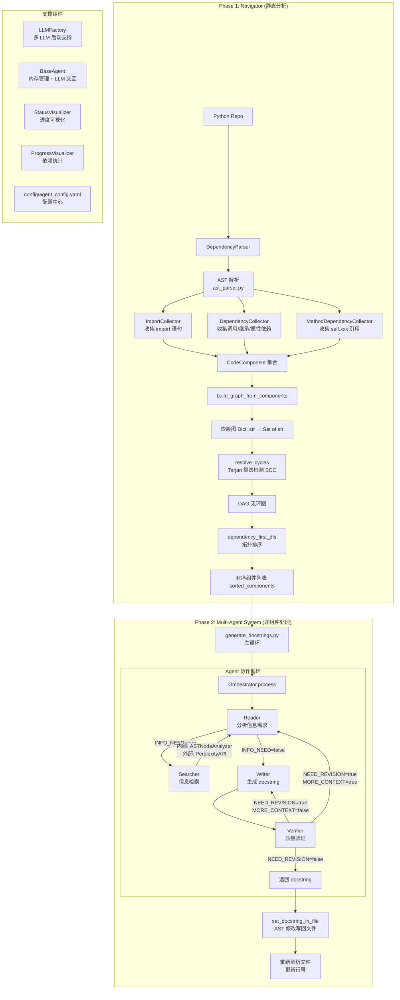
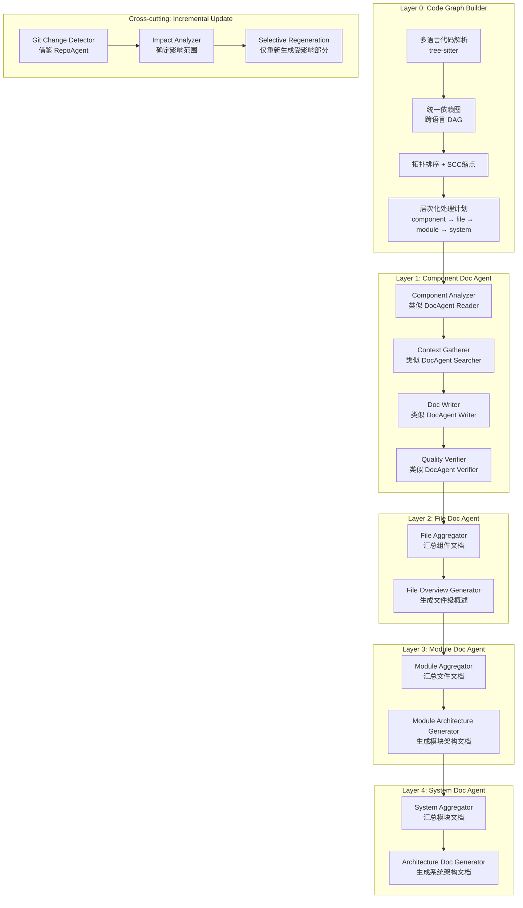

# 研究报告 03：DocAgent 多Agent架构深度分析

> **研究状态**：✅ 完成
> **数据来源**：DocAgent 论文 (arXiv:2504.08725v3, ACL 2025)、GitHub 源代码全文阅读、RepoAgent 对比研究
> **最后更新**：2026-03-21

---

## 目录

1. [DocAgent 完整架构图](#1-docagent-完整架构图)
2. [Navigator 模块详细分析](#2-navigator-模块详细分析)
3. [Agent 协作模式提取](#3-agent-协作模式提取)
4. [可复用的设计模式清单](#4-可复用的设计模式清单)
5. [DocAgent 局限性分析](#5-docagent-局限性分析)
6. [与 RepoAgent 的对比](#6-与-repoagent-的对比)
7. [对我们系统的设计建议](#7-对我们系统的设计建议)

---

## 1. DocAgent 完整架构图

### 1.1 系统全局架构 (基于源代码验证)



### 1.2 源代码目录结构 (已验证)

```
DocAgent/
├── generate_docstrings.py          # 主入口，主循环 + AST 写回
├── config/
│   └── example_config.yaml         # LLM/流控/Perplexity 配置
├── src/
│   ├── dependency_analyzer/        # Navigator 模块
│   │   ├── __init__.py             # 导出 CodeComponent, DependencyParser, topo_sort 等
│   │   ├── ast_parser.py           # AST 解析 + 依赖收集 (~500行)
│   │   └── topo_sort.py            # 拓扑排序 + 环检测 (~200行)
│   ├── agent/                      # 多 Agent 框架
│   │   ├── base.py                 # BaseAgent: 内存 + LLM 调用
│   │   ├── reader.py               # Reader: 信息需求判断
│   │   ├── searcher.py             # Searcher: 内部AST + 外部API检索
│   │   ├── writer.py               # Writer: docstring 生成
│   │   ├── verifier.py             # Verifier: 质量验证
│   │   ├── orchestrator.py         # Orchestrator: 流程编排 (~350行)
│   │   ├── workflow.py             # 简化入口函数
│   │   ├── llm/                    # LLM 工厂 + 基类
│   │   │   ├── factory.py
│   │   │   └── base.py
│   │   └── tool/                   # Agent 工具
│   │       ├── internal_traverse.py # ASTNodeAnalyzer
│   │       └── perplexity_api.py   # Perplexity web 搜索
│   ├── evaluator/                  # 评估系统
│   ├── visualizer/                 # 进度可视化
│   ├── web/                        # Web UI
│   └── web_eval/                   # 评估 Web UI
```

### 1.3 数据流概览

```
[Python Repo Files]
    ↓ (AST 解析)
[CodeComponent 集合] → {id, node, type, file_path, depends_on, source_code, has_docstring}
    ↓ (build_graph_from_components)
[依赖图: Dict[str, Set[str]]]
    ↓ (resolve_cycles → Tarjan SCC)
[DAG]
    ↓ (dependency_first_dfs)
[sorted_components: List[str]]
    ↓ (顺序迭代)
[Per Component] → Orchestrator.process() → docstring
    ↓ (AST 修改)
[Updated Python File]
```

---

## 2. Navigator 模块详细分析

### 2.1 输入

| 输入          | 格式              | 来源                          |
| ------------- | ----------------- | ----------------------------- |
| 仓库路径      | `str` (repo_path) | CLI 参数 `--repo-path`        |
| Python 源文件 | `*.py` 文件       | `os.walk(repo_path)` 递归扫描 |

### 2.2 处理流程 — 三遍扫描策略

**源代码文件**: `src/dependency_analyzer/ast_parser.py`

#### 第一遍：组件收集 (`_parse_file` + `_collect_components`)

```python
# 遍历 AST 树，收集三类组件：
for node in ast.walk(tree):
    if isinstance(node, ast.ClassDef):
        # → CodeComponent(type="class", id="module.ClassName")
        for item in node.body:
            if isinstance(item, (ast.FunctionDef, ast.AsyncFunctionDef)):
                # → CodeComponent(type="method", id="module.ClassName.method_name")

    elif isinstance(node, (ast.FunctionDef, ast.AsyncFunctionDef)):
        if isinstance(node.parent, ast.Module):  # 仅顶层函数
            # → CodeComponent(type="function", id="module.func_name")
```

**组件 ID 格式**：`模块路径.组件名`，如 `src.agent.orchestrator.Orchestrator.process`

#### 第二遍：依赖解析 (`_resolve_dependencies`)

通过三个 AST Visitor 收集依赖关系：

| Visitor 类                  | 追踪的依赖类型                       | AST 节点类型                                                  |
| --------------------------- | ------------------------------------ | ------------------------------------------------------------- |
| `ImportCollector`           | `import x` / `from x import y`       | `ast.Import`, `ast.ImportFrom`                                |
| `DependencyCollector`       | 函数调用、类引用、属性访问、基类继承 | `ast.Call`, `ast.Name`, `ast.Attribute`, `ast.ClassDef.bases` |
| `MethodDependencyCollector` | `self.xxx` 方法间引用                | `ast.Attribute` (where value is `self`)                       |

**依赖过滤规则**（来自源码）：

- 排除 Python 内置类型 (`builtins`)
- 排除标准库模块 (`abc, argparse, asyncio, ...` 共30+个)
- 排除 `self`, `cls`
- 排除局部变量 (通过 `visit_Assign` 追踪)
- 仅保留仓库内模块的依赖 (`dep in self.modules`)

```python
# DependencyCollector._add_dependency 核心逻辑
def _add_dependency(self, name):
    if name in BUILTIN_TYPES: return
    if name in EXCLUDED_NAMES: return
    if name in self.local_variables: return

    # 检查是否从仓库模块导入
    for module, imported_names in self.from_imports.items():
        if module in STANDARD_MODULES: continue
        if name in imported_names and module in self.repo_modules:
            self.dependencies.add(f"{module}.{name}")
            return

    # 当前模块内引用
    self.dependencies.add(f"{self.current_module}.{name}")
```

#### 第三遍：类-方法依赖 (`_add_class_method_dependencies`)

```python
# 关键设计：类依赖于其方法（而非反过来）
# 这确保方法先于类被处理
for class_id, method_ids in class_methods.items():
    if class_id in self.components:
        for method_id in method_ids:
            if not method_id.endswith(".__init__"):  # __init__ 除外
                self.components[class_id].depends_on.add(method_id)
```

### 2.3 DAG 构建与拓扑排序

**源代码文件**: `src/dependency_analyzer/topo_sort.py`

#### 环检测：Tarjan 强连通分量算法

```python
def detect_cycles(graph) -> List[List[str]]:
    """使用 Tarjan 算法检测强连通分量 (SCC)"""
    # 标准 Tarjan 实现
    # 仅返回包含 >1 个节点的 SCC（真正的环）

def resolve_cycles(graph) -> Dict[str, Set[str]]:
    """打破环：移除每个 SCC 中的一条边"""
    for cycle in cycles:
        for j in range(len(cycle) - 1):
            current, next_node = cycle[j], cycle[j + 1]
            if next_node in new_graph[current]:
                new_graph[current].remove(next_node)
                break  # 每个 SCC 只断一条边
```

> ⚠️ **局限性注意**：环的处理策略非常简单——仅移除每个 SCC 中遇到的第一条边。没有使用启发式方法选择"最弱"的边。论文中提到 "condensed into a single super node"，但源代码实际是断边而非缩点。

#### DFS 拓扑排序 (`dependency_first_dfs`)

```python
def dependency_first_dfs(graph):
    """基于 DFS 的拓扑排序，确保依赖先处理"""
    acyclic_graph = resolve_cycles(graph)

    # 找到根节点（无入边的节点）
    root_nodes = [n for n in graph if not has_incoming_edge[n]]

    def dfs(node):
        if node in visited: return
        visited.add(node)
        for dep in sorted(graph.get(node, set())):
            dfs(dep)  # 先递归处理所有依赖
        result.append(node)  # 后序：依赖在前

    for root in sorted(root_nodes):
        dfs(root)
```

### 2.4 输出

| 输出                | 格式                       | 用途                                |
| ------------------- | -------------------------- | ----------------------------------- |
| `sorted_components` | `List[str]`                | 有序的组件 ID 列表，指导处理顺序    |
| `dependency_graph`  | `Dict[str, List[str]]`     | JSON 文件，供 Searcher 查询依赖关系 |
| `components`        | `Dict[str, CodeComponent]` | 完整组件信息，包含源码、行号等      |

---

## 3. Agent 协作模式提取

### 3.1 通信拓扑：嵌套循环管道式

DocAgent 的 Agent 通信**既不是纯管道式也不是图式**，而是**嵌套循环管道式** (Nested-Loop Pipeline):

```
┌─────────────────────────────────────────────────────────┐
│ 外循环 (Reader-Searcher Context Loop)                    │
│   max_reader_search_attempts (默认=2, 配置可达4)          │
│                                                         │
│   Reader ──(INFO_NEED=true)──→ Searcher ──→ 更新Context  │
│     ↑                                          │        │
│     └──────────── (继续分析) ←───────────────────┘        │
│                                                         │
│   Reader ──(INFO_NEED=false)──→                         │
│                                                         │
│   ┌─────────────────────────────────────────────┐       │
│   │ 内循环 (Writer-Verifier Refinement Loop)      │       │
│   │   max_verifier_rejections (默认=1, 配置可达3)  │       │
│   │                                             │       │
│   │   Writer ──→ Verifier                       │       │
│   │     ↑           │                           │       │
│   │     │    NEED_REVISION=true                  │       │
│   │     │    MORE_CONTEXT=false                  │       │
│   │     └───(改进建议)───┘                        │       │
│   │                                             │       │
│   │   Verifier ──(NEED_REVISION=true,            │       │
│   │              MORE_CONTEXT=true)──→ break     │       │
│   │      → 回到外循环 Reader                      │       │
│   │                                             │       │
│   │   Verifier ──(NEED_REVISION=false)──→ 完成   │       │
│   └─────────────────────────────────────────────┘       │
└─────────────────────────────────────────────────────────┘
```

### 3.2 各 Agent 输入/输出接口 (基于源码)

#### Reader (`reader.py`)

| 维度         | 详情                                                                 |
| ------------ | -------------------------------------------------------------------- |
| **输入**     | `focal_component: str` (源代码), `context: str` (当前上下文)         |
| **输出**     | 自由文本分析 + `<INFO_NEED>true/false</INFO_NEED>` + `<REQUEST>` XML |
| **系统提示** | 详细的信息需求分析指令，区分内部/外部请求                            |
| **内存管理** | 系统提示 → 用户消息（代码+上下文）→ LLM 响应                         |

**Reader 输出的 XML 格式**：

```xml
<INFO_NEED>true</INFO_NEED>
<REQUEST>
    <INTERNAL>
        <CALLS>
            <CLASS>class1,class2</CLASS>
            <FUNCTION>func1,func2</FUNCTION>
            <METHOD>self.method1,instance.method2</METHOD>
        </CALLS>
        <CALL_BY>true/false</CALL_BY>
    </INTERNAL>
    <RETRIEVAL>
        <QUERY>query1,query2</QUERY>
    </RETRIEVAL>
</REQUEST>
```

#### Searcher (`searcher.py`)

| 维度           | 详情                                                                                             |
| -------------- | ------------------------------------------------------------------------------------------------ |
| **输入**       | `reader_response: str`, `ast_node`, `ast_tree`, `dependency_graph`, `focal_node_dependency_path` |
| **输出**       | `Dict` 结构化结果                                                                                |
| **不使用 LLM** | Searcher 是唯一不依赖 LLM 的 Agent，完全靠工具执行                                               |
| **工具**       | `ASTNodeAnalyzer`（内部代码检索）+ `PerplexityAPI`（外部知识）                                   |

**Searcher 输出格式**：

```python
{
    'internal': {
        'calls': {
            'class': {'ClassName': '源代码内容', ...},
            'function': {'func_name': '源代码内容', ...},
            'method': {'method_name': '源代码内容', ...}
        },
        'called_by': ['调用此组件的代码片段1', ...]
    },
    'external': {
        'query1': 'Perplexity API 返回的答案',
        'query2': '...'
    }
}
```

#### Writer (`writer.py`)

| 维度         | 详情                                            |
| ------------ | ----------------------------------------------- |
| **输入**     | `focal_component: str`, `context: Dict`         |
| **输出**     | `<DOCSTRING>...</DOCSTRING>` 包裹的 docstring   |
| **特殊处理** | 根据组件类型切换 class_prompt / function_prompt |
| **输出解析** | `extract_docstring()` 从 XML 标签中提取         |

**Writer 的双模式提示**：

- **类模式 (`class_prompt`)**: 聚焦对象表示、系统角色；包含 Summary/Description/Example/Parameters/Attributes
- **函数/方法模式 (`function_prompt`)**: 聚焦动作效果；包含 Summary/Description/Args/Returns/Raises/Examples

#### Verifier (`verifier.py`)

| 维度         | 详情                                                               |
| ------------ | ------------------------------------------------------------------ |
| **输入**     | `focal_component: str`, `docstring: str`, `context: str`           |
| **输出**     | `<NEED_REVISION>true/false</NEED_REVISION>` + conditional tags     |
| **评估标准** | 信息价值、细节层级、完整性                                         |
| **反馈机制** | `<MORE_CONTEXT>` 触发回到 Reader; `<SUGGESTION>` 直接反馈给 Writer |

**Verifier 输出决策树**：

```
NEED_REVISION = false → 接受 docstring
NEED_REVISION = true →
  MORE_CONTEXT = true → <SUGGESTION_CONTEXT>为什么需要额外上下文</SUGGESTION_CONTEXT>
  MORE_CONTEXT = false → <SUGGESTION>具体改进建议</SUGGESTION>
```

#### Orchestrator (`orchestrator.py`)

| 维度           | 详情                                                                                                                            |
| -------------- | ------------------------------------------------------------------------------------------------------------------------------- |
| **输入**       | `focal_component`, `file_path`, `ast_node`, `ast_tree`, `dependency_graph`, `focal_node_dependency_path`, `token_consume_focal` |
| **输出**       | 最终的 docstring 字符串                                                                                                         |
| **状态管理**   | `self.context` (XML 结构化上下文字符串), 计数器                                                                                 |
| **上下文管理** | `_update_context()` 合并搜索结果, `_constrain_context_length()` Token 截断                                                      |

### 3.3 上下文管理机制 (关键设计)

Orchestrator 维护一个 **XML 结构化上下文字符串**:

```xml
<CONTEXT>
<INTERNAL_INFO>
  <CLASS>
    <ClassName>类的源代码</ClassName>
  </CLASS>
  <FUNCTION>
    <func_name>函数源代码</func_name>
  </FUNCTION>
  <METHOD>
    <method_name>方法源代码</method_name>
  </METHOD>
  <CALL_BY>
    调用此组件的代码片段
  </CALL_BY>
</INTERNAL_INFO>
<EXTERNAL_RETRIEVAL_INFO>
  <QUERY>查询</QUERY>
  <r>结果</r>
</EXTERNAL_RETRIEVAL_INFO>
</CONTEXT>
```

**上下文长度约束** (`_constrain_context_length`):

```python
# 当 context_tokens + focal_tokens > max_input_tokens 时：
# 1. 找到最长的 XML section
# 2. 从末尾截断该 section 的内容
# 3. 使用 tiktoken (cl100k_base) 进行 token 计数
```

### 3.4 迭代终止条件 (基于源码精确分析)

| 条件                         | 默认值 | 配置键                                    | 作用                  |
| ---------------------------- | ------ | ----------------------------------------- | --------------------- |
| Reader-Searcher 最大尝试次数 | 2      | `flow_control.max_reader_search_attempts` | 外循环上限            |
| Verifier 最大拒绝次数        | 1      | `flow_control.max_verifier_rejections`    | 内循环上限            |
| INFO_NEED=false              | -      | Reader 判断                               | 跳出外循环进入 Writer |
| NEED_REVISION=false          | -      | Verifier 判断                             | 接受当前 docstring    |
| 组件 > 10000 tokens          | -      | 硬编码                                    | 截断组件代码          |

> 💡 **重要发现**：默认配置中 `max_reader_search_attempts=2`, `max_verifier_rejections=1`，意味着大多数组件只有 **1-2 轮 Reader-Searcher + 1 轮 Writer-Verifier** 的交互。这是一个 **非常保守的迭代策略**。

### 3.5 内存管理与错误恢复

**内存管理**（源码分析）：

```python
# 每个 Agent 维护独立的 _memory: List[Dict]
# Orchestrator 管理各 Agent 的内存生命周期：

# 1. Reader: 上下文更新时 refresh_memory (完全替换)
# 2. Writer: Verifier 拒绝时 clear_memory; 改进建议通过 add_to_memory("user", suggestion)
# 3. Verifier: 每次评估后 clear_memory
# 4. 上下文通过 Orchestrator.context 字符串共享，不通过 Agent 内存
```

**错误恢复**（有限）：

- 组件处理失败：`try/except` 捕获异常，记录错误，跳过该组件继续处理下一个
- 文件写回后重新解析：确保同文件后续组件的行号准确
- 无显式重试机制；Perplexity API 失败返回错误字符串而非崩溃

---

## 4. 可复用的设计模式清单

### 模式 1：依赖感知的拓扑处理顺序 (Dependency-Aware Topological Processing)

| 维度              | 内容                                                                                           |
| ----------------- | ---------------------------------------------------------------------------------------------- |
| **模式名称**      | 依赖感知拓扑处理                                                                               |
| **DocAgent 映射** | `DependencyParser` → `build_graph_from_components` → `resolve_cycles` → `dependency_first_dfs` |
| **适用场景**      | 任何需要按依赖序处理代码单元的场景（文档生成、代码分析、重构规划）                             |
| **核心价值**      | 确保处理 A 时，A 的所有依赖已被处理。消除传递上下文爆炸问题。                                  |

**在我们系统中的应用**：

```python
class DependencyAwareProcessor:
    """可复用的依赖感知处理器"""

    def __init__(self, graph_builder, cycle_handler="break_edge"):
        self.graph_builder = graph_builder  # 支持插件化图构建器
        self.cycle_handler = cycle_handler

    def process_in_order(self, items, processor_fn):
        """按依赖顺序处理所有项目"""
        graph = self.graph_builder.build(items)

        if self.cycle_handler == "break_edge":
            graph = self._break_cycles(graph)
        elif self.cycle_handler == "condense":
            graph = self._condense_cycles(graph)  # 改进：真正的缩点

        ordered = self._topological_sort(graph)

        results = {}
        for item_id in ordered:
            # 处理时已经可以访问所有依赖的结果
            dep_results = {dep: results[dep] for dep in graph[item_id] if dep in results}
            results[item_id] = processor_fn(items[item_id], dep_results)

        return results
```

### 模式 2：Reader-Searcher 信息需求驱动检索 (Need-Driven Information Retrieval)

| 维度              | 内容                                                              |
| ----------------- | ----------------------------------------------------------------- |
| **模式名称**      | 信息需求驱动检索                                                  |
| **DocAgent 映射** | `Reader.process()` → XML 请求 → `Searcher.process()` → 结构化结果 |
| **适用场景**      | 任何需要先评估"需要什么信息"再检索的场景                          |
| **核心价值**      | 避免盲目检索所有上下文；由分析型 Agent 决定检索范围               |

**代码草案**：

```python
class InformationNeedAnalyzer:
    """分析代码组件的信息需求"""

    def analyze(self, code, existing_context) -> InformationRequest:
        """返回结构化的信息请求"""
        response = self.llm.generate(
            system_prompt=self.analysis_prompt,
            user_input=f"代码: {code}\n已有上下文: {existing_context}"
        )
        return self._parse_request(response)

    def _parse_request(self, response) -> InformationRequest:
        return InformationRequest(
            internal_deps=self._extract_deps(response),
            external_queries=self._extract_queries(response),
            needs_callers=self._extract_caller_need(response),
            confidence=self._extract_confidence(response)
        )

class ContextSearcher:
    """根据信息需求执行检索"""

    def __init__(self, code_index, web_searcher=None):
        self.code_index = code_index
        self.web_searcher = web_searcher

    def search(self, request: InformationRequest) -> SearchResult:
        result = SearchResult()

        for dep in request.internal_deps:
            result.add_internal(dep, self.code_index.get_source(dep))

        if request.needs_callers:
            result.add_callers(self.code_index.get_callers(request.focal_id))

        if request.external_queries and self.web_searcher:
            for query in request.external_queries:
                result.add_external(query, self.web_searcher.search(query))

        return result
```

### 模式 3：Writer-Verifier 迭代精炼 (Iterative Refinement with Verification)

| 维度              | 内容                                                            |
| ----------------- | --------------------------------------------------------------- |
| **模式名称**      | 生成-验证迭代精炼                                               |
| **DocAgent 映射** | `Writer.process()` → `Verifier.process()` → 条件反馈            |
| **适用场景**      | 任何 LLM 生成内容需要质量保障的场景                             |
| **核心价值**      | 用独立 Agent 评估质量，区分"需要更多上下文"和"需要改写"两类问题 |

**代码草案**：

```python
class IterativeRefiner:
    """通用的生成-验证迭代精炼器"""

    def __init__(self, generator, verifier, max_iterations=3):
        self.generator = generator
        self.verifier = verifier
        self.max_iterations = max_iterations

    def refine(self, input_data, context) -> RefinementResult:
        for i in range(self.max_iterations):
            output = self.generator.generate(input_data, context)

            feedback = self.verifier.verify(input_data, output, context)

            if feedback.is_acceptable:
                return RefinementResult(output=output, iterations=i+1)

            if feedback.needs_more_context:
                # 回到上层处理（升级问题）
                return RefinementResult(
                    output=output,
                    needs_escalation=True,
                    escalation_reason=feedback.context_suggestion
                )

            # 将改进建议注入下一轮
            self.generator.add_improvement_hint(feedback.suggestion)

        # 达到最大迭代次数，返回最后结果
        return RefinementResult(output=output, iterations=self.max_iterations, forced=True)
```

### 模式 4：嵌套循环编排 (Nested-Loop Orchestration)

| 维度              | 内容                                                              |
| ----------------- | ----------------------------------------------------------------- |
| **模式名称**      | 嵌套循环编排模式                                                  |
| **DocAgent 映射** | `Orchestrator.process()` 中的双层 while 循环                      |
| **适用场景**      | 当 Agent 工作流需要"收集信息"和"生产内容"两个独立但互相关联的阶段 |
| **核心价值**      | 外循环负责信息充分性，内循环负责内容质量，职责清晰                |

**代码草案**：

```python
class NestedLoopOrchestrator:
    """嵌套循环编排器"""

    def __init__(self, config):
        self.max_context_rounds = config.get('max_context_rounds', 3)
        self.max_refinement_rounds = config.get('max_refinement_rounds', 2)

    def orchestrate(self, task):
        context = Context()
        context_round = 0

        # 外循环：信息收集
        while True:
            need = self.analyzer.analyze(task, context)

            if need.is_sufficient or context_round >= self.max_context_rounds:
                break

            new_info = self.searcher.search(need)
            context.merge(new_info)
            context_round += 1

        # 内循环：内容生产 + 质量验证
        refinement_round = 0
        while True:
            output = self.generator.generate(task, context)
            feedback = self.verifier.verify(task, output, context)

            if feedback.is_acceptable or refinement_round >= self.max_refinement_rounds:
                return output

            if feedback.needs_more_context and context_round < self.max_context_rounds:
                # 升级到外循环
                context_round += 1
                new_info = self.searcher.search_targeted(feedback.context_hint)
                context.merge(new_info)

            self.generator.incorporate_feedback(feedback)
            refinement_round += 1
```

### 模式 5：XML 结构化上下文管理 (Structured Context Window Management)

| 维度              | 内容                                                             |
| ----------------- | ---------------------------------------------------------------- |
| **模式名称**      | XML 结构化上下文管理                                             |
| **DocAgent 映射** | `Orchestrator._update_context()` + `_constrain_context_length()` |
| **适用场景**      | 需要在 LLM 上下文窗口中管理多类型信息                            |
| **核心价值**      | 使用 XML 标签分区管理不同类型上下文；基于 Token 计数智能截断     |

**代码草案**：

```python
class StructuredContextManager:
    """管理结构化的 LLM 上下文"""

    def __init__(self, max_tokens, tokenizer="cl100k_base"):
        self.max_tokens = max_tokens
        self.sections = OrderedDict()  # section_name → content
        self.priorities = {}  # section_name → priority (越高越重要)
        self.encoding = tiktoken.get_encoding(tokenizer)

    def add_section(self, name, content, priority=5):
        if name not in self.sections:
            self.sections[name] = []
            self.priorities[name] = priority
        self.sections[name].append(content)

    def to_prompt(self, reserve_tokens=0) -> str:
        """生成受限于 token 预算的上下文字符串"""
        full_context = self._render_all()
        total_tokens = self._count_tokens(full_context)

        available = self.max_tokens - reserve_tokens

        if total_tokens <= available:
            return full_context

        # 按优先级从低到高截断
        return self._truncate_by_priority(available)
```

### 模式 6：单次无状态 Agent + 外部内存 (Stateless Agent with External Memory)

| 维度              | 内容                                                              |
| ----------------- | ----------------------------------------------------------------- |
| **模式名称**      | 无状态 Agent + 外部内存管理                                       |
| **DocAgent 映射** | `BaseAgent._memory` + `add_to_memory/clear_memory/refresh_memory` |
| **适用场景**      | 需要跨轮次保持对话但又需要灵活控制内存的场景                      |
| **核心价值**      | Orchestrator 控制各 Agent 内存的生命周期，而非 Agent 自己管理     |

---

## 5. DocAgent 局限性分析

### 5.1 仅支持 Python 的根本原因

**技术原因**（源码分析）：

1. **硬依赖 `ast` 标准库**: `ast_parser.py` 直接使用 Python 的 `ast` 模块解析源码
2. **Python 特定的依赖分析**: `ImportCollector` 只处理 `import/from...import` 语法
3. **`self.xxx` 特殊处理**: `MethodDependencyCollector` 专门追踪 Python 的 `self` 引用
4. **内置类型硬编码**: `BUILTIN_TYPES = {name for name in dir(builtins)}`
5. **标准库白名单**: 30+ 个 Python 标准库模块名硬编码
6. **docstring 位置检测**: 依赖 Python AST 中 `ast.Expr(value=ast.Constant(value=str))` 的约定

**扩展难度评估**：

- **低难度**: 替换 AST 解析器为 tree-sitter（支持 40+ 语言）
- **中难度**: 适配各语言的导入/引用语义
- **高难度**: 各语言的注释/文档约定差异（JSDoc, JavaDoc, Rustdoc 等格式各异）

### 5.2 仅生成 docstring 的设计限制

DocAgent 的 **输出粒度固定为函数/方法/类级别的 docstring**，这意味着：

| 限制           | 描述                          | 对我们的影响               |
| -------------- | ----------------------------- | -------------------------- |
| 无文件级文档   | 不生成模块说明、文件头注释    | 我们需要文件级和目录级文档 |
| 无架构文档     | 不生成跨模块/系统级的架构描述 | 我们的核心需求之一         |
| 无 README 生成 | 不生成项目/模块 README        | 需要自行实现               |
| 无 changelog   | 不追踪变更生成更新日志        | 与增量更新需求不匹配       |
| 固定格式       | 仅 Google Style docstring     | 我们需要多种文档格式       |

### 5.3 对"渐进式多级文档"需求的差距

| 我们的需求      | DocAgent 能力          | 差距                 |
| --------------- | ---------------------- | -------------------- |
| 函数级文档      | ✅ 完全覆盖            | 无                   |
| 文件级概述      | ❌ 不支持              | 需新增 FileDocAgent  |
| 模块/目录级文档 | ❌ 不支持              | 需新增模块聚合层     |
| 架构级文档      | ❌ 不支持              | 需新增架构分析 Agent |
| 增量更新        | ⚠️ 可跳过已有docstring | 不追踪变更范围       |
| 多语言支持      | ❌ 仅 Python           | 需替换解析器         |
| 交叉引用        | ⚠️ 依赖图有，文档中无  | 需要超链接生成       |

### 5.4 其他需要避开的设计问题

1. **环处理过于简单**：仅断边，可能丢失重要依赖信息。改进建议：使用 SCC 缩点为 super-node，保留所有依赖
2. **单线程串行处理**：组件按拓扑序串行处理。改进建议：同层组件可以并行处理
3. **上下文截断策略粗糙**：总是截断最长 section 的末尾。改进建议：基于相关性评分截断
4. **无持久化缓存**：每次运行从零解析。改进建议：缓存依赖图和已生成文档
5. **Searcher 的匹配策略宽松**：使用子串匹配，可能误匹配。改进建议：使用精确的符号解析
6. **写回机制脆弱**：使用 `ast.unparse()` 会丢失原始格式（注释、空行等）

---

## 6. 与 RepoAgent 的对比

### 6.1 设计理念差异

| 维度         | DocAgent (Meta)             | RepoAgent (OpenBMB)         |
| ------------ | --------------------------- | --------------------------- |
| **架构**     | 多Agent协作 (5 个专门Agent) | 单Agent + 三阶段管道        |
| **论文**     | ACL 2025                    | ACL 2024 Demo               |
| **核心创新** | 拓扑处理顺序 + 多Agent协作  | 双向引用分析 + Git 变更追踪 |
| **处理粒度** | 函数/方法/类                | 函数/方法/类 + 文件级       |
| **依赖分析** | 单向（A depends on B）      | 双向（A调用B + B被A调用）   |
| **输出**     | Python docstring            | Markdown 文档               |
| **增量更新** | ❌ 不支持                   | ✅ Git hook 自动检测变更    |
| **多线程**   | ❌ 串行                     | ✅ 多线程并发               |
| **文档层级** | 函数级                      | 函数级 + Markdown 文件结构  |
| **外部知识** | ✅ Perplexity API           | ❌ 无                       |
| **质量保障** | ✅ Verifier Agent 迭代验证  | ❌ 无独立验证               |

### 6.2 哪个设计更适合我们的需求？

**结论：两者皆不完全适合，但可以互相借鉴**。

最佳组合策略：

| 我们的需求                    | 借鉴来源     | 原因                                   |
| ----------------------------- | ------------ | -------------------------------------- |
| 依赖图构建                    | DocAgent     | 更完善的 AST 分析 + 拓扑排序           |
| 多级文档(函数→文件→模块→架构) | **自行设计** | 两者都不完全支持                       |
| 增量更新                      | RepoAgent    | Git 变更检测 + 选择性重新生成          |
| 质量保障                      | DocAgent     | Verifier Agent 模式                    |
| 多语言支持                    | **自行设计** | 两者都仅支持 Python                    |
| 外部知识检索                  | DocAgent     | Reader-Searcher 模式                   |
| 输出格式                      | RepoAgent    | Markdown 比纯 docstring 更接近我们需求 |
| 并发处理                      | RepoAgent    | 同层组件并行处理                       |

### 6.3 可以互相借鉴什么

**从 DocAgent 借鉴**：

1. 多 Agent 协作架构的分工方式
2. Reader-Searcher 的"信息需求驱动"检索模式
3. Writer-Verifier 的迭代精炼模式
4. Tarjan 算法处理循环依赖
5. 结构化 XML 上下文管理

**从 RepoAgent 借鉴**：

1. 双向引用分析（caller + callee）
2. Git 钩子集成实现增量更新
3. Markdown 文档输出格式
4. 多线程并发处理
5. 文件级元信息生成

---

## 7. 对我们系统的设计建议

### 7.1 推荐架构：层次化多Agent渐进式文档系统



### 7.2 关键设计决策

1. **解析器选择**: 用 tree-sitter 替代 Python ast，获得多语言支持
2. **环处理策略**: 使用 SCC 缩点而非断边，保留完整依赖信息
3. **并行策略**: 同层组件（无互相依赖的组件）并行处理
4. **缓存策略**: 持久化依赖图和已生成文档，支持增量重新生成
5. **上下文管理**: 采用 DocAgent 的 XML 分区管理，但增加基于相关性的截断
6. **质量保障**: 保留 Verifier 模式，但增加自动化评估指标（完整性+有用性+真实性）

### 7.3 实现优先级

| 优先级 | 组件                | 复用来源                       | 工作量 |
| ------ | ------------------- | ------------------------------ | ------ |
| P0     | 多语言依赖图构建    | 改造 DocAgent Navigator        | 高     |
| P0     | Component Doc Agent | 直接复用 DocAgent 5-Agent 模式 | 中     |
| P1     | File/Module 聚合层  | 新设计                         | 中     |
| P1     | 增量更新检测        | 借鉴 RepoAgent Git hooks       | 中     |
| P2     | 系统架构文档生成    | 新设计                         | 高     |
| P2     | 交叉引用与超链接    | 新设计                         | 低     |
| P3     | Web UI 可视化       | 可参考 DocAgent Web 组件       | 低     |

---

## 附录 A: DocAgent 论文关键数据

- **论文**: DocAgent: A Multi-Agent System for Automated Code Documentation Generation
- **会议**: ACL 2025
- **作者**: Dayu Yang, Antoine Simoulin, Xin Qian, Xiaoyi Liu, Yuwei Cao, Zhaopu Teng, Grey Yang (Meta AI)
- **基准**: 9 个 Python 仓库 (来自 Hot GitHub Repos)
- **评估**: Completeness (AST-based) + Helpfulness (LLM-as-judge) + Truthfulness (fact-checking)
- **消融实验结论**: 移除拓扑排序后 Helpfulness 下降 0.25 (GPT-4o-mini), Truthfulness 的 Existence Ratio 从 94.64% 降至 86.75%

## 附录 B: HyperAgent (FPT Software) 对比参考

| 维度         | DocAgent                                     | HyperAgent                            |
| ------------ | -------------------------------------------- | ------------------------------------- |
| **目标**     | 代码文档生成                                 | 通用软件工程任务                      |
| **Agent**    | Reader/Searcher/Writer/Verifier/Orchestrator | Planner/Navigator/CodeEditor/Executor |
| **通信**     | Orchestrator 管道编排                        | 异步消息队列                          |
| **应用范围** | 仅文档                                       | Bug修复+代码生成+故障定位             |
| **可借鉴**   | 文档质量验证循环                             | 异步消息队列架构                      |

## 附录 C: 源代码关键参数汇总

| 参数                         | 默认值       | 位置        | 说明                     |
| ---------------------------- | ------------ | ----------- | ------------------------ |
| `max_reader_search_attempts` | 2            | config.yaml | Reader-Searcher 循环上限 |
| `max_verifier_rejections`    | 1            | config.yaml | Writer-Verifier 循环上限 |
| `status_sleep_time`          | 1s           | config.yaml | 状态更新间隔             |
| `max_output_tokens`          | 4096         | config.yaml | LLM 最大输出             |
| `max_input_tokens`           | 100000       | config.yaml | 上下文窗口限制           |
| `temperature`                | 0.1          | config.yaml | LLM 温度                 |
| 组件大小限制                 | 10000 tokens | 硬编码      | 超过则截断               |
| docstring 长度阈值           | 10 words     | 硬编码      | 低于则覆盖               |
| `overwrite_docstrings`       | false        | config.yaml | 是否覆盖已有 docstring   |
