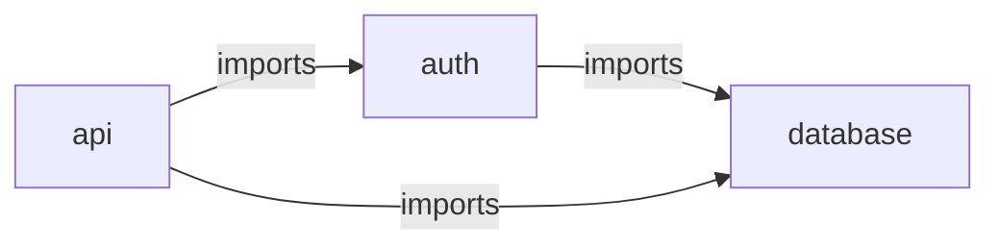

# 研究报告 04：渐进式披露文档设计标准

> **研究日期**: 2026-03-21
> **状态**: ✅ 完成
> **前置依赖**: 01_code_graph_tools.md ✅ | 02_auto_module_grouping.md ✅ | 03_docagent_architecture.md ✅

---

## 目录

1. [业界架构文档标准综述](#1-业界架构文档标准综述)
2. [渐进式披露适用性分析](#2-渐进式披露适用性分析)
3. [真实大型开源项目文档结构分析](#3-真实大型开源项目文档结构分析)
4. [文档层级定义（核心产出）](#4-文档层级定义核心产出)
5. [信息密度标准](#5-信息密度标准)
6. [索引链接规范](#6-索引链接规范)
7. [文档模板](#7-文档模板)
8. [与 C4 Model 的映射关系](#8-与-c4-model-的映射关系)
9. [AI/LLM 消费优化建议](#9-aillm-消费优化建议)
10. [参考资源](#10-参考资源)

---

## 1. 业界架构文档标准综述

### 1.1 C4 Model ⭐ 最接近渐进式披露

**来源**: https://c4model.com/ — Simon Brown 创建

C4 Model 是目前最接近"渐进式披露"理念的架构文档模型。它定义了四个层级的抽象：

| 层级        | 名称           | 受众          | 内容                                           | 类比                   |
| ----------- | -------------- | ------------- | ---------------------------------------------- | ---------------------- |
| **Level 1** | System Context | 所有人        | 系统在环境中的位置、外部用户和系统             | Google Maps 国家级视图 |
| **Level 2** | Container      | 技术决策者    | 系统内的主要可执行单元（应用、数据库、微服务） | 城市级视图             |
| **Level 3** | Component      | 架构师/开发者 | 容器内的组件及其协作关系                       | 街区级视图             |
| **Level 4** | Code           | 开发者        | 类、接口、对象的具体实现                       | 建筑级视图             |

**关键设计原则**：

- **Zoom in/out**：像地图一样可以在层级间自由缩放
- **Notation independent**：不强制特定图表标记法
- **Level 4 通常可选**：代码本身就是最详细的文档
- 补充图表：System Landscape、Dynamic、Deployment

**对我们的启示**：

- C4 的 4 层映射天然适合渐进式文档
- Level 4（Code）可以由 IDE 或代码本身替代，无需生成
- 我们的文档系统应覆盖 Level 1-3，Level 4 由代码注释覆盖

### 1.2 arc42

**来源**: https://arc42.org/ — 德国架构文档标准，已有 20 年历史

arc42 将架构文档组织为 **12 个章节**：

| 章节 | 名称                     | 适合自动生成？ | 理由                                     |
| ---- | ------------------------ | -------------- | ---------------------------------------- |
| 1    | Introduction and Goals   | ⚠️ 半自动      | 需要人工输入项目目标，但可从 README 提取 |
| 2    | Constraints              | ❌ 人工        | 技术约束需要人工定义                     |
| 3    | Context and Scope        | ✅ 可自动      | 可从依赖图提取外部系统边界               |
| 4    | Solution Strategy        | ❌ 人工        | 架构决策需要人工记录                     |
| 5    | **Building Block View**  | ✅ 可自动      | **核心**：模块分解视图，直接对应代码结构 |
| 6    | Runtime View             | ⚠️ 半自动      | 可从调用图推断关键流程                   |
| 7    | Deployment View          | ❌ 人工        | 基础设施映射需要人工                     |
| 8    | Crosscutting Concepts    | ⚠️ 半自动      | 可检测常见模式（日志、安全等）           |
| 9    | Architectural Decisions  | ❌ 人工        | ADR 需要人工撰写                         |
| 10   | Quality Requirements     | ❌ 人工        | 质量属性需要人工定义                     |
| 11   | Risks and Technical Debt | ⚠️ 半自动      | 可从代码指标推断技术债务                 |
| 12   | Glossary                 | ✅ 可自动      | 可从代码中提取术语                       |

**对我们的启示**：

- arc42 的 **Building Block View（第5章）** 是我们最核心的自动生成目标
- 它支持多层嵌套分解（Level 1 → Level 2 → Level 3），天然符合渐进式披露
- arc42 Canvas（单页版）概念可以作为我们 Level 0 的参考

### 1.3 Diátaxis 框架

**来源**: https://diataxis.fr/

Diátaxis 将技术文档分为四个象限：

```
                    实践导向
                      ↑
          Tutorial  |  How-to Guide
  学习导向 ←─────────┼──────────→ 工作导向
          Explanation|  Reference
                      ↓
                    理论导向
```

| 象限             | 目的         | 与我们的关系                          |
| ---------------- | ------------ | ------------------------------------- |
| **Tutorial**     | 引导学习     | 不适合自动生成                        |
| **How-to Guide** | 解决特定问题 | 可部分自动生成（常见操作模式）        |
| **Reference**    | 精确查阅     | **完全适合自动生成**（API、类、函数） |
| **Explanation**  | 深度理解     | 对应我们的 Level 1-2（架构解释）      |

**对我们的启示**：

- 我们的渐进式文档主要覆盖 **Reference** 和 **Explanation** 两个象限
- Level 0 兼具 Tutorial（导航）和 Reference（索引）特征
- Level 1-2 是 Explanation 形态
- Diátaxis 与 C4/arc42 是**互补而非替代**关系

### 1.4 4+1 Architectural View Model

**来源**: Philippe Kruchten, 1995

| 视图             | 关注点             | 受众                 | 与我们的关系              |
| ---------------- | ------------------ | -------------------- | ------------------------- |
| Logical View     | 功能需求、类/对象  | 终端用户、业务分析师 | Level 2（组件内部结构）   |
| Process View     | 运行时行为、并发   | 系统工程师           | 可选（运行时视图）        |
| Development View | 代码组织、模块层次 | 程序员               | **Level 0-1（模块组织）** |
| Physical View    | 部署拓扑           | 运维工程师           | 不在范围内                |
| Scenarios (+1)   | 用例验证           | 所有人               | Level 0 的用例场景        |

**对我们的启示**：

- 4+1 的 **Development View** 最直接对应我们的文档层级
- 我们的系统本质上是 Development View 的渐进式展开
- Process View 可以作为扩展项目（数据流图）

---

## 2. 渐进式披露适用性分析

### 2.1 最适合渐进式披露的标准

| 标准                          | 渐进式披露契合度 | 理由                     |
| ----------------------------- | ---------------- | ------------------------ |
| **C4 Model**                  | ⭐⭐⭐⭐⭐       | 天然的 4 层 zoom-in 设计 |
| **arc42 Building Block View** | ⭐⭐⭐⭐         | 支持多层嵌套分解         |
| **4+1 Development View**      | ⭐⭐⭐           | 模块层次结构             |
| **Diátaxis**                  | ⭐⭐             | 四象限模型，非层级结构   |

### 2.2 渐进式披露的核心原则

基于 UX 设计领域的渐进式披露理论和我们的代码文档需求：

1. **最小必要信息原则**：每层只展示理解当前上下文所需的最少信息
2. **用户驱动深入**：读者（人类或 LLM）主动选择是否深入更低层级
3. **自包含性**：每层文档独立可理解，无需阅读其他层级
4. **一致性导航**：每层使用统一的导航格式指向父/子层级
5. **信息密度控制**：每层信息量有明确上限

### 2.3 与前置研究的对齐

#### 与 01_code_graph_tools.md 对齐

Graph-sitter 输出的 NetworkX DiGraph 数据结构直接支持我们的层级：

- **Level 0**：`module_graph`（模块依赖图）→ 项目总览的模块列表
- **Level 1**：模块内的 `call_graph` 子集 → 模块概述的函数/类列表
- **Level 2**：单个组件的 `call_graph` + `inheritance_graph` → 组件详情

#### 与 02_auto_module_grouping.md 对齐

分组算法的三层方案直接映射到文档层级：

| 分组层级                     | 文档层级                 | 对应关系               |
| ---------------------------- | ------------------------ | ---------------------- |
| Level 0: 目录结构 → 初始分组 | Level 0: INDEX.md        | 分组结果决定模块列表   |
| Level 1: Louvain → 细化分组  | Level 1: OVERVIEW.md     | 细化后的模块边界和依赖 |
| Level 2: LLM → 语义验证      | Level 2: ARCHITECTURE.md | LLM 生成的语义描述     |

#### 与 03_docagent_architecture.md 对齐

DocAgent 的多 Agent 架构为文档生成提供了关键的设计模式参考：

| DocAgent 设计模式                | 对文档层级的影响                                     | 应用位置                 |
| -------------------------------- | ---------------------------------------------------- | ------------------------ |
| **依赖感知拓扑处理**             | Level 2 文档按拓扑序生成，确保被依赖组件的文档先完成 | ARCHITECTURE.md 生成顺序 |
| **嵌套循环编排**                 | 外循环收集上下文 → 内循环生成文档，保障信息充分性    | 每层文档的生成流程       |
| **Writer-Verifier 迭代精炼**     | 每层文档生成后由独立 Verifier 验证质量               | 信息密度控制             |
| **XML 结构化上下文**             | 文档元数据使用结构化格式，便于 LLM 解析              | doc-meta 注释格式        |
| **Reader-Searcher 信息需求驱动** | 按需加载依赖文档而非全部加载                         | 渐进式加载协议           |

**DocAgent 的局限性对我们的设计启示**：

- DocAgent 仅生成函数级 docstring → 我们需要扩展到 **文件→模块→系统** 三个更高层级
- DocAgent 的 Layer 3-4（Module/System Doc Agent）是 03 报告中建议的新增层
- DocAgent 的串行处理 → 我们应支持同层组件并行生成
- DocAgent 无增量更新 → 借鉴 RepoAgent 的 Git 变更检测

---

## 3. 真实大型开源项目文档结构分析

### 3.1 Linux Kernel

**文档目录**: `Documentation/`

```
Documentation/
├── index.rst                    ← 顶级入口（Level 0）
├── admin-guide/                 ← 管理员指南
│   ├── index.rst
│   ├── kernel-parameters.rst
│   └── ...
├── core-api/                    ← 内核核心 API
│   ├── index.rst
│   └── workqueue.rst
├── driver-api/                  ← 驱动开发 API
│   ├── index.rst
│   └── ...
├── process/                     ← 开发流程
│   ├── coding-style.rst
│   └── submitting-patches.rst
├── arch/                        ← 架构特定文档
│   ├── arm/
│   ├── x86/
│   └── riscv/
└── userspace-api/               ← 用户空间 API
    ├── index.rst
    └── ...
```

**分析**：

- ✅ **按受众分类**（admin-guide vs core-api vs driver-api）
- ✅ **每个子目录有 index.rst** 作为入口
- ✅ **使用 Sphinx + reStructuredText** 自动构建
- ✅ **kernel-doc 注释** 从源码自动提取文档
- ❌ **缺少架构概览**：没有类似 C4 Level 1 的系统全景图
- ❌ **层级过深**：某些路径 >5 层，导航困难

**对我们的启示**：每个目录都有 `index.rst` 是优秀实践；但需要控制层级深度

### 3.2 Rust 编译器 (rustc)

**目录结构**: `compiler/`

```
rust-lang/rust/
├── README.md                    ← 项目总览
├── compiler/                    ← 编译器源码
│   ├── rustc_driver/            ← 入口点
│   ├── rustc_interface/         ← 编译器接口
│   ├── rustc_middle/            ← 核心数据结构（被大量依赖）
│   ├── rustc_parse/             ← 解析器
│   ├── rustc_resolve/           ← 名称解析
│   ├── rustc_typeck/            ← 类型检查
│   └── ... (每个 crate 有自己的 README)
├── library/                     ← 标准库
│   ├── core/
│   ├── alloc/
│   └── std/
└── src/
    ├── doc/                     ← 用户文档
    └── tools/                   ← 工具链
```

**文档策略**：

- ✅ **Rust Compiler Development Guide**（https://rustc-dev-guide.rust-lang.org/）作为独立的架构文档
- ✅ **每个 crate 的 `//!` 模块文档** 提供本地上下文
- ✅ **rustdoc 自动生成** API 参考文档
- ✅ **IR 层级文档**：Token → AST → MIR → LLVM-IR 的渐进式编译流程
- ✅ **crate 命名约定**（`rustc_*`）直接传达模块归属
- ❌ **架构图较少**：主要依赖文字描述

**对我们的启示**：

- Development Guide 是独立于代码的"Level 0"文档
- 每个 crate 的模块文档是 "Level 1"
- rustdoc 生成的 API 文档是 "Level 2"
- 这种分层正好是自然的渐进式披露

### 3.3 对比总结

| 特征       | Linux Kernel        | Rust Compiler      | 我们的目标         |
| ---------- | ------------------- | ------------------ | ------------------ |
| 入口文档   | index.rst           | Dev Guide + README | INDEX.md           |
| 模块文档   | 子目录 index.rst    | crate //! 文档     | OVERVIEW.md        |
| API 文档   | kernel-doc 注释     | rustdoc 生成       | ARCHITECTURE.md    |
| 架构图     | 少                  | 少                 | Mermaid 图（必须） |
| 自动生成   | Sphinx + kernel-doc | rustdoc            | 我们的工具链       |
| 渐进式导航 | ⚠️ 弱               | ✅ 中              | ✅ 强（设计目标）  |

---

## 4. 文档层级定义（核心产出）

### 4.1 三层文档架构

```
项目根目录/
├── INDEX.md                           ← Level 0: 项目总览
├── docs/
│   ├── auth/
│   │   ├── OVERVIEW.md                ← Level 1: 认证模块概述
│   │   ├── login/
│   │   │   └── ARCHITECTURE.md        ← Level 2: 登录组件详情
│   │   └── oauth/
│   │       └── ARCHITECTURE.md        ← Level 2: OAuth 组件详情
│   ├── api/
│   │   ├── OVERVIEW.md                ← Level 1: API 模块概述
│   │   └── routes/
│   │       └── ARCHITECTURE.md        ← Level 2: 路由组件详情
│   └── _shared/
│       └── OVERVIEW.md                ← Level 1: 共享工具模块
└── .doc-meta/
    ├── doc-index.json                 ← 文档索引元数据
    └── doc-config.yaml                ← 文档生成配置
```

### 4.2 Level 0: INDEX.md（项目总览）

**职责**：一页纸了解整个项目的全貌

**必须包含的内容**：

| 区块       | 内容                          | 信息来源                  |
| ---------- | ----------------------------- | ------------------------- |
| 项目标识   | 名称 + 一句话描述             | README.md / package.json  |
| 技术栈摘要 | 语言、框架、主要依赖          | 包管理文件                |
| 架构概览图 | Mermaid 模块依赖图            | Graph-sitter module_graph |
| 模块列表   | 名称 + 简述 + 文件数 + 复杂度 | Louvain 分组结果          |
| 关键入口点 | main 函数 / 启动文件          | 调用图分析                |
| 导航索引   | 链接到所有 Level 1 文档       | 自动生成                  |

### 4.3 Level 1: OVERVIEW.md（模块概述）

**职责**：理解一个模块的职责、边界和对外接口

**必须包含的内容**：

| 区块       | 内容                        | 信息来源             |
| ---------- | --------------------------- | -------------------- |
| 模块标识   | 名称 + 职责描述             | LLM 语义分析         |
| 模块边界   | 包含的文件列表              | Louvain 分组         |
| 依赖关系图 | 与其他模块的 Mermaid 依赖图 | module_graph 子集    |
| 对外接口   | 导出的公共函数/类列表       | Graph-sitter exports |
| 内部组件   | 子组件列表（带简述）        | 子目录 / 类层次      |
| 复杂度指标 | 文件数、函数数、圈复杂度    | 静态分析             |
| 导航       | ↑ 父级链接 + ↓ Level 2 链接 | 自动生成             |

### 4.4 Level 2: ARCHITECTURE.md（组件详情）

**职责**：理解一个组件的内部实现细节

**必须包含的内容**：

| 区块         | 内容                     | 信息来源                       |
| ------------ | ------------------------ | ------------------------------ |
| 组件标识     | 名称 + 设计目的          | LLM 分析                       |
| 内部结构     | 类/函数关系图（Mermaid） | call_graph + inheritance_graph |
| 核心类说明   | 每个类的职责和主要方法   | Graph-sitter class API         |
| 核心函数说明 | 关键函数的签名和说明     | Graph-sitter function API      |
| 数据流       | 主要数据流路径描述       | call_graph 分析                |
| 设计决策     | 关键实现选择及理由       | LLM 推断 / ADR                 |
| 导航         | ↑ 父级 OVERVIEW.md 链接  | 自动生成                       |

---

## 5. 信息密度标准

### 5.1 Token 预算依据

基于以下数据源确定各层级的信息密度：

1. **Aider repomap**：默认 1,000 tokens 的 map-tokens 预算，可覆盖中型项目结构
2. **Claude 上下文窗口**：200K tokens 标准，1M tokens 最新版
3. **LLM 注意力分布**："Lost in the middle" 现象表明开头和结尾的信息利用率最高
4. **人类可读性**：认知心理学研究表明，7±2 个信息块是短期记忆上限
5. **llms.txt 标准**：推荐单文件 Markdown 格式，保持紧凑

### 5.2 各层级预算

| 层级                          | 最大行数   | 最大 Token 数      | 依据                                                                          |
| ----------------------------- | ---------- | ------------------ | ----------------------------------------------------------------------------- |
| **Level 0** (INDEX.md)        | 80-120 行  | 800-1,200 tokens   | Aider repomap 预算（1K tokens 可覆盖完整项目结构）；需要一次性放入 LLM 上下文 |
| **Level 1** (OVERVIEW.md)     | 120-200 行 | 1,200-2,000 tokens | 一个模块的完整概述；LLM 单次对话中可能加载 3-5 个模块 ≈ 6K-10K tokens         |
| **Level 2** (ARCHITECTURE.md) | 200-400 行 | 2,000-4,000 tokens | 单个组件的详细说明；通常只在需要时加载 1-2 个                                 |

### 5.3 密度控制规则

```
Level 0 密度规则:
├── 模块列表: 每个模块最多 2 行（名称 + 一句描述）
├── 架构图: 最多 20 行 Mermaid 代码
├── 技术栈: 最多 5 行
└── 总计: 不超过 120 行

Level 1 密度规则:
├── 接口列表: 每个接口最多 1 行（签名）
├── 依赖图: 最多 15 行 Mermaid 代码
├── 文件列表: 超过 15 个文件时折叠显示
└── 总计: 不超过 200 行

Level 2 密度规则:
├── 类说明: 每个类最多 5 行
├── 函数说明: 每个函数最多 3 行（签名 + 描述）
├── 数据流: 最多 20 行 Mermaid 代码
└── 总计: 不超过 400 行
```

### 5.4 超出预算时的裁剪策略

当内容超出预算时，按以下优先级裁剪：

1. **保留**：名称、签名、一句话描述
2. **裁剪**：详细说明 → 缩减为一句话
3. **折叠**：超过阈值的列表 → `... 及其他 N 项`
4. **省略**：最低优先级的信息（如内部工具函数）

这与 Aider repomap 的 PageRank 排序 + token 预算裁剪策略一致：优先保留被引用最多的符号。

---

## 6. 索引链接规范

### 6.1 Markdown 层间导航格式

每个文档在**头部**和**尾部**都包含导航链接：

```markdown
<!-- doc-meta
parent: ../INDEX.md
children:
  - login/ARCHITECTURE.md
  - oauth/ARCHITECTURE.md
module: auth
coverage: 0.85
last_updated: 2026-03-21T12:00:00Z
generated_by: codebase-explorer v0.1
-->

# 认证模块概述

> 📍 **导航**: [← 项目总览](../INDEX.md) | [登录组件 →](login/ARCHITECTURE.md) | [OAuth 组件 →](oauth/ARCHITECTURE.md)

... 内容 ...

---

## 导航

| 方向      | 链接                                           | 说明           |
| --------- | ---------------------------------------------- | -------------- |
| ↑ 上层    | [INDEX.md](../INDEX.md)                        | 项目总览       |
| ↓ 登录    | [login/ARCHITECTURE.md](login/ARCHITECTURE.md) | 登录组件详情   |
| ↓ OAuth   | [oauth/ARCHITECTURE.md](oauth/ARCHITECTURE.md) | OAuth 组件详情 |
| ↔ API模块 | [../api/OVERVIEW.md](../api/OVERVIEW.md)       | 相关模块       |
```

### 6.2 元数据注释格式

使用 HTML 注释嵌入结构化元数据，不影响 Markdown 渲染：

```html
<!-- doc-meta
# 文档标识
type: level-1-overview          # level-0-index | level-1-overview | level-2-architecture
module: auth                     # 模块标识符
version: 1.2.3                   # 文档版本

# 层级关系
parent: ../INDEX.md              # 上层文档路径
children:                        # 下层文档列表
  - login/ARCHITECTURE.md
  - oauth/ARCHITECTURE.md
siblings:                        # 同层文档
  - ../api/OVERVIEW.md
  - ../shared/OVERVIEW.md

# 质量指标
coverage: 0.85                   # 覆盖率：文档覆盖的代码比例
staleness: 0.12                  # 过时度：文档与代码的差异比例
last_updated: 2026-03-21T12:00:00Z
source_hash: abc123def456        # 源代码 hash，用于检测变更

# 生成信息
generated_by: codebase-explorer
generation_model: claude-sonnet-4
token_count: 1450                # 文档的 token 数
-->
```

### 6.3 全局文档索引 (doc-index.json)

```json
{
  "project": "my-project",
  "generated_at": "2026-03-21T12:00:00Z",
  "levels": {
    "0": {
      "path": "INDEX.md",
      "token_count": 950,
      "modules_covered": 5
    },
    "1": [
      {
        "path": "docs/auth/OVERVIEW.md",
        "module": "auth",
        "token_count": 1450,
        "children": [
          "docs/auth/login/ARCHITECTURE.md",
          "docs/auth/oauth/ARCHITECTURE.md"
        ],
        "coverage": 0.85
      }
    ],
    "2": [
      {
        "path": "docs/auth/login/ARCHITECTURE.md",
        "component": "login",
        "parent_module": "auth",
        "token_count": 2800,
        "coverage": 0.92
      }
    ]
  },
  "total_token_count": 15200,
  "total_coverage": 0.87
}
```

### 6.4 链接完整性校验方法

```python
import json
import os
from pathlib import Path

def validate_doc_links(project_root: str) -> dict:
    """验证文档链接的完整性"""
    issues = []
    index_path = Path(project_root) / ".doc-meta" / "doc-index.json"

    if not index_path.exists():
        return {"valid": False, "issues": ["doc-index.json not found"]}

    with open(index_path) as f:
        index = json.load(f)

    # 检查所有文件是否存在
    all_paths = [index["levels"]["0"]["path"]]
    for level1 in index["levels"].get("1", []):
        all_paths.append(level1["path"])
        all_paths.extend(level1.get("children", []))
    for level2 in index["levels"].get("2", []):
        all_paths.append(level2["path"])

    for path in all_paths:
        full_path = Path(project_root) / path
        if not full_path.exists():
            issues.append(f"Missing file: {path}")

    # 检查 parent/children 双向一致性
    for level1 in index["levels"].get("1", []):
        for child_path in level1.get("children", []):
            # 确保 child 的 parent 指向当前 level1
            child_found = False
            for level2 in index["levels"].get("2", []):
                if level2["path"] == child_path:
                    child_found = True
                    break
            if not child_found:
                issues.append(f"Orphan child: {child_path}")

    return {
        "valid": len(issues) == 0,
        "total_docs": len(all_paths),
        "issues": issues
    }
```

---

## 7. 文档模板

### 7.1 Level 0 模板: INDEX.md

````jinja2
{# ============================================ #}
{# Level 0: INDEX.md - 项目总览模板              #}
{# 变量说明:                                     #}
{#   project_name: str - 项目名称                #}
{#   description: str - 一句话描述               #}
{#   tech_stack: list[str] - 技术栈              #}
{#   modules: list[Module] - 模块列表            #}
{#     Module.name: str - 模块名                 #}
{#     Module.description: str - 简述            #}
{#     Module.file_count: int - 文件数            #}
{#     Module.path: str - OVERVIEW.md 路径        #}
{#   mermaid_graph: str - Mermaid 图代码          #}
{#   entry_points: list[EntryPoint] - 入口点      #}
{#     EntryPoint.name: str                      #}
{#     EntryPoint.file: str                      #}
{#   generation_time: str - 生成时间              #}
{#   total_files: int - 总文件数                  #}
{#   total_functions: int - 总函数数              #}
{# ============================================ #}
<!-- doc-meta
type: level-0-index
version: 1.0.0
children:

  - {{ module.path }}

coverage: {{ coverage }}
last_updated: {{ generation_time }}
generated_by: codebase-explorer
token_count: {{ token_count }}
-->

# {{ project_name }}

> {{ description }}

## 技术栈


- {{ tech }}


## 架构概览

```mermaid
{{ mermaid_graph }}
````

## 模块一览

| 模块 | 职责 | 文件数 | 详情 |
| ---- | ---- | ------ | ---- |


| **{{ module.name }}** | {{ module.description }} | {{ module.file_count }} | [→ 概述]({{ module.path }}) |


## 关键入口点



- `{{ entry.name }}` — `{{ entry.file }}`
  

---

_自动生成于 {{ generation_time }} | 总计 {{ total_files }} 文件, {{ total_functions }} 函数_

````

### 7.2 Level 1 模板: OVERVIEW.md

```jinja2
{# ============================================ #}
{# Level 1: OVERVIEW.md - 模块概述模板           #}
{# 变量说明:                                     #}
{#   module_name: str - 模块名                   #}
{#   module_description: str - 模块职责描述       #}
{#   parent_path: str - INDEX.md 路径             #}
{#   files: list[File] - 包含的文件               #}
{#     File.path: str - 相对路径                  #}
{#     File.description: str - 简述              #}
{#   dependencies: list[Dep] - 依赖模块           #}
{#     Dep.name: str - 模块名                    #}
{#     Dep.direction: str - "imports"|"imported_by" #}
{#   public_interfaces: list[Interface] - 公共接口 #}
{#     Interface.name: str - 函数/类名            #}
{#     Interface.signature: str - 签名            #}
{#     Interface.type: str - "function"|"class"   #}
{#   components: list[Component] - 子组件         #}
{#     Component.name: str - 组件名               #}
{#     Component.description: str - 简述          #}
{#     Component.path: str - ARCHITECTURE.md 路径  #}
{#   dependency_mermaid: str - 依赖关系图          #}
{#   metrics: Metrics - 复杂度指标                #}
{#     Metrics.file_count: int                    #}
{#     Metrics.function_count: int                #}
{#     Metrics.class_count: int                   #}
{#     Metrics.avg_complexity: float              #}
{#   generation_time: str                         #}
{# ============================================ #}
<!-- doc-meta
type: level-1-overview
module: {{ module_name }}
parent: {{ parent_path }}
children:

  - {{ comp.path }}

coverage: {{ coverage }}
last_updated: {{ generation_time }}
generated_by: codebase-explorer
token_count: {{ token_count }}
-->

# {{ module_name }}

> 📍 [← 项目总览]({{ parent_path }})

> {{ module_description }}

## 依赖关系

```mermaid
{{ dependency_mermaid }}
````

| 方向 | 模块 | 关系 |
| ---- | ---- | ---- |


| {{ "→ 依赖" if dep.direction == "imports" else "← 被依赖" }} | {{ dep.name }} | {{ dep.description }} |


## 公共接口



- `{{ iface.signature }}` — {{ iface.description }}
  

## 内部组件

| 组件 | 说明 | 详情 |
| ---- | ---- | ---- |


| **{{ comp.name }}** | {{ comp.description }} | [→ 详情]({{ comp.path }}) |


## 包含文件



- `{{ file.path }}` — {{ file.description }}
  
  
- _... 及其他 {{ files|length - 15 }} 个文件_
  

## 指标

| 指标         | 值                           |
| ------------ | ---------------------------- |
| 文件数       | {{ metrics.file_count }}     |
| 函数数       | {{ metrics.function_count }} |
| 类数         | {{ metrics.class_count }}    |
| 平均圈复杂度 | {{ metrics.avg_complexity }} |

---

_自动生成于 {{ generation_time }}_

````

### 7.3 Level 2 模板: ARCHITECTURE.md

```jinja2
{# ============================================ #}
{# Level 2: ARCHITECTURE.md - 组件详情模板       #}
{# 变量说明:                                     #}
{#   component_name: str - 组件名                #}
{#   component_description: str - 设计目的        #}
{#   parent_path: str - OVERVIEW.md 路径          #}
{#   parent_module: str - 所属模块名              #}
{#   classes: list[ClassInfo] - 核心类列表        #}
{#     ClassInfo.name: str                       #}
{#     ClassInfo.description: str                #}
{#     ClassInfo.methods: list[MethodInfo]        #}
{#       MethodInfo.name: str                    #}
{#       MethodInfo.signature: str               #}
{#       MethodInfo.description: str             #}
{#     ClassInfo.base_classes: list[str]          #}
{#   functions: list[FuncInfo] - 核心函数列表     #}
{#     FuncInfo.name: str                        #}
{#     FuncInfo.signature: str                   #}
{#     FuncInfo.description: str                 #}
{#     FuncInfo.called_by: list[str]             #}
{#     FuncInfo.calls: list[str]                 #}
{#   structure_mermaid: str - 内部结构图          #}
{#   data_flow_mermaid: str - 数据流图            #}
{#   design_decisions: list[Decision] - 设计决策  #}
{#     Decision.title: str                       #}
{#     Decision.description: str                 #}
{#     Decision.rationale: str                   #}
{#   generation_time: str                         #}
{# ============================================ #}
<!-- doc-meta
type: level-2-architecture
component: {{ component_name }}
module: {{ parent_module }}
parent: {{ parent_path }}
coverage: {{ coverage }}
last_updated: {{ generation_time }}
generated_by: codebase-explorer
token_count: {{ token_count }}
-->

# {{ component_name }}

> 📍 [← {{ parent_module }} 概述]({{ parent_path }}) | [← 项目总览]({{ index_path }})

> {{ component_description }}

## 内部结构

```mermaid
{{ structure_mermaid }}
````

## 核心类



### {{ cls.name }}

{{ cls.description }}


**继承**: {{ cls.base_classes | join(" → ") }}


| 方法 | 签名 | 说明 |
| ---- | ---- | ---- |


| `{{ method.name }}` | `{{ method.signature }}` | {{ method.description }} |




## 核心函数



### `{{ func.signature }}`

{{ func.description }}



- **被调用者**: {{ func.called_by | join(", ") }}
  
  
- **调用**: {{ func.calls | join(", ") }}
  



## 数据流

```mermaid
{{ data_flow_mermaid }}
```



## 设计决策



### {{ decision.title }}

{{ decision.description }}

**理由**: {{ decision.rationale }}




---

_自动生成于 {{ generation_time }}_

```

---

## 8. 与 C4 Model 的映射关系

### 8.1 层级映射

```

C4 Model Our System arc42 对应
─────────────────────────────────────────────────────────────────────
Level 1: System Context → INDEX.md (Level 0) → §3 Context & Scope
项目在生态中的位置 系统边界
外部依赖和用户

Level 2: Container → INDEX.md (Level 0) → §5 Building Block L1 + OVERVIEW.md (Level 1) 主要模块分解
模块级结构

Level 3: Component → OVERVIEW.md (Level 1) → §5 Building Block L2 + ARCHITECTURE.md (L2) 组件级结构
组件及其交互

Level 4: Code → 源代码 + IDE → §5 Building Block L3
(不在文档范围) 代码级细节

````

### 8.2 映射说明

| C4 概念 | 我们的实现 | 说明 |
|---------|-----------|------|
| Software System | INDEX.md 中的项目标识 | 一句话 + 技术栈 |
| Person/Actor | INDEX.md 中的入口点 | 谁/什么触发系统 |
| Container | OVERVIEW.md | 每个模块 = 一个"容器" |
| Component | ARCHITECTURE.md | 模块内的子组件 |
| Code | 源代码本身 | 通过 IDE/编辑器查看 |
| Relationship | Mermaid 图中的箭头 | 依赖和调用关系 |

### 8.3 C4 补充图表的覆盖

| C4 补充图表 | 是否支持 | 实现方式 |
|------------|---------|---------|
| System Landscape | ⚠️ 部分 | INDEX.md 的外部依赖列表 |
| Dynamic Diagram | ❌ 未来 | 可从调用图生成序列图 |
| Deployment Diagram | ❌ 不支持 | 需要基础设施信息 |

---

## 9. AI/LLM 消费优化建议

### 9.1 双受众设计原则

我们的文档必须同时服务两类读者：

| 特征 | 人类读者 | LLM 读者 |
|------|---------|---------|
| 阅读方式 | 扫读 → 定位 → 精读 | 全文处理 → 语义理解 |
| 信息接收 | 视觉层次（标题、缩进、图表） | 文本结构（标记、关键词） |
| 上下文 | 已有领域知识 | 依赖文档提供的上下文 |
| 需求 | 可读性、可导航性 | 明确性、结构化、自包含 |

### 9.2 LLM 优化策略

#### 策略 1: 结构化元数据前置

```markdown
<!-- doc-meta
type: level-1-overview
module: auth
key_exports: [login, logout, validate_token, AuthMiddleware]
dependencies: [database, config, crypto]
-->
````

**原因**：LLM 可以快速从元数据中判断是否需要深入阅读正文

#### 策略 2: Frontmatter 摘要

每个文档开头包含一个自包含的摘要段落：

```markdown
# 认证模块

> 本模块负责用户认证和授权。包含登录、OAuth2、JWT 令牌管理
> 三个子组件。对外暴露 `login()`, `logout()`, `validate_token()`,
> `AuthMiddleware` 四个公共接口。依赖 database 和 crypto 模块。
```

**原因**：LLM 的 "Lost in the Middle" 问题意味着开头内容获得最高注意力

#### 策略 3: 明确的符号引用格式

```markdown
函数 `auth.login.validate_credentials(username: str, password: str) -> bool`
被 `api.routes.handle_login()` 调用。
```

**原因**：完全限定名让 LLM 能精确定位代码位置

#### 策略 4: Mermaid 图作为结构化信息



**原因**：Mermaid 是文本格式，LLM 可以直接解析图的结构（而 PNG/SVG 不行）

#### 策略 5: Token 预算意识

```markdown
## 公共接口（4 个）

- `login(username, password) -> Token`
- `logout(token) -> None`
- `validate_token(token) -> User`
- `AuthMiddleware(app) -> Middleware`

详细参数说明见 [Level 2 文档](login/ARCHITECTURE.md)
```

**原因**：Level 1 只给出签名，详细参数在 Level 2。渐进式加载 = Token 高效

### 9.3 llms.txt 集成

为项目生成 `llms.txt` 文件，遵从 llms.txt 标准：

```markdown
# Project Name

> One-line description of the project.

## Docs

- [Project Overview](INDEX.md): Architecture overview with module map
- [Auth Module](docs/auth/OVERVIEW.md): Authentication and authorization
- [API Module](docs/api/OVERVIEW.md): REST API endpoints and routing
- [Database Module](docs/db/OVERVIEW.md): Data access layer

## API Reference

- [Auth API](docs/auth/login/ARCHITECTURE.md): Login, OAuth, JWT details
- [Route Handlers](docs/api/routes/ARCHITECTURE.md): Request handling
```

### 9.4 渐进式加载协议

为 AI Agent 设计的文档加载协议：

```
Step 1: 加载 INDEX.md (≈1000 tokens)
        → Agent 获得项目全貌
        → Agent 决定需要深入哪个模块

Step 2: 加载目标 OVERVIEW.md (≈1500 tokens)
        → Agent 获得模块边界和接口
        → Agent 决定需要深入哪个组件

Step 3: 加载目标 ARCHITECTURE.md (≈3000 tokens)
        → Agent 获得实现细节
        → Agent 可以开始修改代码

总计: ≈5500 tokens（仅加载需要的路径）
对比: 直接加载所有源码 ≈50,000-500,000 tokens
节省: 90-99% 的 token 消耗
```

---

## 10. 参考资源

### 架构文档标准

- **C4 Model**: https://c4model.com/ — Simon Brown
- **arc42**: https://arc42.org/ — Peter Hruschka & Gernot Starke
- **Diátaxis**: https://diataxis.fr/ — Daniele Procida
- **4+1 View Model**: Kruchten, P. (1995). "Architectural Blueprints—The '4+1' View Model of Software Architecture"

### 渐进式披露

- Nielsen Norman Group: Progressive Disclosure design pattern
- ui-patterns.com: Progressive Disclosure pattern documentation
- UXPin: Progressive Disclosure in complex interfaces

### AI/LLM 文档优化

- **llms.txt 标准**: https://llmstxt.org/ — Jeremy Howard / Answer.AI
- **Aider repomap**: https://aider.chat/docs/repomap.html — Paul Gauthier
- **Repomix**: https://repomix.com/ — Token-efficient codebase packing
- kapa.ai: Writing LLM-friendly documentation guide

### 文档生成工具

- **Jinja2**: https://jinja.palletsprojects.com/ — Armin Ronacher
- **Sphinx**: https://www.sphinx-doc.org/ — reStructuredText documentation generator
- **MkDocs**: https://www.mkdocs.org/ — Markdown documentation generator
- **rustdoc**: Rust 文档生成工具（Architecture documentation best practice）

### 开源项目文档参考

- **Linux Kernel Documentation**: https://www.kernel.org/doc/html/latest/
- **Rust Compiler Dev Guide**: https://rustc-dev-guide.rust-lang.org/
- **Kubernetes Documentation**: https://kubernetes.io/docs/

### 前置研究

- `results/01_code_graph_tools.md` — Graph-sitter 输出的数据结构定义了文档的数据来源
- `results/02_auto_module_grouping.md` — Louvain 分组结果直接决定文档的模块划分

---

## 附录：决策摘要

### 为什么选择三层而非四层（与 C4 的差异）？

C4 的 Level 4（Code）是代码本身，不需要生成独立文档。我们的三层覆盖 C4 的 Level 1-3，Level 4 由 IDE 和源代码注释替代。

### 为什么 Level 0 限制在 1000 tokens？

Aider repomap 的实践证明 1000 tokens 的 token 预算足以覆盖中型项目（~100 文件）的完整结构。超过此限制时，信息密度下降，LLM 的利用效率降低。

### 为什么使用 HTML 注释存储元数据？

HTML 注释 `<!-- doc-meta ... -->` 的优势：

1. 不影响 Markdown 渲染（GitHub、GitLab 等都不显示）
2. 可以被程序解析
3. 保持在文档文件内部（不需要额外的 sidecar 文件）
4. 与 YAML frontmatter 相比，不会被某些 Markdown 工具误解析

### 为什么 Mermaid 而非 PlantUML 或 DOT？

1. GitHub/GitLab 原生支持 Mermaid 渲染
2. LLM 可以直接阅读和生成 Mermaid 语法
3. 文本格式，版本控制友好
4. 无需安装额外工具
