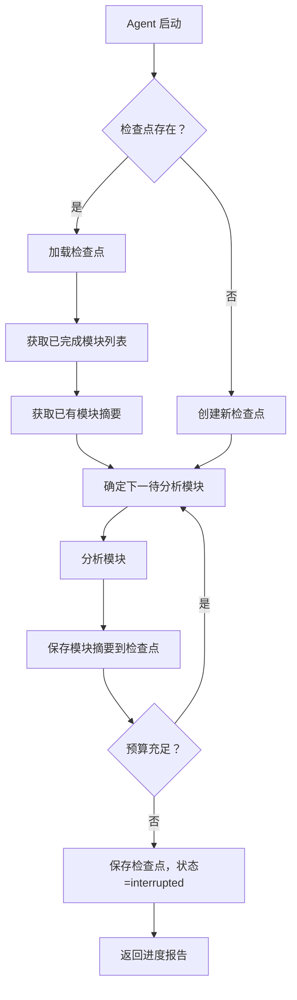
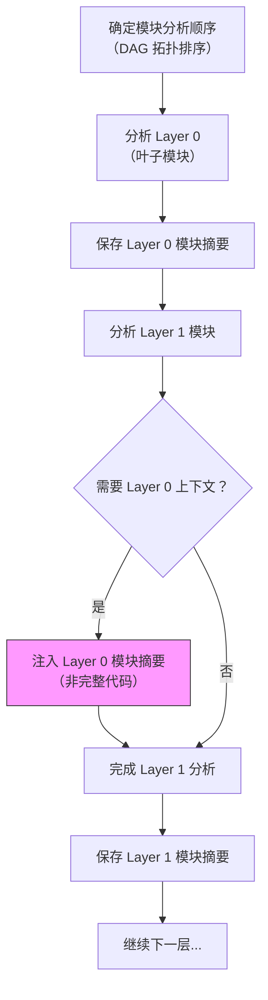

# 研究报告 07：上下文预算与代码分片策略

> **研究日期**: 2026-03-22
> **状态**: ✅ 完成
> **前置依赖**: 01_code_graph_tools.md ✅ | 02_auto_module_grouping.md ✅ | 05_mcp_server_patterns.md ✅

---

## 目录

1. [现有工具上下文策略对比](#1-现有工具上下文策略对比)
2. [代码量-Token 估算公式](#2-代码量-token-估算公式)
3. [推荐的分析分片策略](#3-推荐的分析分片策略)
4. [预算阈值建议](#4-预算阈值建议)
5. [中间状态保存方案](#5-中间状态保存方案)
6. [跨引用处理策略](#6-跨引用处理策略)
7. [与前置研究的对齐](#7-与前置研究的对齐)
8. [参考来源](#8-参考来源)

---

## 1. 现有工具上下文策略对比

### 1.1 策略矩阵

| 工具             | 策略名称                            | 选择算法                                                                                    | 预算控制                                     | 增量/全量                | 特色                                                       |
| ---------------- | ----------------------------------- | ------------------------------------------------------------------------------------------- | -------------------------------------------- | ------------------------ | ---------------------------------------------------------- |
| **aider**        | RepoMap + Personalized PageRank     | Tree-sitter 提取符号 → 构建文件依赖图 → Personalized PageRank 排序 → 按 token 预算裁剪      | `--map-tokens`（默认 1024 tokens），动态扩展 | 增量（每次请求动态选择） | 图排序确保"传递重要性"——被重要文件引用的工具文件也会被选入 |
| **Plandex**      | Tree-sitter Project Maps + 分层规划 | Tree-sitter 索引生成项目地图 → 高层规划选择相关上下文 → 分步细化每步的文件上下文            | 2M tokens 直接上下文窗口；可索引 20M+ tokens | 增量（任务级分步加载）   | 先粗后细的两阶段规划；自动选择模型以平衡成本/质量          |
| **Continue.dev** | Context Providers + LSP             | LSP 定义跳转 + import 追踪 + 最近文件 + 用户 `@` 指定                                       | 依赖模型 context window                      | 增量（按需注入）         | 多源上下文融合（代码+文档+终端+Git diff）；MCP 协议支持    |
| **Cursor IDE**   | 全量嵌入索引 + RAG                  | 全代码库向量嵌入 → 语义检索最相关片段 → 注入上下文                                          | 200K tokens（扩展至 1M）                     | 全量索引 + 增量检索      | Composer 多文件协调编辑；`.cursorrules` 控制行为           |
| **Claude Code**  | 三层压缩管线                        | Micro-compaction（静默替换旧工具结果）→ Auto-compaction（95%时自动摘要）→ Manual `/compact` | 200K tokens（Sonnet 4.x），1M（Opus 4.6）    | 增量 + 压缩              | Subagent 隔离 token 开销；`/fork` `/btw` 防止上下文污染    |
| **Repomix**      | 全量序列化                          | 将整个代码库打包为单个文本文件（可配置过滤）                                                | 无内置预算（依赖目标模型）                   | 全量                     | 适合一次性分析小型项目                                     |

### 1.2 各工具详细策略分析

#### aider 的 RepoMap 策略（最值得借鉴）

aider 的上下文管理是本研究中最深入研究的实现，其策略分为以下几个阶段：

**第一阶段：符号提取**

- 使用 **Tree-sitter** 解析所有源代码文件，构建 AST
- 提取函数定义、类定义、变量声明等符号的 `Tag` 元组
- 如果 Tree-sitter 查询不完整，回退到 **Pygments** 词法分析
- 提取结果缓存到 **SQLite 数据库**，避免重复解析

**第二阶段：图构建**

- 以 **源文件为节点**、文件间依赖关系为边，构建有向图
- 社区讨论中有人提议使用函数/类级别的节点以提高精度（但目前仍是文件级）
- 区分 "chatfiles"（用户主动加入的文件）和 "otherfiles"（其余仓库文件）

**第三阶段：Personalized PageRank 排序**

- 执行 **Personalized PageRank** 算法，以 chatfiles 为种子节点
- 识别"传递重要性"——一个被多个重要文件频繁引用的工具类会获得高排名
- 排序结果决定了哪些符号/文件进入 repo map

**第四阶段：Token 预算裁剪**

- 按 PageRank 分数从高到低，逐步添加符号到 repo map
- 达到 `--map-tokens` 预算后停止
- map 格式是精简的代码骨架：类名、函数签名、关键行，用 `⋮...` 省略其余行
- 动态扩展：当 chat 中无文件时，map 可能显著超过预算以提供全局视图

**关键设计决策**：

- repo map 不包含全部符号，仅包含**被其他代码最频繁引用**的标识符
- 如果 LLM 需要更多细节，它可以**请求查看特定文件**，aider 会提供完整内容
- 这是一种 **"先给地图，再按需加载"** 的策略

#### Plandex 的分层上下文策略

Plandex 采用的是一种**规划驱动**的上下文管理方式：

1. **项目索引**：使用 Tree-sitter 构建整个项目的 "Project Map"，可索引 20M+ tokens 的代码库
2. **高层规划**：基于用户请求和 Project Map，LLM 制定任务计划，选择**宏观相关文件**
3. **分步执行**：将计划拆分为多个小步骤，每步只加载**该步所需的文件上下文**
4. **模型自动选择**：根据步骤复杂度、成本和性能自动选择 LLM 模型

**关键创新**：

- 不是一次性把所有相关代码塞入上下文，而是**逐步按需加载**
- 即使项目有 2000 万 tokens，每步只使用 2M tokens 的有效窗口

#### Claude Code 的三层压缩管线

Claude Code 的上下文管理最具工程深度：

1. **Micro-compaction**（微压缩）：
   - 在 Agent 运行过程中**静默替换**旧的工具调用结果
   - 例如之前读取的文件内容被替换为文件路径引用
   - 持续运行，保持上下文精简

2. **Auto-compaction**（自动压缩）：
   - 当 context window 使用超过 **95%（或剩余 25%）** 时自动触发
   - 生成对话摘要，保留关键信息：架构决策、未解决 bug、实现细节
   - 丢弃冗余的工具输出和消息
   - 用摘要开始新的 context window，继续任务

3. **Manual compaction**（手动压缩）：
   - 用户通过 `/compact` 命令主动触发
   - 可附带指令指定保留哪些信息
   - 适合在完成一个子任务后清理上下文

4. **辅助机制**：
   - **Subagent**：生成子 Agent 执行 token 密集型工作，仅返回简洁摘要
   - **`/fork`**：隔离探索，不污染主会话上下文
   - **`/btw`**：临时问答，不进入主对话历史
   - **Memory Tool**：文件系统中持久化知识，跨会话引用

---

## 2. 代码量-Token 估算公式

### 2.1 不同语言的经验公式

基于 tiktoken（OpenAI）和实际测量数据的经验公式：

| 语言            | 字符/Token 比    | 行/Token 比（近似） | 说明                     |
| --------------- | ---------------- | ------------------- | ------------------------ |
| **Python**      | ~4.2 chars/token | ~2.5 行/token       | 缩进主导，类型标注可选   |
| **TypeScript**  | ~3.8 chars/token | ~2.0 行/token       | 类型声明增加 token 密度  |
| **JavaScript**  | ~3.8 chars/token | ~2.0 行/token       | 与 TS 相近               |
| **Java**        | ~3.5 chars/token | ~1.8 行/token       | 冗长的类型声明和关键词   |
| **Go**          | ~3.8 chars/token | ~2.0 行/token       | 简洁语法，但错误处理冗长 |
| **C/C++**       | ~3.2 chars/token | ~1.5 行/token       | 最低效（最多 token）     |
| **Rust**        | ~3.5 chars/token | ~1.8 行/token       | 生命周期注解增加 token   |
| **Minified JS** | ~2.5 chars/token | N/A                 | Webpack 打包后极度密集   |

**关键发现**：

- 代码比自然语言消耗**更多 token**（自然英文约 4.0 chars/token，代码 3.2-4.2）
- 动态类型语言（Python）比静态类型语言（C, Java）更 token 高效
- 函数式语言（Haskell, Clojure）通常比命令式语言更高效
- C 是最"低效"的语言（token/功能最高），Clojure 最高效——差距约 **2.6x**

### 2.2 快速估算方法

#### 方法 1：字符数估算（推荐用于快速粗算）

```python
def estimate_tokens_from_chars(char_count: int, language: str = "python") -> int:
    """根据字符数快速估算 token 数"""
    ratios = {
        "python": 4.2,
        "typescript": 3.8,
        "javascript": 3.8,
        "java": 3.5,
        "go": 3.8,
        "c": 3.2,
        "cpp": 3.2,
        "rust": 3.5,
        "default": 3.8  # 保守默认值
    }
    ratio = ratios.get(language, ratios["default"])
    return int(char_count / ratio)
```

#### 方法 2：行数估算（推荐用于模块级规划）

```python
def estimate_tokens_from_lines(line_count: int, language: str = "python") -> int:
    """根据代码行数估算 token 数（假设平均行长 40-50 字符）"""
    # 经验数据：代码平均每行 ~15-25 个 token
    avg_tokens_per_line = {
        "python": 12,
        "typescript": 15,
        "javascript": 15,
        "java": 18,
        "go": 15,
        "c": 20,
        "cpp": 20,
        "rust": 18,
        "default": 15
    }
    tpl = avg_tokens_per_line.get(language, avg_tokens_per_line["default"])
    return int(line_count * tpl)
```

#### 方法 3：文件大小估算（推荐用于全项目规划）

```python
def estimate_tokens_from_filesize(bytes_count: int, language: str = "python") -> int:
    """根据文件大小（字节）估算 token 数"""
    # 假设 UTF-8 编码，大部分代码是 ASCII
    char_count = bytes_count  # ASCII 场景下 1 byte ≈ 1 char
    return estimate_tokens_from_chars(char_count, language)
```

### 2.3 推荐使用的估算工具/库

| 工具                    | 准确度              | 速度              | 适用场景           | 安装方式               |
| ----------------------- | ------------------- | ----------------- | ------------------ | ---------------------- |
| **tiktoken** (OpenAI)   | 精确（GPT 系列）    | 极快（Rust 核心） | 需要精确计数时     | `pip install tiktoken` |
| **anthropic tokenizer** | 精确（Claude 系列） | 快                | Claude 模型场景    | Anthropic API 内置     |
| **字符数/3.8**          | ±15% 误差           | 即时              | 快速粗算、规划阶段 | 无需安装               |
| **行数×15**             | ±20% 误差           | 即时              | 模块级容量规划     | 无需安装               |
| **`wc -c`**             | ±15% 误差           | 即时              | 命令行快速检查     | 系统自带               |

**推荐策略**：

- **规划阶段**：使用字符数/行数快速估算，确定分片大小
- **执行阶段**：使用 tiktoken 精确计算，确保不超预算
- **MCP 工具中**：在 `index_codebase` 时用 tiktoken 预计算每个文件的 token 数，存入 SQLite

```python
# 在 MCP Server 中嵌入的推荐实现
import tiktoken

def count_tokens(text: str, model: str = "gpt-4") -> int:
    """精确计算 token 数"""
    try:
        encoding = tiktoken.encoding_for_model(model)
    except KeyError:
        encoding = tiktoken.get_encoding("cl100k_base")
    return len(encoding.encode(text))

def fast_estimate_tokens(text: str) -> int:
    """无依赖快速估算（< 1ms）"""
    return len(text) // 4  # 保守估算
```

### 2.4 不同模型的 tokenizer 差异

| 模型家族                          | Tokenizer     | 编码名称    | 代码 token 效率 |
| --------------------------------- | ------------- | ----------- | --------------- |
| GPT-4, GPT-4-turbo, GPT-3.5-turbo | tiktoken      | cl100k_base | 基准线          |
| GPT-4o, GPT-4.1, GPT-5            | tiktoken      | o200k_base  | 略优于 cl100k   |
| Codex                             | tiktoken      | p50k_base   | 代码优化        |
| Claude 3.x / 4.x                  | Anthropic BPE | 专有        | 与 cl100k 相近  |
| Gemini 2.x / 3.x                  | SentencePiece | 专有        | 与 cl100k 相近  |

**实际影响**：不同 tokenizer 对同一段代码的 token 数差异通常在 **±10%** 以内。对于预算规划来说，使用 cl100k_base 的估算值作为统一标准是足够的。

---

## 3. 推荐的分析分片策略

> 本节已与 02_auto_module_grouping.md（Louvain 分组结果）和 01_code_graph_tools.md（Graph-sitter 输出）对齐。

### 3.1 分片单位选择

| 分片粒度          | 适用场景                | 优势               | 劣势                               | 推荐度     |
| ----------------- | ----------------------- | ------------------ | ---------------------------------- | ---------- |
| **文件级**        | 单文件 < 500行          | 简单、边界清晰     | 文件过大则超预算；过小则缺少上下文 | ⭐⭐⭐     |
| **模块级** ★      | 经 Louvain 分组后的模块 | 语义完整、依赖自洽 | 模块大小不均匀                     | ⭐⭐⭐⭐⭐ |
| **函数组级**      | 大文件中的相关函数集    | 精细、灵活         | 可能打断类的完整性                 | ⭐⭐⭐⭐   |
| **类级**          | OOP 重度项目            | 对象模型完整       | 大型类超预算                       | ⭐⭐⭐     |
| **层级（Layer）** | 分层架构                | 契合架构认知       | 跨层依赖多                         | ⭐⭐⭐     |

**推荐方案：以模块为主、以函数组为辅的混合分片策略**

### 3.2 分片策略详细设计

#### Step 1：模块级初始分片

利用 02_auto_module_grouping.md 的 Louvain 分组结果，将代码库划分为模块：

```python
def create_module_chunks(
    modules: dict[str, list[str]],  # Louvain 分组结果
    max_tokens_per_chunk: int = 60000,
    language: str = "python"
) -> list[dict]:
    """
    基于模块分组创建分析分片。
    如果模块过大，进一步按文件拆分。
    """
    chunks = []

    for module_name, files in modules.items():
        # 估算模块总 token 数
        total_tokens = 0
        file_tokens = []
        for f in files:
            content = read_file(f)
            tokens = estimate_tokens_from_chars(len(content), language)
            file_tokens.append((f, tokens, content))
            total_tokens += tokens

        if total_tokens <= max_tokens_per_chunk:
            # 模块足够小，作为单个分片
            chunks.append({
                "chunk_id": f"module_{module_name}",
                "type": "module",
                "module_name": module_name,
                "files": [f for f, _, _ in file_tokens],
                "estimated_tokens": total_tokens,
                "strategy": "full_module"
            })
        else:
            # 模块过大，按文件拆分为多个子分片
            current_chunk_files = []
            current_tokens = 0
            sub_index = 0

            for f, tokens, content in sorted(file_tokens, key=lambda x: x[1]):
                if current_tokens + tokens > max_tokens_per_chunk and current_chunk_files:
                    chunks.append({
                        "chunk_id": f"module_{module_name}_part{sub_index}",
                        "type": "module_part",
                        "module_name": module_name,
                        "files": current_chunk_files,
                        "estimated_tokens": current_tokens,
                        "strategy": "split_module"
                    })
                    current_chunk_files = []
                    current_tokens = 0
                    sub_index += 1

                current_chunk_files.append(f)
                current_tokens += tokens

            if current_chunk_files:
                chunks.append({
                    "chunk_id": f"module_{module_name}_part{sub_index}",
                    "type": "module_part",
                    "module_name": module_name,
                    "files": current_chunk_files,
                    "estimated_tokens": current_tokens,
                    "strategy": "split_module"
                })

    return chunks
```

#### Step 2：单文件过大时的函数级拆分

当单个文件超过分片预算时，使用 **Tree-sitter** 进行语义分割：

```python
def split_large_file_by_functions(
    filepath: str,
    max_tokens: int = 30000,
    language: str = "python"
) -> list[dict]:
    """
    使用 Tree-sitter 将大文件按函数/类边界拆分。
    保证每个分片是语义完整的。
    """
    # Tree-sitter 解析获取函数/类边界
    # 实际实现使用 tree_sitter 库
    functions_and_classes = parse_code_units(filepath)

    chunks = []
    current_units = []
    current_tokens = 0

    for unit in functions_and_classes:
        unit_tokens = estimate_tokens_from_chars(len(unit.source), language)

        if current_tokens + unit_tokens > max_tokens and current_units:
            chunks.append({
                "file": filepath,
                "units": [u.name for u in current_units],
                "line_range": (current_units[0].start_line, current_units[-1].end_line),
                "estimated_tokens": current_tokens,
            })
            current_units = []
            current_tokens = 0

        current_units.append(unit)
        current_tokens += unit_tokens

    if current_units:
        chunks.append({
            "file": filepath,
            "units": [u.name for u in current_units],
            "line_range": (current_units[0].start_line, current_units[-1].end_line),
            "estimated_tokens": current_tokens,
        })

    return chunks
```

### 3.3 每片的推荐大小

| 分析类型                  | 每片推荐 Token 数 | 代码行数（Python 约） | 说明                           |
| ------------------------- | ----------------- | --------------------- | ------------------------------ |
| **Level 0: 项目概览**     | 10,000-20,000     | 500-1,000 行          | aider RepoMap 风格的签名摘要   |
| **Level 1: 模块分析**     | 30,000-60,000     | 2,000-4,000 行        | 完整模块代码 + 依赖模块摘要    |
| **Level 2: 组件深度分析** | 40,000-80,000     | 3,000-6,000 行        | 核心组件代码 + 调用链 + 数据流 |
| **跨模块引用分析**        | 20,000-40,000     | 1,000-3,000 行        | 目标代码 + 被引用模块的摘要    |

### 3.4 如何处理跨片依赖

详见 [第 6 节](#6-跨引用处理策略)。核心思路是：

1. **依赖模块摘要注入**：分析模块 A 时，将其依赖的模块 B 的**摘要**（而非完整代码）注入上下文
2. **DAG 拓扑排序**：先分析被依赖的模块，后分析依赖者，确保摘要可用
3. **上下文预算分配**：为跨引用摘要预留 20-30% 的 token 预算

### 3.5 分片排序策略

分片的处理顺序应遵循 **依赖 DAG 的拓扑排序**，结合以下优先级规则：

```python
def order_chunks_for_analysis(
    chunks: list[dict],
    dependency_graph: nx.DiGraph,
    module_groups: dict
) -> list[dict]:
    """
    按依赖拓扑排序 + 优先级排列分片处理顺序。

    排序规则：
    1. 拓扑排序确保先分析被依赖的模块
    2. 相同拓扑层级内，按 PageRank 分数排序（高分优先）
    3. 工具/共享模块最先分析
    """
    # Step 1: SCC 凝缩 → DAG
    condensed = nx.condensation(dependency_graph)
    topo_order = list(nx.topological_sort(condensed))

    # Step 2: 为每个模块分配拓扑层级
    module_topo_level = {}
    for level, scc_node in enumerate(topo_order):
        for original_node in condensed.nodes[scc_node]["members"]:
            module_topo_level[original_node] = level

    # Step 3: 按拓扑层级 + PageRank 排序
    pagerank = nx.pagerank(dependency_graph)

    def sort_key(chunk):
        module = chunk["module_name"]
        topo = module_topo_level.get(module, 999)
        pr = pagerank.get(module, 0)
        is_utility = module.startswith("_")  # 工具模块命名约定
        return (0 if is_utility else 1, topo, -pr)

    return sorted(chunks, key=sort_key)
```

**排序原则**：

1. **工具/共享模块最先**：`_utilities`, `_shared`, `common` 等
2. **叶子模块优先**：被其他模块依赖但不依赖其他模块的
3. **核心模块次之**：PageRank 最高的模块
4. **边缘模块最后**：独立性强、影响小的模块

---

## 4. 预算阈值建议

### 4.1 不同模型的建议预算

| 模型                  | 最大 Context Window | 推荐工作预算         | 为什么不用满？                       |
| --------------------- | ------------------- | -------------------- | ------------------------------------ |
| **Claude Sonnet 4.x** | 200K tokens         | **80K-120K tokens**  | 留空间给系统提示词 + 输出 + 安全余量 |
| **Claude Opus 4.6**   | 1M tokens           | **200K-400K tokens** | "lost in the middle" 效应；成本控制  |
| **GPT-4o**            | 128K tokens         | **60K-80K tokens**   | 输出质量随上下文增大而下降           |
| **GPT-4.1**           | 1M tokens           | **200K-400K tokens** | 同 Opus                              |
| **GPT-5**             | 400K tokens         | **120K-200K tokens** | 保守策略                             |
| **Gemini 2.5 Pro**    | 1M tokens (企业 2M) | **200K-500K tokens** | 多模态特性可能需要额外空间           |
| **Gemini 3 Pro**      | 1M-10M tokens       | **400K-800K tokens** | 适合大型代码库全量分析               |

### 4.2 "何时停下来"的具体规则

```python
# 分析预算控制器
class AnalysisBudgetController:
    """
    控制 Agent 何时应该停下来保存中间结果。
    """

    def __init__(
        self,
        model_context_window: int = 200_000,
        safety_margin: float = 0.3,      # 30% 安全余量
        system_prompt_tokens: int = 3000, # 系统提示词
        output_reserve_tokens: int = 8000, # 输出保留
    ):
        self.total_budget = int(
            model_context_window
            * (1 - safety_margin)
            - system_prompt_tokens
            - output_reserve_tokens
        )
        # 200K 窗口 → 实际可用约 129,000 tokens

    def should_stop(self, context: "AnalysisContext") -> tuple[bool, str]:
        """
        判断 Agent 是否应该停下来。

        返回: (should_stop, reason)
        """
        used = context.current_tokens

        # 规则 1: 硬限制 — 已用 > 总预算的 85%
        if used > self.total_budget * 0.85:
            return True, "approaching_hard_limit"

        # 规则 2: 分片完成 — 当前模块/分片分析完成
        if context.current_chunk_completed:
            return True, "chunk_completed"

        # 规则 3: 跨模块跳转 — 需要分析不在当前上下文的模块
        if context.pending_cross_references > 3:
            return True, "too_many_cross_refs"

        # 规则 4: 时间限制 — 单次分析超过 N 分钟
        if context.elapsed_minutes > 15:
            return True, "time_limit"

        # 规则 5: 质量衰减 — 检测到输出质量下降
        if context.repetition_score > 0.3:
            return True, "quality_degradation"

        return False, ""
```

### 4.3 预算分配方案

对于一次典型的模块级分析（80K token 预算），推荐的分配比例：

```
┌──────────────────────────────────────────────────────┐
│                   总预算: 80,000 tokens                │
├──────────────────────────────────────────────────────┤
│ 系统提示词 + 工具描述          │  3,000 (3.75%)      │
│ 模块代码（主分析目标）         │ 40,000 (50%)        │
│ 依赖模块摘要（跨引用上下文）   │ 16,000 (20%)        │
│ 已有分析结果（前置分析摘要）   │  8,000 (10%)        │
│ 分析指令 + 模板               │  5,000 (6.25%)      │
│ 输出保留空间                   │  8,000 (10%)        │
└──────────────────────────────────────────────────────┘
```

---

## 5. 中间状态保存方案

### 5.1 中间结果格式定义

Agent 在每个分片分析完成后（或被预算控制器中断时），应保存以下格式的中间结果：

```python
# Pydantic 模型定义
from pydantic import BaseModel, Field
from typing import Literal, Optional
from datetime import datetime

class ModuleSummary(BaseModel):
    """模块级分析摘要 — 可作为其他模块分析的上下文输入"""
    module_name: str
    description: str = Field(description="一句话模块功能描述")
    public_interfaces: list[str] = Field(description="公开函数/类签名列表")
    key_data_structures: list[str] = Field(description="核心数据结构")
    dependencies: list[str] = Field(description="依赖的其他模块名")
    dependents: list[str] = Field(description="依赖本模块的其他模块名")
    patterns_identified: list[str] = Field(description="识别到的设计模式")
    token_count: int = Field(description="本摘要的 token 数")

class AnalysisCheckpoint(BaseModel):
    """分析检查点 — 支持 Agent 从中断处继续"""
    checkpoint_id: str
    index_id: str
    timestamp: datetime

    # 进度追踪
    status: Literal["in_progress", "completed", "interrupted", "failed"]
    phase: Literal["indexing", "module_analysis", "cross_reference", "doc_generation"]

    # 已完成的工作
    analyzed_modules: list[str] = Field(description="已完成分析的模块列表")
    module_summaries: dict[str, ModuleSummary] = Field(
        description="已生成的模块摘要，键为模块名"
    )
    generated_docs: dict[str, str] = Field(
        description="已生成的文档，键为文档路径"
    )

    # 待处理的工作
    pending_modules: list[str] = Field(description="尚未分析的模块列表")
    pending_cross_refs: list[dict] = Field(
        description="待处理的跨模块引用",
        default_factory=list,
    )

    # 元数据
    total_modules: int
    total_files: int
    total_tokens_processed: int
    errors: list[dict] = Field(default_factory=list)

    @property
    def progress_percent(self) -> float:
        if self.total_modules == 0:
            return 0.0
        return len(self.analyzed_modules) / self.total_modules * 100

class CrossRefEntry(BaseModel):
    """跨模块引用条目"""
    source_module: str
    target_module: str
    reference_type: Literal["import", "call", "inherit", "type_ref"]
    symbols: list[str] = Field(description="涉及的符号列表")
    resolved: bool = False
    resolution_strategy: Optional[str] = None
```

### 5.2 SQLite Schema 定义

与 05_mcp_server_patterns.md 的 SQLite 状态管理对齐：

```sql
-- 分析检查点表
CREATE TABLE IF NOT EXISTS analysis_checkpoints (
    id TEXT PRIMARY KEY,
    index_id TEXT NOT NULL,
    created_at TEXT DEFAULT (datetime('now')),
    updated_at TEXT DEFAULT (datetime('now')),

    -- 状态
    status TEXT NOT NULL DEFAULT 'in_progress',
    phase TEXT NOT NULL DEFAULT 'indexing',

    -- 进度 (JSON)
    analyzed_modules TEXT DEFAULT '[]',    -- JSON array
    pending_modules TEXT DEFAULT '[]',     -- JSON array

    -- 统计
    total_modules INTEGER DEFAULT 0,
    total_files INTEGER DEFAULT 0,
    total_tokens_processed INTEGER DEFAULT 0,

    -- 错误记录
    errors TEXT DEFAULT '[]',              -- JSON array

    FOREIGN KEY (index_id) REFERENCES codebase_index(id)
);

-- 模块摘要表（核心中间结果）
CREATE TABLE IF NOT EXISTS module_summaries (
    id TEXT PRIMARY KEY,
    checkpoint_id TEXT NOT NULL,
    module_name TEXT NOT NULL,

    -- 摘要内容
    description TEXT,
    public_interfaces TEXT,     -- JSON array of signatures
    key_data_structures TEXT,   -- JSON array
    dependencies TEXT,          -- JSON array of module names
    dependents TEXT,            -- JSON array of module names
    patterns_identified TEXT,   -- JSON array

    -- 完整分析结果（可选，较大）
    detailed_analysis TEXT,     -- 详细分析文本（Markdown）
    mermaid_diagram TEXT,       -- Mermaid 图定义

    -- 元数据
    token_count INTEGER,
    file_count INTEGER,
    created_at TEXT DEFAULT (datetime('now')),

    UNIQUE(checkpoint_id, module_name),
    FOREIGN KEY (checkpoint_id) REFERENCES analysis_checkpoints(id)
);

-- 跨模块引用表
CREATE TABLE IF NOT EXISTS cross_references (
    id INTEGER PRIMARY KEY AUTOINCREMENT,
    checkpoint_id TEXT NOT NULL,
    source_module TEXT NOT NULL,
    target_module TEXT NOT NULL,
    ref_type TEXT NOT NULL,        -- 'import', 'call', 'inherit', 'type_ref'
    symbols TEXT,                  -- JSON array
    resolved BOOLEAN DEFAULT 0,
    resolution_notes TEXT,

    FOREIGN KEY (checkpoint_id) REFERENCES analysis_checkpoints(id)
);

-- 生成的文档表
CREATE TABLE IF NOT EXISTS generated_docs (
    id TEXT PRIMARY KEY,
    checkpoint_id TEXT NOT NULL,
    doc_type TEXT NOT NULL,        -- 'index', 'overview', 'architecture'
    target_name TEXT NOT NULL,
    content TEXT,
    token_count INTEGER,
    coverage REAL,                 -- 0.0 - 1.0
    quality_score REAL,            -- 0.0 - 1.0 (AI自评)
    created_at TEXT DEFAULT (datetime('now')),

    FOREIGN KEY (checkpoint_id) REFERENCES analysis_checkpoints(id)
);

-- 索引: 加速常用查询
CREATE INDEX IF NOT EXISTS idx_summaries_checkpoint
    ON module_summaries(checkpoint_id);
CREATE INDEX IF NOT EXISTS idx_summaries_module
    ON module_summaries(module_name);
CREATE INDEX IF NOT EXISTS idx_crossrefs_checkpoint
    ON cross_references(checkpoint_id);
CREATE INDEX IF NOT EXISTS idx_docs_checkpoint
    ON generated_docs(checkpoint_id);
```

### 5.3 Agent 如何保存和恢复中间状态

#### 保存中间结果的 MCP 工具设计

```python
@mcp.tool(
    annotations={"title": "Save Analysis Checkpoint", "readOnlyHint": False},
)
async def save_analysis_checkpoint(
    checkpoint_id: Annotated[str, Field(description="检查点 ID")],
    module_name: Annotated[str, Field(description="刚完成分析的模块名")],
    summary: Annotated[dict, Field(description="模块摘要（ModuleSummary 结构）")],
    analysis_text: Annotated[str | None, Field(
        description="详细分析文本（Markdown）"
    )] = None,
    status: Annotated[
        Literal["in_progress", "completed", "interrupted"],
        Field(description="当前状态")
    ] = "in_progress",
    ctx: Context = None,
) -> dict:
    """保存分析检查点和模块摘要。

    Agent 在每个模块分析完成后调用此工具，保存中间结果。
    这使得下一个 Agent（或下一轮会话）可以从中断处继续。

    使用场景：
    - 每个模块分析完成后保存摘要
    - 预算即将用尽时保存进度
    - 发生错误时保存已完成的工作
    """
    ...
```

#### 恢复中间状态的 MCP 工具设计

```python
@mcp.tool(
    annotations={"title": "Load Analysis Checkpoint", "readOnlyHint": True},
)
async def load_analysis_checkpoint(
    checkpoint_id: Annotated[str | None, Field(
        description="检查点 ID，None 表示加载最新检查点"
    )] = None,
    ctx: Context = None,
) -> dict:
    """加载分析检查点，恢复中间状态。

    返回已完成的模块列表、待分析的模块列表和已有的模块摘要。
    Agent 可以根据返回结果决定从哪个模块继续分析。

    使用场景：
    - 新 Agent 开始工作前，检查是否有可恢复的检查点
    - 上一轮分析被中断后，从检查点继续
    """
    ...
```

### 5.4 Agent 恢复流程



---

## 6. 跨引用处理策略

### 6.1 核心问题

当分析模块 A 时，A 可能 import 模块 B 的函数、继承 B 的类、或使用 B 的数据结构。如果把 B 的完整代码也加入上下文，token 数会翻倍甚至更多。

**解决思路**：**不薒完整代码，而是提供摘要**。

### 6.2 DAG 拓扑排序策略

**先分析依赖 → 再分析依赖者**

```python
def build_analysis_order(dependency_graph: nx.DiGraph) -> list[list[str]]:
    """
    构建分析顺序：
    1. 检测并凝缩强连通分量（循环依赖的模块归为同一组）
    2. 在 DAG 上执行拓扑排序
    3. 返回分层的分析顺序

    返回: [[第一层模块], [第二层模块], ...]
    """
    # Step 1: 处理循环依赖
    condensed = nx.condensation(dependency_graph)

    # Step 2: 拓扑排序
    topo_layers = []
    remaining = set(condensed.nodes())

    while remaining:
        # 找没有入边的节点（当前层的"叶子"）
        current_layer = {
            n for n in remaining
            if all(pred not in remaining for pred in condensed.predecessors(n))
        }
        if not current_layer:
            # 有循环，取剩余全部
            current_layer = remaining.copy()

        # 展开回原始模块名
        layer_modules = []
        for scc_node in current_layer:
            layer_modules.extend(condensed.nodes[scc_node]["members"])

        topo_layers.append(layer_modules)
        remaining -= current_layer

    return topo_layers
```

**分析顺序示例**：

```
Layer 0 (先分析): [utils, config, constants]     ← 被广泛依赖，无依赖
Layer 1:          [models, database]              ← 仅依赖 Layer 0
Layer 2:          [services, api_handlers]        ← 依赖 Layer 0 + 1
Layer 3:          [routes, middleware]             ← 依赖 Layer 0-2
Layer 4 (最后):   [app, main]                     ← 顶层入口
```

### 6.3 模块摘要作为上下文替代

当分析模块 A 需要理解模块 B 时，注入 B 的**模块摘要**而非完整代码：

```python
def build_cross_reference_context(
    target_module: str,
    dependency_graph: nx.DiGraph,
    module_summaries: dict[str, ModuleSummary],
    max_context_tokens: int = 16000,
) -> str:
    """
    为目标模块构建跨引用上下文。
    仅包含依赖模块的摘要，而非完整代码。
    """
    # 获取目标模块的直接依赖
    deps = list(dependency_graph.successors(target_module))

    context_parts = []
    used_tokens = 0

    # 按依赖重要性排序（被目标引用次数多的优先）
    deps_sorted = sorted(deps, key=lambda d:
        dependency_graph[target_module][d].get("weight", 1),
        reverse=True
    )

    for dep in deps_sorted:
        if dep in module_summaries:
            summary = module_summaries[dep]
            summary_text = format_module_summary(summary)
            summary_tokens = fast_estimate_tokens(summary_text)

            if used_tokens + summary_tokens > max_context_tokens:
                # 超预算，使用超短摘要
                context_parts.append(
                    f"# Module: {dep}\n"
                    f"描述: {summary.description}\n"
                    f"接口: {', '.join(summary.public_interfaces[:5])}\n"
                )
                break

            context_parts.append(summary_text)
            used_tokens += summary_tokens
        else:
            # 依赖模块尚未分析，仅提供文件列表
            context_parts.append(
                f"# Module: {dep} (尚未分析)\n"
                f"状态: 待分析\n"
            )

    return "\n---\n".join(context_parts)


def format_module_summary(summary: ModuleSummary) -> str:
    """将模块摘要格式化为 LLM 可读的文本"""
    lines = [
        f"# Module: {summary.module_name}",
        f"## 功能描述",
        summary.description,
        f"## 公开接口 ({len(summary.public_interfaces)} 个)",
    ]
    for iface in summary.public_interfaces:
        lines.append(f"- `{iface}`")

    if summary.key_data_structures:
        lines.append(f"## 核心数据结构")
        for ds in summary.key_data_structures:
            lines.append(f"- `{ds}`")

    if summary.patterns_identified:
        lines.append(f"## 设计模式")
        for pattern in summary.patterns_identified:
            lines.append(f"- {pattern}")

    lines.append(f"## 依赖")
    lines.append(f"依赖: {', '.join(summary.dependencies) or '无'}")
    lines.append(f"被依赖: {', '.join(summary.dependents) or '无'}")

    return "\n".join(lines)
```

### 6.4 三种跨引用场景的处理

| 场景                    | 处理方式                                     | Token 开销       |
| ----------------------- | -------------------------------------------- | ---------------- |
| **A import B 的函数**   | 注入 B 的公开接口签名列表                    | ~200-500 tokens  |
| **A 继承 B 的类**       | 注入 B 的类定义（属性+方法签名，不含方法体） | ~500-2000 tokens |
| **A 使用 B 的数据结构** | 注入 B 的数据模型定义                        | ~200-1000 tokens |
| **A 和 B 循环依赖**     | 合并为同一分片一起分析                       | 按合并后大小计算 |

### 6.5 完整的跨引用分析流程



---

## 7. 与前置研究的对齐

### 7.1 与 01_code_graph_tools.md 的对齐

| 本报告的策略                 | 依赖的 01 结论                                              |
| ---------------------------- | ----------------------------------------------------------- |
| 使用 Graph-sitter 获取依赖图 | Graph-sitter 是推荐的主力工具，NetworkX 原生输出            |
| Personalized PageRank 排序   | Graph-sitter 的 NetworkX 图可直接调用 `nx.pagerank()`       |
| Tree-sitter 语义分割         | Graph-sitter 底层即 Tree-sitter，可复用解析器               |
| 文件级回退方案               | 对于 Graph-sitter 不支持的语言，用 Joern 或手动 import 解析 |

### 7.2 与 02_auto_module_grouping.md 的对齐

| 本报告的策略         | 依赖的 02 结论                          |
| -------------------- | --------------------------------------- |
| 模块级分片（首选）   | 使用 Louvain 算法的分组结果作为分片边界 |
| 工具模块单独处理     | 02 中的 omnipresent 节点识别策略        |
| SCC 凝缩处理循环依赖 | 02 中的 `nx.condensation()` 策略        |
| 分组质量评估         | 02 中的 Modularity Q > 0.3 标准         |
| 目录 + 算法混合分组  | 02 推荐的 Level 0 + Level 1 分层方案    |

### 7.3 与 05_mcp_server_patterns.md 的对齐

| 本报告的策略            | 依赖的 05 结论                                             |
| ----------------------- | ---------------------------------------------------------- |
| SQLite 存储中间结果     | 05 的 WAL 模式 + aiosqlite 异步访问                        |
| MCP 工具保存/恢复检查点 | 05 的工具设计规范（Annotated + Field + dict 返回）         |
| 互斥锁防止并行冲突      | 05 的 `claim_analysis_task` / `release_analysis_task` 模式 |
| Lifespan 管理数据库连接 | 05 的 `@lifespan` 装饰器模式                               |
| 结构化输出              | 05 的 `{status, summary, data}` 标准返回格式               |

---

## 8. 参考来源

### 工具官方文档

- **aider RepoMap**: https://aider.chat/docs/repomap.html
- **aider RepoMap 博客**: https://aider.chat/2023/10/22/repomap.html
- **aider GitHub** (`repomap.py`): https://github.com/Aider-AI/aider
- **Plandex**: https://plandex.ai / https://github.com/plandex-ai/plandex
- **Continue.dev**: https://continue.dev / https://github.com/continuedev/continue
- **Continue.dev Context Providers**: https://docs.continue.dev/customize/context
- **tiktoken** (OpenAI): https://github.com/openai/tiktoken
- **Claude Code 文档**: https://docs.anthropic.com/en/docs/claude-code
- **Claude Code Context Management**: https://www.anthropic.com/engineering/claude-code-best-practices

### 模型 Context Window 参考

| 模型                   | Context Window (2026-03) | 来源       |
| ---------------------- | ------------------------ | ---------- |
| Claude Sonnet 4.x      | 200K (标准) / 1M (beta)  | claude.com |
| Claude Opus 4.6        | 200K-1M                  | claude.com |
| GPT-4o                 | 128K                     | openai.com |
| GPT-4.1                | 1M                       | openai.com |
| GPT-5                  | 400K                     | openai.com |
| GPT-5.4                | 1M (预期)                | 行业报道   |
| Gemini 2.5 Pro / Flash | 1M (企业 2M)             | google.dev |
| Gemini 3 Pro           | 1M-10M                   | google.dev |

### Token 估算研究

- **代码 token 效率对比**: https://martinalderson.com/blog/llm-token-efficiency (C vs Clojure 2.6x 差距)
- **OpenAI Tokenizer**: https://platform.openai.com/tokenizer
- **tiktoken Python 文档**: https://github.com/openai/tiktoken

### 代码分片工具

- **code-splitter** (Tree-sitter 语义分割): https://github.com/ShoggothAI/code-splitter
- **code-chopper** (Tree-sitter chunker): https://github.com/related-repos/code-chopper
- **text-splitter** (Rust, 多策略): https://github.com/benbrandt/text-splitter

### 上下文压缩策略

- **Claude Code auto-compact**: Anthropic 官方文档
- **三层压缩管线分析**: https://github.com/anthropics/claude-code (社区分析)
- **Context Decay / Lost in the Middle**: 多篇学术论文 (Nelson et al., 2024)

### 增量分析模式

- **DataStates-LLM** (LLM 检查点系统): arXiv (2024)
- **Agent 状态管理**: Langchain / LangGraph 文档
- **设计模式参考**: 03_docagent_architecture.md 中的多 Agent 状态追踪

---

## 附录 A：快速决策参考卡

```
┌─────────────────────────────────────────────────────┐
│              上下文预算快速决策指南                    │
├─────────────────────────────────────────────────────┤
│                                                       │
│ 1. 模型选择 → 确定最大 context window                 │
│    Claude Sonnet: 200K  |  GPT-4o: 128K              │
│    Claude Opus: 1M      |  Gemini Pro: 1M             │
│                                                       │
│ 2. 工作预算 = context_window × 0.6                    │
│    Claude Sonnet: ~120K |  GPT-4o: ~80K               │
│                                                       │
│ 3. 预算分配                                           │
│    50% → 目标代码                                     │
│    20% → 依赖模块摘要                                 │
│    10% → 前置分析结果                                 │
│    10% → 输出保留                                     │
│    10% → 系统提示 + 指令                              │
│                                                       │
│ 4. 分片大小                                           │
│    Python: 60K tokens ≈ 5000 行 ≈ 250KB               │
│    TypeScript: 60K tokens ≈ 4000 行 ≈ 230KB          │
│                                                       │
│ 5. 何时该停                                           │
│    ✓ 当前分片分析完成                                  │
│    ✓ token 使用超过预算 85%                            │
│    ✓ 需要跨引用 > 3 个未分析模块                      │
│    ✓ 单次分析超过 15 分钟                             │
│                                                       │
│ 6. 快速 Token 估算                                    │
│    字符数 ÷ 4 = token 数（±15%）                      │
│    行数 × 15 = token 数（±20%）                       │
│    文件大小(bytes) ÷ 4 = token 数（ASCII 代码）       │
│                                                       │
└─────────────────────────────────────────────────────┘
```

## 附录 B：与 MCP 工具的集成清单

基于 05_mcp_server_patterns.md 的工具矩阵，本研究建议新增的工具：

| 新增工具                   | 功能                  | 对应本研究的章节 |
| -------------------------- | --------------------- | ---------------- |
| `estimate_module_tokens`   | 估算各模块的 token 数 | §2 Token 估算    |
| `create_analysis_plan`     | 生成分片和排序计划    | §3 分片策略      |
| `save_analysis_checkpoint` | 保存分析检查点        | §5 中间状态      |
| `load_analysis_checkpoint` | 加载分析检查点        | §5 中间状态      |
| `get_module_summary`       | 获取已分析模块的摘要  | §6 跨引用        |
| `get_cross_ref_context`    | 构建跨引用上下文      | §6 跨引用        |
| `check_budget_status`      | 查询当前预算使用情况  | §4 预算阈值      |
